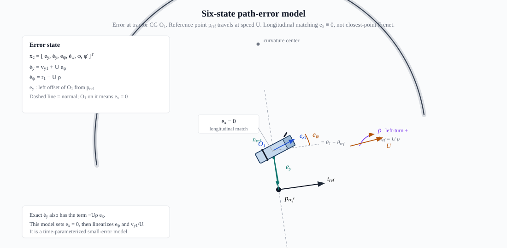

# 卡车—半挂车模型：从二维几何到控制状态空间的完整推导

本文逐步推导
[`1_truck_model_key_formula.md`](1_truck_model_key_formula.md)
中的全部关键公式。推导只使用二维位置、二维速度和标量偏航力矩；所有向量、矩阵和
自定义符号均在使用前完整定义。

可视化验证报告见
[最新推导验证 Canvas](https://cursor.com/dashboard/shared-canvases?shareId=canvas--dwF_B4CCAInb-mDcQVwzHpy)。

与已发表文献对应的推导步骤，在相应位置以 **文献对照** 注明原文的章节、式号和页码；
文献列表见文末"参考文献"一节。

---

## 1. 推导目标与模型边界

目标是得到三层模型：

1. 铰接车辆的精确非线性运动学；
2. 共同恒定纵速下的线性横向动力学；
3. 面向 LQR/MPC 的六状态路径误差模型。

动力学层采用以下假设：

- 两车均为刚体单轨模型；
- 精确非线性运动学以卡车后轴前向速度 \(U_1>0\) 为输入；
- 线性横向动力学在直线平衡点附近令两车共享名义纵速 \(U>0\)；
- \(U\) 在当前线性动力学模型中恒定；
- 前轮转角、铰接角、轮胎侧偏角和横向速度相对纵向速度均较小；
- 轮胎处于侧偏力线性区；
- 忽略纵向驱动/制动力对横向子系统的一阶作用；
- 忽略轮胎饱和、载荷转移、车身侧倾、空气侧力和大铰接角。

用 \(\varepsilon\) 统一记录小量阶次，并以 \(\rho\) 和
\(\dot\rho=d\rho/dt\) 表示后文定义的参考曲率及其时间变化率。
在线性模型中：
\[
\delta,\ \phi,\ \alpha,\ 
\frac{v_{y1}}U,\ \frac{v_{y2}}U,\ 
\frac{L_1r_1}U,\ \frac{L_2r_2}U,\ 
L_1\rho,\ L_2\rho,\ 
\frac{L_1^2\dot\rho}{U},\ \frac{L_2^2\dot\rho}{U}
=O(\varepsilon).
\]

因此，本文不是任意工况下的全非线性平面动力学；由于线性轮胎公式含有 \(1/U\)，
模型也不适用于 \(U\to0\) 或倒车工况。

---

## 2. 二维坐标、方向和参数

### 2.1 全局与车体方向

全局坐标使用 \(X,Y\)。卡车航向为 \(\theta_1\)，拖车航向为 \(\theta_2\)。

卡车前向单位向量完整定义为：

\[
\boxed{
\boldsymbol e_{x1}=
\begin{bmatrix}
\cos\theta_1\\
\sin\theta_1
\end{bmatrix}.
}
\tag{D1}
\]

卡车左向单位向量完整定义为：

\[
\boxed{
\boldsymbol e_{y1}=
\begin{bmatrix}
-\sin\theta_1\\
\cos\theta_1
\end{bmatrix}.
}
\tag{D2}
\]

拖车前向单位向量完整定义为：

\[
\boxed{
\boldsymbol e_{x2}=
\begin{bmatrix}
\cos\theta_2\\
\sin\theta_2
\end{bmatrix}.
}
\tag{D3}
\]

拖车左向单位向量完整定义为：

\[
\boxed{
\boldsymbol e_{y2}=
\begin{bmatrix}
-\sin\theta_2\\
\cos\theta_2
\end{bmatrix}.
}
\tag{D4}
\]

铰接角与偏航角速度定义为：

\[
\boxed{
\phi=\theta_1-\theta_2,\qquad
r_1=\dot\theta_1,\qquad
r_2=\dot\theta_2.
}
\tag{D5}
\]

对式 (D1)–(D4) 求时间导数：

\[
\boxed{
\begin{aligned}
\dot{\boldsymbol e}_{x1}&=r_1\boldsymbol e_{y1},&
\dot{\boldsymbol e}_{y1}&=-r_1\boldsymbol e_{x1},\\
\dot{\boldsymbol e}_{x2}&=r_2\boldsymbol e_{y2},&
\dot{\boldsymbol e}_{y2}&=-r_2\boldsymbol e_{x2}.
\end{aligned}}
\tag{D6}
\]

式 (D6) 直接来自
\(\frac{d}{dt}\cos\theta=-\dot\theta\sin\theta\) 和
\(\frac{d}{dt}\sin\theta=\dot\theta\cos\theta\)。

### 2.2 几何参数

- 卡车质心记为 \(O_1\)；
- 拖车质心记为 \(O_2\)；
- 铰接点记为 \(P_h\)；铰接横向力仍记为标量 \(H\)；
- 卡车前轴中心在 \(O_1\) 前方 \(a_1\)；
- 卡车后轴中心在 \(O_1\) 后方 \(b_1\)；
- 铰接点在 \(O_1\) 后方 \(d_1\)；
- 铰接点在 \(O_2\) 前方 \(a_2\)；
- 拖车轴中心在 \(O_2\) 后方 \(b_2\)。

定义：

\[
\boxed{
L_1=a_1+b_1,\qquad
L_2=a_2+b_2.
}
\tag{D7}
\]

\(b_1-d_1\) 是卡车后轴中心到铰接点的有符号前向距离。当 \(d_1=b_1\) 时，
该距离为零，铰接点与卡车后轴中心重合。


图中同时给出全局坐标 \(X,Y\)、两车体轴 \(\boldsymbol e_{x i},\boldsymbol e_{y i}\)、
前轮转角 \(\delta\) 和铰接角 \(\phi=\theta_1-\theta_2\)。长度按式 (D7)
理解：\(L_1\) 是 \(F_1\) 到 \(R_1\)，\(L_2\) 是 \(P_h\) 到 \(R_2\)。

### 2.3 质量、惯量和轮胎参数

- \(m_1,m_2>0\)：两车质量，单位 \(\mathrm{kg}\)；
- \(I_1,I_2>0\)：两车平面偏航转动惯量，单位 \(\mathrm{kg\,m^2}\)；
- \(a_1,b_1,d_1,a_2,b_2\)：几何长度，单位 \(\mathrm m\)；
- \(C_{1f},C_{1r},C_{2r}>0\)：三个整轴侧偏刚度，单位
  \(\mathrm{N/rad}\)；
- \(U_1,U_2>0\)：卡车、拖车沿各自车体前向的实际纵向速度分量；纯滚动运动学以
  \(U_1\) 为输入；
- \(U>0\)：线性动力学中两车直线平衡点的共同恒定名义纵速；
- \(\delta\)：卡车前轮转角，单位 \(\mathrm{rad}\)。

---

## 3. 精确非线性运动学

运动学模型假设所有车轮纯滚动，不允许轮胎横向侧滑。

### 3.1 卡车自行车模型

以卡车后轴中心 \(R_1\) 为参考。其速度沿卡车前向，完整写为：

\[
\boxed{
\boldsymbol v_{R_1}=U_1\boldsymbol e_{x1}
=U_1
\begin{bmatrix}
\cos\theta_1\\
\sin\theta_1
\end{bmatrix}.
}
\tag{D8}
\]

卡车前轴中心 \(F_1\) 的位置为：

\[
\boxed{
\boldsymbol p_{F_1}
=\boldsymbol p_{R_1}+L_1\boldsymbol e_{x1}.
}
\tag{D9}
\]

对式 (D9) 求导，并使用式 (D6)：

\[
\begin{aligned}
\boldsymbol v_{F_1}
&=\boldsymbol v_{R_1}+L_1r_1\boldsymbol e_{y1}\\
&=U_1\boldsymbol e_{x1}+L_1r_1\boldsymbol e_{y1}.
\end{aligned}
\tag{D10}
\]

前轮相对卡车转过 \(\delta\)。前轮法向单位向量完整写为：

\[
\boxed{
\boldsymbol n_f=
\begin{bmatrix}
-\sin(\theta_1+\delta)\\
\cos(\theta_1+\delta)
\end{bmatrix}.
}
\tag{D11}
\]

纯滚动要求前轴速度在轮胎法向上的分量为零：

\[
\boldsymbol n_f^T\boldsymbol v_{F_1}=0.
\tag{D12}
\]

逐项计算：

\[
\boldsymbol n_f^T\boldsymbol e_{x1}=-\sin\delta,
\qquad
\boldsymbol n_f^T\boldsymbol e_{y1}=\cos\delta.
\tag{D13}
\]

将式 (D10) 代入式 (D12)：

\[
-U_1\sin\delta+L_1r_1\cos\delta=0.
\tag{D14}
\]

因此：

\[
\boxed{
r_1=\frac{U_1}{L_1}\tan\delta.
}
\tag{D15}
\]

### 3.2 铰接点速度

铰接点相对卡车后轴中心的位置为：

\[
\boxed{
\boldsymbol p_{P_h}
=\boldsymbol p_{R_1}+(b_1-d_1)\boldsymbol e_{x1}.
}
\tag{D16}
\]

对式 (D16) 求导：

\[
\begin{aligned}
\boldsymbol v_{P_h}
&=\boldsymbol v_{R_1}+(b_1-d_1)r_1\boldsymbol e_{y1}\\
&=U_1\boldsymbol e_{x1}+(b_1-d_1)r_1\boldsymbol e_{y1}.
\end{aligned}
\tag{D17}
\]

将单位向量完整展开：

\[
\boxed{
\boldsymbol v_{P_h}=
\begin{bmatrix}
U_1\cos\theta_1-(b_1-d_1)r_1\sin\theta_1\\
U_1\sin\theta_1+(b_1-d_1)r_1\cos\theta_1
\end{bmatrix}.
}
\tag{D18}
\]

所以：

\[
\boxed{
\dot X_h=U_1\cos\theta_1-(b_1-d_1)r_1\sin\theta_1,
\quad
\dot Y_h=U_1\sin\theta_1+(b_1-d_1)r_1\cos\theta_1.
}
\tag{D19}
\]

### 3.3 拖车纯滚动

拖车轴中心记为 \(R_2\)。铰接点位于拖车轴前方 \(L_2\)：

\[
\boxed{
\boldsymbol p_{P_h}
=\boldsymbol p_{R_2}+L_2\boldsymbol e_{x2}.
}
\tag{D20}
\]

对式 (D20) 求导：

\[
\boldsymbol v_{P_h}
=\boldsymbol v_{R_2}+L_2r_2\boldsymbol e_{y2}.
\tag{D21}
\]

拖车轴纯滚动，所以其横向速度为零：

\[
\boldsymbol e_{y2}^T\boldsymbol v_{R_2}=0.
\tag{D22}
\]

式 (D21) 左乘 \(\boldsymbol e_{y2}^T\)：

\[
\boldsymbol e_{y2}^T\boldsymbol v_{P_h}=L_2r_2.
\tag{D23}
\]

由式 (D17)：

\[
\boldsymbol e_{y2}^T\boldsymbol v_{P_h}
=U_1\boldsymbol e_{y2}^T\boldsymbol e_{x1}
+(b_1-d_1)r_1\boldsymbol e_{y2}^T\boldsymbol e_{y1}.
\tag{D24}
\]

使用完整向量点积：

\[
\begin{aligned}
\boldsymbol e_{y2}^T\boldsymbol e_{x1}
&=
\begin{bmatrix}
-\sin\theta_2&\cos\theta_2
\end{bmatrix}
\begin{bmatrix}
\cos\theta_1\\\sin\theta_1
\end{bmatrix}\\
&=\sin(\theta_1-\theta_2)=\sin\phi,
\end{aligned}
\tag{D25}
\]

\[
\begin{aligned}
\boldsymbol e_{y2}^T\boldsymbol e_{y1}
&=
\begin{bmatrix}
-\sin\theta_2&\cos\theta_2
\end{bmatrix}
\begin{bmatrix}
-\sin\theta_1\\\cos\theta_1
\end{bmatrix}\\
&=\cos(\theta_1-\theta_2)=\cos\phi.
\end{aligned}
\tag{D26}
\]

于是：

\[
L_2r_2=U_1\sin\phi+(b_1-d_1)r_1\cos\phi.
\tag{D27}
\]

\[
\boxed{
r_2=\frac{U_1\sin\phi+(b_1-d_1)r_1\cos\phi}{L_2}.
}
\tag{D28}
\]

拖车轴中心沿拖车前向的速度记为 \(U_2\)。由
\(\boldsymbol v_{R_2}=\boldsymbol v_{P_h}-L_2r_2\boldsymbol e_{y2}\) 可得
\[
U_2=\boldsymbol e_{x2}^T\boldsymbol v_{R_2}
=U_1\cos\phi-(b_1-d_1)r_1\sin\phi.
\]
因此精确非线性运动学中一般 \(U_2\ne U_1\)。在后续小角度线性化中，
\(U_2-U_1\) 为二阶小量，才可令 \(U_1=U_2=U\)。

又因为：

\[
\dot\phi=\dot\theta_1-\dot\theta_2=r_1-r_2,
\tag{D29}
\]

所以得到关键公式文档式 (K5)。当 \(d_1=b_1\) 时立即得到式 (K6)。

**文献对照：** 纯滚动假设下的同一运动学关系见 Ljungqvist 等 [1] 第 3 节式 (1e)（预印本第 9 页）：
\(\dot\beta_2=v\big(\tan\alpha/L_1-\sin\beta_2/L_2+M_1\cos\beta_2\tan\alpha/(L_1L_2)\big)\)。
其中 \(\beta_2\) 为牵引车与后一节车的铰接角，\(v\) 为牵引车后轴速度，\(\alpha\) 为前轮转角，
\(M_1>0\) 为铰接点在牵引车后轴之后的偏置距离。取 \(\beta_2=\phi\)、\(v=U_1\)、\(\alpha=\delta\)、
\(M_1=d_1-b_1\)，并由式 (D15) 把 \(v\tan\alpha/L_1\) 换成 \(r_1\)，即得式 (D29) 与式 (D28)；
\(M_1=0\) 对应式 (K6)。

---

## 4. 车体坐标中的横向加速度

从本章开始进入线性横向动力学层。\(U\) 表示直线平衡点处两车共同的恒定名义纵速，
不再表示精确非线性模型中的两个实际纵速。

卡车质心速度完整写为：

\[
\boxed{
\boldsymbol v_{O_1}
=U\boldsymbol e_{x1}+v_{y1}\boldsymbol e_{y1}.
}
\tag{D30}
\]

对式 (D30) 求导，并使用式 (D6)，在 \(U\) 恒定时：

\[
\begin{aligned}
\boldsymbol a_{O_1}
&=Ur_1\boldsymbol e_{y1}
+\dot v_{y1}\boldsymbol e_{y1}
-v_{y1}r_1\boldsymbol e_{x1}\\
&=-v_{y1}r_1\boldsymbol e_{x1}
+(\dot v_{y1}+Ur_1)\boldsymbol e_{y1}.
\end{aligned}
\tag{D31}
\]

因此卡车横向加速度为：

\[
\boxed{
a_{y1}=\dot v_{y1}+Ur_1.
}
\tag{D32}
\]

同理，拖车质心速度完整写为：

\[
\boxed{
\boldsymbol v_{O_2}
=U\boldsymbol e_{x2}+v_{y2}\boldsymbol e_{y2},
}
\tag{D33}
\]

得到拖车横向加速度：

\[
\boxed{
a_{y2}=\dot v_{y2}+Ur_2.
}
\tag{D34}
\]

\(Ur\) 是前进方向旋转产生的横向加速度；它不是额外轮胎力。

---

## 5. 二维受力与偏航力矩

### 5.1 二维力矩定义

二维位置和力完整定义为：

\[
\boldsymbol p=
\begin{bmatrix}
p_x\\p_y
\end{bmatrix},
\qquad
\boldsymbol F=
\begin{bmatrix}
F_x\\F_y
\end{bmatrix}.
\tag{D35}
\]

对参考点的标量偏航力矩定义为：

\[
\boxed{
M=p_xF_y-p_yF_x.
}
\tag{D36}
\]

所有轴和铰接点都位于车体中心线上，因此 \(p_y=0\)，力矩简化为
\(M=p_xF_y\)。

### 5.2 卡车受力

前轮侧向力在前轮方向的左侧。变换到卡车坐标系后的完整分量为：

\[
\boxed{
\boldsymbol F_{1f}^{(1)}=
\begin{bmatrix}
-F_{1f}\sin\delta\\
F_{1f}\cos\delta
\end{bmatrix}.
}
\tag{D37}
\]

后轮横向力和铰接力在卡车坐标系中完整写为：

\[
\boxed{
\boldsymbol F_{1r}^{(1)}=
\begin{bmatrix}
0\\F_{1r}
\end{bmatrix},
\qquad
\boldsymbol F_H^{(1)}=
\begin{bmatrix}
F_{hx}\\H
\end{bmatrix}.
}
\tag{D38}
\]

横向牛顿方程：

\[
m_1(\dot v_{y1}+Ur_1)
=F_{1f}\cos\delta+F_{1r}+H.
\tag{D39}
\]

小 \(\delta\) 下 \(\cos\delta\approx1\)：

\[
\boxed{
m_1(\dot v_{y1}+Ur_1)=F_{1f}+F_{1r}+H.
}
\tag{D40}
\]

前轴、后轴、铰接点相对卡车质心的位置分量分别为：

\[
\boxed{
\boldsymbol p_{1f}^{(1)}=
\begin{bmatrix}a_1\\0\end{bmatrix},
\quad
\boldsymbol p_{1r}^{(1)}=
\begin{bmatrix}-b_1\\0\end{bmatrix},
\quad
\boldsymbol p_{P_h}^{(1)}=
\begin{bmatrix}-d_1\\0\end{bmatrix}.
}
\tag{D41}
\]

由式 (D36)，三个偏航力矩分别为：

\[
a_1F_{1f}\cos\delta,\qquad
-b_1F_{1r},\qquad
-d_1H.
\tag{D42}
\]

小 \(\delta\) 下：

\[
\boxed{
I_1\dot r_1=a_1F_{1f}-b_1F_{1r}-d_1H.
}
\tag{D43}
\]

### 5.3 拖车受力

根据作用力与反作用力，卡车作用于拖车的铰接力是
\(-\boldsymbol F_H^{(1)}\)。投影到拖车左向后：

\[
\begin{aligned}
F_{H,y2}
&=-F_{hx}\boldsymbol e_{y2}^T\boldsymbol e_{x1}
-H\boldsymbol e_{y2}^T\boldsymbol e_{y1}\\
&=-F_{hx}\sin\phi-H\cos\phi.
\end{aligned}
\tag{D44}
\]

**文献对照：** (D44) 这种"纵向分量乘 \(\sin\)、横向分量乘 \(\cos\)"的精确投影见：

- 郑雪莲等 [2] 式 (2)（第 57 页）：挂车横向方程和横摆方程中的铰接力项均为
  \(F_X\sin\theta-F_Y\cos\theta\)，其中 \(\theta=\psi_2-\psi_1\)，各项正负号取决于该文的方向约定；
- 赵晋海等 [3] 式 (10)（第 16 页）：\(F_{jx}=F'_{jx}\cos\theta+F'_{jy}\sin\theta\)，
  \(F_{jy}=F'_{jy}\cos\theta-F'_{jx}\sin\theta\)；同页式 (6) 挂车横摆力矩中的
  \(F_{jy}\cos\delta+F_{jx}\sin\delta\) 应为 \(F_{jy}\cos\theta+F_{jx}\sin\theta\)（原文笔误），
  即 (D44) 的形式；
- Gäfvert 与 Lindgärde [4] 式 (6)（第 9 页）给出挂车系到牵引车系的精确旋转矩阵，
  式 (21)–(22)（第 12 页）用它合并两车平动方程；(D44) 就是这一旋转在拖车左向的分量。

小 \(\phi\) 且忽略纵向铰接力的一阶作用：

\[
\boxed{
F_{H,y2}\approx-H.
}
\tag{D45}
\]

这一步需要额外条件，不能只凭 "\(\phi\) 小"。展开 (D44) 的第一项：

\[
-F_{hx}\sin\phi=-F_{hx}\phi+O(\varepsilon^3),
\]

若 \(F_{hx}\) 在直线平衡点处的基值 \(F_{hx,0}\) 是 \(O(1)\)，则
\(-F_{hx,0}\phi\) 与 \(-H\cos\phi\) 同为一阶，删除它不合法。因此 (D45) 及其后的
(K8) 成立需要

\[
\boxed{
F_{hx,0}=0
\quad\text{或}\quad
F_{hx}=O(\varepsilon).
}
\tag{D45a}
\]

同样的项也出现在拖车偏航方程 (D48)：铰接力臂为 \(a_2\)，漏掉的力矩为
\(-a_2F_{hx}\phi\)。

量级判断：直线匀速时 \(F_{hx}\) 只需克服拖车滚阻与气阻，
\(m_2=18\,\mathrm t\) 时约 \(1\text{–}3\,\mathrm{kN}\)，相对
\(10\text{–}30\,\mathrm{kN}\) 的轮胎侧向力可视为高阶小量，(D45a) 近似成立。
但牵引/制动时不成立：\(F_{hx}=30\,\mathrm{kN}\)、\(\phi=0.05\) 时横向方程漏掉
\(1.5\,\mathrm{kN}\)、偏航方程漏掉 \(a_2F_{hx}\phi=6\,\mathrm{kN\,m}\)
（\(a_2=4\,\mathrm m\)）。

要覆盖这些工况必须把 \(F_{hx}\) 作为显式量保留，由拖车纵向方程补一条方程，
模型维数和输入都会增加；本文矩阵不适用。

**文献对照：** 文献普遍采用 (D45)，但给出的理由不同：

- 郑雪莲等 [2] 第 58 页："当铰接角较小且铰接角变化缓慢时，认为 \(\cos\theta\approx1\)，
  \(\sin\theta\approx0\)"。这里取 \(\sin\theta\approx0\) 而不是 \(\sin\theta\approx\theta\)，
  只有在 (D45a) 成立时才与一阶模型相容，原文没有讨论纵向铰接力的量级；
- 彭涛等 [5] 式 (3)（第 93 页）直接令挂车系铰接力分量等于牵引车系分量，
  \(F_{xsh}=F_{xth}\)、\(F_{ysh}=F_{yth}\)，即忽略铰接角造成的坐标旋转；
- 周猛等 [6] 第 1371 页设铰接力"垂直于牵引车纵向方向"，即一开始就令 \(F_{hx}=0\)，
  挂车侧只剩 \(F_a\cos\theta\)（式 (4)(5)），随后在式 (10) 前取 \(\cos\theta=1\) 并令两车纵速相等；
- Sharma 与 He [7] 式 (4)（第 5 页）保留了纵向力的力矩 \(F_{fx}\gamma L_{fs}\)；式 (7) 中该项已写成
  \(m_t(-r_tv_{yt})L_{fs}\gamma\)，相当于用匀速、牵引车无纵向轮胎力条件下的纵向方程
  \(F_{fx}=m_tr_tv_{yt}\) 代入（原文未写出这一步），该项成为二阶小量，在附录 A 的线性矩阵中消失。
  这是文献中与 (D45a) 的 \(F_{hx,0}=0\) 条件最接近的论证；
- Morrison 与 Cebon [8] 第 2.1 节（第 1603 页）假设纵速恒定、铰接角小，
  第五轮处只保留侧向运动学约束。

以上文献都没有讨论牵引、制动工况。不做 (D45) 近似、并计入变速影响的推导见
[`4_hitch_force_free_derivation.md`](4_hitch_force_free_derivation.md)。

拖车横向方程：

\[
\boxed{
m_2(\dot v_{y2}+Ur_2)=F_{2r}-H.
}
\tag{D46}
\]

拖车轴与铰接点相对拖车质心的位置为：

\[
\boxed{
\boldsymbol p_{2r}^{(2)}=
\begin{bmatrix}-b_2\\0\end{bmatrix},
\qquad
\boldsymbol p_{P_h}^{(2)}=
\begin{bmatrix}a_2\\0\end{bmatrix}.
}
\tag{D47}
\]

由式 (D36)：

\[
\boxed{
I_2\dot r_2=-b_2F_{2r}-a_2H.
}
\tag{D48}
\]

式 (D40)、(D43)、(D46)、(D48) 即关键公式文档式 (K8)。

**文献对照：** 对两车分别写横向、横摆方程并显式保留铰接力，见周猛等 [6] 式 (1)(2)（第 1370 页）
与式 (4)(5)（第 1371 页）、郑雪莲等 [2] 式 (1)(2)（第 57 页）、Sharma 与 He [7] 式 (1)–(4)
（第 4–5 页）、彭涛等 [5] 式 (1)(2)（第 92 页）、赵晋海等 [3] 式 (1)–(6)（第 16 页）。
这些模型多数另含侧倾或纵向自由度；Sharma 与 He 把挂车方程也写在牵引车坐标系下。


图中将铰接点拆成一对作用力与反作用力：卡车侧为 \(+H\)，拖车侧为
\(-H\)。力矩臂与式 (D41)、(D47) 一致。

---

## 6. 铰接点速度约束：错误最容易发生的位置

### 6.1 从卡车侧计算同一铰接点

铰接点相对卡车质心的位置为：

\[
\boxed{
\boldsymbol p_{P_h}
=\boldsymbol p_{O_1}-d_1\boldsymbol e_{x1}.
}
\tag{D49}
\]

对式 (D49) 求导：

\[
\begin{aligned}
\boldsymbol v_{P_h}
&=\boldsymbol v_{O_1}-d_1r_1\boldsymbol e_{y1}\\
&=U_1\boldsymbol e_{x1}
+(v_{y1}-d_1r_1)\boldsymbol e_{y1}.
\end{aligned}
\tag{D50}
\]

所以铰接点在卡车坐标系中的横向分量是
\(v_{y1}-d_1r_1\)。

### 6.2 从拖车侧计算同一铰接点

铰接点相对拖车质心的位置为：

\[
\boxed{
\boldsymbol p_{P_h}
=\boldsymbol p_{O_2}+a_2\boldsymbol e_{x2}.
}
\tag{D51}
\]

对式 (D51) 求导：

\[
\begin{aligned}
\boldsymbol v_{P_h}
&=\boldsymbol v_{O_2}+a_2r_2\boldsymbol e_{y2}\\
&=U_2\boldsymbol e_{x2}
+(v_{y2}+a_2r_2)\boldsymbol e_{y2}.
\end{aligned}
\tag{D52}
\]

所以铰接点在拖车坐标系中的横向分量是
\(v_{y2}+a_2r_2\)。

### 6.3 为什么两个横向标量不能直接相等

\(\boldsymbol e_{y1}\) 与 \(\boldsymbol e_{y2}\) 方向不同。必须把完整速度投影到
同一个方向。将式 (D50) 投影到拖车左向：

\[
\begin{aligned}
\boldsymbol e_{y2}^T\boldsymbol v_{P_h}
&=U_1\boldsymbol e_{y2}^T\boldsymbol e_{x1}
+(v_{y1}-d_1r_1)\boldsymbol e_{y2}^T\boldsymbol e_{y1}\\
&=U_1\sin\phi+(v_{y1}-d_1r_1)\cos\phi.
\end{aligned}
\tag{D53}
\]

而式 (D52) 在拖车左向的分量为：

\[
\boldsymbol e_{y2}^T\boldsymbol v_{P_h}=v_{y2}+a_2r_2.
\tag{D54}
\]

因此精确约束为：

\[
\boxed{
v_{y2}+a_2r_2
=U_1\sin\phi+(v_{y1}-d_1r_1)\cos\phi.
}
\tag{D55}
\]

### 6.4 一阶线性化

\[
\sin\phi=\phi+O(\phi^3),
\qquad
\cos\phi=1+O(\phi^2).
\tag{D56}
\]

按照第 1 章的小量约定，
\(v_{y1}/U,v_{y2}/U,L_1r_1/U,L_2r_2/U,\phi=O(\varepsilon)\)，且
\(U_1=U_2=U+O(\varepsilon^2)\)。保留一阶项：

\[
v_{y2}+a_2r_2=U\phi+v_{y1}-d_1r_1.
\tag{D57}
\]

整理：

\[
\boxed{
v_{y2}=v_{y1}-d_1r_1-a_2r_2+U\phi.
}
\tag{D58}
\]

这里 \(U\phi\) 是一阶项，不能因为“小角度”而删除。

### 6.5 加速度约束

对式 (D58) 求导。若 \(U,d_1,a_2\) 恒定：

\[
\dot v_{y2}
=\dot v_{y1}-d_1\dot r_1-a_2\dot r_2+U\dot\phi.
\tag{D59}
\]

由式 (D29)，\(\dot\phi=r_1-r_2\)：

\[
\boxed{
\dot v_{y2}
=\dot v_{y1}-d_1\dot r_1-a_2\dot r_2+U(r_1-r_2).
}
\tag{D60}
\]

若 \(U\) 随时间变化，还必须增加 \(\dot U\phi\)。本文动力学假设 \(U\) 恒定。

**文献对照：**

- 精确速度约束 (D55) 及其求导见赵晋海等 [3] 式 (7)–(9) 和 (11)–(12)（第 16 页）；
- 一阶约束 (D58) 中的 \(U\phi\) 项见李道飞等 [9] 式 (5) 下的说明（第 1100 页）：
  \(v_{y2}=v_{y1}-f\omega_1-a_2\omega_2-v_{x1}\gamma\)，其中 \(\gamma=\psi_2-\psi_1=-\phi\)，
  \(f\) 即本文 \(d_1\)；
- 加速度约束 (D60) 见郑雪莲等 [2] 式 (9)（第 58 页），去掉侧倾项后为
  \(\dot v_1-b_{r1}\dot r_1-\dot v_2-b_{r2}\dot r_2=u_1(r_2-r_1)\)，\(b_{r1}\)、\(b_{r2}\) 即本文
  \(d_1\)、\(a_2\)；另见周猛等 [6] 式 (7)(8)（第 1371 页）和 Morrison 与 Cebon [8] 附录 1
  质量矩阵 \(M\) 第 6 行（第 1626 页）。

---

## 7. 线性轮胎力

### 7.1 刚体上任一点的横向速度

对卡车纵向坐标为 \(x\) 的点，其位置为：

\[
\boldsymbol p(x)=\boldsymbol p_{O_1}+x\boldsymbol e_{x1}.
\tag{D61}
\]

求导：

\[
\boldsymbol v(x)
=U\boldsymbol e_{x1}+(v_{y1}+xr_1)\boldsymbol e_{y1}.
\tag{D62}
\]

所以该点速度相对车体纵向的小方向角为：

\[
\beta(x)
=\arctan\frac{v_{y1}+xr_1}{U}
\approx\frac{v_{y1}+xr_1}{U}.
\tag{D63}
\]

本文定义侧偏角为“车轮指向角减去速度方向角”，并采用
\(F_y=C_\alpha\alpha\)。

### 7.2 卡车前后轴

前轴 \(x=a_1\)，车轮指向角为 \(\delta\)：

\[
\boxed{
\alpha_{1f}
=\delta-\frac{v_{y1}+a_1r_1}{U}.
}
\tag{D64}
\]

后轴 \(x=-b_1\)，车轮指向角为零：

\[
\boxed{
\alpha_{1r}
=-\frac{v_{y1}-b_1r_1}{U}.
}
\tag{D65}
\]

### 7.3 拖车轴

同理，拖车轴横向速度为 \(v_{y2}-b_2r_2\)：

\[
\boxed{
\alpha_{2r}
=-\frac{v_{y2}-b_2r_2}{U}.
}
\tag{D66}
\]

代入正确约束式 (D58)：

\[
\begin{aligned}
v_{y2}-b_2r_2
&=v_{y1}-d_1r_1-a_2r_2+U\phi-b_2r_2\\
&=v_{y1}-d_1r_1-L_2r_2+U\phi.
\end{aligned}
\tag{D67}
\]

因此：

\[
\boxed{
\alpha_{2r}
=-\frac{v_{y1}-d_1r_1-L_2r_2+U\phi}{U}.
}
\tag{D68}
\]

横向力完整展开为：

\[
\boxed{
\begin{aligned}
F_{1f}
&=C_{1f}\delta
-\frac{C_{1f}}U v_{y1}
-\frac{a_1C_{1f}}U r_1,\\
F_{1r}
&=-\frac{C_{1r}}U v_{y1}
+\frac{b_1C_{1r}}U r_1,\\
F_{2r}
&=-\frac{C_{2r}}U v_{y1}
+\frac{d_1C_{2r}}U r_1
+\frac{L_2C_{2r}}U r_2
-C_{2r}\phi.
\end{aligned}}
\tag{D69}
\]

遗漏 \(U\phi\) 会使拖车轮胎力遗漏 \(-C_{2r}\phi\)。

**文献对照：** 同样的线性轮胎和侧偏角定义见 Sharma 与 He [7] 式 (12)–(17)（第 5 页）；
周猛等 [6] 式 (9)（第 1371 页）结构相同，但侧偏刚度取负值（该文表 1），符号约定与本文相反。

---

## 8. 直接消除铰接力

从四条动力学方程式 (D40)、(D43)、(D46)、(D48) 出发。

### 8.1 第一行：两车横向方程相加

两车横向方程为：

\[
m_1(\dot v_{y1}+Ur_1)=F_{1f}+F_{1r}+H,
\tag{D70}
\]

\[
m_2(\dot v_{y2}+Ur_2)=F_{2r}-H.
\tag{D71}
\]

相加后内部力 \(H\) 抵消：

\[
m_1(\dot v_{y1}+Ur_1)
+m_2(\dot v_{y2}+Ur_2)
=F_{1f}+F_{1r}+F_{2r}.
\tag{D72}
\]

由正确加速度约束式 (D60)：

\[
\begin{aligned}
\dot v_{y2}+Ur_2
&=\dot v_{y1}-d_1\dot r_1-a_2\dot r_2
+U(r_1-r_2)+Ur_2\\
&=\dot v_{y1}-d_1\dot r_1-a_2\dot r_2+Ur_1.
\end{aligned}
\tag{D73}
\]

将式 (D73) 代入式 (D72)：

\[
\boxed{
\begin{aligned}
(m_1+m_2)\dot v_{y1}
-m_2d_1\dot r_1
-m_2a_2\dot r_2
=F_{1f}+F_{1r}+F_{2r}
-(m_1+m_2)Ur_1.
\end{aligned}}
\tag{D74}
\]

### 8.2 第二行：代入卡车偏航方程

由拖车横向方程式 (D71) 解出：

\[
\boxed{
H=F_{2r}-m_2(\dot v_{y2}+Ur_2).
}
\tag{D75}
\]

利用式 (D73)：

\[
\boxed{
H=F_{2r}
-m_2(\dot v_{y1}-d_1\dot r_1-a_2\dot r_2+Ur_1).
}
\tag{D76}
\]

卡车偏航方程：

\[
I_1\dot r_1=a_1F_{1f}-b_1F_{1r}-d_1H.
\tag{D77}
\]

代入式 (D76)：

\[
\begin{aligned}
I_1\dot r_1
={}&a_1F_{1f}-b_1F_{1r}-d_1F_{2r}\\
&+m_2d_1
(\dot v_{y1}-d_1\dot r_1-a_2\dot r_2+Ur_1).
\end{aligned}
\tag{D78}
\]

将加速度项移到左边：

\[
\boxed{
\begin{aligned}
-m_2d_1\dot v_{y1}
+(I_1+m_2d_1^2)\dot r_1
+m_2d_1a_2\dot r_2\\
=a_1F_{1f}-b_1F_{1r}-d_1F_{2r}
+m_2d_1Ur_1.
\end{aligned}}
\tag{D79}
\]

### 8.3 第三行：代入拖车偏航方程

拖车偏航方程：

\[
I_2\dot r_2=-b_2F_{2r}-a_2H.
\tag{D80}
\]

代入式 (D76)：

\[
\begin{aligned}
I_2\dot r_2
={}&-b_2F_{2r}-a_2F_{2r}\\
&+m_2a_2
(\dot v_{y1}-d_1\dot r_1-a_2\dot r_2+Ur_1).
\end{aligned}
\tag{D81}
\]

使用 \(L_2=a_2+b_2\)，并将加速度项移到左边：

\[
\boxed{
\begin{aligned}
-m_2a_2\dot v_{y1}
+m_2a_2d_1\dot r_1
+(I_2+m_2a_2^2)\dot r_2\\
=-L_2F_{2r}+m_2a_2Ur_1.
\end{aligned}}
\tag{D82}
\]

**文献对照：** 本章消去铰接力的三行在文献中有直接对应：

- Sharma 与 He [7] 式 (5)–(7)（第 5 页）与本章只差行变换：式 (5) 即 (D74)；式 (6) 等于
  (D79) 加 \(d_1\) 倍 (D74)，是牵引车对铰接点的力矩方程；式 (7) 等于 (D82) 加 \(a_2\) 倍 (D74)。
  区别在于该文用牵引车横向方程 (1) 表示铰接力，本文用拖车横向方程 (D75)；
- 周猛等 [6] 第 1371 页矩阵 \(K\)：第 3 行为两车横向方程之和；第 1 行（\(K_{11}=m_1v_{x1}c\)）
  和第 4 行（含 \(m_2v_{x2}e\)）分别为牵引车、拖车对铰接点的横摆方程；第 6 行为铰接点约束式 (7)；
- Morrison 与 Cebon [8] 附录 1 质量矩阵 \(M\)（第 1626 页）：第 3 行为两车横向方程之和；
  第 1、4 行分别含 \(m_1l_{1c}u_1\) 与 \(-m_2l_{2c}u_1\)，即两车对铰接点的横摆方程；
  第 6 行为铰接点约束。

### 8.4 收集第一行系数

将式 (D69) 的三个轮胎力代入式 (D74)。右侧为：

\[
F_{1f}+F_{1r}+F_{2r}-(m_1+m_2)Ur_1.
\tag{D83}
\]

逐项收集：

\[
\begin{aligned}
F_{1f}+F_{1r}+F_{2r}
={}&
-\frac{C_{1f}+C_{1r}+C_{2r}}U v_{y1}\\
&+\frac{-a_1C_{1f}+b_1C_{1r}+d_1C_{2r}}U r_1\\
&+\frac{L_2C_{2r}}U r_2
-C_{2r}\phi
+C_{1f}\delta.
\end{aligned}
\tag{D84}
\]

所以式 (D74) 的完整右侧为：

\[
\begin{aligned}
&-\frac{C_{1f}+C_{1r}+C_{2r}}U v_{y1}\\
&+\left[
\frac{-a_1C_{1f}+b_1C_{1r}+d_1C_{2r}}U
-(m_1+m_2)U
\right]r_1\\
&+\frac{L_2C_{2r}}U r_2
-C_{2r}\phi+C_{1f}\delta.
\end{aligned}
\tag{D85}
\]

### 8.5 收集第二行系数

式 (D79) 右侧为：

\[
a_1F_{1f}-b_1F_{1r}-d_1F_{2r}+m_2d_1Ur_1.
\tag{D86}
\]

分别展开：

\[
\begin{aligned}
a_1F_{1f}
&=a_1C_{1f}\delta
-\frac{a_1C_{1f}}U v_{y1}
-\frac{a_1^2C_{1f}}U r_1,\\
-b_1F_{1r}
&=\frac{b_1C_{1r}}U v_{y1}
-\frac{b_1^2C_{1r}}U r_1,\\
-d_1F_{2r}
&=\frac{d_1C_{2r}}U v_{y1}
-\frac{d_1^2C_{2r}}U r_1
-\frac{d_1L_2C_{2r}}U r_2
+d_1C_{2r}\phi.
\end{aligned}
\tag{D87}
\]

相加得到：

\[
\begin{aligned}
&\frac{-a_1C_{1f}+b_1C_{1r}+d_1C_{2r}}U v_{y1}\\
&+\left[
-\frac{a_1^2C_{1f}+b_1^2C_{1r}+d_1^2C_{2r}}U
+m_2d_1U
\right]r_1\\
&-\frac{d_1L_2C_{2r}}U r_2
+d_1C_{2r}\phi+a_1C_{1f}\delta.
\end{aligned}
\tag{D88}
\]

### 8.6 收集第三行系数

式 (D82) 右侧为：

\[
-L_2F_{2r}+m_2a_2Ur_1.
\tag{D89}
\]

展开：

\[
\begin{aligned}
-L_2F_{2r}
={}&
\frac{L_2C_{2r}}U v_{y1}
-\frac{d_1L_2C_{2r}}U r_1\\
&-\frac{L_2^2C_{2r}}U r_2
+L_2C_{2r}\phi.
\end{aligned}
\tag{D90}
\]

所以完整右侧为：

\[
\begin{aligned}
\frac{L_2C_{2r}}U v_{y1}
+\left[
-\frac{d_1L_2C_{2r}}U+m_2a_2U
\right]r_1
-\frac{L_2^2C_{2r}}U r_2
+L_2C_{2r}\phi.
\end{aligned}
\tag{D91}
\]

### 8.7 组装有效矩阵

定义三维速度变量及其导数：

\[
\boxed{
\boldsymbol\eta=
\begin{bmatrix}
v_{y1}\\r_1\\r_2
\end{bmatrix},
\qquad
\dot{\boldsymbol\eta}=
\begin{bmatrix}
\dot v_{y1}\\\dot r_1\\\dot r_2
\end{bmatrix}.
}
\tag{D92}
\]

由式 (D74)、(D79)、(D82) 左侧得到：

\[
\boxed{
M_e=
\begin{bmatrix}
m_1+m_2&-m_2d_1&-m_2a_2\\
-m_2d_1&I_1+m_2d_1^2&m_2d_1a_2\\
-m_2a_2&m_2d_1a_2&I_2+m_2a_2^2
\end{bmatrix}.
}
\tag{D93}
\]

**文献对照：** Chen 与 Tomizuka [10] 第 4.1 节式 (6)–(11)（第 11 页）用 Lagrange 方程得到同一线性模型：
式 (6) 为 \(M\ddot q+C\dot q+G\dot q+Kq=D\delta\)，式 (7) 取广义坐标 \(q=[y,\ \varepsilon,\ \varepsilon_f]\)，
\(\varepsilon_f\) 为挂车相对牵引车的横摆角，即 \(-\phi\)（符号定义见该文附录 1，第 18 页）。
式 (8) 的质量矩阵为

\[
M_{[10]}=
\begin{bmatrix}
m_1+m_2&-m_2(d_1+d_3)&-m_2d_3\\
-m_2(d_1+d_3)&I_{z1}+I_{z2}+m_2(d_1+d_3)^2&I_{z2}+m_2d_3^2+m_2d_1d_3\\
-m_2d_3&I_{z2}+m_2d_3^2+m_2d_1d_3&I_{z2}+m_2d_3^2
\end{bmatrix},
\]

其中 \(d_1\)、\(d_3\) 分别对应本文 \(d_1\)、\(a_2\)。令
\([v_{y1},\ r_1,\ r_2]^T=T[\dot y,\ \dot\varepsilon,\ \dot\varepsilon_f]^T\)，
\(T=\begin{bmatrix}1&0&0\\0&1&0\\0&1&1\end{bmatrix}\)，可以逐项验证 \(M_{[10]}=T^TM_eT\)。
该文式 (11) 刚度矩阵 \(K\) 的第三列为 \(2C_{\alpha t}[-1,\ l_3+d_1,\ l_3]^T\)（\(l_3\) 即本文 \(L_2\)，
系数 2 对应每轴两侧车轮），把式 (D95) 的 \(\boldsymbol k_\phi\) 按 \(T^T\) 组合各行即得同一结果。
Sharma 与 He [7] 附录 A 式 (A1)（第 21 页）的后三行则是按其式 (5)–(7) 组合的质量矩阵。

由式 (D85)、(D88)、(D91) 得到：

\[
\boxed{
K_e=
\begin{bmatrix}
-\dfrac{C_{1f}+C_{1r}+C_{2r}}U
&
\dfrac{-a_1C_{1f}+b_1C_{1r}+d_1C_{2r}}U-(m_1+m_2)U
&
\dfrac{L_2C_{2r}}U
\\[3mm]
\dfrac{-a_1C_{1f}+b_1C_{1r}+d_1C_{2r}}U
&
-\dfrac{a_1^2C_{1f}+b_1^2C_{1r}+d_1^2C_{2r}}U+m_2d_1U
&
-\dfrac{d_1L_2C_{2r}}U
\\[3mm]
\dfrac{L_2C_{2r}}U
&
-\dfrac{d_1L_2C_{2r}}U+m_2a_2U
&
-\dfrac{L_2^2C_{2r}}U
\end{bmatrix}.
}
\tag{D94}
\]

\[
\boxed{
\boldsymbol k_\phi=
C_{2r}
\begin{bmatrix}
-1\\d_1\\L_2
\end{bmatrix},
\qquad
\boldsymbol G_e=
\begin{bmatrix}
C_{1f}\\a_1C_{1f}\\0
\end{bmatrix}.
}
\tag{D95}
\]

于是：

\[
\boxed{
M_e\dot{\boldsymbol\eta}
=K_e\boldsymbol\eta+\boldsymbol k_\phi\phi+\boldsymbol G_e\delta.
}
\tag{D96}
\]

---

## 9. 从有效质量矩阵到标准四状态模型

### 9.1 为什么必须增加第四状态

式 (D96) 的右侧显式包含 \(\phi\)。同时：

\[
\dot\phi=r_1-r_2.
\tag{D97}
\]

所以三维变量 \(\boldsymbol\eta\) 不能闭合。定义完整物理状态：

\[
\boxed{
\boldsymbol x_p=
\begin{bmatrix}
v_{y1}\\r_1\\r_2\\\phi
\end{bmatrix}.
}
\tag{D98}
\]

将前三行动力学方程与 \(\dot\phi=r_1-r_2\) 合并，可写成四状态质量矩阵形式：

\[
\boxed{
\mathcal M\dot{\boldsymbol x}_p
=\mathcal K\boldsymbol x_p+\mathcal G\delta,
}
\tag{D99}
\]

其中所有矩阵完整写为：

\[
\boxed{
\mathcal M=
\begin{bmatrix}
m_1+m_2&-m_2d_1&-m_2a_2&0\\
-m_2d_1&I_1+m_2d_1^2&m_2d_1a_2&0\\
-m_2a_2&m_2d_1a_2&I_2+m_2a_2^2&0\\
0&0&0&1
\end{bmatrix},
}
\tag{D100}
\]

\[
\boxed{
\mathcal K=
\begin{bmatrix}
(K_e)_{11}&(K_e)_{12}&(K_e)_{13}&-C_{2r}\\
(K_e)_{21}&(K_e)_{22}&(K_e)_{23}&d_1C_{2r}\\
(K_e)_{31}&(K_e)_{32}&(K_e)_{33}&L_2C_{2r}\\
0&1&-1&0
\end{bmatrix},
\qquad
\mathcal G=
\begin{bmatrix}
C_{1f}\\a_1C_{1f}\\0\\0
\end{bmatrix}.
}
\tag{D101}
\]

第四行展开为：

\[
0\dot v_{y1}+0\dot r_1+0\dot r_2+\dot\phi
=0v_{y1}+r_1-r_2+0\phi,
\tag{D102}
\]

即式 (D97)。

### 9.2 逆矩阵

令：

\[
\begin{aligned}
\mu_{11}&=m_1+m_2,&
\mu_{12}&=-m_2d_1,&
\mu_{13}&=-m_2a_2,\\
\mu_{22}&=I_1+m_2d_1^2,&
\mu_{23}&=m_2d_1a_2,&
\mu_{33}&=I_2+m_2a_2^2.
\end{aligned}
\tag{D103}
\]

则：

\[
M_e=
\begin{bmatrix}
\mu_{11}&\mu_{12}&\mu_{13}\\
\mu_{12}&\mu_{22}&\mu_{23}\\
\mu_{13}&\mu_{23}&\mu_{33}
\end{bmatrix}.
\tag{D104}
\]

三阶行列式按第一行展开：

\[
\boxed{
\begin{aligned}
\Delta={}&
\mu_{11}(\mu_{22}\mu_{33}-\mu_{23}^2)\\
&-\mu_{12}(\mu_{12}\mu_{33}-\mu_{13}\mu_{23})\\
&+\mu_{13}(\mu_{12}\mu_{23}-\mu_{13}\mu_{22}).
\end{aligned}}
\tag{D105}
\]

代入式 (D103) 并化简：
\[
\Delta=(m_1+m_2)I_1I_2
+m_1m_2\left(I_1a_2^2+I_2d_1^2\right)>0.
\]
因为 \(m_1,m_2,I_1,I_2>0\)，所以 \(M_e^{-1}\) 一定存在。

余子式给出：

\[
\boxed{
M_e^{-1}=
\begin{bmatrix}
q_{11}&q_{12}&q_{13}\\
q_{12}&q_{22}&q_{23}\\
q_{13}&q_{23}&q_{33}
\end{bmatrix},
}
\tag{D106}
\]

\[
\boxed{
\begin{aligned}
q_{11}&=\frac{\mu_{22}\mu_{33}-\mu_{23}^2}{\Delta},&
q_{12}&=\frac{\mu_{13}\mu_{23}-\mu_{12}\mu_{33}}{\Delta},\\
q_{13}&=\frac{\mu_{12}\mu_{23}-\mu_{13}\mu_{22}}{\Delta},&
q_{22}&=\frac{\mu_{11}\mu_{33}-\mu_{13}^2}{\Delta},\\
q_{23}&=\frac{\mu_{12}\mu_{13}-\mu_{11}\mu_{23}}{\Delta},&
q_{33}&=\frac{\mu_{11}\mu_{22}-\mu_{12}^2}{\Delta}.
\end{aligned}}
\tag{D107}
\]

### 9.3 标准矩阵每个元素

定义：

\[
A_v=M_e^{-1}K_e
=
\begin{bmatrix}
a_{11}&a_{12}&a_{13}\\
a_{21}&a_{22}&a_{23}\\
a_{31}&a_{32}&a_{33}
\end{bmatrix}.
\tag{D108}
\]

每个元素都是逆质量矩阵的一行与 \(K_e\) 的一列点积：

\[
\boxed{
\begin{aligned}
a_{11}&=q_{11}(K_e)_{11}+q_{12}(K_e)_{21}+q_{13}(K_e)_{31},\\
a_{12}&=q_{11}(K_e)_{12}+q_{12}(K_e)_{22}+q_{13}(K_e)_{32},\\
a_{13}&=q_{11}(K_e)_{13}+q_{12}(K_e)_{23}+q_{13}(K_e)_{33},\\
a_{21}&=q_{12}(K_e)_{11}+q_{22}(K_e)_{21}+q_{23}(K_e)_{31},\\
a_{22}&=q_{12}(K_e)_{12}+q_{22}(K_e)_{22}+q_{23}(K_e)_{32},\\
a_{23}&=q_{12}(K_e)_{13}+q_{22}(K_e)_{23}+q_{23}(K_e)_{33},\\
a_{31}&=q_{13}(K_e)_{11}+q_{23}(K_e)_{21}+q_{33}(K_e)_{31},\\
a_{32}&=q_{13}(K_e)_{12}+q_{23}(K_e)_{22}+q_{33}(K_e)_{32},\\
a_{33}&=q_{13}(K_e)_{13}+q_{23}(K_e)_{23}+q_{33}(K_e)_{33}.
\end{aligned}}
\tag{D109}
\]

铰接角列：

\[
\boxed{
\begin{aligned}
a_{14}&=C_{2r}(-q_{11}+d_1q_{12}+L_2q_{13}),\\
a_{24}&=C_{2r}(-q_{12}+d_1q_{22}+L_2q_{23}),\\
a_{34}&=C_{2r}(-q_{13}+d_1q_{23}+L_2q_{33}).
\end{aligned}}
\tag{D110}
\]

输入列：

\[
\boxed{
\begin{aligned}
\beta_1&=C_{1f}(q_{11}+a_1q_{12}),\\
\beta_2&=C_{1f}(q_{12}+a_1q_{22}),\\
\beta_3&=C_{1f}(q_{13}+a_1q_{23}).
\end{aligned}}
\tag{D111}
\]

最终：

\[
\boxed{
\dot{\boldsymbol x}_p
=A_p\boldsymbol x_p+B_p\delta,
}
\tag{D112}
\]

\[
\boxed{
A_p=
\begin{bmatrix}
a_{11}&a_{12}&a_{13}&a_{14}\\
a_{21}&a_{22}&a_{23}&a_{24}\\
a_{31}&a_{32}&a_{33}&a_{34}\\
0&1&-1&0
\end{bmatrix},
\qquad
B_p=
\begin{bmatrix}
\beta_1\\\beta_2\\\beta_3\\0
\end{bmatrix}.
}
\tag{D113}
\]

---

## 10. 六状态路径误差模型

### 10.1 参考轨迹定义

令时间参考点 \(\boldsymbol p_{\mathrm{ref}}(t)\) 以速度 \(U\) 沿参考切向
\(\boldsymbol e_{x,\mathrm{ref}}\) 运动：
\[
\dot{\boldsymbol p}_{\mathrm{ref}}
=U\boldsymbol e_{x,\mathrm{ref}}.
\]
其左向单位向量记为 \(\boldsymbol e_{y,\mathrm{ref}}\)。以卡车质心为误差参考点，定义：

- \(e_x=\boldsymbol e_{x,\mathrm{ref}}^T
  (\boldsymbol p_{O_1}-\boldsymbol p_{\mathrm{ref}})\)：纵向匹配误差；
- \(e_y=\boldsymbol e_{y,\mathrm{ref}}^T
  (\boldsymbol p_{O_1}-\boldsymbol p_{\mathrm{ref}})\)：卡车质心相对时间参考点的左向横向误差；
- \(\theta_{\mathrm{ref}}\)：按时间给定的参考航向；
- \(e_\psi=\theta_1-\theta_{\mathrm{ref}}\)：航向误差；
- \(\rho=\rho(t)\in C^1\)：左转为正的参考轨迹曲率；
- \(\dot\rho=d\rho(t)/dt\)：曲率对时间的变化率。

时间参数化参考轨迹满足：

\[
\boxed{
\dot\theta_{\mathrm{ref}}=U\rho.
}
\tag{D114}
\]



\(e_y\) 是 \(O_1\) 相对 \(\boldsymbol p_{\mathrm{ref}}\) 的左向投影；虚线为参考
法向。一阶纵向匹配把 \(O_1\) 视为落在该法向上。

本文六状态模型采用**一阶**纵向匹配，因此不是严格最近点 Frenet 模型。严格 Frenet
模型还会包含 \(\dot s\) 和 \(1-\rho e_y\) 等项。

这里的 \(e_x\) 只在一阶意义下可略，并非恒为零；第 11.1 节给出
\(\dot e_x=U\rho e_y+O(\varepsilon^2)U\) 及其工程处理。若曲率按弧长给出为
\(\rho(t)=\kappa(s(t))\)，并取 \(\dot s=U\)，则
\(\dot\rho=U\kappa'(s)\)；仅在直线或固定半径圆弧上才有 \(\dot\rho=0\)。

### 10.2 横向误差运动学

卡车质心速度完整写为：

\[
\boldsymbol v_{O_1}=U\boldsymbol e_{x1}+v_{y1}\boldsymbol e_{y1}.
\tag{D115}
\]

由于
\(\dot{\boldsymbol e}_{y,\mathrm{ref}}
=-U\rho\boldsymbol e_{x,\mathrm{ref}}\)，对 \(e_y\) 求导得到：

\[
\begin{aligned}
\dot e_y
&=-U\rho e_x+U\sin e_\psi+v_{y1}\cos e_\psi\\
&=U\sin e_\psi+v_{y1}\cos e_\psi
\qquad(U\rho e_x=O(\varepsilon^2)U)\\
&\approx v_{y1}+Ue_\psi.
\end{aligned}
\tag{D116}
\]

所以：

\[
\boxed{
v_{y1}=\dot e_y-Ue_\psi.
}
\tag{D117}
\]

在 \(U\) 恒定时：

\[
\boxed{
\dot v_{y1}=\ddot e_y-U\dot e_\psi.
}
\tag{D118}
\]

### 10.3 航向误差

\[
\begin{aligned}
\dot e_\psi
&=\dot\theta_1-\dot\theta_{\mathrm{ref}}\\
&=r_1-U\rho.
\end{aligned}
\tag{D119}
\]

因此：

\[
\boxed{
r_1=\dot e_\psi+U\rho.
}
\tag{D120}
\]

继续求导：

\[
\boxed{
\dot r_1=\ddot e_\psi+U\dot\rho.
}
\tag{D121}
\]

### 10.4 拖车偏航率

由 \(\dot\phi=r_1-r_2\)：

\[
\boxed{
r_2=r_1-\dot\phi
=\dot e_\psi+U\rho-\dot\phi.
}
\tag{D122}
\]

继续求导：

\[
\boxed{
\dot r_2=\ddot e_\psi+U\dot\rho-\ddot\phi.
}
\tag{D123}
\]

### 10.5 完整状态转换

定义控制状态向量：

\[
\boxed{
\boldsymbol x_c=
\begin{bmatrix}
e_y\\\dot e_y\\e_\psi\\\dot e_\psi\\\phi\\\dot\phi
\end{bmatrix}.
}
\tag{D124}
\]

利用式 (D117)、(D120)、(D122)：

\[
\boxed{
\boldsymbol x_p=T\boldsymbol x_c+\boldsymbol t_\rho\rho,
}
\tag{D125}
\]

\[
\boxed{
T=
\begin{bmatrix}
0&1&-U&0&0&0\\
0&0&0&1&0&0\\
0&0&0&1&0&-1\\
0&0&0&0&1&0
\end{bmatrix},
\qquad
\boldsymbol t_\rho=
\begin{bmatrix}
0\\U\\U\\0
\end{bmatrix}.
}
\tag{D126}
\]

逐行检查：

\[
\begin{aligned}
v_{y1}&=\dot e_y-Ue_\psi,\\
r_1&=\dot e_\psi+U\rho,\\
r_2&=\dot e_\psi-\dot\phi+U\rho,\\
\phi&=\phi.
\end{aligned}
\tag{D127}
\]

### 10.6 物理模型的标量形式

由式 (D113)：

\[
\boxed{
\begin{aligned}
\dot v_{y1}
&=a_{11}v_{y1}+a_{12}r_1+a_{13}r_2+a_{14}\phi+\beta_1\delta,\\
\dot r_1
&=a_{21}v_{y1}+a_{22}r_1+a_{23}r_2+a_{24}\phi+\beta_2\delta,\\
\dot r_2
&=a_{31}v_{y1}+a_{32}r_1+a_{33}r_2+a_{34}\phi+\beta_3\delta.
\end{aligned}}
\tag{D128}
\]

### 10.7 推导 \(\ddot e_y\)

由式 (D118)：

\[
\ddot e_y=\dot v_{y1}+U\dot e_\psi.
\tag{D129}
\]

将式 (D117)、(D120)、(D122) 代入式 (D128) 第一行：

\[
\begin{aligned}
\dot v_{y1}
={}&a_{11}(\dot e_y-Ue_\psi)
+a_{12}(\dot e_\psi+U\rho)\\
&+a_{13}(\dot e_\psi+U\rho-\dot\phi)
+a_{14}\phi+\beta_1\delta.
\end{aligned}
\tag{D130}
\]

展开：

\[
\begin{aligned}
\dot v_{y1}
={}&a_{11}\dot e_y-Ua_{11}e_\psi
+(a_{12}+a_{13})\dot e_\psi\\
&+a_{14}\phi-a_{13}\dot\phi
+U(a_{12}+a_{13})\rho+\beta_1\delta.
\end{aligned}
\tag{D131}
\]

代入式 (D129)：

\[
\boxed{
\begin{aligned}
\ddot e_y
={}&a_{11}\dot e_y-Ua_{11}e_\psi
+(a_{12}+a_{13}+U)\dot e_\psi\\
&+a_{14}\phi-a_{13}\dot\phi\\
&+U(a_{12}+a_{13})\rho+\beta_1\delta.
\end{aligned}}
\tag{D132}
\]

### 10.8 推导 \(\ddot e_\psi\)

由式 (D121)：

\[
\ddot e_\psi=\dot r_1-U\dot\rho.
\tag{D133}
\]

将状态转换代入式 (D128) 第二行：

\[
\begin{aligned}
\dot r_1
={}&a_{21}(\dot e_y-Ue_\psi)
+a_{22}(\dot e_\psi+U\rho)\\
&+a_{23}(\dot e_\psi+U\rho-\dot\phi)
+a_{24}\phi+\beta_2\delta.
\end{aligned}
\tag{D134}
\]

展开并代入式 (D133)：

\[
\boxed{
\begin{aligned}
\ddot e_\psi
={}&a_{21}\dot e_y-Ua_{21}e_\psi
+(a_{22}+a_{23})\dot e_\psi\\
&+a_{24}\phi-a_{23}\dot\phi\\
&+U(a_{22}+a_{23})\rho+\beta_2\delta
-U\dot\rho.
\end{aligned}}
\tag{D135}
\]

### 10.9 推导 \(\ddot\phi\)

\[
\ddot\phi=\dot r_1-\dot r_2.
\tag{D136}
\]

用式 (D128) 第二行减第三行：

\[
\begin{aligned}
\ddot\phi
={}&(a_{21}-a_{31})v_{y1}
+(a_{22}-a_{32})r_1\\
&+(a_{23}-a_{33})r_2
+(a_{24}-a_{34})\phi\\
&+(\beta_2-\beta_3)\delta.
\end{aligned}
\tag{D137}
\]

代入式 (D117)、(D120)、(D122)，整理：

\[
\boxed{
\begin{aligned}
\ddot\phi
={}&(a_{21}-a_{31})\dot e_y
-U(a_{21}-a_{31})e_\psi\\
&+(a_{22}-a_{32}+a_{23}-a_{33})\dot e_\psi\\
&+(a_{24}-a_{34})\phi
+(-a_{23}+a_{33})\dot\phi\\
&+U(a_{22}-a_{32}+a_{23}-a_{33})\rho\\
&+(\beta_2-\beta_3)\delta.
\end{aligned}}
\tag{D138}
\]

### 10.10 六状态矩阵

状态导数完整定义为：

\[
\dot{\boldsymbol x}_c=
\begin{bmatrix}
\dot e_y\\\ddot e_y\\\dot e_\psi\\\ddot e_\psi\\\dot\phi\\\ddot\phi
\end{bmatrix}.
\tag{D139}
\]

由式 (D132)、(D135)、(D138)：

\[
\boxed{
\dot{\boldsymbol x}_c
=A_c\boldsymbol x_c+B_c\delta
+E_\rho\rho+E_{\dot\rho}\dot\rho.
}
\tag{D140}
\]

\[
\boxed{
A_c=
\begin{bmatrix}
0&1&0&0&0&0\\
0&a_{11}&-Ua_{11}&a_{12}+a_{13}+U&a_{14}&-a_{13}\\
0&0&0&1&0&0\\
0&a_{21}&-Ua_{21}&a_{22}+a_{23}&a_{24}&-a_{23}\\
0&0&0&0&0&1\\
0&a_{21}-a_{31}&-U(a_{21}-a_{31})&
a_{22}-a_{32}+a_{23}-a_{33}&
a_{24}-a_{34}&-a_{23}+a_{33}
\end{bmatrix}.
}
\tag{D141}
\]

\[
\boxed{
B_c=
\begin{bmatrix}
0\\\beta_1\\0\\\beta_2\\0\\\beta_2-\beta_3
\end{bmatrix}.
}
\tag{D142}
\]

\[
\boxed{
E_\rho=
U
\begin{bmatrix}
0\\
a_{12}+a_{13}\\
0\\
a_{22}+a_{23}\\
0\\
a_{22}-a_{32}+a_{23}-a_{33}
\end{bmatrix}.
}
\tag{D143}
\]

\[
\boxed{
E_{\dot\rho}=
\begin{bmatrix}
0\\0\\0\\-U\\0\\0
\end{bmatrix}.
}
\tag{D144}
\]

修正铰接约束后，矩阵第五列一般不为零：

\[
A_c(2,5)=a_{14},\qquad
A_c(4,5)=a_{24},\qquad
A_c(6,5)=a_{24}-a_{34}.
\tag{D145}
\]

这些项描述铰接角通过拖车轮胎侧偏力反馈到整车横向动力学。

**文献对照：** Chen 与 Tomizuka [10] 第 4.2 节（第 12–13 页）把式 (6) 的线性模型换到道路中心线坐标下：
\(y_r\) 为牵引车质心相对道路中心线的横向偏差，\(\varepsilon_r\) 为牵引车相对道路的航向角，
代换关系为式 (13)–(16)，结果为式 (17) 及状态空间形式 (23)。其道路输入 \(\dot\varepsilon_d\)
为弯道处的期望横摆角速度（附录 1，第 18 页：弯道半径恒定时等于纵速除以半径），对应本文的
\(U\rho\)（本文 \(\rho\) 为曲率）；式 (17) 中的 \(E\dot\varepsilon_d+F\ddot\varepsilon_d\) 与 (D140) 中的
\(E_\rho\rho+E_{\dot\rho}\dot\rho\) 结构相同。

---

## 11. 适用边界的逐式推导

本章补齐
[`1_truck_model_key_formula.md`](1_truck_model_key_formula.md) 1.4 节列出的边界条件。
纵向铰接力一条已在 (D45a) 就地给出，这里补其余三条。

### 11.1 纵向误差 \(e_x\) 的真实动态

沿用第 10.1 节的定义
\(e_x=\boldsymbol e_{x,\mathrm{ref}}^T(\boldsymbol p_{O_1}-\boldsymbol p_{\mathrm{ref}})\)。
参考点按 \(\dot{\boldsymbol p}_{\mathrm{ref}}=U\boldsymbol e_{x,\mathrm{ref}}\)
运动，参考标架随 \(\dot\theta_{\mathrm{ref}}=U\rho\) 旋转，故

\[
\dot{\boldsymbol e}_{x,\mathrm{ref}}
=U\rho\,\boldsymbol e_{y,\mathrm{ref}}.
\tag{D146}
\]

对 \(e_x\) 求导，逐项写出：

\[
\begin{aligned}
\dot e_x
&=\dot{\boldsymbol e}_{x,\mathrm{ref}}^T
  (\boldsymbol p_{O_1}-\boldsymbol p_{\mathrm{ref}})
 +\boldsymbol e_{x,\mathrm{ref}}^T
  (\boldsymbol v_{O_1}-U\boldsymbol e_{x,\mathrm{ref}})\\
&=U\rho\,\boldsymbol e_{y,\mathrm{ref}}^T
  (\boldsymbol p_{O_1}-\boldsymbol p_{\mathrm{ref}})
 +\boldsymbol e_{x,\mathrm{ref}}^T\boldsymbol v_{O_1}-U.
\end{aligned}
\tag{D147}
\]

第一项按定义即 \(U\rho e_y\)。第二项用
\(\boldsymbol v_{O_1}=U\boldsymbol e_{x1}+v_{y1}\boldsymbol e_{y1}\) 和
\(\boldsymbol e_{x,\mathrm{ref}}^T\boldsymbol e_{x1}=\cos e_\psi\)、
\(\boldsymbol e_{x,\mathrm{ref}}^T\boldsymbol e_{y1}=-\sin e_\psi\) 展开：

\[
\boldsymbol e_{x,\mathrm{ref}}^T\boldsymbol v_{O_1}
=U\cos e_\psi-v_{y1}\sin e_\psi.
\tag{D148}
\]

代回 (D147)：

\[
\dot e_x
=U\rho e_y+U(\cos e_\psi-1)-v_{y1}\sin e_\psi.
\tag{D149}
\]

按 1.3 节阶次表，\(\cos e_\psi-1=O(\varepsilon^2)\)，
\(v_{y1}\sin e_\psi=O(\varepsilon^2)U\)，而 \(U\rho e_y\) 只是
\(U\cdot O(\varepsilon)\cdot O(\varepsilon)L_1/L_1\)。整理得

\[
\boxed{
\dot e_x=U\rho e_y+O(\varepsilon^2)U.
}
\tag{D150}
\]

**结论一：\(e_x\equiv0\) 不是不变流形。** 只要 \(\rho e_y\neq0\)，\(e_x\) 就会漂移。
数值例：\(U=15\,\mathrm{m/s}\)、\(\rho=0.02\,\mathrm m^{-1}\)、\(e_y=2\,\mathrm m\)
给出 \(\dot e_x=0.6\,\mathrm{m/s}\)。

**结论二：六状态模型不需要 \(e_x\equiv0\)。** 在 (D116) 中被丢弃的是
\(U\rho e_x\)，由 (K0) 的 \(e_x/L_1=O(\varepsilon)\) 与 \(L_1\rho=O(\varepsilon)\) 得

\[
U\rho e_x=U\cdot(L_1\rho)\cdot\frac{e_x}{L_1}=O(\varepsilon^2)U,
\tag{D151}
\]

本来就低于保留阶次。所以 (K34)–(K41) 是原点附近一致的一阶模型，
其有效性只要求 \(e_x\) 是小量，不要求它为零。

**结论三：工程上可把 \(e_x\) 主动压回。** 每拍将参考点重新投影到车辆当前位置，
即取 \(s\) 使 \(e_x=0\)，则 (D150) 的漂移在每个采样点被清零。仓库走这条路：
`DemoSession::updatePathProgress` 用 `ReferencePath::project` 在有界弧长窗口内
做最近点投影，再由 `updateMeasuredErrorState` 重算 \(e_y,e_\psi\)。

失效条件：\(\rho e_y\) 不再是小量时（大曲率叠加大横向误差），(D151) 和最近点投影
同时失去依据，必须换用含 \(\dot s\) 与 \(1-\rho e_y\) 的严格 Frenet 模型。

### 11.2 变速工况的遗漏项

全文动力学层设 \(U\) 恒定。设 \(U=U(t)\)，\(\dot U\neq0\)，逐处检查。

**（a）铰接约束微分。** 位置级约束 (D58) 为
\(v_{y2}=v_{y1}-d_1r_1-a_2r_2+U\phi\)。求导时 \(U\phi\) 是乘积：

\[
\dot v_{y2}
=\dot v_{y1}-d_1\dot r_1-a_2\dot r_2
+U\dot\phi+\dot U\phi.
\tag{D152}
\]

用 \(\dot\phi=r_1-r_2\) 得

\[
\boxed{
\dot v_{y1}-d_1\dot r_1-\dot v_{y2}-a_2\dot r_2
+U(r_1-r_2)+\dot U\phi=0.
}
\tag{D153}
\]

与 (D60) 相比多出 \(\dot U\phi\)。它会进入第 8 章的 \(\boldsymbol s\) 向量，
从而改变 \(A_q\)：约束导数项由 \(\boldsymbol s^T\boldsymbol q\) 变为
\(\boldsymbol s^T\boldsymbol q-\dot U\phi\)。

**（b）横向误差二阶导。** 由 (D116) 的一阶式 \(\dot e_y=v_{y1}+Ue_\psi\)：

\[
\ddot e_y=\dot v_{y1}+U\dot e_\psi+\dot Ue_\psi.
\tag{D154}
\]

与 (D129) 相比多出 \(\dot Ue_\psi\)。

**（c）航向误差二阶导。** 由 (D120) 的 \(r_1=\dot e_\psi+U\rho\)：

\[
\dot r_1=\ddot e_\psi+U\dot\rho+\dot U\rho
\quad\Longrightarrow\quad
\ddot e_\psi=\dot r_1-U\dot\rho-\dot U\rho.
\tag{D155}
\]

与 (D133) 相比多出 \(-\dot U\rho\)。同理 (D123) 的 \(\dot r_2\) 也多出 \(\dot U\rho\)。

**（d）轮胎与矩阵。** (D64)–(D66) 含 \(1/U\)，故 \(K_e\)、\(A_p\)、\(B_p\)、
\(A_c\)、\(B_c\)、\(E_\rho\)、\(E_{\dot\rho}\) 全部是 \(U(t)\) 的函数。

**仓库的处理方式：冻结时间（准 LPV）。**
`DemoSession::updateAdaptiveSpeed` 在
\(|U-U_{\mathrm{sched}}|\ge0.25\,\mathrm{m/s}\)（`kModelSpeedScheduleThreshold`）
时用当前车速调 `buildDynamicModel` / `buildErrorModel` 重建矩阵；两次重建之间按恒速
模型积分，即 (D153)–(D155) 的 \(\dot U\) 项被忽略。

误差量级：取最大减速度 \(\dot U=-2.5\,\mathrm{m/s^2}\)、\(\phi=0.1\,\mathrm{rad}\)，则

\[
|\dot U\phi|=0.25\,\mathrm{m/s^2},
\]

同工况 \(U=15\,\mathrm{m/s}\)、\(r_1-r_2=0.1\,\mathrm{rad/s}\) 时

\[
|U(r_1-r_2)|=1.5\,\mathrm{m/s^2},
\]

相对误差约 **17%**。缓加减速（\(|\dot U|\lesssim0.5\,\mathrm{m/s^2}\)）下可接受；
急制动配合大铰接角时必须改用含 \(\dot U\) 的时变模型。

**文献对照：** 第 5–8 章对照的线性模型都把纵速当作常参数：周猛等 [6] 第 1371 页式 (10) 前假设两车
纵速相同，Sharma 与 He [7] 附录 A 以 \(V_x\) 为常参数，Morrison 与 Cebon [8] 第 2.1 节（第 1603 页）
和 Chen 与 Tomizuka [10] 第 4.1 节（第 10 页）明确假设纵速恒定。含纵向动力学、不做小角度近似的模型见
Gäfvert 与 Lindgärde [4] 第 5 节（第 10 页起）和赵晋海等 [3] 式 (1)–(12)（第 16 页）。
变速与纵向铰接力的一致线性化（\(\dot U\phi\) 与 \(F_{hx}\sin\phi\) 必须同时计入）见
[`4_hitch_force_free_derivation.md`](4_hitch_force_free_derivation.md) 第 9、10 节。

### 11.3 曲率率是时间导数

参考线一般按弧长参数化给出 \(\kappa(s)\)，而 (D140) 需要的是 \(\rho(t)\) 的时间导数。
令 \(\rho(t)=\kappa(s(t))\)，链式法则给出

\[
\dot\rho=\frac{d\kappa}{ds}\,\dot s.
\tag{D156}
\]

参考点沿参考线以 \(U\) 前进，故 \(\dot s=U\)：

\[
\boxed{
\dot\rho=U\,\frac{d\kappa}{ds}.
}
\tag{D157}
\]

(D157) 对变速同样成立，因为 \(\dot s=U\) 不要求 \(U\) 恒定。

量纲检查：\([\kappa]=\mathrm m^{-1}\)，\([d\kappa/ds]=\mathrm m^{-2}\)，
\([\dot\rho]=\mathrm m^{-1}\mathrm s^{-1}\)。

**接口对应。** `ReferencePath::curvatureDerivative` 存的是 \(d\kappa/ds\)；
`CurvatureSample::curvatureRate` 要求 \(\dot\rho\)。二者相差一个 \(U\)，
遗漏会使 (D144) 的 \(-U\dot\rho\) 通道整体缩放错误。`DemoSession::step` 的正确写法：

```cpp
preview.push_back({reference.curvature,
                   currentSpeed_ * reference.curvatureDerivative});
```

---

## 参考文献

以下 PDF 均保存在 [`papers/`](papers/) 目录。中文期刊和 Vehicle System Dynamics、Designs 的页码为期刊印刷页码；
技术报告和预印本的页码为其自身页码，已在条目中注明。

1. Ljungqvist O, Evestedt N, Axehill D, Cirillo M, Pettersson H. A path planning and path-following
   control framework for a general 2-trailer with a car-like tractor. Journal of Field Robotics, 2019,
   36(8): 1345–1377. DOI: [10.1002/rob.21908](https://doi.org/10.1002/rob.21908)。
   文中位置按预印本 [arXiv:1904.01651v2](https://arxiv.org/abs/1904.01651) 标注；
   本地 [`EN6_Ljungqvist_2019_General2TrailerPlanningControl.pdf`](papers/EN6_Ljungqvist_2019_General2TrailerPlanningControl.pdf)。
2. 郑雪莲, 李显生, 王占中, 王宇宁, 王睿. 半挂汽车列车行驶稳定性问题研究. 北京理工大学学报, 2013,
   33(增刊1): 56–60. [全文](https://journal.bit.edu.cn/zr/cn/article/pdf/preview/2013S114.pdf)；
   本地 [`CN6_ZhengXuelian_2013_SemitrailerDrivingStability.pdf`](papers/CN6_ZhengXuelian_2013_SemitrailerDrivingStability.pdf)。
3. 赵晋海, 武秀恒, 宋正河, 孙浩. 基于改进粒子滤波的半挂汽车列车状态估计. 湖南大学学报(自然科学版),
   2025, 52(6): 14–23. DOI: 10.16339/j.cnki.hdxbzkb.2025172；
   本地 [`CN5_ZhaoJinhai_2025_ImprovedParticleFilterStateEstimation.pdf`](papers/CN5_ZhaoJinhai_2025_ImprovedParticleFilterStateEstimation.pdf)。
4. Gäfvert M, Lindgärde O. A 9-DOF tractor-semitrailer dynamic handling model for advanced chassis
   control studies. Technical Report TFRT-7597, Department of Automatic Control, Lund Institute of
   Technology, 2001. [LUP](https://lup.lub.lu.se/record/8602689)。期刊版：Vehicle System Dynamics,
   2004, 41(1): 51–82, DOI: 10.1076/vesd.41.1.51.23408。文中位置按技术报告页码标注；
   本地 [`EN2_Gafvert_2001_9DOFTractorSemitrailerHandlingModel.pdf`](papers/EN2_Gafvert_2001_9DOFTractorSemitrailerHandlingModel.pdf)。
5. 彭涛, 关志伟, 张荣辉, 杜峰, 宗长富, 李克宁. 半挂汽车列车高速变道稳定域估计. 交通运输工程学报,
   2018, 18(4): 90–102. DOI: 10.19818/j.cnki.1671-1637.2018.04.010；
   本地 [`CN1_PengTao_2018_LaneChangeStabilityRegion.pdf`](papers/CN1_PengTao_2018_LaneChangeStabilityRegion.pdf)。
6. 周猛, 宁一高, 赵轩, 王姝, 付子扬. 半挂汽车列车关键参数对动力学稳定性影响的量化分析. 汽车工程,
   2025, 47(7): 1369–1382. DOI: 10.19562/j.chinasae.qcgc.2025.07.014；
   本地 [`CN4_ZhouMeng_2025_KeyParametersDynamicStability.pdf`](papers/CN4_ZhouMeng_2025_KeyParametersDynamicStability.pdf)。
7. Sharma T, He Y. On trade-off relationship between static and dynamic lateral stabilities of
   articulated heavy vehicles. Designs, 2024, 8(5): 103. DOI:
   [10.3390/designs8050103](https://doi.org/10.3390/designs8050103)；
   本地 [`EN4_Sharma_2024_StaticDynamicLateralStabilityTradeoff.pdf`](papers/EN4_Sharma_2024_StaticDynamicLateralStabilityTradeoff.pdf)。
8. Morrison G, Cebon D. Sideslip estimation for articulated heavy vehicles at the limits of adhesion.
   Vehicle System Dynamics, 2016, 54(11): 1601–1628. DOI:
   [10.1080/00423114.2016.1223326](https://doi.org/10.1080/00423114.2016.1223326)；
   本地 [`EN3_Morrison_2016_SideslipEstimationArticulatedHGV.pdf`](papers/EN3_Morrison_2016_SideslipEstimationArticulatedHGV.pdf)。
9. 李道飞, 查安飞, 徐彪, 张家杰. 半挂汽车列车紧急避撞轨迹跟踪控制算法. 汽车工程, 2022, 44(7):
   1098–1106. DOI: 10.19562/j.chinasae.qcgc.2022.07.016；
   本地 [`CN3_LiDaofei_2022_EmergencyAvoidanceTrajectoryTracking.pdf`](papers/CN3_LiDaofei_2022_EmergencyAvoidanceTrajectoryTracking.pdf)。
10. Chen C, Tomizuka M. Dynamic modeling of tractor-semitrailer vehicles in automated highway systems.
    California PATH Working Paper UCB-ITS-PWP-95-8, University of California, Berkeley, 1995.
    [eScholarship](https://escholarship.org/uc/item/4cd4x08c)。会议版：Proceedings of the American
    Control Conference, 1995: 653–657, DOI: 10.1109/ACC.1995.529331。文中位置按报告页码标注；
    本地 [`EN1_Chen_1995_DynamicModelingTractorSemitrailerAHS.pdf`](papers/EN1_Chen_1995_DynamicModelingTractorSemitrailerAHS.pdf)。
