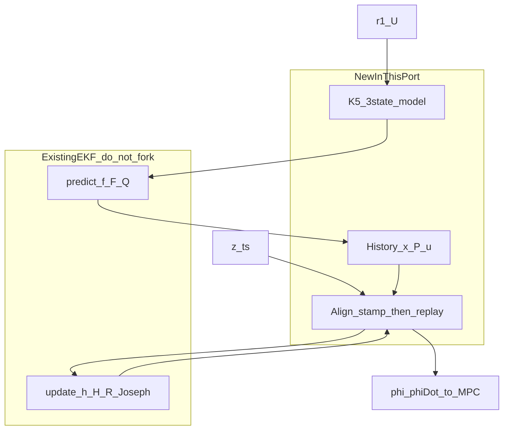
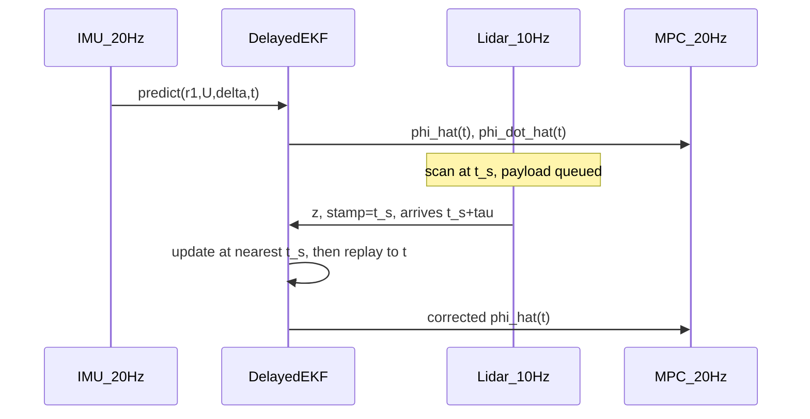
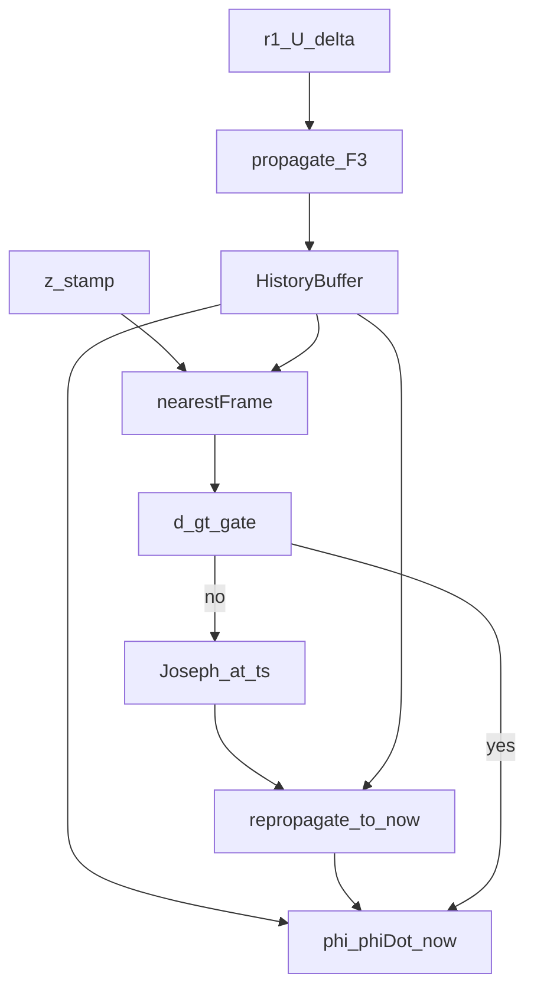

# 重卡铰接角多速率时延融合（Delayed EKF）交接说明

本文是**可冻结的实车方案说明书**：状态、过程/量测模型、时延补偿步骤、调参与验收
以本文为准。车辆几何与横向动力学以
[`1_truck_model_key_formula.md`](1_truck_model_key_formula.md) 为准。

**目标工作区已经有一套较完善的 EKF 实现类。本次移植必须在该类上做功能扩充，
禁止再拷贝或重写一套卡尔曼核。** 本仓库的 `ArticulationEstimator` 只是算法对照
（\(f,F,Q,h,H,R\)、门限、历史重传播怎么调用已有 `predict/update`），不是要落地的
类层次。不要另起状态或过程模型，除非第 11 节的已知限制被新数据推翻。

对照实现（算法，不是拷贝目标）：

| 角色 | 路径 |
|---|---|
| 算法对照 | [`include/truck_model/articulation_estimator.hpp`](../include/truck_model/articulation_estimator.hpp)、[`src/articulation_estimator.cpp`](../src/articulation_estimator.cpp) |
| Demo 雷达时延仿真与闭环接线 | [`examples/mpc_demo/demo_session.cpp`](../examples/mpc_demo/demo_session.cpp) |
| 运行记录 | [`examples/mpc_demo/session_log.cpp`](../examples/mpc_demo/session_log.cpp) |
| 验收用例（应在目标仓用已有 EKF 复现） | [`tests/test_articulated_vehicle.cpp`](../tests/test_articulated_vehicle.cpp)、[`tests/test_mpc_demo.cpp`](../tests/test_mpc_demo.cpp) |

**内部一律 SI：角度 rad，角速度 rad/s，速度 m/s，时间 s。** UI 上的度只是显示换算。

---

## 0. 冻结结论（先读）

实车约束：铰接角 \(\phi\) 只有激光雷达，约 **10 Hz**，时延 **100–400 ms**；高频量
只有 \(\delta,U,r_1\)；没有挂车 IMU \(r_2\)，没有铰接编码器。横向 MPC 约 20 Hz，
要的是**当前** \(\hat\phi,\hat{\dot\phi}\)。

采用 **3 状态 Delayed EKF + 历史重传播**：过程模型为非线性运动学 (K5)，量测为
带偏置的迟到雷达 \(\phi\)。路径跟踪工况下，对 100–400 ms 时延：

- EKF vs Plant RMSE 约 **1.7°–1.8°**（雷达噪声 4°、原始迟到量测 RMSE 约 4.5°–5°）；
- 相位滞后 \(\le 1\) 个控制拍（0 或 50 ms）；
- 幅值比 \(\mathrm{rms}(\hat\phi)/\mathrm{rms}(\phi_{\mathrm{plant}})\approx 0.92\)–\(0.93\)；
- 马氏门限在 \(R=\sigma_{\mathrm{lidar}}^2\) 对齐后几乎不误拒。

**判定：滤波结果尚可，本方案冻结，作为其他工作区最终开发的基准。**

移植时四条硬约束：

0. **复用目标仓已有 EKF 类**（预测、更新、协方差、若已有则含 Joseph / 马氏门限）。只新增铰接角模型、输入、迟到量测的历史重传播外壳。禁止第二套 `KalmanFilter` / `ArticulationEstimator` 滤波核。
1. `historyHorizon` **必须严格大于**最大雷达时延（建议 \(\tau_{\max}+\Delta t_{\mathrm{ctrl}}\)）。本对照实现默认 0.4 s 只刚好覆盖 400 ms；若注入到 0.5 s，大于 0.4 s 的量测会被丢弃（见第 9 节 `20260921_153719`）。
2. `measurementVariance` \(R\) 必须与雷达噪声方差同量级，不要用过小的 \(R\)。
3. 滤波器输出替换 MPC 的铰接通道；Plant / 真值积分仍用 (K27)，二者不要混用。

---

## 0.1 移植架构：扩充已有 EKF，不另起滤波核

目标仓的 EKF 类通常已经具备（名称以目标仓为准）

\[
x\leftarrow f(x,u),\quad
P\leftarrow FPF^\top+Q,\quad
y=z-h(x),\quad
S=HPH^\top+R,\quad
K=PH^\top S^{-1},\quad
x\leftarrow x+Ky,\quad
P\leftarrow (I-KH)P(I-KH)^\top+KRK^\top
\]

以及初始化 \(x,P\)、可选的 \(\chi^2\) 门限。**这些一律沿用，不要在铰接角模块里重写。**

本方案要加的是三层，全部架在已有类外面或作为其**模型插件 / 子类**：

| 层 | 做什么 | 不要做什么 |
|---|---|---|
| 已有 EKF | 一步预测、量测更新、\(P\) 递推、已有门限/对称化 | 为铰接角再写一遍 \(K,S,P\) |
| 模型插件 | 3 维状态 \(x=[\phi,b_{r2},b_\phi]^\top\)；\(f,F,Q\) 按第 4 节；(K5) 几何；\(h=\phi+b_\phi\)，\(H=[1,0,1]\)；\(\phi\) 与创新 `wrap` | 把 \(r_1\) 当状态、把 (K27) 四维塞进这套滤波 |
| 时延外壳 | 缓存 \(\{t_k,x_k,P_k,u_k\}\)；雷达到达时把 EKF **快照回放到** \(t_s\) 最近帧，`update` 一次，再按缓存 \(u\) **顺序 `predict` 到现在** | 把迟到 \(z\) 当成当前量测直接 `update`；自己再实现一套平滑器 |

对已有 EKF 若缺能力，只做**最小扩展**（优先加在基类，供其它滤波共用）：

| 缺口 | 扩法 |
|---|---|
| 不能读写完整 \(x,P\) | 增加 `snapshot()` / `restore(x,P)` 或等价的 clone，供历史重传播 |
| \(Q\) 每步不同 | 预测接口允许本步传入 \(Q\)（F5 含输入噪声与 coasting 倍率） |
| 角度创新不 wrap | 本量测的残差回调里 `wrap(z-h)`；不要改其它滤波的残差 |
| 只有标准 \(P=(I-KH)P\) | 沿用平台更新；有 Joseph 则用 Joseph |
| 已有马氏门限 | 用平台门限，阈值对齐本文 `mahalanobisGate=9`（1 维 \(y^2/S\)） |
| 状态维写死 | 用已有模板/配置把本实例设为 \(n=3,\,m=1\)，不要新开滤波库 |

对照代码里的映射（便于读本仓库，**不要整文件粘贴成第二个 EKF**）：

| 对照函数 | 落到已有 EKF |
|---|---|
| `propagate` 中 \(x^+=f(x,u)\)、\(F\)、\(Q\)、\(P\leftarrow FPF^\top+Q\) | `predict` + 本模型的 \(f,F,Q\) |
| `applyLidarUpdate` 的 \(y,S,K,\) Joseph | `update` |
| `updateLidar` 的 nearest + 改历史 + 后续 `propagate` | 时延外壳：`restore` → `update` → 多次 `predict` |
| `trimHistory` / `HistoryFrame` | 外壳缓冲区，不是 EKF 内部状态机 |
| `kinematicTrailerYawRate` | 模型里的 \(r_{2,\mathrm{kin}}\)，纯几何函数 |

---

## 1. 问题、传感器与控制接口

### 1.1 符号

\[
\phi=\theta_1-\theta_2,\qquad
r_1=\dot\theta_1,\qquad
r_2=\dot\theta_2,\qquad
\dot\phi=r_1-r_2.
\]

轴距与铰接偏置（式 (K1)）：

\[
L_1=a_1+b_1,\qquad
L_2=a_2+b_2,\qquad
\ell_h=b_1-d_1.
\]

\(\ell_h=0\)（铰接点在卡车后轴，本仓库默认 \(d_1=b_1\)）时 (K5) 退化为 (K6)。

Plant（仿真真值）状态是线性轮胎模型 (K27)

\[
z=[v_{y1},\,r_1,\,r_2,\,\phi]^\top.
\]

MPC 误差状态（式 (K36)–(K40)）

\[
x_c=[e_y,\,\dot e_y,\,e_\psi,\,\dot e_\psi,\,\phi,\,\dot\phi]^\top.
\]

代码里 `state[4]`、`state[5]` 就是 \(\phi,\dot\phi\)。融合开启后这两维来自 EKF，
不是 Plant。

### 1.2 传感器

| 量 | 来源 | 典型频率 | 时延 | 用途 |
|---|---|---|---|---|
| \(\delta\) | 转角 | \(\ge 20\,\mathrm{Hz}\) | 可忽略 | 仅残差诊断，不进 \(\dot\phi\) 过程 |
| \(U\) | 车速 | \(\ge 20\,\mathrm{Hz}\) | 可忽略 | (K5) 输入 |
| \(r_1\) | 拖头 IMU | \(\ge 20\,\mathrm{Hz}\) | 可忽略 | (K5) 输入，优于 \((U/L_1)\tan\delta\) |
| \(\phi_{\mathrm{lidar}}\) | 感知雷达 | \(\approx 10\,\mathrm{Hz}\) | **100–400 ms，时变** | 唯一直接铰接观测量 |
| \(r_2\) | — | 无 | — | 用 (K5) + 偏置重建 |
| 铰接编码器 | — | 无 | — | 无 |

雷达给出的是扫描时刻 \(t_s\) 的 \(\phi(t_s)\)，在 \(t_s+\tau\) 才到达。
\(\dot\phi=10^\circ/\mathrm{s}\) 时 300 ms 滞后约 \(3^\circ\)；折叠过程中可达
\(6^\circ\)–\(12^\circ\)。过时的 \(\phi_{\mathrm{lidar}}\) **禁止**直接写入
\(x_c\)。

雷达工控机与车端必须时间同步（PTP/GNSS）。仿真里扫描戳与车辆时钟同源；实车若
戳错，本方案的历史对齐会把更新打到错误帧。

### 1.3 时序

---

## 2. 过程模型：从铰接几何到 (K5)

滤波器**不**使用 (K27) 轮胎力。原因：\(C_\alpha,m_2,I_2\) 随载重变化，大 \(\phi\)
时线性化失效，而 (K5) 只需要轴距。高速侧偏造成的 \(r_2\) 误差由慢变偏置
\(b_{r2}\) 吸收。

### 2.1 铰接点速度

卡车后轴中心相对质心向后 \(b_1\)，铰接点相对质心向后 \(d_1\)。后轴到铰接的有向距离
\(\ell_h=b_1-d_1\)。纯滚动、无侧偏时，卡车纵速 \(U_1=U\)，横摆 \(r_1\)，铰接点在
**卡车体轴**下的速度为式 (K4)

\[
\begin{bmatrix} v_{P_h,x1}\\ v_{P_h,y1} \end{bmatrix}
=
\begin{bmatrix} U \\ \ell_h r_1 \end{bmatrix}.
\]

转到拖车体轴（相对卡车转过 \(-\phi\)）：

\[
\begin{aligned}
v_{P_h,x2}
&= U\cos\phi + \ell_h r_1\sin\phi,\\
v_{P_h,y2}
&= -U\sin\phi + \ell_h r_1\cos\phi.
\end{aligned}
\]

（符号约定：\(\phi=\theta_1-\theta_2\)，拖车相对卡车的转角为 \(-\phi\)。）

### 2.2 挂车轴纯滚动

挂车轴距铰接 \(L_2=a_2+b_2\)。无侧偏时挂车轴接地点速度沿车轴横向分量为 0，铰接点
横向速度完全由挂车横摆产生：

\[
v_{P_h,y2} = -L_2 r_2
\quad\Rightarrow\quad
r_{2,\mathrm{kin}}
=\frac{U\sin\phi+\ell_h r_1\cos\phi}{L_2}.
\]

这就是式 (K5) 的 \(\dot\theta_2\)。因此

\[
\boxed{
\dot\phi
=r_1-r_{2,\mathrm{kin}}
=r_1-\frac{U\sin\phi+\ell_h r_1\cos\phi}{L_2}.
}
\tag{F1}
\]

\(\ell_h=0\) 时

\[
\dot\phi=r_1-\frac{U}{L_2}\sin\phi,
\]

再把 \(r_1=(U/L_1)\tan\delta\) 代入即式 (K6)。**滤波器不要用自行车公式代替 IMU 的
\(r_1\)**：轮胎侧偏时 IMU 的 \(r_1\) 才是 \(\dot\theta_1\)。\(\delta\) 只用来算诊断量

\[
r_{1,\mathrm{bicycle}}=\frac{U}{L_1}\tan\delta,\qquad
\tilde r_1=r_1-r_{1,\mathrm{bicycle}}
\]

（代码 `truckYawResidual`）。

### 2.3 与 Plant (K27) 的差

(K27) 第 4 行是运动学恒等式 \(\dot\phi=r_1-r_2\)，但 \(r_2\) 来自轮胎力，不是
\(r_{2,\mathrm{kin}}\)。高速、大 \(\phi\) 时

\[
r_2=r_{2,\mathrm{kin}}+b_{r2}+\text{（更快的未建模动态）}.
\]

\(b_{r2}\) 只能跟踪慢残差。这就是估计幅值相对 Plant 系统性略矮（约 7%–8%）的来源。
路径跟踪时 Plant 的 \(\phi\) 由路径/MPC 决定，估计器跟着走，该偏差可接受。
**若 MPC 直接跟踪 \(\phi_{\mathrm{ref}}\) 且反馈用 \(\hat\phi\)**，幅值比会掉到约
0.74，闭环会少打转角——见第 9.3 节，这是已知限制，不是调 \(Q/R\) 能消掉的。

---

## 3. 方案对比与选用

| 方案 | 时延 | 参数 | 算力 | 结论 |
|---|---|---|---|---|
| 雷达 ZOH | 无补偿 | 无 | 无 | 对照；10 Hz 阶梯 + 100–400 ms 滞后直接进 MPC |
| 开环 (K5) + 雷达覆盖 | 覆盖发生在 \(t_s\) | 低 | 极低 | 当前值仍落后 \(\tau\)，无协方差 |
| 互补滤波 + \(\dot\phi\cdot\tau\) 外推 | 常值速率 | 低 | 极低 | 时变 \(\tau\) 差；作故障降级 |
| 标准 EKF（把迟到 \(z\) 当当前） | 无 | 低 | 低 | 会把估计往过去拉，禁用 |
| 状态增广 KF | 固定整数档 | 低 | 中 | \(\tau\) 连续波动时维数/插值差 |
| 全状态 (K27) Delayed EKF | 可以 | 高 | 中 | 载重敏感；仅可作高速监督 |
| UKF / 粒子滤波 | 可以 | 低 | 高 | (K5) 非线性只是 \(\sin,\cos\)，过重 |
| **历史重传播 Delayed EKF** | **可变 \(\tau\)** | **低（轴距）** | **低** | **采用** |

选用理由：\(\tau\) 在 100–400 ms 内随机，状态维数不随 \(\tau\) 膨胀；更新对齐到
\(t_s\) 后再用缓存的 \(r_1,U\) 积分到现在，等价于对可变延迟量测做平滑。
在目标仓，这一步是「已有 EKF 的 `update` 打在历史帧上，再 `predict` 回当前」，
不是新滤波算法。

---

## 4. Delayed EKF 公式（模型与时延步骤）

下列 \(f,F,Q,h,H\) 和重传播顺序是要接到**已有 EKF** 上的模型与外壳。
`propagate` / `applyLidarUpdate` 只是本仓库对照里的函数名，对应已有类的
`predict` / `update`（见第 0.1 节）。状态维、雅可比、\(Q\) 公式必须按本节实现；
\(K\) 与 \(P\) 的数值更新走平台核。

### 4.1 状态

\[
x=\begin{bmatrix}\phi\\ b_{r2}\\ b_\phi\end{bmatrix}.
\]

- \(\phi\)：当前铰接角。
- \(b_{r2}\)：挂车横摆运动学残差（侧偏、几何误差），随机游走。
- \(b_\phi\)：雷达系统偏差（安装/标定），随机游走，过程噪声极小。

代码：`HistoryFrame::state`，下标 `[0],[1],[2]`。

### 4.2 连续过程

输入 \(u=(r_1,U)\)（\(\delta\) 不进过程）：

\[
\begin{aligned}
r_{2,\mathrm{kin}}(x,u)
&=\frac{U\sin\phi+\ell_h r_1\cos\phi}{L_2},\\
r_2&=r_{2,\mathrm{kin}}+b_{r2},\\
\dot\phi&=r_1-r_2,\\
\dot b_{r2}&=0,\qquad \dot b_\phi=0.
\end{aligned}
\tag{F2}
\]

函数 `kinematicTrailerYawRate` 实现 \(r_{2,\mathrm{kin}}\)。

输入噪声：把 \(r_1,U\) 看成

\[
r_1=r_{1,\mathrm{meas}}+w_{r1},\quad
U=U_{\mathrm{meas}}+w_U,
\]

\(w_{r1}\sim\mathcal N(0,\sigma_{r1}^2)\)，\(w_U\sim\mathcal N(0,\sigma_U^2)\)，
白噪声，进入 \(\dot\phi\)。另有过程噪声 \(w_{\dot\phi},w_{b_{r2}},w_{b_\phi}\)。

### 4.3 连续雅可比

对 (F2) 求导。记 \(s=\sin\phi,\;c=\cos\phi\)：

\[
\frac{\partial r_{2,\mathrm{kin}}}{\partial\phi}
=\frac{U c-\ell_h r_1 s}{L_2}
\qquad\text{代码 } \texttt{trailerYawSensitivity}.
\]

\[
f_x
=\frac{\partial \dot x}{\partial x}
=
\begin{bmatrix}
-\partial r_{2,\mathrm{kin}}/\partial\phi & -1 & 0\\
0 & 0 & 0\\
0 & 0 & 0
\end{bmatrix}.
\]

\[
\frac{\partial\dot\phi}{\partial r_1}
=1-\frac{\ell_h c}{L_2},\qquad
\frac{\partial\dot\phi}{\partial U}
=-\frac{s}{L_2}.
\]

### 4.4 离散一步（右端点输入、欧拉）

设相邻历史帧时刻 \(t_k<t_{k+1}\)，\(\Delta t=t_{k+1}-t_k>0\)。本实现把
**区间末端**的输入 \(u_{k+1}\) 当作整个区间的 ZOH（`predict` 用新 `inputs`；
重传播用 `history_[i+1].inputs`）。

\[
\begin{aligned}
\phi_{k+1}
&=\mathrm{wrap}\bigl(\phi_k+\Delta t\,(r_{1,k+1}-r_{2,k})\bigr),\\
b_{r2,k+1}&=b_{r2,k},\\
b_{\phi,k+1}&=b_{\phi,k}.
\end{aligned}
\tag{F3}
\]

\(\mathrm{wrap}\) 把角收到 \((-\pi,\pi]\)（代码匿名命名空间 `wrapAngle`）。
\(r_{2,k}=r_{2,\mathrm{kin}}(\phi_k,u_{k+1})+b_{r2,k}\)。

\(\Delta t\le 0\) 时不积分，只 wrap \(\phi\)。

离散状态转移：

\[
F
=I+\Delta t\,f_x
=
\begin{bmatrix}
1-\Delta t\,\partial r_{2,\mathrm{kin}}/\partial\phi & -\Delta t & 0\\
0 & 1 & 0\\
0 & 0 & 1
\end{bmatrix}.
\tag{F4}
\]

\(F_{00}\) 中的 \(\partial r_{2,\mathrm{kin}}/\partial\phi\) 在 **\(\phi_k\)**
处、用 \(u_{k+1}\) 求值。

### 4.5 过程噪声 \(Q\)

\[
\begin{aligned}
Q_{00}
&=\eta\,\Delta t\,q_{\dot\phi}
+\Delta t^2\Bigl[
\bigl(\partial\dot\phi/\partial r_1\bigr)^2\sigma_{r1}^2
+\bigl(\partial\dot\phi/\partial U\bigr)^2\sigma_U^2
\Bigr],\\
Q_{11}&=\Delta t\,q_{b_{r2}},\qquad
Q_{22}=\Delta t\,q_{b_\phi},\\
Q_{ij}&=0\ (i\neq j).
\end{aligned}
\tag{F5}
\]

\(\eta=4\) 当 `coasting`，否则 \(\eta=1\)。协方差

\[
P\leftarrow FPF^\top+Q.
\]

代码 `propagate`。字段对照：

| 符号 | 配置字段 |
|---|---|
| \(q_{\dot\phi}\) | `processArticulationRateVariance` [rad²/s²] |
| \(q_{b_{r2}}\) | `processTrailerYawBiasVariance` [rad²/s³]（随机游走谱密度） |
| \(q_{b_\phi}\) | `processLidarBiasVariance` |
| \(\sigma_{r1}^2\) | `truckYawRateVariance` |
| \(\sigma_U^2\) | `speedVariance` |

### 4.6 量测（只在扫描时刻）

\[
z=\phi+b_\phi+v,\qquad
v\sim\mathcal N(0,R),\qquad
H=\begin{bmatrix}1&0&1\end{bmatrix}.
\tag{F6}
\]

\[
\hat z=\mathrm{wrap}(\phi+b_\phi),\qquad
y=\mathrm{wrap}(z-\hat z),\qquad
S=HPH^\top+R.
\]

展开（\(3\times 3\)）：

\[
S=P_{00}+P_{02}+P_{20}+P_{22}+R.
\]

\(S\le 0\) 或非有限则视为实现错误，抛异常。

卡尔曼增益 \(K=PH^\top S^{-1}\)：

\[
K
=\frac{1}{S}
\begin{bmatrix}P_{00}+P_{02}\\ P_{10}+P_{12}\\ P_{20}+P_{22}\end{bmatrix}.
\]

### 4.7 马氏门限

标量马氏距离

\[
d=y^2/S.
\]

若 \(d>\) `mahalanobisGate`（默认 9，约 1 维 \(3\sigma\)）：**拒绝**，不改该帧
\(x,P\)，不重传播，`measurementGated=true`。连续拒绝或超时则进入 coasting（4.10）。

### 4.8 Joseph 更新（接受时）

\[
x\leftarrow x+Ky,\qquad
\phi\leftarrow\mathrm{wrap}(\phi),
\]

\[
P\leftarrow (I-KH)P(I-KH)^\top+KRK^\top.
\]

\(KH=K[1,\,0,\,1]\)，即第 0、2 列都等于 \(K\)。Joseph 形式保持 \(P\) 对称正定，
即使 \(K\) 与 \(P\) 有轻微数值不一致。代码 `applyLidarUpdate`。

### 4.9 时延：历史缓冲与重传播

缓冲帧

\[
\{t_k,\,x_k,\,P_k,\,u_k\}_{k=0}^{N-1},
\quad
u_k=(t_k,r_{1,k},U_k,\delta_k),
\]

覆盖最近 `historyHorizon` 秒（默认 0.4 s）。20 Hz 时约 9 帧。`trimHistory`
在 `predict` 入队后丢掉过老的帧，始终至少留 1 帧。

**`predict(u)`**（每个 IMU/控制拍）：

1. 未初始化则 `reset(t,0)`。
2. `u.time <= t_last`：只覆盖最新帧输入并发布，不积分。
3. 否则用 (F3)–(F5) 从最新帧积分到 `u.time`，入队，trim，发布。

**`updateLidar({stamp, z})`**：

1. 未初始化或历史空：直接返回。
2. 令 \(t_{\min}=t_0,\;t_{\max}=t_{N-1}\)。若
   `stamp < t_min - 1e-9` 或 `stamp > t_max + 0.05`：**丢弃**（不是门限）。
   `consecutiveRejects++`，可能置 coasting。此时 `measurementGated=false`。
   这就是 \(\tau>\) `historyHorizon` 时量测全部丢失的路径。
3. `index = nearestFrame(stamp)`：历史中 \(|t_k-\mathrm{stamp}|\) 最小的帧。
   **不做时间插值**。控制周期 50 ms 时最大对齐误差 25 ms。
4. 在该帧上算 \(y,S,d\)。若超门限：置 gated，不改历史，返回。
5. 否则 Joseph 更新写入 `history_[index]`。
6. 对 \(i=\mathrm{index},\ldots,N-2\)，用 \(u_{i+1}\) 重传播到后续帧（coasting
   标志在重传播里强制为 false，避免把开环放大的 \(Q\) 再灌进已校正轨迹）。
7. 用最新帧 `publishFromState`。`lastAcceptedStamp = stamp`（扫描时刻，不是到达时刻）。

### 4.10 Coasting（开环）

`coasting` 为真当且仅当

\[
\texttt{consecutiveRejects}\ge\texttt{consecutiveRejectLimit}
\quad\text{或}\quad
t_{\mathrm{now}}-\texttt{lastAcceptedStamp}>\texttt{lostTimeout}.
\]

默认连续 3 次丢/拒，或距**上次接受的扫描戳**超过 0.4 s。coasting 时 \(Q_{00}\)
乘 4，运动学继续积分。

注意：`lastAcceptedStamp` 是 \(t_s\) 不是到达时刻。若 \(\tau\) 本身接近
`lostTimeout`，很多 20 Hz 拍上 `t_now - t_s > 0.4`，标志会亮，但并不表示已经
连续丢了三帧雷达。这是诊断偏严，不是滤波器散了。移植时建议

\[
\texttt{lostTimeout}\ge \tau_{\max}+\texttt{lidarPeriod},
\]

或改为“距上次成功 `updateLidar` 的墙钟时间”。

### 4.11 输出给 MPC

每次 `predict` / 成功更新后：

\[
\begin{aligned}
\hat\phi&=x_0,\\
\hat r_{2,\mathrm{kin}}&=r_{2,\mathrm{kin}}(\hat\phi,U,r_1),\\
\hat r_2&=\hat r_{2,\mathrm{kin}}+\hat b_{r2},\\
\hat{\dot\phi}&=r_1-\hat r_2.
\end{aligned}
\]

**不要**对 \(\hat\phi\) 做数值差分当 \(\dot\phi\)。协方差对角
`covariancePhi/TrailerBias/LidarBias` 供监控，MPC 当前不吃 \(P\)。

---

## 5. Demo 如何模拟雷达（实车对接对照）

`lidarFusionEnabled==true` 时，每个控制拍 `updateMeasuredErrorState`：

1. 先用 Plant 几何填 `state[4], state[5]`（随后会被覆盖）。
2. `predict({t, r1=plant_r1, U, delta})`。
3. `captureDelayedLidar(plant_phi)`：若距上次扫描 \(\ge\) `lidarPeriod`（默认 0.1 s），
   入队
   \[
   z=\phi_{\mathrm{plant}}(t_s)+\sigma_{\mathrm{lidar}}\,n,\quad
   n\sim\mathcal N(0,1),\quad
   \tau\sim\mathrm{Unif}[\tau_{\min},\tau_{\max}],
   \]
   `deliverTime = t_s + tau`，`stamp = t_s`。
4. `deliverDueLidar`：所有 `deliverTime <= t` 的包按 FIFO 调用 `updateLidar`。
5. `state[4]=ekf.phi`，`state[5]=ekf.phi_dot`。Plant `physicalState` 仍按 (K27) 积分。

\(\tau_{\min},\tau_{\max}\) 默认 0.1–0.3 s，面板可改；校验 `lidarDelayMax <= 0.5`。
控制网格 50 ms，实际 \(\tau\) 量化到 50 ms。噪声与均匀随机数是线性同余 + Box–Muller，
种子 `lidarRandomSeed`。

实车替换第 3–4 步：把感知包的 **扫描时间戳** 和 **铰接角 rad** 送进
`updateLidar`；高频 `predict` 用车端 IMU/车速。不要把到达时刻当成 `stamp`。

闭环注意：MPC 跟踪的是 \(\hat\phi\)。路径跟踪时 \(\phi\) 是伴随状态，估计偏差对
\(e_y\) 影响小。铰接角跟踪实验（`articulationTrackingExperiment`）会把 MPC 的
\(Q_{e_y}\) 等关掉、盯 \(\phi_{\mathrm{ref}}\)，此时 0.74 幅值比会被控制器放大——
移植到“直接铰接角闭环”前必须先改过程模型或改用 Plant/编码器作对照，不能只调 \(R\)。

---

## 6. 参数（默认、调参、单位）

面板上的标准差是 **度**；写入配置前换成 rad 再平方：
`variance = (std_deg * π/180)²`。勾选「R 跟随雷达噪声」时
\(R=\max(\sigma_{\mathrm{lidar}},0.25^\circ)^2\)。

| 项 | 字段 | 冻结建议 | 说明 |
|---|---|---|---|
| 历史窗 | `historyHorizon` | \(\ge\tau_{\max}+\Delta t\)，推荐 **0.50–0.55 s** 覆盖 400 ms | 默认 0.4 s 刚好卡在 400 ms |
| \(R\) | `measurementVariance` | 等于雷达 \(\sigma^2\) | 过小 → 马氏拒测；过大 → \(K_\phi\) 过软 |
| \(q_{\dot\phi}\) | `processArticulationRateVariance` | \((3^\circ/\mathrm{s})^2\approx 2.74\times 10^{-3}\) | 帧间 \(\dot\phi\) 过程 |
| \(q_{b_{r2}}\) | `processTrailerYawBiasVariance` | \(2\times 10^{-4}\) | 让 \(b_{r2}\) 能跟侧偏 |
| \(q_{b_\phi}\) | `processLidarBiasVariance` | \(10^{-10}\) | 几乎当零偏，除非有标定慢漂 |
| \(\sigma_{r1}^2\) | `truckYawRateVariance` | \((0.3^\circ/\mathrm{s})^2\) | IMU 横摆 |
| \(\sigma_U^2\) | `speedVariance` | \(0.04\) (0.2 m/s)² | 车速 |
| 门限 | `mahalanobisGate` | 9 | \(R\) 对齐后不要再拧死 |
| 连续拒 | `consecutiveRejectLimit` | 3 | |
| 丢失 | `lostTimeout` | \(\ge\tau_{\max}+T_{\mathrm{lidar}}\) | 默认 0.4 s 对 400 ms 时延偏紧 |
| \(P_\phi(0)\) | `initialArticulationVariance` | \((2^\circ)^2\) | |
| \(P_{b_{r2}}(0)\) | `initialTrailerYawBiasVariance` | \((2^\circ/\mathrm{s})^2\) | |
| \(P_{b_\phi}(0)\) | `initialLidarBiasVariance` | \((0.3^\circ)^2\) | |

头文件里 \(R\) 默认 \((1^\circ)^2\)。Demo 若跟随雷达，会覆盖成雷达方差。
**禁止**在雷达 3°–4° 噪声时仍用 \(1^\circ\) 的 \(R\)：曾经约 50% 量测被门限丢掉。

几何参数必须与实车一致：\(a_2,b_2,b_1,d_1\)。\(L_2\) 错 10% 会系统性扭曲
\(r_{2,\mathrm{kin}}\)。

---

## 7. 接到已有 EKF 上的契约

目标仓用已有 EKF 实例承载第 4 节模型；本仓库字段名只作对照。

### 7.1 配置与复位

`historyHorizon, measurementVariance, processArticulationRateVariance,
mahalanobisGate, lostTimeout, 三个 initial*` 必须有限且 \(>0\)；其余方差 \(\ge 0\)；
`consecutiveRejectLimit >= 1`。

复位：清空历史；已有 EKF `reset` 到
\(x=[\mathrm{wrap}(\phi),0,0]^\top\)，\(P=\mathrm{diag}(P_\phi(0),P_{b_{r2}}(0),P_{b_\phi}(0))\)，
把该快照写入历史第一帧。换几何或 \(Q/R\) 时同样清空历史。

### 7.2 每拍调用顺序（外壳）

与对照实现 `predict` / `updateLidar` 相同，但预测/更新必须走已有 EKF：

1. IMU 拍：用当前 \(u\) 调已有 `predict` → 把返回的 \(x,P,u,t\) 入历史 → trim。
2. 雷达包：`stamp` 出窗则丢弃（不是门限）；否则 `restore` 到最近历史帧 → 已有
   `update`（含门限）→ 若接受，用该帧之后缓存的 \(u_{k}\) 连续 `predict` 到现在并
   改写后续历史。
3. 发布 \(\hat\phi,\hat{\dot\phi}\)（第 4.11 节）。量测诊断（\(y,S,d,K,\) accepted/gated）
   以**这一次** `update` 为准，后续 `predict` 不得清掉。

### 7.3 验收（在目标仓用已有 EKF 复现，不要拷本仓库测试文件当实现）

| 用例 | 断言 |
|---|---|
| \(r_{2,\mathrm{kin}}\) 对轴 / 偏轴 | 与 (K5) \(\dot\theta_2\) 一致 |
| 固定 200 ms 时延、无噪声 | 当前 \(\hat\phi\) RMSE \(<0.015\,\mathrm{rad}\)，且明显小于原始迟到 \(z\) |
| 大野值 | 门限拒绝，\(x\) 不被拉走 |
| 长时间无雷达 | coasting，运动学继续，\(P_{\phi\phi}\) 增大 |
| 闭环路径跟踪 | \(\hat\phi\) 优于原始迟到雷达（量级见第 9 节） |

---

## 8. 运行记录（复盘入口）

面板「导出本次记录」，或 run `finished`/`faulted` 时写入
`runs/YYYYMMDD_HHMMSS/`：

| 文件 | 内容 |
|---|---|
| `settings.txt` | 车型、MPC、雷达、EKF、当时 \(A_d,B_d\) |
| `timeseries.csv` | 每控制步一行 |
| `mpc_horizon.csv` | 预测域 \(x_c(k)\) |
| `path.csv` | 参考线 |
| `README.txt` | 列说明 |

`timeseries.csv` 与融合有关的列：

- Plant：`plant_vy1,plant_r1,plant_r2,plant_vy2,plant_phi,plant_phi_dot`
- 控制反馈（融合后）：`ctrl_phi,ctrl_phi_dot`（即 `state[4,5]`）
- 雷达：`lidar_z,lidar_stamp,lidar_delay,lidar_queue,lidar_delivered,lidar_accepted,lidar_gated`
- EKF：`ekf_phi,ekf_phi_dot,ekf_r2,ekf_r2_kin,ekf_b_r2,ekf_b_phi,ekf_P_phi,ekf_innovation,ekf_S,ekf_mahalanobis,ekf_K_phi,ekf_aligned_stamp,ekf_last_accepted_stamp,ekf_coasting`

送达但 `accepted=0` 且 `gated=0`：量测因超出历史窗被丢，不是野值。

复盘顺序：

1. `lidar_delay` 分布是否覆盖 100–400 ms；`ekf_aligned_stamp` 是否等于 `lidar_stamp`。
2. 接受率；马氏距离均值应 \(O(1)\)，不应经常 \(>9\)。
3. `ekf_phi` vs `plant_phi`：RMSE、互相关滞后、幅值比。
4. 原始 `lidar_z` vs 当前 plant：应明显差于 EKF（证明时延补偿在干活）。
5. `plant_r2` vs `ekf_r2_kin`：过程模型侧偏误差。

---

## 9. 仿真验证（本仓库已跑）

共同条件：路径跟踪，融合开，雷达 10 Hz，噪声 **4°**，\(R=4^{\circ 2}\)，
\(q_{\dot\phi}=(3^\circ/\mathrm{s})^2\)，\(Q_{b_{r2}}=2\times 10^{-4}\)，门限 9，
`historyHorizon=0.4` s，控制 20 Hz，约 32 s。

### 9.1 时延 100–300 ms（`runs/20260921_152621`）

延迟量化后 150/200/250/300 ms 均有样本，均值 219 ms。264 次送达，261 接受，3 拒绝。
EKF vs Plant RMSE **1.70°**，原始雷达 vs 当前 Plant **4.49°**，幅值比 **0.93**，
相关滞后 1 拍。路径 \(e_y\) RMSE 0.25 m。按时延分层，EKF 误差不随 \(\tau\) 变差
（约 1.5°–1.8°）。

### 9.2 把最大时延加到 0.5 s（`runs/20260921_153719`）

设置：`lidarDelayMin=0.1`，`lidarDelayMax=0.5`，其余同上。延迟均值 320 ms，队列
平均 3.5 帧。

| 量化时延 | 送达 | 接受 | 门限拒 | 超窗丢 | 该档 EKF RMSE |
|---|---|---|---|---|---|
| 150–400 ms | 172 | 170 | 2 | 0 | 0.9°–2.0° |
| 450 ms | 14 | 0 | 0 | **14** | （未更新，靠预测） |
| 500 ms | 8 | 0 | 0 | **8** | 同上 |

全段 EKF vs Plant RMSE **1.78°**（相对 300 ms 上限只差 0.08°），幅值比 **0.92**，
相关最佳滞后 **0**。路径跟踪与上一跑相同（\(e_y\) RMSE 0.25 m）。接受时马氏均值
1.11，\(K_\phi\) 约 0.16。

**解读：** 100–400 ms 补偿仍然成立。450–500 ms 的 22 帧全部走“stamp 早于历史”
分支，因为窗只有 0.4 s。这不是算法发散。移植时把 `historyHorizon` 提到 \(\ge 0.55\) s
即可覆盖工程 400 ms 余量以及偶发 500 ms。本跑 `ekf_coasting` 亮了约一半拍数，是
`lostTimeout=0.4` 与长时延扫描戳比较造成的诊断误报（第 4.10 节）；`consecutiveRejects`
最大仅 2，真实丢链并不长。

### 9.3 铰接角正弦跟踪（`runs/20260921_152003`，对照）

直接盯 \(\phi_{\mathrm{ref}}=\pm 20^\circ\)、反馈 \(\hat\phi\) 时，门限问题在 \(R\)
对齐后已解决（拒测 2%），但幅值比仍约 **0.74**。这是 (K5) \(\sin\phi\) 回正项与
(K27) Plant 不一致，被闭环放大。**路径跟踪方案冻结不受此条否定**；若其他工作区要
做铰接角伺服，需单独改过程模型（减弱回正或并联 (K27)），不要指望再拧 \(Q/R\)。

---

## 10. 已知限制（不要当成实现 bug）

1. **过程是 (K5)，Plant 是 (K27)。** 路径跟踪幅值比约 0.92；铰接角闭环会更差。
2. **历史窗必须覆盖 \(\tau_{\max}\)。** 默认 0.4 s 对“最大 400 ms”没有裕度。
3. **`coasting` 用扫描戳计时**，长时延下会误亮。
4. **最近邻对齐，无插值。** 需要亚步精度时再在 `nearestFrame` 两侧线性化，不是当前范围。
5. **单雷达、单峰噪声。** 多峰/错误关联靠马氏门限，不是粒子滤波。
6. **无挂车 IMU。** \(r_2\) 不可观的快动态只能进 \(q_{\dot\phi}\)。
7. **时间同步是前提。** stamp 错 100 ms 等于故意把更新打到错误历史帧。
8. **\(\phi\) wrap。** 创新和状态都 wrap；跨 \(\pm\pi\) 时不要改成不 wrap 的减法。
9. Demo `lidarDelayMax` 校验上限 0.5 s，与当前默认历史窗并不自动联动。

---

## 11. 其他工作区移植清单

按顺序做。**滤波核用目标仓现成 EKF；本仓库代码只对照算法。**

1. 定位已有 EKF 类（`predict` / `update` / \(x,P\)）。确认能否快照与恢复；不能则按第 0.1 节做最小扩展。
2. 新增铰接角**模型**（3 状态，第 4 节 \(f,F,Q,h,H\)），挂到该 EKF 的一个实例上。不要新开滤波库。
3. 新增**时延外壳**（历史 \(\{t,x,P,u\}\)、对齐 `stamp`、回放 `update`、重 `predict`）。几何参数
   \(L_2,d_1,b_1\) 与实车一致即可，不必依赖本仓库的 `Parameters` 类型。
4. IMU/控制线程调外壳的高频 `predict`（内部转已有 EKF `predict`）；雷达回调把**扫描时刻**
   `stamp` 和 \(\phi_{\mathrm{lidar}}\) 送进外壳（内部转已有 `update`）。
5. \(\hat\phi,\hat{\dot\phi}\) 写入横向控制器铰接通道；底盘/Plant 积分不要用估计值。
6. `historyHorizon = tau_max + dt_ctrl`（400 ms 用 0.50–0.55 s），`lostTimeout` 不小于该值，
   \(R=\sigma_{\mathrm{lidar}}^2\)。
7. 用第 7.3 节用例在目标仓回归；实车先开环对比（估计 vs 雷达外推 vs 若有编码器）。
8. 记录与第 8 节同构的时序，按第 9 节指标验收。
9. **不要**忽略时延、不要把 \(\delta\) 代入 (K6) 代替 IMU 的 \(r_1\)、不要在 \(R\) 未对齐时
   把门限拧死、**不要**把 `articulation_estimator.cpp` 整文件拷进目标仓当第二套 EKF。

需要改方案的仅有两种情况：新数据证明 400 ms 下 RMSE 仍显著大于雷达噪声；或产品改为
直接 \(\phi\) 伺服且不能接受 0.74 幅值比。那时再动第 2.3 节的过程模型，而不是推翻
延迟重传播结构，更不要为此重写已有 EKF 核。
