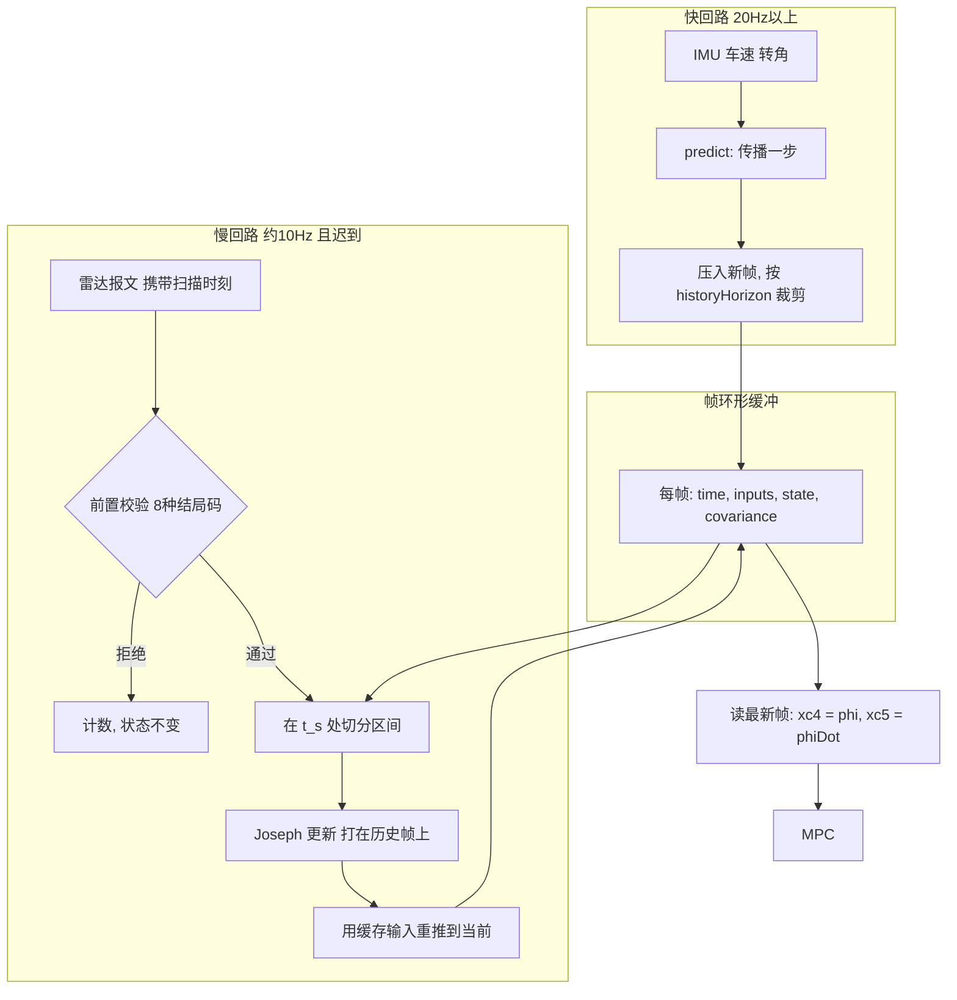
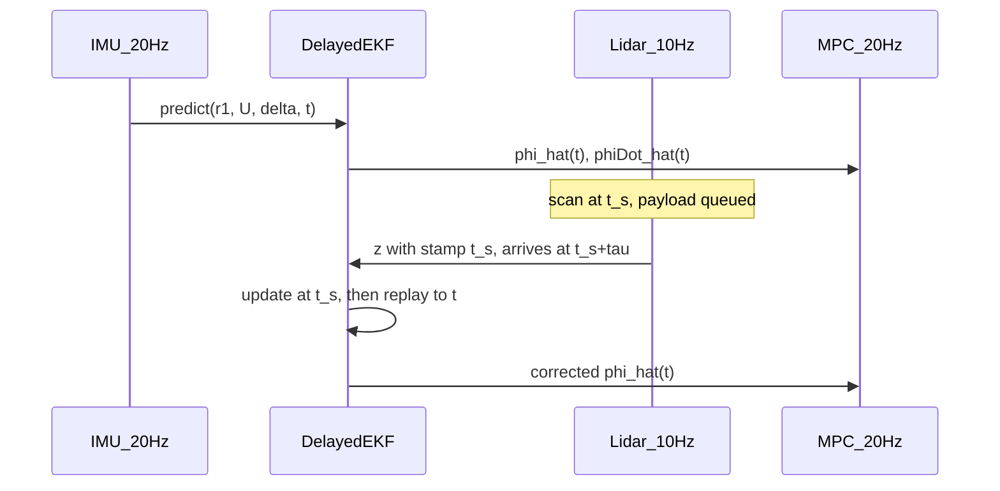

# 铰接角时延融合滤波器：技术说明与移植指南

## 0. 这份文档是什么

卡车只有一个激光雷达能观测铰接角 \(\phi\)，它约 10 Hz、带 100–400 ms 的可变时延；
而横向 MPC 每 50 ms 需要**当前**的 \(\phi\) 和 \(\dot\phi\)。本文给出解决这个问题的
滤波器。

滤波器只有**一套框架**（量测模型、噪声离散、时延处理三者共用），其中**过程模型有两个
可选实现**：运动学 (K5) 和降阶动力学 (K27r)。本文按这两个模型**对照**展开。

**读者**：要把这套滤波器移植到另一个代码仓的人（或 AI）。因此本文：

- 第 2 章先讲清整套方案在干什么，再进推导；
- 每个符号在第一次使用前都在参数表中定义，含单位与物理意义；
- 每个公式都从上一步推出来，不跳步；
- 两个过程模型的每个环节都并排给出，便于取舍；
- 每一节都标注对应的代码位置（第 12 章有完整对照表）；
- 第 15 章是分步移植清单，每步有独立验收条件。

**几何与车辆动力学**以
[`1_truck_model_key_formula.md`](1_truck_model_key_formula.md) 为准，
其适用边界见该文 1.4 节。本文引用的 (K…) 编号都来自那里。

**单位约定**：全文 SI。角度 rad，角速度 rad/s，速度 m/s，时间 s。
界面显示的度只是换算，配置里一律存 rad。

### 0.1 一分钟概览

| 项 | 运动学模型 | 动力学模型 |
|---|---|---|
| 代码枚举 | `ArticulationProcessModel::kinematic` | `::dynamic` |
| 状态维数 | 2 | 3 |
| 状态 | \([\phi,\;b_{r2}]^\top\) | \([v_{y1},\;r_2,\;\phi]^\top\) |
| 依赖参数 | 仅 \(L_2,\ell_h\) | 质量、惯量、轮胎刚度 |
| 量测 | \(z=\phi+v\)，\(H=[1,\,0]\) | \(z=\phi+v\)，\(H=[0,\,0,\,1]\) |
| \(\phi\) RMSE（0.5° 扫描） | 0.56° | **0.30°** |
| \(\dot\phi\) RMSE（0.5° 扫描） | 1.53°/s | **0.60°/s** |
| 默认 | **是** | 否，需显式开启 |

共用部分：量测模型（第 7 章）、噪声离散（第 8 章）、时延处理（第 9 章）。

**三条先说的结论**：

1. 两个模型都**没有**把 \(\dot\phi\) 建成观测量，因为没有任何传感器测它
   （第 7.3 节）。\(\dot\phi\) 是模型输出。
2. 整套方案由你交给 `update()` 的那个**时间戳**参数化。它的含义与可信度是最重要的
   集成决策，不是一个参数（第 2.2 节）。
3. 若只知道时延的大致范围而拿不到逐帧扫描戳，方案**仍然值得做**，但它做的是
   "消掉时延均值、剩下抖动"，不是精确消除（第 2.2 节）。

---

## 1. 问题定义

### 1.1 传感器清单

| 量 | 符号 | 来源 | 频率 | 时延 | 在滤波器中的角色 |
|---|---|---|---|---|---|
| 拖头横摆角速度 | \(r_1\) | 拖头 IMU | ≥20 Hz | 可忽略 | **输入**（两个模型都用） |
| 车速 | \(U\) | 轮速/组合导航 | ≥20 Hz | 可忽略 | **输入**（两个模型都用） |
| 前轮转角 | \(\delta\) | 转向系统 | ≥20 Hz | 可忽略 | 动力学模型的**输入**；运动学模型仅用于诊断 |
| 铰接角 | \(\phi_{\text{lidar}}\) | 感知雷达 | ≈10 Hz | **100–400 ms，时变** | **唯一量测** |
| 挂车横摆角速度 | \(r_2\) | — | 无传感器 | — | 由模型重建 |
| 铰接角速度 | \(\dot\phi\) | — | 无传感器 | — | 由模型重建 |

**关键约束**：没有挂车 IMU，没有铰接编码器。\(r_2\) 和 \(\dot\phi\) 都**不可直接测量**。
任何滤波器都不能凭空增加信息 —— 这一点决定了后面所有取舍，也是第 7.3 节的依据。

### 1.2 时间参考：你实际能拿到什么

这是整套方案最关键的集成前提，比任何一个滤波参数都重要。

雷达描述的是**扫描时刻** \(t_s\) 的 \(\phi(t_s)\)，在 \(t_s+\tau\) 才送达。
\(\dot\phi=10°/\text{s}\) 时，300 ms 的滞后就是 3° 的误差 —— 比雷达本身的噪声还大。
所以把迟到的 \(\phi_{\text{lidar}}\) 直接当成当前值写进控制器是错的。

问题在于：**\(t_s\) 你未必拿得到。** 两种情况必须分清，它们决定方案能做到什么：

| | 情况 A | 情况 B |
|---|---|---|
| 你有什么 | 每帧可信的扫描时间戳 | 只有到达时刻，加一个经验范围 |
| 交给 `update()` 的戳 | 直接用报文里的 \(t_s\) | 合成：\(t_s=t_{\text{arr}}-\bar\tau\) |
| 残余定时误差 | 时钟同步精度（PTP 微秒级） | \(\varepsilon=\tau_{\text{真}}-\bar\tau\)，量级 0.1 s |
| 前提 | 感知与车端时间同步 | 时延范围的经验值可靠 |

`ArticulationLidarMeasurement::stamp` 的 API 契约始终是"扫描时刻，不是到达时刻"。
情况 B 下你**仍然要遵守这个契约**，只是那个扫描时刻是你估出来的而不是读出来的。
误差预算与后果见第 2.2 节，完整处理见第 9.7 节。

> **本文所有实测数字都取自情况 A。** demo 与测试都直接把精确扫描时刻交给滤波器
> （`pending.measurement.stamp = time_`），只延迟*投递*。情况 B 下的表现会差，
> 退化量按第 9.7 节的公式估。

### 1.3 输出接口

MPC 的误差状态（式 (K35)）是
\(x_c=[e_y,\dot e_y,e_\psi,\dot e_\psi,\phi,\dot\phi]^\top\)。
滤波器负责填最后两维：

\[
x_c[4]=\hat\phi,\qquad x_c[5]=\hat{\dot\phi}.
\]

底盘/Plant 的积分**不要**用估计值，只有控制器用。

---

## 2. 方案总览

本章回答三个问题：为什么普通 EKF 不行、时延到底怎么被消掉、整套东西怎么跑。
看完本章应该能判断这个方案适不适合你的系统，再决定要不要读后面的推导。

### 2.1 为什么不用普通 EKF

普通 EKF 的量测方程是

\[
z=h(x_{\text{now}})+v,
\]

它假设量测描述的是**当前**状态。这里这个前提直接不成立：扫描描述的是 100–400 ms
之前的 \(\phi\)。把迟到的扫描当当前值喂进去，同时坏掉三件事：

1. **注入系统性偏差。** 误差约 \(\dot\phi\cdot\tau\)：\(\dot\phi=10°/\text{s}\)、
   \(\tau=0.25\) s 时是 2.5°，与雷达噪声同量级甚至更大。滤波器会把一个确定性偏差
   当成零均值噪声处理。
2. **新息不再是白噪声。** 卡尔曼增益失去最优性，\(P\) 低估真实误差 ——
   滤波器"自信地错着"，而 \(P\) 正是上层判断可信度的唯一依据。
3. **门限反向工作。** \(\tau\) 时变意味着偏差也时变，标定不掉；急转弯时 \(\dot\phi\)
   大、表观新息大，马氏门限会在最需要量测的时刻开始拒绝好包。

所以问题不是"EKF 不够用"，而是它的量测方程在这里是假的。
**本方案不改卡尔曼数学，只把同一套更新用在正确的时间点上。**

### 2.2 时延怎么被消掉：两种情况的误差预算

**情况 A（有可信扫描戳）。** \(\tau=t_{\text{now}}-t_s\) 由时间戳直接给出，
不需要估计。消除的办法不是补偿，而是**回到正确的时间点做更新**：

\[
\text{回退到 } t_s
\;\longrightarrow\;
\text{在历史帧上做标准 EKF 更新}
\;\longrightarrow\;
\text{用缓存的输入重新前推到 } t_{\text{now}}
\]

重推用的是沿途记录下来的 \(r_1,U,\delta\)，不是重新预测，也不是外推。

**"精确"到什么程度，要说清楚：**

- **量测落点是精确的。** 更新打在 \(t_s\) 本身，不存在历史网格量化误差（9.5 节）。
  这是本方案相对"最近邻对齐"的主要改进；前提是保持默认
  `snapToNearestFrame = false`，置真则退回吸附模式，落点不再精确。
- **信息搬运走的是真实模型**，而不是 \(\dot\phi\cdot\tau\) 之类的外推近似。
- **但重推不是原前向过程的逐位复现。** 两个来源：
  1. 运动学用欧拉离散，而 9.5 节会把原区间在 \(t_s\) 处切成两段；
     一步欧拉与两步欧拉相差 \(O(\Delta t^2)\)。
  2. 动力学另有速度调度的滞回（6.5 节）：矩阵取决于速度的**历史**而非当前值，
     而帧里只存 \(x,P,u\)，没存 `scheduledSpeed_`。原前向过程与重推各自的缓存速度
     都可能距当时的输入不到一个 `modelRefreshSpeedStep`，所以两者之间最多可差
     接近两步，实践上仍很小，但没有"一步"的硬界限。

要做到逐位复现，得把 `scheduledSpeed_` 一并存进帧（解决 2），并改用具有严格半群
性质的离散化（解决 1）。当前实现没有这么做，因为两项残差都远小于过程模型本身的
误差。移植时不要把"精确"理解成"比特级可复现"。

代价是一个硬前提：感知与车端必须时间同步。**戳错 100 ms 等于把更新打到错误的
历史时刻，而本方案没有任何机制能自检这件事。**

**情况 B（只有到达时刻和一个范围）。** 必须合成 \(t_s=t_{\text{arr}}-\bar\tau\)。
由 \(t_{\text{arr}}=t_s^{\text{真}}+\tau_{\text{真}}\) 得

\[
t_s=t_s^{\text{真}}+\underbrace{(\tau_{\text{真}}-\bar\tau)}_{\varepsilon},
\qquad
\boxed{\varepsilon=\tau_{\text{真}}-\bar\tau .}
\]

即合成戳比真实扫描时刻**晚** \(\varepsilon\)（\(\varepsilon>0\) 时）。全文统一用这个
符号约定，9.7.3 的回归方向依赖于它。
取范围 100–400 ms、\(\bar\tau=0.25\) s、均匀分布，则 \(\sigma_\varepsilon\approx0.087\) s。

| 做法 | 当前时刻的角度误差 | 量级（RMS 的时间因子） |
|---|---|---|
| 不处理，迟到扫描当当前值 | \(\dot\phi\,\tau\) | 0.26 s |
| 情况 B，合成戳 | \(\dot\phi(\tau-\bar\tau)\) | **0.087 s** |
| 情况 A，真实戳 | \(\dot\phi\times\)时钟误差 | 可忽略 |

\[
\boxed{
\text{情况 B 下方案的作用是消掉时延的\textbf{均值}，剩下\textbf{抖动}，改善约 3 倍。}
}
\]

这既回答了"时延未知还值不值得做"（值得），也纠正了一个容易产生的误解：
它不是精确消除。情况 B 下定时误差会成为主导误差源，必须按第 9.7 节处理，
否则马氏门限会在转弯时批量误拒。

### 2.3 候选方案横向对比

| 方案 | 可变 \(\tau\) | 参数依赖 | 算力 | 结论 |
|---|---|---|---|---|
| 雷达 ZOH 直接用 | 不处理 | 无 | 无 | 对照基线：10 Hz 阶梯叠 100–400 ms 滞后直接进 MPC |
| 开环 (K5) + 雷达覆盖 | 覆盖发生在 \(t_s\) | 低 | 极低 | 当前值仍落后 \(\tau\)，且没有协方差可用 |
| 互补滤波 + \(\dot\phi\tau\) 外推 | 只对常值 \(\tau\) | 低 | 极低 | \(\tau\) 时变时失效；可作故障降级 |
| 标准 EKF（迟到量测当当前） | 不处理 | 低 | 低 | 把估计往过去拉，见 2.1 |
| 状态增广 KF（缓存延迟状态副本） | 固定整数档 | 低 | 中 | \(\tau\) 连续波动时维数膨胀且需插值；**情况 B 下档位本身就不可知**，尤其不适用 |
| 全状态 (K27) Delayed EKF | 可以 | 高 | 中 | 载重敏感；本方案第 6 章的动力学模型就是它的降阶版 |
| UKF / 粒子滤波 | 可以 | 低 | 高 | (K5) 的非线性只有 \(\sin,\cos\)，不值得 |
| **历史重传播 Delayed EKF** | **可以** | **低（仅轴距）** | **低** | **采用** |

选它的理由：\(\tau\) 在区间内随机，而状态维数不随 \(\tau\) 膨胀；更新对齐到 \(t_s\)
后再用缓存输入积分回来，等价于对可变延迟量测做固定区间平滑，但实现只是
"在历史帧上调一次已有的 `update`，再调几次已有的 `predict`"。

### 2.4 整体流程

两个回路共享一个帧环形缓冲：快回路只往前推，慢回路负责回插校正。



时序上看，两条链的交错关系是：



端到端伪代码：

```
# 快回路，每个 IMU/控制拍
on_input(r1, U, delta, t):
    ekf.predict({r1, U, delta}, t)          # 见 9.3
    phi, phiDot = ekf.publish()             # 见 5.8 / 6.6
    controller.articulation_channel(phi, phiDot)

# 慢回路，每个雷达报文
on_scan(payload):
    t_s = payload.scan_time                 # 情况 A
    # t_s = arrival_time - tau_bar          # 情况 B，见 2.2
    outcome = ekf.update(t_s, payload.phi)  # 见 9.4
    log(outcome)                            # 8 个结局码，见 9.4
```

**移植时最容易做错的一步**：把 `on_scan` 里的 `t_s` 写成到达时刻。那等于回到 2.1
的普通 EKF，而且因为多了一层历史机制，症状更隐蔽。

重推只需要输入、不必重放量测，这一点的正当性**完全**来自扫描戳单调前提（第 9.1 节）。
若该前提不成立，整个简化失效。

---

## 3. 全局符号表

后续所有推导只使用本表加上各模型节内声明的附加符号。

### 3.1 几何参数（常量，来自 (K1)）

| 符号 | 含义 | 单位 | 代码字段 |
|---|---|---|---|
| \(a_1\) | 卡车质心到前轴距离 | m | `Parameters::a1` |
| \(b_1\) | 卡车质心到后轴、**沿车体 x 向后**的距离 | m | `Parameters::b1` |
| \(d_1\) | 卡车质心到铰接点、**沿车体 x 向后**的距离 | m | `Parameters::d1` |
| \(a_2\) | 挂车质心到铰接点距离 | m | `Parameters::a2` |
| \(b_2\) | 挂车质心到挂车轴距离 | m | `Parameters::b2` |
| \(L_1=a_1+b_1\) | 卡车轴距 | m | 派生 |
| \(L_2=a_2+b_2\) | 铰接点到挂车轴距离 | m | 派生 |
| \(\ell_h=b_1-d_1\) | 卡车后轴到铰接点的**有向**距离 | m | `hitchOffset()` |

\(\ell_h\) 是本文最容易搞错符号的量。\(b_1\) 与 \(d_1\) 都从质心**向后**量，所以

\[
\boxed{\ell_h>0\iff\text{铰接点在后轴\textbf{前方}（沿 }\boldsymbol e_{x1}\text{ 正向）}.}
\]

落在后轴上时 \(\ell_h=0\)。本仓库默认 \(d_1=b_1\)，即 \(\ell_h=0\)。
此约定与 [docs/2](2_truck_model_derivation.md) (D7)、
[中文模型长文](articulated_vehicle_model_zh-CN.md) §2.2 一致
（该文 §2.4 的数值例取 \(d_1=1.8<b_1=2.5\)，得 \(\ell_h=0.7\) m，铰接点在后轴前方）。

### 3.2 运动学量

| 符号 | 含义 | 单位 |
|---|---|---|
| \(\theta_1,\theta_2\) | 卡车、挂车航向角 | rad |
| \(\phi=\theta_1-\theta_2\) | 铰接角 | rad |
| \(r_1=\dot\theta_1\) | 卡车横摆角速度 | rad/s |
| \(r_2=\dot\theta_2\) | 挂车横摆角速度 | rad/s |
| \(\dot\phi=r_1-r_2\) | 铰接角速度 | rad/s |
| \(U\) | 卡车纵向速度 | m/s |
| \(\delta\) | 前轮转角 | rad |
| \(v_{y1}\) | 卡车质心横向速度 | m/s |
| \(v_{1r}=v_{y1}-b_1r_1\) | 卡车**后轴**横向速度 | m/s |
| \(P_h\) | 铰接点 | — |
| \(R_2\) | 挂车轴中心 | — |
| \(\boldsymbol e_{x1},\boldsymbol e_{y1}\) | 卡车体轴单位向量 | — |
| \(\boldsymbol e_{x2},\boldsymbol e_{y2}\) | 挂车体轴单位向量 | — |

### 3.3 滤波量

| 符号 | 含义 | 单位 |
|---|---|---|
| \(x\) | 状态向量（各模型不同） | — |
| \(P\) | 状态协方差 | — |
| \(A\) | 连续时间雅可比 \(\partial\dot x/\partial x\) | 1/s |
| \(F\) | 实际用于 \(P\) 递推的离散转移矩阵 | — |
| \(\Phi_{\text{VL}}\) | Van Loan 内部的精确转移 \(e^{A\Delta t}\)，用于构造 \(Q_d\) | — |
| \(Q_c\) | 连续过程噪声功率谱密度 | 见 8.1 |
| \(Q_d\) | 离散过程噪声协方差 | — |
| \(H\) | 量测雅可比 | — |
| \(z\) | 雷达量测 | rad |
| \(R\) | 量测方差 | rad² |
| \(y\) | 量测残差（新息） | rad |
| \(S\) | 新息方差 | rad² |
| \(K\) | 卡尔曼增益 | — |
| \(d\) | 马氏距离平方 | — |
| \(\Delta t\) | 积分步长 | s |
| \(\tau\) | 雷达时延 | s |
| \(\bar\tau\) | 时延的标称值（情况 B） | s |
| \(\varepsilon\) | 残余定时误差 | s |
| \(\eta\) | 开环噪声膨胀倍率 | — |

---

## 4. 两个过程模型的分工

先说清楚为什么有两个，再分别推导。

| 维度 | 运动学 (K5) | 动力学 (K27r) |
|---|---|---|
| 物理假设 | 轮胎纯滚动，无侧偏 | 线性轮胎，小角度，恒速 |
| 过程模型**实际用到**的参数 | \(L_2,\ell_h\)（即 \(a_2,b_2,b_1,d_1\)） | 再加 \(a_1,m_1,m_2,I_1,I_2,C_{1f},C_{1r},C_{2r}\) |
| 参数随载重变化 | 否 | **是**，质量/惯量/刚度都变 |
| 侧偏的处理 | 归入残差状态 \(b_{r2}\)，按随机游走 | 显式建模 |
| \(\dot\phi\) 精度（0.5° 扫描） | 弱（1.53°/s） | 强（0.60°/s） |
| \(\dot\phi\) 精度（4° 扫描） | 1.37°/s | 1.11°/s，优势缩小 |
| 失效工况 | 大侧偏、高速急弯 | 低速、倒车、大侧偏、参数失配 |
| 逆犯罪风险 | 低（与 Plant 不同源） | **高**（本仓库 Plant 就是 K27） |

> 注意区分"过程模型用到什么"与"API 要求你填什么"：即使选运动学，
> `ArticulationEstimator::configure()` 仍会校验完整的 `Parameters`
> （`requireValid`），所以质量、惯量、刚度字段必须填合法值。
> 区别在于运动学的**结果**不依赖它们，填得不准也不会影响估计。

**默认选运动学**，因为它只需要两个几何尺寸，不会因为载重变化而失准。
动力学模型作为可选项，在参数可信**且扫描噪声较低**时能显著改善 \(\dot\phi\) ——
注意这个优势随噪声增大而缩小（第 14.1 节）。

---

## 5. 过程模型 A：运动学 (K5)

代码：`KinematicArticulationModel`（`src/articulation_estimator.cpp`）。

### 5.1 本节附加符号

| 符号 | 含义 | 单位 | 首次出现 |
|---|---|---|---|
| \(v_{P_h,x1},v_{P_h,y1}\) | 铰接点速度在**卡车**体轴的分量 | m/s | (F1) |
| \(v_{P_h,x2},v_{P_h,y2}\) | 铰接点速度在**挂车**体轴的分量 | m/s | (F2) |
| \(r_{2,\text{kin}}\) | 纯滚动假设下的挂车横摆角速度 | rad/s | (F4) |
| \(b_{r2}=r_2-r_{2,\text{kin}}\) | 挂车横摆角速度残差（状态） | rad/s | 5.5 |
| \(v_{2r}\) | 挂车轴横向速度 | m/s | (F6) |
| \(\alpha_{1r}\) | 卡车后轴侧偏角 | rad | (F6) |
| \(\alpha_{2r}\) | 挂车轴侧偏角 | rad | (F6) |
| \(C_{2r}\) | 挂车轴侧偏刚度 | N/rad | (F6) |
| \(F_{2r}\) | 挂车轴侧向力 | N | (F6) |
| \(a\) | \(\partial r_{2,\text{kin}}/\partial\phi\) | 1/s | (F9) |

### 5.2 第一步：铰接点在卡车体轴下的速度

纯滚动、无侧偏时，卡车后轴中心速度沿车体前向，大小 \(U\)；卡车以 \(r_1\) 横摆。
铰接点相对后轴沿车体前向偏置 \(\ell_h\)。由刚体速度关系
\(\boldsymbol v_{P}=\boldsymbol v_{O}+\boldsymbol\omega\times\boldsymbol r_{OP}\)，
其中 \(\boldsymbol\omega=r_1\boldsymbol e_z\)、
\(\boldsymbol r_{OP}=\ell_h\boldsymbol e_{x1}\)，
而 \(\boldsymbol e_z\times\boldsymbol e_{x1}=\boldsymbol e_{y1}\)：

\[
\boxed{
\begin{bmatrix} v_{P_h,x1}\\ v_{P_h,y1}\end{bmatrix}
=\begin{bmatrix} U\\ \ell_h r_1\end{bmatrix}.}
\tag{F1}
\]

这就是式 (K4)。

### 5.3 第二步：转到挂车体轴

挂车标架相对卡车标架转过 \(\theta_2-\theta_1=-\phi\)。把同一个向量的分量从卡车标架
换算到挂车标架，要左乘 \(R(-(-\phi))=R(\phi)\)：

\[
\begin{bmatrix} v_{P_h,x2}\\ v_{P_h,y2}\end{bmatrix}
=\begin{bmatrix}\cos\phi&-\sin\phi\\[2pt]\sin\phi&\cos\phi\end{bmatrix}
\begin{bmatrix} U\\ \ell_h r_1\end{bmatrix},
\]

展开：

\[
\boxed{
\begin{aligned}
v_{P_h,x2}&=U\cos\phi-\ell_h r_1\sin\phi,\\
v_{P_h,y2}&=U\sin\phi+\ell_h r_1\cos\phi.
\end{aligned}}
\tag{F2}
\]

**独立核对**（移植时建议照做）。用单位向量点积，由 (D25)(D26) 有
\(\boldsymbol e_{y2}^{T}\boldsymbol e_{x1}=\sin\phi\)、
\(\boldsymbol e_{y2}^{T}\boldsymbol e_{y1}=\cos\phi\)，所以

\[
v_{P_h,y2}
=\boldsymbol e_{y2}^{T}\!\left(U\boldsymbol e_{x1}+\ell_h r_1\boldsymbol e_{y1}\right)
=U\sin\phi+\ell_h r_1\cos\phi,
\]

与 (F2) 第二式一致。两条独立路径得到同一结果，说明旋转方向没搞反 ——
这一步值得做，旋转方向与 \(v_{P_h,y2}\) 的符号约定必须**成对**自洽，
单看任何一个都可能自圆其说。

### 5.4 第三步：挂车轴纯滚动约束

铰接点位于挂车轴前方 \(L_2\)：
\(\boldsymbol p_{P_h}=\boldsymbol p_{R_2}+L_2\boldsymbol e_{x2}\)。
对时间求导，用 \(\dot{\boldsymbol e}_{x2}=r_2\boldsymbol e_{y2}\)：

\[
\boldsymbol v_{P_h}=\boldsymbol v_{R_2}+L_2r_2\boldsymbol e_{y2}.
\]

左乘 \(\boldsymbol e_{y2}^{T}\)。纯滚动意味着挂车轴无横向速度，即
\(\boldsymbol e_{y2}^{T}\boldsymbol v_{R_2}=0\)，于是

\[
\boxed{v_{P_h,y2}=+L_2r_2.}
\tag{F3}
\]

注意符号是 \(+L_2r_2\)，与 5.3 的 \(R(\phi)\) 约定配套。

联立 (F2) 第二式与 (F3)：

\[
\boxed{
r_{2,\text{kin}}(\phi,U,r_1)=\frac{U\sin\phi+\ell_h r_1\cos\phi}{L_2}}
\tag{F4}
\]

\[
\boxed{
\dot\phi=r_1-r_{2,\text{kin}}
=r_1-\frac{U\sin\phi+\ell_h r_1\cos\phi}{L_2}}
\tag{F5}
\]

与 (K5) 的 \(\dot\theta_2\)、\(\dot\phi\) 两行完全一致。
\(\ell_h=0\) 时退化为 \(\dot\phi=r_1-(U/L_2)\sin\phi\)，再代入
\(r_1=(U/L_1)\tan\delta\) 即 (K6)。

代码：`kinematicTrailerYawRate()` 实现 (F4)。

> **不要用自行车公式代替 IMU 的 \(r_1\)。** 轮胎侧偏时 IMU 测到的 \(r_1\) 才是真正的
> \(\dot\theta_1\)；\(\delta\) 只用来算诊断量 \(\tilde r_1=r_1-(U/L_1)\tan\delta\)
> （代码字段 `truckYawResidual`），它**不进**过程模型。

### 5.5 第四步：残差状态 \(b_{r2}\) 的物理含义

(F4) 假设**两根轴**都纯滚动，真实车辆两根轴都会侧偏，所以
\(r_2\neq r_{2,\text{kin}}\)。定义

\[
b_{r2}\;\equiv\;r_2-r_{2,\text{kin}}.
\]

**完整推导。** 放开两处纯滚动假设。铰接点在卡车体轴下的横向速度精确为
\(v_{y1}-d_1r_1\)（由 (K9)），把它按后轴分解：

\[
v_{y1}-d_1r_1=\underbrace{(v_{y1}-b_1r_1)}_{v_{1r}}+\underbrace{(b_1-d_1)}_{\ell_h}r_1 .
\]

即 (F1) 的第二行在有侧偏时应为 \(v_{1r}+\ell_hr_1\)。挂车侧同理，(F3) 变成
\(v_{P_h,y2}=v_{2r}+L_2r_2\)。代回 (F2) 的投影关系：

\[
v_{2r}+L_2r_2=U\sin\phi+\ell_hr_1\cos\phi+v_{1r}\cos\phi,
\]

\[
\boxed{
b_{r2}=\frac{v_{1r}\cos\phi-v_{2r}}{L_2}
\;\xrightarrow[\ \phi\ \text{小}\ ]{}\;
\frac{U(\alpha_{2r}-\alpha_{1r})}{L_2},}
\tag{F6}
\]

最后一步用了 (K7) 的 \(\alpha_{1r}=-v_{1r}/U\)、\(\alpha_{2r}=-v_{2r}/U\)。

**\(b_{r2}\) 是两根轴侧偏角之差折算成的横摆角速度**，不只是挂车轴的。
只有在卡车后轴纯滚动（\(\alpha_{1r}=0\)）这一特例下才退化为常见的

\[
b_{r2}=\frac{U\alpha_{2r}}{L_2}=\frac{U\,F_{2r}}{L_2\,C_{2r}}.
\tag{F6a}
\]

**本节后续的量级、时间常数与符号诊断都以 (F6a) 为基础**，因此都隐含
\(\alpha_{1r}\ll\alpha_{2r}\)。这在挂车重载、卡车后轴负荷轻时成立得较好；
两轴侧偏相当时，下面的 \(k_\beta\) 会系统性偏大。

三个推论（基于 (F6a)）：

1. 它随侧向力变化，**不是常值**。
2. 它有确定的动态（下面 (F7)），不是白噪声驱动的随机游走。
3. 稳态下 \(b_{r2}=k_\beta(U)\,r_2\)，其中 \(k_\beta=m_2a_2U^2/(L_2^2C_{2r})\)。
   本仓库参数、\(U=12\) m/s 时 \(k_\beta=0.42\)，即 \(b_{r2}\) 占 \(r_2\) 的四成，
   绝不是小量。

**它的时间常数。** 由 (K8) 的挂车两式消去铰接力 \(H\)：
\(m_2(\dot v_{y2}+Ur_2)=F_{2r}-H\) 与 \(I_2\dot r_2=-b_2F_{2r}-a_2H\)，
解出 \(H\) 代入并乘 \(a_2\)，得

\[
a_2m_2(\dot v_{y2}+Ur_2)-I_2\dot r_2=L_2F_{2r}
\]

（注意 \(I_2\) 项是**减号**）。代入 (F6a) 整理：

\[
\dot b_{r2}=-\lambda(U)\,b_{r2}+\frac{U}{L_2}r_2
+\frac{a_2b_2m_2-I_2}{a_2m_2L_2}\dot r_2,
\qquad
\boxed{\lambda(U)=\frac{C_{2r}L_2}{a_2m_2U}.}
\tag{F7}
\]

本仓库参数：\(\lambda(15)=3.24\ \text{s}^{-1}\)，即 \(\tau_b=0.31\) s；
\(U=25\) 时 \(\tau_b=0.51\) s。**时间常数随车速增大。**

#### 5.5.1 量级与符号：怎么判断它是否合理

(F6a) 给了 \(b_{r2}\) 确定的量级和符号，可以直接核对。

| 工况 | \(b_{r2}\) 的表现 | 依据 |
|---|---|---|
| 直线行驶 | 趋近 0 | \(F_{2r}\to0\) |
| 稳态左转（\(r_2>0\)） | **与 \(r_2\) 同号**，约 \(k_\beta r_2\) | (F6a) 与 \(k_\beta>0\) |
| 车速加倍、**曲率不变** | 约放大 **8 倍** | \(b_{r2}=k_\beta r_2\)，\(k_\beta\propto U^2\) 且 \(r_2\approx U\rho\)，故 \(b_{r2}\propto U^3\rho\) |
| 车速加倍、**\(r_2\) 不变** | 约放大 4 倍 | 只有 \(k_\beta\propto U^2\) 起作用 |
| 空载 → 满载 | 变大（\(m_2\uparrow\)） | \(k_\beta\propto m_2\) |

两条车速行必须分清：固定曲率过弯时 \(r_2\) 本身正比于 \(U\)，所以总效应是三次方。

本仓库参数、\(U=12\) m/s：\(k_\beta=0.42\)。若 \(r_2=0.15\) rad/s，
则 \(b_{r2}\approx0.063\) rad/s ≈ 3.6°/s。

**排错用**：若估出的 \(b_{r2}\) 与 \(r_2\) **反号**，或直线段不回零，
基本可判定 \(L_2\) 或 \(\ell_h\) 填错、或者 \(r_1\) 的符号约定反了。
这比盯着 \(\phi\) 的 RMSE 更容易定位问题。

#### 5.5.2 在遥测和日志里看它

| 量 | `ArticulationEstimate` 字段 | CSV 列 |
|---|---|---|
| \(\hat b_{r2}\) | `trailerYawBias` | `ekf_b_r2` |
| \(r_{2,\text{kin}}\)（式 (F4)） | `kinematicTrailerYawRate` | `ekf_r2_kin` |
| \(\hat r_2\)（合成值） | `trailerYawRate` | `ekf_r2` |
| 协方差 | `covarianceTrailerBias` | `ekf_P_br2` |
| 卡尔曼增益 | `kalmanGainTrailerBias` | `ekf_K_br2` |

三者恒满足 \(\hat r_2=r_{2,\text{kin}}+\hat b_{r2}\)，可用作日志自检。

**最后两行的含义随模型而变**，读日志时务必注意：

| 字段 | 运动学模式 | 动力学模式 |
|---|---|---|
| `covarianceTrailerBias` / `ekf_P_br2` | \(P_{b_{r2}b_{r2}}\) | \(P_{r_2r_2}\) —— **不是** \(b_{r2}\) 的方差 |
| `kalmanGainTrailerBias` / `ekf_K_br2` | \(K_{b_{r2}}\) | \(K_{r_2}\) |

两者都取状态向量的第 2 个分量，而该分量在两个模型里是不同的物理量。

因为动力学模型里 \(r_2\) 是状态而 \(b_{r2}\) 是派生量
\(\hat b_{r2}=\hat r_2-r_{2,\text{kin}}(\hat\phi)\)，而 \(r_{2,\text{kin}}\) 又依赖
状态 \(\phi\)，所以 \(\operatorname{Var}(b_{r2})\neq P_{r_2r_2}\)。

**动力学模型也输出 \(b_{r2}\)**，但那是**诊断量**：代码反推
\(\hat b_{r2}=\hat r_2-r_{2,\text{kin}}\)，衡量"动力学解偏离纯滚动多远"。
两个模型的 `ekf_b_r2` 列因此可以直接对比：若运动学估出的 \(b_{r2}\) 明显小于
动力学的，就是 5.6 节说的跟不上。

#### 5.5.3 整定 \(q_b\)：能调到什么程度

把 \(b_{r2}\) 建成随机游走后，\(q_b\) 决定它能变多快。
用 OU 过程近似：时间常数 \(\tau_b\)、稳态标准差 \(\sigma_b\) 的过程，
在短时间尺度上等价于 PSD 为

\[
q_b\approx\frac{2\sigma_b^{2}}{\tau_b}
\tag{F7a}
\]

的随机游走。代入 \(\sigma_b=0.063\) rad/s、\(\tau_b=0.31\) s：

\[
q_b\approx\frac{2\times0.063^2}{0.31}\approx2.6\times10^{-2},
\]

比默认值大两个数量级。但**实测并不支持照此设置**
（`tools/fusion_probe.cpp` 的扫描，其余条件同 14.1 节）：

| \(q_b\) [rad²/s³] | \(\phi\) RMSE | \(\dot\phi\) RMSE |
|---|---|---|
| \(2\times10^{-5}\) | 0.580° | 1.561°/s |
| \(1\times10^{-4}\) | 0.567° | 1.545°/s |
| \(2\times10^{-4}\)（默认） | 0.556° | 1.527°/s |
| \(1\times10^{-3}\) | **0.524°** | **1.460°/s** |
| \(5\times10^{-3}\) | 0.526° | 1.460°/s |
| \(2.56\times10^{-2}\)（(F7a) 值） | 0.597° | 1.507°/s |
| \(5\times10^{-2}\) | 0.655° | 1.533°/s |

三点结论：

1. **最优区在 \(1\times10^{-3}\sim5\times10^{-3}\)**，且相当平坦；
   (F7a) 给出的 \(2.6\times10^{-2}\) 已经越过最优区、开始变差，
   所以它只能当数量级上界，不能当最终值。
2. **默认 \(2\times10^{-4}\) 偏保守约 5%**。保留默认是因为这只是单一场景、
   单一随机种子的结果，5% 不足以支撑改默认；实车整定时建议从
   \(1\times10^{-3}\) 起扫。
3. **整个扫描区间 \(\dot\phi\) 只在 1.46–1.56°/s 之间动**，而动力学模型是
   0.60°/s。**调 \(q_b\) 不可能补上这个差距** —— 限制是结构性的
   （随机游走无法表示 (F7) 的确定性动态），不是整定问题。
   这是第 6 章存在的根本理由。

顺带说明：本例中 \(\phi\) 与 \(\dot\phi\) 在最优点附近**同向变化**，
不存在通常预期的"平滑 vs 跟随"取舍 —— 因为默认值处在欠调一侧，
两个指标都还没到各自的拐点。\(q_b\) 越过 \(5\times10^{-3}\) 后才开始互相拉扯。

#### 5.5.4 初值 \(P_{11}(0)\)

`initialTrailerYawBiasVariance` 默认 \((2°/\text{s})^2\)。
由 5.5.1，\(b_{r2}\) 的典型量级就是几度每秒，所以这个初值表示
"开机时对它几乎一无所知"，是合理的弱先验。

它确实影响收敛速度：\(P_{11}(0)\) 直接进入首次更新的 \(P_{10}\) 与增益
\(K_b=P_{10}/S\)（式 (F11a)），调大会让前几帧对 \(b_{r2}\) 的修正更激进。
调得过小则会在起步阶段压制修正，应避免。真正决定稳态收敛速度的是 \(q_b\)
与量测率，不是初值。

### 5.6 因此本模型的已知短板

\(\tau_b\approx0.3\text{–}0.5\) s 远长于 50 ms 控制周期，把 \(b_{r2}\) 建成随机游走
**跟不上**这段动态。代价主要落在 \(\dot\phi\) 上（实测 1.53°/s，对比动力学 0.60°/s）。

(F7) 含 \(\dot r_2\)，实现它需要对噪声很大的 \(r_1\) 求导，所以本方案**不**直接实现
(F7)，而是把第 6 章的降阶动力学模型作为可选替代 —— 它用 \(v_{y1}\) 作状态，
从根上避免了输入微分。

### 5.7 状态、雅可比与可观性

\[
x=\begin{bmatrix}\phi\\ b_{r2}\end{bmatrix},
\qquad
\dot\phi=r_1-r_{2,\text{kin}}(\phi)-b_{r2},
\qquad
\dot b_{r2}=0+w_b .
\]

令

\[
a\;\equiv\;\frac{\partial r_{2,\text{kin}}}{\partial\phi}
=\frac{U\cos\phi-\ell_h r_1\sin\phi}{L_2},
\tag{F8}
\]

则

\[
\boxed{
A_{\text{kin}}=\frac{\partial\dot x}{\partial x}
=\begin{bmatrix}-a&-1\\[2pt]0&0\end{bmatrix}.}
\tag{F9}
\]

代码：`KinematicArticulationModel::continuousJacobian()`。

量测 \(H_{\text{kin}}=[1,\;0]\)（代码 `measurementJacobian()`）。可观性矩阵

\[
\mathcal O_{\text{kin}}=\begin{bmatrix}H\\ HA\end{bmatrix}
=\begin{bmatrix}1&0\\ -a&-1\end{bmatrix},
\qquad
\boxed{\det\mathcal O_{\text{kin}}=-1 .}
\tag{F10}
\]

行列式恒为 \(-1\)，**与车速、与铰接角无关**。这两个状态在任何工作点都结构可观，
不需要工况激励。测试 `testKinematicObservabilityRank`。

### 5.8 \(\dot\phi\) 怎么出来

\[
\hat r_2=r_{2,\text{kin}}(\hat\phi,U,r_1)+\hat b_{r2},
\qquad
\boxed{\hat{\dot\phi}=r_1-\hat r_2 .}
\tag{F11}
\]

代码：`publish()` 中 `trailerRate = kinematicRate + trailerBias`，
再 `estimate.articulationRate = inputs.truckYawRate - trailerRate`。
**不是**对 \(\hat\phi\) 做数值差分。

下面四小节回答同一个常见疑问：状态向量里只有 \([\phi,b_{r2}]\)，
既看不到 \(\dot\phi\) 这个状态，\(H\) 里也没有 \(\dot\phi\) 这个观测，
那 \(\dot\phi\) 到底是从哪来的、又凭什么会越估越准？

#### 5.8.1 \(\dot\phi\) 就是 \(\phi\) 的状态方程本身

(F11) 不是额外补的一个后处理公式，它**就是** (F5) 的右端项。
传播函数每一步都在用它推进 \(\phi\)：

```
// KinematicArticulationModel::propagate()
const double trailerRate =
    kinematicTrailerYawRate(parameters_, inputs.speed,
                            inputs.truckYawRate, state[0])   // r2_kin(phi)
    + state[1];                                              // + b_r2
...
state[0] = wrapAngle(state[0] + dt * (inputs.truckYawRate - trailerRate));
//                                    ^^^^^^^^^^^^^^^^^^^^^^^^^^^^^^^^^ 这就是 phiDot
```

最后一行是 \(\phi^{+}=\phi+\Delta t\cdot\dot\phi\)，括号内即 (F11)。
`publish()` 对外输出 \(\hat{\dot\phi}\) 时用的是**同一个表达式**，不是另算一遍。

一句话：在状态空间模型 \(\dot x=f(x,u)\) 中，\(f\) 本身就是对导数的建模。
\(\dot\phi\) 不在状态向量里，不等于它没被建模 —— 它在方程的左边。

#### 5.8.2 为什么这套状态里 \(\dot\phi\) 不必是状态

给定 \((\phi,b_{r2})\) 与输入 \((r_1,U)\)，(F11) 的取值唯一确定，
没有剩余自由度。在**这组状态**里再把它加进去，等于引入一个是其它状态确定函数的
冗余坐标，协方差在该方向上退化。

这是对当前参数化的判断，不是普遍禁令：换一组状态（例如把 \([\phi,\dot\phi]\)
当成二阶积分链、把模型信息挪到过程噪声里）当然也能建，只是那样就放弃了 (F5)
提供的几何约束，通常更差。

> 对比 MPC：(K35) 的状态向量里 \(\phi\) 与 \(\dot\phi\) 是分开的两项，
> 因为那是二阶误差模型，\(\dot\phi\) 在那里是独立坐标。滤波器这边不是。
> 两处的 \(\phi,\dot\phi\) 含义相同，但**地位不同**，移植时不要照搬维数。

#### 5.8.3 雷达只测 \(\phi\)，怎么把 \(\dot\phi\) 带准

量测雅可比 \(H=[1,\;0]\) 第二列为零，看似碰不到 \(b_{r2}\)。但卡尔曼增益是

\[
K=PH^{\top}S^{-1}
=\frac{1}{S}\begin{bmatrix}P_{00}\\ P_{10}\end{bmatrix},
\tag{F11a}
\]

第二个分量 \(P_{10}/S\) 非零，所以**每次雷达更新都会修正 \(b_{r2}\)**，
走的是互协方差 \(P_{10}\) 这条路。修正链条：

\[
z=\phi+v
\;\xrightarrow{\;P_{10}\;}\;
\hat b_{r2}
\;\xrightarrow{\;(F11)\;}\;
\hat{\dot\phi}.
\]

\(P_{10}\) 有两个来源，**都不可忽略**：

1. **状态转移。** 由 (F9)，\(F=I+A\Delta t=\begin{bmatrix}1-a\Delta t&-\Delta t\\0&1\end{bmatrix}\)，
   于是即便先验 \(P\) 是对角的，一步预测后也有
   \(P^-_{10}=-\Delta t\,P_{11}\neq0\)。这是主要通路：\(b_{r2}\) 通过
   \(\dot\phi=\cdots-b_{r2}\) 直接驱动 \(\phi\)，二者必然相关。
2. **过程噪声。** Van Loan 离散给出 (F20) 中的 \(-\tfrac12 q_bT^2\) 交叉项，
   在此之上继续贡献。

> 这解释了 8.3 节"不能只填对角"的实际影响范围：把 \(Q_d\) 简化成
> \(\operatorname{diag}(q_\phi T,\,q_b T)\) **不会**切断 \(b_{r2}\) 的可观性
> （通路 1 仍在），但会丢掉 \(Q_d\) 贡献的那部分 \(P_{10}\)，使 \(b_{r2}\) 收敛偏慢。
> 对 \(Q_{00}\) 的偏差**方向取决于参数**，不一定是低估：见 8.3 节的数值。
> 测试 `testVanLoanMatchesAnalyticRandomWalk` 守住交叉项。

可观性行列式 \(\det\mathcal O_{\text{kin}}=-1\)（式 (F10)，恒定、与车速无关）
就是这条链恒久畅通的形式化保证。

#### 5.8.4 链条通了，为什么精度仍然有限

链条能把 \(b_{r2}\) 校准到"当前平均水平"，但过程模型假设
\(\dot b_{r2}=0+w_b\)（随机游走），而 5.5 节推出 \(b_{r2}\) 真实的时间常数是
\(\tau_b=0.3\text{–}0.5\) s。模型跟不上这段确定性动态，误差就落在 \(\dot\phi\) 上。

这解释了实测数据（14.1 节）为什么在两个量上差距不同：

| | 运动学 | 动力学 | 差距 | 原因 |
|---|---|---|---|---|
| \(\phi\) | 0.56° | 0.30° | 1.9× | 有雷达直接托底 |
| \(\dot\phi\) | 1.53°/s | 0.60°/s | **2.5×** | 主要靠过程模型 |

动力学模型把 \(r_2\) 建成**有自己微分方程的独立状态**（(F12) 第二行），
而不是一个随机游走偏置，所以 \(\dot\phi\) 明显更准。这正是第 6 章存在的理由。

---

## 6. 过程模型 B：降阶动力学 (K27r)

代码：`DynamicArticulationModel`（`src/articulation_estimator.cpp`）。
"r" 表示 reduced，即在 (K27) 基础上降了一阶。

### 6.1 本节附加符号

| 符号 | 含义 | 单位 |
|---|---|---|
| \(m_1,m_2\) | 卡车、挂车质量 | kg |
| \(I_1,I_2\) | 卡车、挂车绕质心转动惯量 | kg·m² |
| \(C_{1f},C_{1r}\) | 卡车前轴、后轴侧偏刚度 | N/rad |
| \(C_{2r}\) | 挂车轴侧偏刚度 | N/rad |
| \(\boldsymbol x_p\) | (K27) 的四维状态 | — |
| \(A_p,B_p\) | (K27) 的系统、输入矩阵 | — |
| \(a_{ij}\) | \(A_p\) 的元素（\(U\) 的函数） | — |
| \(\beta_i\) | \(B_p\) 的元素（\(U\) 的函数） | — |
| \(x_r\) | 降阶后的三维状态 | — |
| \(u_r\) | 降阶后的输入 | — |

### 6.2 为什么能降阶

(K27) 给出

\[
\dot{\boldsymbol x}_p=A_p\boldsymbol x_p+B_p\delta,
\qquad
\boldsymbol x_p=[v_{y1},\;r_1,\;r_2,\;\phi]^{\top}.
\]

四个状态里 \(r_1\) **是直接测量的**（拖头 IMU）。既然测得到，就没必要再估计它：
把 \(\dot r_1\) 那一行删掉，把 \(r_1\) 从状态挪到输入。这样做的收益是
少一个状态、少一份过程噪声，而且 \(r_1\) 的信息直接以传感器精度进入模型，
不必等雷达来校正。

代价见 6.7 节末：这样处理把 \(r_1\) 当成了**无噪输入**，其传感器噪声只能折进
\(Q\)（式 (F18)），这是一个近似。

### 6.3 降阶推导

取

\[
x_r=\begin{bmatrix}v_{y1}\\ r_2\\ \phi\end{bmatrix},
\qquad
u_r=\begin{bmatrix}r_1\\ \delta\end{bmatrix}.
\]

保留 (K27) 的第 1、3、4 行（\(\dot v_{y1},\dot r_2,\dot\phi\)），
把原先乘 \(r_1\) 的那一列整体移到输入矩阵：

\[
\boxed{
\dot x_r=
\underbrace{\begin{bmatrix}
a_{11}&a_{13}&a_{14}\\
a_{31}&a_{33}&a_{34}\\
0&-1&0
\end{bmatrix}}_{A_{\text{dyn}}}x_r
+
\underbrace{\begin{bmatrix}
a_{12}&\beta_1\\
a_{32}&\beta_3\\
1&0
\end{bmatrix}}_{B_{\text{dyn}}}u_r }
\tag{F12}
\]

代码逐元素对应（`DynamicArticulationModel::refresh()`）：

```
continuous_[0][*] = plant.a[0][{0,2,3}]   // 第 1 行：vy1
continuous_[1][*] = plant.a[2][{0,2,3}]   // 第 2 行：r2
continuous_[2][1] = -1.0                  // 第 3 行：phi
inputYawRate_     = {plant.a[0][1], plant.a[2][1], 1.0}
inputSteering_    = {plant.b[0],    plant.b[2],    0.0}
```

**第三行不是近似。** 它就是恒等式

\[
\dot\phi=r_1-r_2,
\]

其中 \(-1\) 乘状态 \(r_2\)（`continuous_[2][1]`），\(+1\) 乘输入 \(r_1\)
（`inputYawRate_[2]`）。这一行把"铰接角速度"这个**约束关系**写进了过程模型 ——
注意这与"把 \(\dot\phi\) 当成观测量"是完全不同的两件事，见第 7.3 节。

### 6.4 可观性

量测 \(H_{\text{dyn}}=[0,\;0,\;1]\)（代码 `measurementJacobian()`）。

\[
\mathcal O_{\text{dyn}}=
\begin{bmatrix}H\\ HA\\ HA^2\end{bmatrix}
=\begin{bmatrix}
0&0&1\\
0&-1&0\\
-a_{31}&-a_{33}&-a_{34}
\end{bmatrix},
\qquad
\boxed{\det\mathcal O_{\text{dyn}}=-a_{31}.}
\tag{F13}
\]

本仓库名义参数下 \(a_{31}=0.2875\)，结构可观。
但注意 \(v_{y1}\) 只能通过 \(\phi\) 的**二阶**动态被感知，在 10 Hz、
0.5° 噪声的量测下数值可观性较弱，条件数差。
测试 `testDynamicObservabilityRank` 同时断言秩为 3 与 \(\det=-a_{31}\)。

### 6.5 车速调度与离散

\(a_{ij},\beta_i\) 都是 \(U\) 的函数。实现按 `modelRefreshSpeedStep`（默认 0.25 m/s）
重建矩阵，低于 `minimumModelSpeed`（默认 0.5 m/s）时取下限，避免 (K27) 中
\(1/U\) 项发散。

调度后模型是线性的，所以均值与 \(F\) 都用**增广矩阵指数**做精确 ZOH
（`propagate()`，5×5 增广矩阵 = 3 状态 + 2 输入），而不是欧拉。

### 6.6 \(\dot\phi\) 怎么出来

\(r_2\) 本身就是状态，所以

\[
\boxed{\hat{\dot\phi}=r_1-\hat r_2=r_1-\hat x_r[1].}
\tag{F14}
\]

代码：`publish()` 中 `trailerRate = state[1]`，再走与运动学同一行
`estimate.articulationRate = inputs.truckYawRate - trailerRate`。
同样**不做数值差分**。两者输出公式完全一致，差别只在 \(\hat r_2\) 的来源：
运动学是 \(r_{2,\text{kin}}+\hat b_{r2}\)，动力学是直接的状态分量。

### 6.7 何时不要用

| 条件 | 原因 |
|---|---|
| 载重、\(I_2\)、\(C_{2r}\) 未知或变化大 | (F12) 每个系数都依赖它们 |
| 低速、倒车、强制动 | (K27) 的 \(1/U\) 与恒速假设失效 |
| 大侧偏、大铰接角 | 线性轮胎与小角度假设失效 |
| 扫描噪声大（3–4°） | \(\dot\phi\) 优势从 2.5× 缩到约 1.24×（14.1 节） |
| 只能用同参数 (K27) 仿真验收 | **逆犯罪**，会得到虚假优势 |

测试 `testDynamicModelSurvivesParameterMismatch` 在 \(m_2,I_2\) 同比例 ±30%
与 \(C_{2r}\) ±30% 的组合失配下，要求动力学模型的 \(\dot\phi\) RMSE 不劣于运动学。
两处覆盖缺口，实车取证时应补上：它**没有**让 \(m_2\) 与 \(I_2\) 独立变化，
而且对 \(\phi\) 只检查绝对上限 0.05 rad，并未与运动学逐项比较。

**一个未实现的替代结构**：把 \(r_1\) 保留为状态（回到 (K27) 四维），
IMU 就成了货真价实的第二行量测
\(H=\begin{bmatrix}0&0&0&1\\0&1&0&0\end{bmatrix}\)，
而不是像现在这样把 \(r_1\) 当无噪输入、再把它的噪声折进 \(Q\)。
统计上这更干净，代价是多一个状态、多一份调参，且要求 IMU 噪声模型可信。
本仓库未实现，记录在此供后续评估。

---

## 7. 量测模型（两个模型共用）

### 7.1 量测方程

\[
z=\phi+v,\qquad v\sim\mathcal N(0,R).
\]

唯一区别是 \(\phi\) 在状态向量中的位置：

| 模型 | 状态 | \(H\) | 代码 |
|---|---|---|---|
| 运动学 | \([\phi,b_{r2}]\) | \([1,\;0]\) | `KinematicArticulationModel::measurementJacobian()` |
| 动力学 | \([v_{y1},r_2,\phi]\) | \([0,\;0,\;1]\) | `DynamicArticulationModel::measurementJacobian()` |

### 7.2 更新方程

\[
\hat z=\text{wrap}(\phi),\qquad
y=\text{wrap}(z-\hat z),\qquad
S=HPH^{\top}+R .
\]

\(S\le0\) 或非有限视为实现错误，抛异常。增益 \(K=PH^{\top}S^{-1}\)，更新

\[
x\leftarrow x+Ky,\quad\phi\leftarrow\text{wrap}(\phi),
\]
\[
\boxed{P\leftarrow(I-KH)P(I-KH)^{\top}+KRK^{\top}.}
\tag{F15}
\]

Joseph 形式在 \(K\) 与 \(P\) 略有数值不一致时仍保持对称**半**正定
（不是正定，不要过度声称）。实现另做一次显式对称化。

`wrap` 用 `std::remainder` 折到 \((-\pi,\pi]\)。

**马氏门限**：\(d=y^2/S\sim\chi^2_1\)，\(d>\) `mahalanobisGate`（默认 9，约 \(3\sigma\)）
则拒绝，不改状态。理想误拒率约 **0.27%**，10 Hz 下平均 37 秒一次 —— 这不是
"几乎不会发生"，复盘时应按此预期核对。

> 该误拒率只在 \(R\) 与实际量测误差匹配时成立。情况 B 下定时误差会使实际误差远大于
> \(R_{\text{sensor}}\)，误拒率急剧上升，见第 9.7 节。

### 7.3 为什么 \(\dot\phi\) 不是观测量

这是移植时最容易做错的地方，单独说明。

**事实**：两个过程模型都**没有**把 \(\dot\phi\) 建成观测量。
两个 \(H\) 矩阵（7.1 表）都只有 \(\phi\) 对应的那一列非零。

**原因**：观测量必须对应一个真实传感器。第 1.1 节的清单里没有任何设备输出
\(\dot\phi\) —— 没有铰接编码器，没有挂车 IMU。凭空加一行
"\(z_2=\dot\phi\)" 等于向滤波器注入不存在的信息，会让 \(P\) 虚假收缩，
估计看起来很稳，实际已经错了。

**三个概念要分清**：

| 概念 | 运动学模型 | 动力学模型 |
|---|---|---|
| \(\dot\phi\) 是**状态**吗 | 否 | 否 |
| \(\dot\phi\) 是**观测量**吗 | **否** | **否** |
| \(\dot\phi\) 是**输出**吗 | 是，\(r_1-(r_{2,\text{kin}}+\hat b_{r2})\) | 是，\(r_1-\hat r_2\) |
| 过程模型里有 \(\dot\phi\) 的**方程**吗 | 有，(F5) 是 \(\phi\) 的状态方程 | 有，(F12) 第三行 |

第四行和第二行的区别是本节的要点：**过程模型里写 \(\dot\phi=r_1-r_2\)，
是在描述状态如何随时间演化**（一个运动学恒等式）；
**把 \(\dot\phi\) 写进 \(H\)，是在声称有传感器测到了它**（一个不存在的事实）。
前者必须有，后者绝不能有。

**\(\dot\phi\) 的精度主要由过程模型决定**，这是两个模型在 \(\dot\phi\) 上差距
（1.53 对 0.60 °/s）远大于在 \(\phi\) 上差距（0.56 对 0.30°）的原因 ——
\(\phi\) 有量测直接托底，\(\dot\phi\) 没有。但"主要"不等于"完全"：
\(R\)、时延 \(\tau\) 和 \(r_1\) 的噪声都会经状态更新传到 \(\hat{\dot\phi}\)。
14.1 节的三档噪声数据可以看到这种依赖。

#### 7.3.1 如果将来装了传感器，正确的加法是什么

- **铰接编码器**：它测的是 \(\phi\)，不是 \(\dot\phi\)。正确做法是增加第二行
  \(\phi\) 量测（不同的 \(R\) 与时延），**不是**对它差分再当成 \(\dot\phi\) 量测 ——
  差分不产生新信息，只会把编码器噪声放大并引入与自身相关的伪量测。
- **挂车 IMU**：它测 \(r_2\)。运动学模型下 \(H\) 增加一行
  \([\,\partial r_2/\partial\phi,\;1\,]=[\,a,\;1\,]\)；动力学模型下直接是
  \([\,0,\;1,\;0\,]\)。注意 \(b_{r2}\)（或 \(r_2\)）本来就已经结构可观（(F10)(F13)），
  所以这不是"从不可观变可观"，而是把 \(\dot\phi\) 从**主要靠过程模型**变成
  **有直接量测支撑**，从而摆脱 5.8.4 那个随机游走滞后的限制。
- **时延本身的在线辨识**：见 9.7.3，那是往状态里加时延误差 \(\delta_\tau\)，
  不是加 \(\dot\phi\) 量测。

### 7.4 为什么没有雷达偏置状态

早期版本在运动学模型上加过第三个状态 \(b_\phi\)（雷达安装偏差），
此时 \(H=[1,0,1]\)。在**冻结线性化工作点**（\(a\) 视为常数）上，可观性矩阵

\[
\mathcal O=\begin{bmatrix}1&0&1\\-a&-1&0\\ a^2&a&0\end{bmatrix}
\]

第三行等于 \(-a\) 乘第二行，秩只有 2。不可观方向为
\([1,\,-a,\,-1]^\top\)：取 \(\delta\phi=\varepsilon\)、
\(\delta b_{r2}=-a\varepsilon\)、\(\delta b_\phi=-\varepsilon\)，
在一阶上既不改变输出也不改变动态。

严格说，\(a=(U\cos\phi-\ell_hr_1\sin\phi)/L_2\) 会随车速与角度变化，
不可观方向也随之转动，因此长时间跨工况下 \(b_\phi\) 并非**绝对**不可观。
但 \(a\) 缓变且恒正，激励很弱，实测对精度无贡献，所以移除。

**若实车确有安装偏差，离线标定后从量测中减掉，不要建成状态。**

---

## 8. 噪声与离散化（两个模型共用）

### 8.1 唯一契约：连续功率谱密度

**所有过程噪声参数都是连续时间 PSD，不是每拍方差。**
这样把步长减半不会改变建模的噪声总量，第 9 章的区间切分才自洽。

这个不变性是就 \(Q\) 本身而言的：Van Loan 量满足
\(Q_{[0,T]}=\Phi_{\text{VL},2}Q_{[0,T_1]}\Phi_{\text{VL},2}^{\top}+Q_{[T_1,T]}\)
（测试 `testProcessNoiseIsStepInvariant`）。**整条 \(P\) 递推并不严格步长不变**，
因为运动学模型用 \(F=I+A\Delta t\) 递推 \(P\) 而 \(Q_d\) 来自 \(e^{A\Delta t}\)，
\(a\neq0\) 时两者复合有 \(O(\Delta t^2)\) 残差。这个残差属于欧拉离散化误差，
与噪声参数化无关；把 \(q\) 写成每拍方差会额外引入一个与步长成正比的**建模**错误，
那才是本节要防的。

| 符号 | 代码字段 | 单位 | 默认 | 用于 |
|---|---|---|---|---|
| \(q_\phi\) | `noiseDensity.articulationRate` | rad²/s | \(2.742\times10^{-3}\) | 两者 |
| \(q_b\) | `noiseDensity.trailerYawBias` | rad²/s³ | \(2\times10^{-4}\) | 运动学 |
| \(\sigma_{r1}^2\) | `noiseDensity.truckYawRate` | rad²/s | \(2.742\times10^{-5}\) | 两者 |
| \(\sigma_U^2\) | `noiseDensity.speed` | m²/s | \(0.04\) | 运动学 |
| \(q_{v_{y1}}\) | `noiseDensity.truckLateralVelocity` | (m/s)²/s | \(0.05\) | 动力学 |
| \(q_{r_2}\) | `noiseDensity.trailerYawRate` | rad²/s³ | \(1.5\times10^{-4}\) | 动力学 |

**量纲自检**（移植时务必做）：\(Q_{\phi\phi}\) 必须是 rad²，它由 \(q_\phi\) 对时间
积分得到，故 \([q_\phi]=\text{rad}^2/\text{s}\)。若误当成"角速度方差"
（rad²/s²）会差一个时间量纲。

### 8.2 各模型的 \(Q_c\)

**运动学**。\(r_1,U\) 的噪声通过 (F5) 进入 \(\dot\phi\)：

\[
\frac{\partial\dot\phi}{\partial r_1}=1-\frac{\ell_h\cos\phi}{L_2},
\qquad
\frac{\partial\dot\phi}{\partial U}=-\frac{\sin\phi}{L_2},
\tag{F16}
\]

\[
\boxed{
Q_{c,\text{kin}}=\operatorname{diag}\!\left(
\eta q_\phi
+\Big(\tfrac{\partial\dot\phi}{\partial r_1}\Big)^{2}\sigma_{r1}^2
+\Big(\tfrac{\partial\dot\phi}{\partial U}\Big)^{2}\sigma_U^2,
\;\;q_b\right)}
\tag{F17}
\]

代码：`KinematicArticulationModel::propagate()`。

**动力学**。对角项为 \(\operatorname{diag}(q_{v_{y1}},\,q_{r_2},\,\eta q_\phi)\)，
再叠加 \(r_1\) 传感器噪声 —— 因为 \(r_1\) 是输入，其噪声按输入列
\(B_{\text{dyn}}[:,0]\) 传播，产生**满矩阵**贡献：

\[
\boxed{
Q_{c,\text{dyn}}=\operatorname{diag}(q_{v_{y1}},q_{r_2},\eta q_\phi)
+\sigma_{r1}^2\,B_{\text{dyn}}[:,0]\,B_{\text{dyn}}[:,0]^{\top}}
\tag{F18}
\]

代码：`DynamicArticulationModel::propagate()`。注意这里有交叉项，不能只填对角。

\(\eta\) 是开环膨胀倍率（第 10 章），正常时为 1。

### 8.3 Van Loan 离散

对 \(\dot x=Ax+w\)、\(w\) 的 PSD 为 \(Q_c\)，构造 \(2n\times2n\) 矩阵

\[
M=\begin{bmatrix}-A&Q_c\\ 0&A^{\top}\end{bmatrix}\Delta t,
\qquad
e^{M}=\begin{bmatrix}M_{11}&M_{12}\\ 0&M_{22}\end{bmatrix},
\]

则

\[
\boxed{\Phi_{\text{VL}}=M_{22}^{\top}=e^{A\Delta t},\qquad Q_d=\Phi_{\text{VL}}\,M_{12}.}
\tag{F19}
\]

> **记号提醒。** \(\Phi_{\text{VL}}\) 是 Van Loan 内部用来构造 \(Q_d\) 的精确转移矩阵，
> 它**不一定**就是实际用来递推 \(P\) 的那个矩阵。本文用 \(F\) 表示后者：
> 运动学模型取 \(F=I+A\Delta t\)（与欧拉均值自洽），动力学模型取
> \(F=e^{A\Delta t}=\Phi_{\text{VL}}\)。见 8.4 节。代码中运动学
> `propagate()` 只取 `discretizeVanLoan(...).processNoise`，丢弃其 transition，
> 正是这个原因。

代码：`discretizeVanLoan()`（`include/truck_model/matrix_exponential.hpp`），
内部复用 `matrixExponential()`（缩放平方 + Taylor）。

**为什么不能只填对角。** \(b_{r2}\) 通过 \(\dot\phi=\cdots-b_{r2}\) 直接驱动
\(\phi\)，所以 \(Q_d\) 必然有交叉项。取**解析可验的特例**
\(A=\begin{bmatrix}0&-1\\0&0\end{bmatrix}\)（即 (F9) 中 \(a=0\)）、
\(Q_c=\operatorname{diag}(0,q_b)\)，(F19) 给出闭式

\[
Q_{d}\big|_{a=0,\,q_\phi=0}=
\begin{bmatrix}
\tfrac13 q_b T^{3} & -\tfrac12 q_b T^{2}\\[3pt]
-\tfrac12 q_b T^{2} & q_b T
\end{bmatrix}.
\tag{F20}
\]

\[
\boxed{
\text{(F20) 只是 } a=0,\;q_\phi=0 \text{ 的特例，不是一般小步长展开。}}
\]

一般情形 \(a\neq0\) 时 \(Q_{d,00}\) 还含 \(q_\phi T\) 以及 \(-aq_\phi T^2\) 等更低阶项，
必须走 (F19) 而不是套 (F20)。测试
`testVanLoanMatchesAnalyticRandomWalk` 正是在这个特例上逐元素比对，
`testProcessNoiseIsStepInvariant` 则在一般 \(Q_c\) 下验证分段复合。

**只填对角错在哪里，以及错多少。** 交叉项 \(-\tfrac12q_bT^2\) 必然丢失，这是确定的。
但 \(Q_{00}\) 的偏差方向要看参数。展开到 \(T^3\)：

\[
Q_{d,00}=q_\phi T-a\,q_\phi T^{2}
+\Big(\tfrac23a^2q_\phi+\tfrac13q_b\Big)T^{3}+O(T^4).
\tag{F20a}
\]

取 \(a=U/L_2=15/7=2.143\)，\(T=0.05\)，\(q_\phi=2.742\times10^{-3}\)，
\(q_b=2\times10^{-4}\)（为便于核对，这里只用 (F17) 的 \(q_\phi\) 项，
**忽略**输入噪声贡献 \(\sigma_{r1}^2,\sigma_U^2\)；完整 \(Q_{c,00}\) 略大）：

| | \(Q_{d,00}\) | 相对精确值 |
|---|---|---|
| (F19) 精确值 | \(1.2339\times10^{-4}\) | — |
| (F20a) 展开 | \(1.2345\times10^{-4}\) | \(+0.04\%\) |
| 只填对角 \(q_\phi T\) | \(1.3708\times10^{-4}\) | \(+11.1\%\) |

即此处对角近似**高估**约 11%，而不是低估 —— 因为 \(a>0\) 时 \(-aq_\phi T^2\) 为负。
\(q_b\) 很大或 \(a\) 接近 0 时符号会翻过来。所以正确的说法是：
**对角近似必然丢交叉项，而它对 \(Q_{00}\) 的偏差方向取决于参数**，
两者都得靠 (F19) 避免。复算脚本：`tools/q00_check.cpp`。

### 8.4 均值与转移矩阵

| | 运动学 | 动力学 |
|---|---|---|
| 均值 | (F5) 一步欧拉，\(\phi^{+}=\text{wrap}(\phi+\Delta t\,\dot\phi)\) | 增广矩阵指数，精确 ZOH |
| \(P\) 递推用的 \(F\) | 欧拉映射的精确雅可比 \(I+A\Delta t\) | \(e^{A\Delta t}\)（同一增广指数） |
| \(Q_d\) 来源 | (F19)，仅取 \(Q_d\)，丢弃 \(\Phi_{\text{VL}}\) | (F19) |
| 为何不同 | 模型非线性，\(F\) 必须与均值映射自洽，否则 \(P\) 与均值描述的不是同一条轨迹 | 调度后线性，均值与 \(F\) 可同取精确解 |

两处都用 \(P\leftarrow FPF^{\top}+Q_d\)。运动学这里 \(F\neq\Phi_{\text{VL}}\)
是**有意为之**，不是近似上的妥协。

测试 `testKinematicJacobianMatchesFiniteDifference` 用中心差分核对运动学的
\(F\) 与均值映射一致。

---

## 9. 时延处理（两个模型共用）

代码：`DelayedEkf<Model>`（`include/truck_model/delayed_ekf.hpp`），
两个过程模型分别作为模板参数实例化。

### 9.1 前提：扫描戳单调不减

\[
\boxed{\text{后到达的扫描，其 stamp 不早于已融合过的任何 stamp}.}
\]

**为什么这个前提让算法变简单。** 当 \(t_s\) 的扫描到达时，所有已融合的扫描戳都
\(\le t_s\)。于是从 \(t_s\) 向前重推时，后面**不存在**任何已融合的校正会被覆盖，
只重推输入就够了。若扫描可能乱序，前向过程还必须重新应用那些更晚的量测，
需要完整的事件日志。

单雷达、单感知管线、FIFO 传输通常满足该前提。

**不要默认它成立，要校验。** 实现对 stamp \(\le\) 上一次已处理 stamp 的报文直接
拒绝，并给出独立结局码。这样一旦管线真的乱序，会表现为一个可见的计数器，
而不是被静默损坏的状态。

> **情况 B 下这层保护会失效。** 合成戳 \(t_s=t_{\text{arr}}-\bar\tau\) 由单调的到达
> 时刻减一个常数得到，因此**天然单调**，`outOfOrder` 永远不会触发。
> 真实的扫描乱序在情况 B 下既检测不到、也纠正不了，会被静默地按错误顺序使用。
> 详见 9.7.4。

### 9.2 数据结构

```
Frame:
    time         : double            # 该帧对应的时刻
    inputs       : {r1, U, delta}    # 支配"上一帧 -> 本帧"区间的输入
    state        : Vector<n>         # 处理完本帧后的后验
    covariance   : Matrix<n,n>

DelayedEkf:
    frames               : deque<Frame>   # 按时间升序
    lastAcceptedStamp    : double         # 最近一次 Joseph 更新所在的戳
    lastMeasurementStamp : double         # 最近一条通过顺序与窗口检查的戳，
                                          # 含随后被马氏门限拒掉的；
                                          # 不含 duplicate/outOfOrder/stale/ahead
    consecutiveRejects   : int
```

区间约定：**右端点 ZOH**，区间 \([t_k,t_{k+1}]\) 使用 \(u_{k+1}\)。

### 9.3 predict：每个 IMU/控制拍

```
predict(u, t):
    if t <= frames.back().time:          # 不倒退时间，只刷新输入
        frames.back().inputs = u
        return
    next.time   = t
    next.inputs = u
    next.state, next.covariance =
        propagate(frames.back().state, frames.back().covariance,
                  u, t - frames.back().time, noiseScale(frames.back().time))
    frames.push_back(next)
    trim()                                # 丢弃超出 historyHorizon 的最老帧
```

稳态下摊销 O(1)。单次调用最坏是 O(N)：时间大跳或 `maximumFrames` 被撑满时，
`trim()` 会一次弹出多帧。

### 9.4 update：雷达报文到达

```
update(stamp, z):
    # --- 前置检查，顺序不可调换 ---
    if not initialized:               return notInitialized
    if stamp or z not finite:         return nonFinite
    if stamp == lastMeasurementStamp: return duplicate
    if stamp <  lastMeasurementStamp: rejects++; return outOfOrder
    if stamp <  frames.front().time:  rejects++; return staleBeyondWindow
    if stamp >  frames.back().time:   return aheadOfInputs
    lastMeasurementStamp = stamp

    i = locateFrame(stamp)            # 见 9.5，默认在 stamp 处切分

    outcome = applyMeasurement(frames[i], z)   # (F15) Joseph 更新
    if outcome != accepted: return outcome

    # --- 用缓存输入把修正推回当前 ---
    for k = i .. frames.size()-2:
        dt = frames[k+1].time - frames[k].time
        frames[k+1].state, frames[k+1].covariance =
            propagate(frames[k].state, frames[k].covariance,
                      frames[k+1].inputs, dt, noiseScale(frames[k].time))
    return accepted
```

重推段的噪声倍率**不是常数 1**。\([t_s,t_{\text{now}}]\) 这段区间里没有任何量测，
它仍然是开环的。但 Joseph 更新已经把 `lastAcceptedStamp` 前移到了 \(t_s\)，
所以 `noiseScale` 在重推时度量的正是"自本次校正以来的开环时长"，这恰好是正确的
时钟。默认配置下 `historyHorizon`(0.55) < `lostTimeout`(0.6)，且控制拍连续调用时，
重推段不会触发膨胀，结果与固定 1.0 相同；但若把窗口放大到超过 `lostTimeout`，
或出现时间大跳使 `trim()` 保底留下的两帧跨度超过 `lostTimeout`，
这个写法才不会低估协方差。

`MeasurementOutcome` 共 8 个取值，全部列出：

| 结局码 | 触发条件 | 处理 |
|---|---|---|
| `notInitialized` | 还没调过 `reset()` | 拒绝 |
| `nonFinite` | stamp 或 \(z\) 非有限 | 拒绝并上报；上游数据损坏。**不抛异常** —— 控制回路里不能因为一个坏包而栈展开。本次量测的诊断字段（新息、\(S\)、马氏距离、增益、`alignedStamp`）一并清零，避免和上一包的数值一起被记录 |
| `duplicate` | stamp 与上一条相同 | 拒绝，不计入连续拒绝 |
| `outOfOrder` | stamp 早于上一条 | 拒绝并计数；**前提被违反的信号**（情况 B 下永不触发，见 9.1） |
| `staleBeyondWindow` | stamp 早于最老帧 | 拒绝并计数；`historyHorizon` 不足的唯一症状 |
| `aheadOfInputs` | stamp 晚于最新帧 | 拒绝。外推最新输入会凭空造信息，应先 `predict` |
| `gated` | \(d>\) 门限 | 拒绝并计数，不改状态 |
| `accepted` | 其余 | Joseph 更新 + 重推 |

### 9.5 精确切分

扫描戳一般落在两帧之间。默认在 \(t_s\) 处**插入一帧**，把区间切成
\([t_k,t_s]\) 与 \([t_s,t_{k+1}]\)，**两段都沿用原区间的 \(u_{k+1}\)**。
切分不改变输入语义。

\[
\boxed{
\text{切分使对齐误差相对\textbf{报告戳}为零；相对\textbf{真实扫描时刻}仍有 }\varepsilon.}
\]

这个区分在情况 B 下很重要：精确切分消除的是历史网格量化误差，**不是**时间戳本身
的误差。它让你不必再担心前者，仅此而已。

替代做法是吸附到最近的已有帧（`snapToNearestFrame`），会额外引入

\[
e_t\approx-\dot\phi(t_s)\cdot\epsilon_{\text{grid}},
\qquad|\epsilon_{\text{grid}}|\le\tfrac12\Delta t_{\text{ctrl}}
\]

的量测误差。\(\Delta t=50\) ms、\(\dot\phi=40°/\text{s}\) 时最坏约 1°：
对 4° 噪声可忽略，对 0.5° 级雷达不可忽略。默认用精确切分。
测试 `testSubFrameAlignmentIsExact`。

### 9.6 历史窗

\[
\boxed{\texttt{historyHorizon}\;\ge\;\tau_{\text{可见,max}}+2\,\Delta t_{\text{ctrl}}}
\]

其中 \(\tau_{\text{可见,max}}\) 是**滤波器看得见的**最大扫描年龄：
情况 A 下它就是真实的 \(\tau_{\max}\)；情况 B 下它约等于 \(\bar\tau\)（见本节末）。

**为什么是两个控制周期，不是一个。** 这一条容易漏，两个周期各有来源：

1. **服务量化。** 报文在下一个控制拍才被处理，所以标称时延 \(\tau\) 的扫描，
   真正被处理时年龄可达 \(\tau+\Delta t_{\text{ctrl}}\)。
2. **`trim()` 的余量。** 它一旦发现跨度已经不超过 `historyHorizon` 就停止弹出，
   而最后那次弹出会把跨度砍掉整整一帧。所以**实际可用跨度只保证
   \(\ge\texttt{historyHorizon}-\Delta t_{\text{ctrl}}\)**，不是 `historyHorizon`。

两项相加即得上式。扫描时刻恰好落在控制网格上时，第 1 项会退化、一个周期也够用；
但真实雷达与控制环异步，扫描戳落在帧之间，此时必须留两个周期。
`tools/window_check.cpp` 实测了这一点：\(\tau_{\max}=0.401\)、
\(\Delta t=0.05\) 且扫描时刻异步时，窗口取 \(\tau_{\max}+\Delta t\) 仍有 3 个报文被
`staleBeyondWindow` 拒绝，取 \(\tau_{\max}+2\Delta t\) 则全部通过。

**"两个周期"成立的前提**（移植到别的时序前先核对）：

| 前提 | 不成立时 |
|---|---|
| 控制周期固定为 \(\Delta t\) | 用实际的最大相邻 `predict` 间隔代替 |
| 报文最迟在下一拍被处理 | 用实际的最大服务等待 \(J_{\max}\) 代替第 1 项 |
| `maximumFrames` 不会先截断历史 | 帧数上限会二次裁剪，需增大它 |

一般形式是

\[
\texttt{historyHorizon}\;\ge\;\tau_{\text{可见,max}}+J_{\max}+G_{\max},
\]

其中 \(J_{\max}\) 是到达后最大服务等待，\(G_{\max}\) 是 `trim()` 可能一次丢掉的最大
相邻帧间隔。本仓库的 20 Hz 固定网格下两者都等于 \(\Delta t_{\text{ctrl}}\)，
才化简成 \(+2\Delta t\)。

默认 0.55 s 覆盖 400 ms 工况加两个 50 ms 周期后仍有余量。

**这个关系在哪里被强制。** Demo 的配置校验
（`DemoSettings::validationError`）检查

```
lidarDelayMax + 2 * mpc.sampleTime <= articulationEstimator.historyHorizon
```

不满足直接报错，测试 `testHistoryHorizonMustCoverLatency` 覆盖 0/1/2 个周期余量
三种情形。

> **库本身不做这个检查。** `ArticulationEstimatorConfig::validationError()` 只校验
> `historyHorizon > 0`，因为库不知道你的雷达时延上界和控制周期 —— 那是集成层的信息。
> **移植时必须在自己的配置层加上这条校验**，否则窗口配小了只会表现为偶发的
> `staleBeyondWindow` 计数，不会有任何报错。

**情况 B 下窗口不再是你对长时延的防线。** 这一点反直觉，必须讲清楚：
窗口判定用的是**合成戳**，而合成戳的可见年龄恒为

\[
t_{\text{now}}-t_s=t_{\text{now}}-t_{\text{arr}}+\bar\tau\approx\bar\tau+\text{服务量化},
\]

与真实时延 \(\tau_{\text{真}}\) **无关**。所以一个真实时延 500 ms 的扫描不会触发
`staleBeyondWindow`，它会被当成年龄只有 \(\bar\tau\) 的包，融合到一个**过新**的时刻上。

两个后果：

- 窗口只需覆盖 \(\bar\tau\) 加服务裕量即可避免 stale；按 \(\tau_{\max}\) 配是无害的
  保守做法，但**解决不了**时刻错误。
- 长时延的真正代价是定时误差 \(\varepsilon=\tau_{\text{真}}-\bar\tau\) 变大，
  按 (F21) 转成角度误差。这只能靠 9.7 节的手段处理，不能靠调窗口。

### 9.7 定时不确定性：情况 B 的完整处理

本节只在情况 B（拿不到可信逐帧扫描戳）下需要。情况 A 可以跳过。

#### 9.7.1 误差模型

设真实扫描时刻为 \(t_s^{\text{真}}\)，交给滤波器的是 \(t_s=t_s^{\text{真}}+\varepsilon\)。
在 \(t_s\) 处施加量测时，等效的量测误差是

\[
\boxed{e\approx-\dot\phi(t_s)\cdot\varepsilon.}
\tag{F21}
\]

三个性质决定了它不能当普通噪声处理：

1. **与 \(\dot\phi\) 成正比**，因此在转弯、折叠等大 \(\dot\phi\) 工况下最大 ——
   恰好是你最需要量测的时候。
2. **不是白噪声**，它与状态相关。
3. **不能并入常数 \(R\)**，否则直线段过保守、转弯段严重不足。

数量级（范围 100–400 ms、\(\sigma_\varepsilon\approx0.087\) s）：

| \(\dot\phi\) | 定时误差 \(1\sigma\) | 最坏（\(\|\varepsilon\|=0.15\) s） |
|---|---|---|
| 5°/s | 0.43° | 0.75° |
| 10°/s | 0.87° | 1.5° |
| 20°/s | 1.7° | 3.0° |
| 40°/s | 3.5° | 6.0° |

对照：demo 默认扫描噪声 0.5°，实际感知 3–4°。所以定时误差在
\(\dot\phi\gtrsim6°/\text{s}\) 时就超过 0.5° 的传感器噪声，
在 \(\dot\phi\gtrsim35°/\text{s}\) 时超过 3° 的感知噪声。

#### 9.7.2 后果一：马氏门限会批量误拒

\(S=HPH^\top+R\)。若 \(R\) 只按传感器噪声 0.5° 配置，而实际误差在 40°/s 时达 3.5°，
则

\[
d\approx\Big(\frac{3.5}{0.5}\Big)^2\approx49\;\gg\;9 .
\]

（这里取 \(HPH^\top\ll R\)，即滤波已收敛。一般应算
\(d\approx3.5^2/(P_{\phi\phi}+0.5^2)\)，\(P_{\phi\phi}\) 不可忽略时 \(d\) 会小一些，
但结论不变。）

扫描会被成批拒绝，而且集中发生在转弯段。现有的
`ekfMeasurementFollowsLidar` 开关只让 \(R\) 跟随**传感器**噪声，跟不了这一项。

**处理办法**：把定时抖动折进有效量测方差，

\[
\boxed{R_{\text{eff}}=R_{\text{sensor}}+\dot\phi^2\,\sigma_\varepsilon^2 .}
\tag{F22}
\]

它是状态相关的（用当前 \(\hat{\dot\phi}\) 估），因此转弯时自动放大、直线时自动收回，
同时解决精度加权与门限两个问题。**本仓库未实现 (F22)**，情况 B 下必须补。

#### 9.7.3 后果二：时延的均值可以辨识，抖动不能

把时延拆开：

\[
\tau=\bar\tau+\varepsilon,
\]

- \(\bar\tau\)（固定管线延迟加时钟偏置）是**常量**，可辨识；
- \(\varepsilon\)（逐帧抖动）是**随机量**，逐帧不可辨识，只有方差可用。

辨识 \(\bar\tau\) 的偏差项。记它为

\[
\delta_\tau\;\equiv\;\bar\tau_{\text{在用}}-\mathbb E[\tau_{\text{真}}]
\]

（用 \(\delta_\tau\) 而不是 \(\delta\)，后者在全文是前轮转角）。由 (F21)，新息满足

\[
y\approx\dot\phi\,\delta_\tau+v .
\]

把新息对 \(\dot\phi\) 做最小二乘回归，斜率就是 \(\delta_\tau\)：为正说明标称时延取大了，
应调小。这个方法有个很好的性质：

\[
\boxed{\text{误差与可辨识性都正比于 }\dot\phi\text{ —— 它恰好在起作用时才可辨识。}}
\]

直线行驶时 \(\dot\phi\approx0\)，\(\delta_\tau\) 辨识不出来，但那时它也不产生误差。

**递归形式（未实现，记录备选）。** 把 \(\delta_\tau\) 加进状态：

\[
h=\phi+\dot\phi\,\delta_\tau,
\qquad
H\approx[\,1,\;0,\;\dot\phi\,].
\]

与已移除的雷达偏置 \(b_\phi\)（7.4 节）对比，这是两种不同的增广：

| | \(b_\phi\)（已移除） | \(\delta_\tau\)（备选） |
|---|---|---|
| \(H\) 第三列 | \(1\)，常数 | \(\dot\phi\)，随工况变号变幅 |
| 冻结工作点 | 秩 2 | 秩 2（\(\det\mathcal O=0\)） |
| 靠什么激励 | \(a=U\cos\phi/L_2\) 的变化 | \(\dot\phi\) 的变化 |
| 激励强度 | 弱：\(a\) 缓变且恒正 | 强：\(\dot\phi\) 在机动中大幅变号 |

两者在任一冻结工作点都不可观，但 \(\delta_\tau\) 的激励条件在真实机动中远比
\(b_\phi\) 容易满足。
**所以"加一个量测侧扰动状态"这个结构本身没错，错的是选了 \(b_\phi\)。**

#### 9.7.4 后果三：乱序检测能力丧失

见 9.1 的方框。情况 B 下 `outOfOrder` 恒不触发，因为合成戳继承了到达时刻的单调性。
这意味着：

- 你**无法**用计数器发现感知管线乱序；
- 真实乱序会被当成正常的时间顺序处理，误差静默注入。

若管线存在乱序风险而你又处在情况 B，唯一稳妥的办法是从感知侧拿到真正的扫描戳，
即设法回到情况 A。

#### 9.7.5 情况 B 的移植检查表

- [ ] \(\bar\tau\) 用什么值？建议先离线用 9.7.3 的回归标定，不要直接取范围中点。
- [ ] \(\sigma_\varepsilon\) 估计多少？据此实现 (F22)。
- [ ] `historyHorizon` 至少覆盖 \(\bar\tau\) 加服务裕量（9.6）？按 \(\tau_{\max}\)
      配是无害的保守做法，但**别指望它能挡住长时延** —— 长时延在情况 B 下根本不会
      触发 stale。
- [ ] 是否接受失去乱序检测（9.7.4）？
- [ ] 复盘时是否按 \(\dot\phi\) 分层统计接受率？定时问题只在大 \(\dot\phi\) 段暴露。

---

## 10. 开环与链路健康：两个不同的量

\[
\boxed{
\text{informationAge}=t_{\text{now}}-t_{\text{lastAccepted}},
\qquad
\text{arrivalGap}=t_{\text{now}}-t_{\text{lastSuccessfulUpdate}} .}
\]

- **informationAge**：当前估计背后最新融合信息的年龄。**过程噪声倍率由它决定**：
  超过 `lostTimeout`（默认 0.6 s）或连续拒绝达 `consecutiveRejectLimit`（默认 3）
  时 \(\eta=4\)。400 ms 时延下它本来就接近 0.4 s，这不是误报 —— 估计确实在外推。
- **arrivalGap**：距上次成功更新的墙钟时间。**链路健康由它决定**，
  超过 `linkTimeout`（默认 0.5 s）置 `linkStalled`。

把两者混成一个标志会让长时延被误报成断链。`lostTimeout` 默认 0.6 s > 400 ms，
正常工况不触发。

MPC 目前不消费 \(P\)。**长时间开环没有自动降级，上层必须自行定义失效上限。**

---

## 11. 参数表

面板上的标准差是**度**，写入配置前换成 rad 再平方。

| 项 | 字段 | 默认 | 适用 | 说明 |
|---|---|---|---|---|
| 过程模型 | `processModel` | `kinematic` | — | `kinematic` / `dynamic` |
| 历史窗 | `historyHorizon` | 0.55 s | 两者 | \(\ge\tau_{\text{可见,max}}+2\Delta t_{\text{ctrl}}\)；**只有 Demo 配置层强制**，库不查，见 9.6 |
| \(R\) | `measurementVariance` | \(3.046\times10^{-4}\)（1°） | 两者 | 情况 A：等于雷达 \(\sigma^2\)。情况 B：还需加 \(\dot\phi^2\sigma_\varepsilon^2\)，见 (F22) |
| \(q_\phi\) | `noiseDensity.articulationRate` | \(2.742\times10^{-3}\) | 两者 | rad²/s |
| \(q_b\) | `noiseDensity.trailerYawBias` | \(2\times10^{-4}\) | 运动学 | rad²/s³，整定见 5.5.3 |
| \(\sigma_{r1}^2\) | `noiseDensity.truckYawRate` | \(2.742\times10^{-5}\) | 两者 | rad²/s |
| \(\sigma_U^2\) | `noiseDensity.speed` | 0.04 | 运动学 | m²/s |
| \(q_{v_{y1}}\) | `noiseDensity.truckLateralVelocity` | 0.05 | 动力学 | \(0.3\,\text{m/s}^2\)、\(\tau=0.2\) s |
| \(q_{r_2}\) | `noiseDensity.trailerYawRate` | \(1.5\times10^{-4}\) | 动力学 | \(1°/\text{s}^2\)、\(\tau=0.2\) s |
| 门限 | `mahalanobisGate` | 9 | 两者 | \(R\) 对齐后不要再拧死 |
| 连续拒 | `consecutiveRejectLimit` | 3 | 两者 | |
| 信息年龄阈值 | `lostTimeout` | 0.6 s | 两者 | 决定 \(\eta\) |
| 链路阈值 | `linkTimeout` | 0.5 s | 两者 | 仅诊断 |
| 开环膨胀 | `coastingProcessNoiseScale` † | 4.0 | 两者 | \(\eta\) 的取值 |
| 最大帧数 | `maximumFrames` † | 4096 | 两者 | 防病态输入撑爆缓冲 |
| 吸附对齐 | `snapToNearestFrame` † | false | 两者 | 置真则退回最近邻，见 9.5 |
| \(P_\phi(0)\) | `initialArticulationVariance` | \((2°)^2\) | 两者 | |
| \(P_b(0)\) | `initialTrailerYawBiasVariance` | \((2°/\text{s})^2\) | 运动学 | |
| \(P_{v_{y1}}(0)\) | `initialTruckLateralVelocityVariance` | 0.25 | 动力学 | |
| \(P_{r_2}(0)\) | `initialTrailerYawRateVariance` | \((2°/\text{s})^2\) | 动力学 | |
| 调度步长 | `modelRefreshSpeedStep` | 0.25 m/s | 动力学 | |
| 最低建模车速 | `minimumModelSpeed` | 0.5 m/s | 动力学 | 防 \(1/U\) 发散 |

**† 这三项只存在于 `DelayedEkfLimits`，门面 `ArticulationEstimatorConfig` 没有转发
它们**（`Impl::limits()` 只搬运 `historyHorizon`、`mahalanobisGate`、
`consecutiveRejectLimit`、`lostTimeout` 四项）。经当前公共 API 只能用它们的默认值；
需要调就得改 `limits()` 或直接用 `DelayedEkf`。

**\(R\) 必须与实际量测误差同量级**，注意是"实际误差"而不是"传感器噪声"：
情况 B 下两者差很多（9.7.2）。雷达 3°–4° 噪声却用 1° 的 \(R\)，会让马氏门限批量误拒。
Demo 中 `ekfMeasurementFollowsLidar` 开关负责跟随传感器噪声那一部分。

几何参数必须与实车一致：\(a_2,b_2,b_1,d_1\)。\(L_2\) 错 10% 会系统性扭曲 (F4)。

---

## 12. 公式与代码对照表

| 公式 | 含义 | 代码位置 |
|---|---|---|
| (F4) | \(r_{2,\text{kin}}\) | `kinematicTrailerYawRate()` |
| (F5) | 运动学均值传播 | `KinematicArticulationModel::propagate()` |
| (F9) | \(A_{\text{kin}}\) | `KinematicArticulationModel::continuousJacobian()` |
| (F11) | 运动学 \(\hat{\dot\phi}\) | `publish()` |
| (F12) | \(A_{\text{dyn}},B_{\text{dyn}}\) | `DynamicArticulationModel::refresh()` |
| (F14) | 动力学 \(\hat{\dot\phi}\) | `publish()` |
| (F15) | Joseph 更新 | `DelayedEkf::applyMeasurement()` |
| (F17) | \(Q_{c,\text{kin}}\) | `KinematicArticulationModel::propagate()` |
| (F18) | \(Q_{c,\text{dyn}}\) | `DynamicArticulationModel::propagate()` |
| (F19) | Van Loan | `discretizeVanLoan()` in `matrix_exponential.hpp` |
| (F22) | 定时膨胀的 \(R\) | **未实现**，情况 B 需补 |
| 7.1 表 | \(H\) | `measurementJacobian()`（两个模型各一份） |
| 9.3 | predict | `DelayedEkf::predict()` |
| 9.4 | update | `DelayedEkf::update()` |
| 9.5 | 切分 | `DelayedEkf::locateFrame()` |
| 9.4 重推 | 重传播 | `DelayedEkf::repropagateFrom()` |
| 第 10 章 | 开环判定 | `DelayedEkf::informationAge() / coasting()` |

外部 API 只有一个门面类 `ArticulationEstimator`，它按 `processModel` 在两个
`DelayedEkf` 实例之间切换：

```
configure(parameters, config)          // 建模型、设限值
reset(time, articulation)              // 清历史，置初值
predict(inputs) -> Estimate            // 每个控制拍
updateLidar(measurement) -> Estimate   // 每个雷达报文
estimate() -> Estimate                 // 读当前值
```

两处的错误处理是有意不同的：

- `updateLidar` 对损坏的**报文**返回 `nonFinite` 而不抛异常 —— 那是不受信的外部
  数据，控制回路不该因为一个坏包而栈展开。
- `predict` 对非有限**输入**（时间、\(r_1\)、\(U\)、\(\delta\) 四项全查）抛异常 ——
  那是车端自己的数据，出现 NaN 属于编程错误，应当尽早暴露。

**量测诊断字段的生命周期**（读日志前务必弄清）：

| 字段 | `updateLidar` 入口 | `predict` |
|---|---|---|
| `innovation`、`innovationCovariance`、`mahalanobis` | 清零 | **保留** |
| `alignedStamp`、`kalmanGainPhi`、`kalmanGainTrailerBias` | 清零 | **保留** |
| `outcome`、`measurementAccepted`、`measurementGated` | 重置 | 重置（`outcome` 置 `notInitialized`） |
| `repropagatedFrames` | 清零 | 清零 |

`updateLidar` 清零是为了让被拒的报文不带着上一包的数值进日志。
`predict` 保留上表前两行那六个数值字段是有意的：两次扫描之间最近一次更新的诊断
仍然可见，便于按控制拍
读日志。代价是 `predict` 发布的 `outcome` 恒为 `notInitialized`，会和那一行里仍然
有效的诊断数值并存 —— **判断"这一行有没有量测"要看 `lidar_delivered_count` 之类的
逐包计数列，不要看 `outcome`。**

---

## 13. Demo 中的三个开关

Studio 面板"铰接角雷达融合"下有三个开关，语义相互正交。

| 开关 | 字段 | 作用 | 默认 |
|---|---|---|---|
| **a** 启用融合滤波 | `lidarFusionEnabled` | 运行主滤波器，模型由 `articulationEstimator.processModel` 选 | 关 |
| **b** MPC 使用融合结果 | `mpcUsesFusedArticulation` | 开：控制器读 \(\hat\phi,\hat{\dot\phi}\)；关：读 Plant 真值，**滤波器照常运行** | 关 |
| **c** 启用对照估计器 | `shadowEstimatorEnabled` | 第二个滤波器，吃同样的扫描和输入，模型由 `shadowProcessModel` 选，**永不进回路** | 关 |

b 和 c 都依赖 a（配置校验会拒绝单独打开）。

**自检性质**：a 与 c 选**同一**过程模型时，两条估计曲线必须逐位重合 ——
两个滤波器拿到的是同一个 `inputs` 对象和同一个 `measurement` 对象，
唯一的差别只可能来自过程模型。不重合就说明接线出了问题。
测试 `testSameProcessModelMakesBothFiltersAgree`（阈值 \(10^{-12}\)）与
`testDifferentProcessModelsDiverge` 分别守住这两个方向。

**b 为什么默认关**：先看滤波器本身好不好，再看它进回路会怎样。这两件事混在一起
正是 14.2 节那个现象的来源。

**Demo 模拟的是情况 A。** `captureDelayedLidar` 写入
`pending.measurement.stamp = time_`，即精确扫描时刻，只有投递被延迟。
因此 demo **无法**复现 9.7 节的定时误差效应。

---

## 14. 实测数据

Demo 默认 S 形路径，雷达 10 Hz、0.1–0.3 s 时延，统计区间 \(t\ge1\) s，
b 关（开环评估，控制器不受估计影响）。复现见 14.3。

**所有数字取自情况 A**（精确扫描戳）。情况 B 下的退化按 (F21) 估算。

### 14.1 两个模型的精度与噪声依赖

| 扫描噪声 | 量 | 运动学 K5 | 动力学 K27r | 原始迟到雷达 |
|---|---|---|---|---|
| **0.5°**（demo 默认） | \(\phi\) RMSE | 0.56° | **0.30°** | 1.02° |
| | \(\dot\phi\) RMSE | 1.53°/s | **0.60°/s** | 观测不到 |
| **2.0°** | \(\phi\) RMSE | 0.79° | **0.48°** | 2.25° |
| | \(\dot\phi\) RMSE | 1.44°/s | **1.19°/s** | 观测不到 |
| **4.0°**（贴近实际感知） | \(\phi\) RMSE | 0.92° | **0.40°** | 4.17° |
| | \(\dot\phi\) RMSE | 1.37°/s | **1.11°/s** | 观测不到 |

三点值得注意：

1. **噪声越大，融合的价值越大。** \(\phi\) 相对原始雷达的改善从 1.8×（0.5°）
   涨到 4.5×（4°）。这是合理的：时延补偿的收益与噪声无关，而滤波平均的收益随噪声增长。
2. **动力学模型的 \(\dot\phi\) 优势随噪声缩小**，从 2.5×（0.5°）降到 1.24×（4°）。
   它依赖量测把 \(v_{y1}\) 钉住，噪声大时这条通路变弱。选型时若实车感知是 3–4°，
   不要按 0.5° 的对比结果估收益。
3. **运动学模型的 \(\dot\phi\) 反而随噪声略有改善**（1.53 → 1.37°/s）。
   因为 \(R\) 变大后滤波更依赖模型、量测驱动的抖动减少，而它的主要误差是
   \(b_{r2}\) 滞后造成的系统性偏差，本来就不随噪声变化。

**注意**：本仓库的仿真 Plant 就是 (K27)，与动力学模型同源，
所以上表对动力学有利的部分属于**逆犯罪**，不能作为最终证据。

### 14.2 开关 b 对闭环的影响

铰接角跟踪实验（控制器闭环跟踪 \(\phi_{\text{ref}}\)，正弦 0.12 rad / 0.12 Hz）：

| 配置 | plant/ref | est/plant |
|---|---|---|
| 不融合 | 0.992 | 1.000 |
| K5 滤波运行，**b 关** | **0.992** | 0.866 |
| K5 **b 开**（进回路） | **1.156** | 0.865 |
| K27r **b 开**（进回路） | 0.990 | 1.005 |

**这组数据说明了三件事**：

1. **滤波器本身不会让 plant 超过参考。** 第二行 b 关时 plant/ref 保持 0.992，
   和完全不融合时一模一样 —— 滤波器在跑，但不碰控制回路。
2. **超调只在 b 打开时出现**，且量值可由估计器偏差算出：
   K5 的估计只读到真值的 86.5%，控制器把**估计**压到参考，真实角度就被抬高到
   \(1/0.865=1.156\) 倍，与实测 1.156 严丝合缝。
3. **估计足够准时超调消失。** K27r 的 est/plant = 1.005（几乎无偏），
   闭环后 plant/ref = 0.990，没有任何超调。

第 3 点正是判据：**融合结果贴近真值，就不会出现这个现象**。
反过来，看到 plant 超过参考，应当先查估计器的幅值比，而不是查控制器。

也因此，**铰接角跟踪实验不能用作融合验收**：它把估计误差经闭环放大，
测的是"估计器偏差 × 控制器增益"的乘积，不是估计精度本身。
验收要用 b 关的开环配置，即 14.1 节。

### 14.3 复现方法与口径

```
tools/fusion_probe.cpp   # 产生 14.1、14.2 与 5.5.3 的全部数字
```

口径差异需注意：**原始雷达 RMSE 只在有扫描送达的控制拍上统计**（约 10 Hz 的子集），
而滤波 RMSE 在全部控制拍上统计（20 Hz）。两者采样集合不同，
比值只能作量级参考，不是严格配对比较。

---

## 15. 移植清单

按顺序做，每步有独立验收条件，不要跳步。

### 步骤 1：确定你处在情况 A 还是情况 B

这是第一件事，它决定后面所有取舍（第 1.2、2.2 节）。

- [ ] 感知报文里**有没有**逐帧扫描时间戳？
- [ ] 若有：它是扫描时刻还是发布时刻？偏置与抖动标定过吗？
- [ ] 若无：时延范围的经验值从哪来、有多可靠？
- [ ] 车端与感知时间同步（PTP/GNSS）？情况 A 完全依赖它。
- [ ] 若是情况 B：读 9.7 节，并把 (F22) 列入实现范围。
- [ ] 感知链路的扫描戳单调不减？若否，9.1 的简化不成立，需要扩成事件重放。
- [ ] 已知滤波器可见的最大扫描年龄？情况 A 是 \(\tau_{\max}\)，情况 B 约是
      \(\bar\tau\)。据此设 `historyHorizon`（9.6 节）。
- [ ] 确认**没有**任何传感器测 \(\dot\phi\)（若有，见 7.3.1）。

### 步骤 2：选过程模型

先只实现运动学。它只要两个几何尺寸，不会因载重变化失准。
第 4 章的对照表是取舍依据。动力学留到步骤 8。

### 步骤 3：接上已有 EKF 核

目标仓若已有 EKF 类，**在它上面扩充**，不要另起卡尔曼核。需要的能力：

| 能力 | 若缺失 |
|---|---|
| 读写完整 \(x,P\) | 增加 `snapshot()` / `restore(x,P)`，历史回退要用 |
| 每步传入不同 \(Q_d\) | 预测接口允许本步传 \(Q\) |
| 角度残差 wrap | 在本量测的残差回调里 wrap，不要改其它滤波 |
| 状态维可配 | 设为 \(n=2\)（动力学为 3） |

**快照必须覆盖该核的全部内部统计状态**，不只是 \(x,P\)。若平台用平方根因子或
自适应统计，仅存 \(x,P\) 无法完整恢复。

**验收**：snapshot → 若干步 predict → restore → 重放，得到逐位相同的结果。

### 步骤 4：实现运动学过程模型

实现 (F4)(F5)(F9)(F17)。

**验收**：
- \(r_{2,\text{kin}}\) 在 \(\ell_h=0\) 与 \(\ell_h\ne0\) 两种情形下都与 (K5) 的
  \(\dot\theta_2\) 一致；
- \(F\) 与均值映射的中心差分一致，逐元素误差 \(<10^{-6}\)；
- 可观矩阵行列式为 \(-1\)。

### 步骤 5：实现噪声离散

实现 (F19)。

**验收**：
- 在 \(a=0,\;q_\phi=0\) 的特例下，\(Q_d\) 逐元素等于 (F20) 的解析值；
- 一般 \(Q_c\) 下分段复合成立：
  \(Q_{[0,T]}=\Phi_{\text{VL},2}\,Q_{[0,T_1]}\,\Phi_{\text{VL},2}^{\top}+Q_{[T_1,T]}\)。

### 步骤 6：实现时延外壳

实现 9.2–9.6。

**验收**：
- 亚帧扫描戳（如 5/17/25/43 ms 相位）的 `alignedStamp` 等于 stamp 本身；
- 8 个结局码都能触发并正确上报，其中 `nonFinite` 必须是返回值而不是异常；
- **配置层**：窗口余量不足两个控制周期时拒绝该配置（0 个和 1 个周期都要拒）；
- **运行时**：戳恰好等于最老保留帧时应当**接受**（判据是 `stamp < front.time`，
  不是 `<=`）。这两条不要混为一谈 —— 前者是配置校验，后者是窗口边界语义。

### 步骤 7：接线

- IMU/控制拍调 `predict`，用车端 \(r_1,U,\delta\)；
- 雷达回调把**扫描时刻**（情况 B 则是合成戳）和 \(\phi\)（rad）送进 `update`；
- \(\hat\phi,\hat{\dot\phi}\) 写入控制器的铰接通道；
- 底盘/Plant 积分不要用估计值。

**建议**：先按 13 章的 b 关模式接，即滤波器跑起来但控制器仍用原来的信号源，
确认精度达标后再切到估计值。

**验收**：固定 200 ms 时延、无噪声的仿真下，当前 \(\hat\phi\) 的 RMSE
\(<0.015\) rad，且明显优于原始迟到量测。

### 步骤 8：是否加动力学模型

只有在载荷参数可信、且扫描噪声不大时才值得做（6.7 节）。
先以对照模式（13 章的 c）并跑，不要直接替换默认。判定门槛见 16.3。

**验收**：参数 ±30% 失配下 \(\dot\phi\) RMSE 不劣于运动学模型。
仓库内的那条测试对 \(\phi\) 只查绝对上限，实车取证时应把 \(\phi\) 也做逐项比较。

### 不要做的事

- 不要忽略时延，把迟到 \(z\) 当当前量测（2.1 节）；
- 不要把到达时刻当成 `stamp` 直接送进 `update`；
- 不要把 \(\dot\phi\) 建成观测量（7.3 节）；
- 不要把编码器读数差分后当 \(\dot\phi\) 量测（7.3.1 节）；
- 不要把 \(\delta\) 代入 (K6) 代替 IMU 的 \(r_1\)；
- 不要在 \(R\) 未与**实际**量测误差对齐时拧死门限（9.7.2 节）；
- 不要把雷达安装偏差建成在线状态（7.4 节）；
- 不要只用同参数的 (K27) 仿真验收动力学模型；
- 不要用闭环跟踪实验验收融合精度（14.2 节）。

---

## 16. 验收

### 16.1 仓库内已实现的用例

| 用例 | 断言 | 测试名 |
|---|---|---|
| Van Loan vs 解析（\(a=0\) 特例） | 逐元素等于 (F20) | `testVanLoanMatchesAnalyticRandomWalk` |
| \(Q_d\) 分段复合（一般 \(Q_c\)） | \(Q=\Phi_{\text{VL},2}Q_1\Phi_{\text{VL},2}^\top+Q_2\) | `testProcessNoiseIsStepInvariant` |
| 运动学 \(F\) vs 中心差分 | \(<10^{-6}\) | `testKinematicJacobianMatchesFiniteDifference` |
| 运动学可观性 | \(\det\mathcal O=-1\) | `testKinematicObservabilityRank` |
| 动力学可观性 | 秩 3 且 \(\det\mathcal O=-a_{31}\) | `testDynamicObservabilityRank` |
| \(r_{2,\text{kin}}\) | 对轴/偏轴均与 (K5) 一致 | `testKinematicTrailerYawRateMatchesK5` |
| 亚帧对齐 | `alignedStamp == stamp` | `testSubFrameAlignmentIsExact` |
| 迟到扫描在自己的戳上融合 | `alignedStamp == stamp` 且当前估计被校正 | `testSubFrameAlignmentIsExact`、`testDelayedEkfCompensatesLidarLatency` |
| 乱序/重复 | 接受一包后，更早戳报 `outOfOrder`、同戳报 `duplicate`，均不改状态 | `testDelayedScanOrdering` |
| 边界结局 | stale / ahead / accepted / duplicate（**不含** gated） | `testMeasurementBoundaryHandling` |
| 损坏报文 | 返回 `nonFinite`，不抛异常，不改状态 | `testNonFiniteMeasurementIsReportedNotThrown` |
| 固定 200 ms 时延 | RMSE \(<0.015\) rad 且优于原始量测 | `testDelayedEkfCompensatesLidarLatency` |
| 大野值 | 被门限拒绝 | `testLidarOutlierIsGated` |
| 长时间无雷达 | 进入开环 | `testEstimatorCoastsAfterDropout` |
| 动力学改善 \(\dot\phi\) | RMSE \(<0.8\times\) 运动学 | `testDynamicModelImprovesRateTracking` |
| 参数失配 | ±30% 下动力学的 \(\dot\phi\) 不劣于运动学；\(\phi\) 只查绝对上限 0.05 rad，**未**与运动学比较 | `testDynamicModelSurvivesParameterMismatch` |
| 优于原始迟到量测 | 两模型都 \(<0.5\times\) | `testBothModelsBeatDelayedMeasurement` |
| 带噪传感器 | 收敛 | `testFilterConvergesWithNoisySensors` |
| 历史窗校验 | 余量 0 个与 1 个控制周期都被拒，2 个通过 | `testHistoryHorizonMustCoverLatency` |
| 开关 a=c 同模型 | 两路逐位重合（\(10^{-12}\)） | `testSameProcessModelMakesBothFiltersAgree` |
| 开关 a≠c 异模型 | 两路确实分叉 | `testDifferentProcessModelsDiverge` |
| 开关 b | 开→控制器读估计；关→读 Plant，滤波仍跑 | `testFusedDataReachesControllerOnlyWhenSwitchBIsOn` |
| 对照模型并跑 | 动力学 \(\dot\phi\) 更好 | `testShadowEstimatorRunsInParallel` |
| 闭环放大估计偏差 | 14.2 节现象可复现 | `testTrackingLoopAmplifiesEstimatorAmplitudeBias` |
| 重推段被正确计入开环 | 窗口长于 `lostTimeout` 时重推段膨胀协方差 | `testReplaySpanIsCoastedWhenItExceedsLostTimeout` |
| 日志导出 | **抽查**若干关键设置项与表头是否写出，非逐列校验 | `testSessionLogExportContainsFusionColumns` |

**已知覆盖缺口**（移植时应补，不要假定已验证）：

- `testFilterConvergesWithNoisySensors` 从 Plant 真值初始化，**未覆盖初值错误下的收敛**。
- `testDynamicModelSurvivesParameterMismatch` 让 \(m_2\) 与 \(I_2\) 同比例变化，
  未独立验证三个参数各自失配。
- **没有任何测试覆盖定时误差**（第 9.7 节），因为 demo 只模拟情况 A。
- 所有测试都在扫描戳精确的前提下运行。

### 16.2 开环验收（推荐）

用 13 章的 b 关配置，比较 \(\hat\phi,\hat{\dot\phi}\) 与真值。
这样测到的是估计精度本身，不含控制器反馈。
情况 B 下还应按 \(\dot\phi\) 分层统计，定时误差只在大 \(\dot\phi\) 段暴露。

### 16.3 替换默认过程模型的门槛

| 类别 | 门槛 |
|---|---|
| 角度 | \(\phi\) RMSE 不劣于基线；幅值比 0.97–1.03 |
| 角速度 | \(\dot\phi\) RMSE 至少降低 20%；幅值比 0.90–1.10 |
| 相位 | 不超过 1 个控制拍 |
| 闭环 | \(e_y,e_\psi\) 不恶化；转角 RMS 与速率不恶化超 5% |
| 鲁棒 | 跨载荷/速度/温度的最差分位不恶化 |
| 实时 | 20 Hz 平台 p99 \(<5\) ms |
| 统计 | 多随机种子配对实验；有真值时检查 NEES 与覆盖率 |

真值来源：开发阶段临时加装铰接编码器、挂车 IMU 或光学基准；量产车不需要。

---

## 17. 已知限制

1. **时延不是已知量。** 除非拿得到可信的逐帧扫描戳（情况 A），否则残余定时误差
   \(\varepsilon\) 会成为主导误差源，且与 \(\dot\phi\) 相关。本仓库**未实现** (F22) 的
   \(R\) 膨胀，情况 B 下必须补（第 9.7 节）。
2. **本文全部实测数字取自情况 A。** demo 与测试都喂精确扫描戳，
   所以它们既不能证明也不能证伪情况 B 下的表现。
3. **情况 B 下乱序检测失效。** 合成戳天然单调，`outOfOrder` 恒不触发（9.7.4）。
4. **默认过程模型是 (K5)，真实车辆有轮胎侧偏。** \(b_{r2}\) 的随机游走跟不上 5.5 节
   算出的 0.3–0.5 s 动态，\(\dot\phi\) 幅值系统性偏瘦。动力学模型是针对性解法，
   但引入参数敏感性，且优势随扫描噪声缩小。
5. **\(b_{r2}\) 的量级公式只在卡车后轴近似纯滚动时成立。** 完整表达式 (F6) 含
   \(\alpha_{1r}\)；两轴侧偏相当时 \(k_\beta\) 会偏大。
6. **\(\dot\phi\) 主要是模型输出**（7.3 节）。任何滤波器都不能凭空增加信息。
7. **雷达安装偏差不在状态里**（7.4 节），必须离线标定后从量测中减掉。
   未标定的偏差会经 \(\partial\hat{\dot\phi}/\partial\phi\approx-U/L_2\) 放大：
   \(U=15,L_2=7\) 时，1° 的未建模偏差约产生 \(2.14°/\text{s}\) 的 \(\dot\phi\) 误差。
8. **输入噪声按连续 PSD 处理**，未建 sample-and-hold 的跨分段相关性。
   动力学模型把 \(r_1\) 当无噪输入，其噪声只折进 \(Q\)（6.7 节末）。
9. **依赖扫描戳单调**（9.1 节）。违反会被拒绝并计数，但那些报文的信息就丢失了。
10. **\(v_{y1}\) 在动力学模型中弱可观**，(F13) 虽满秩但条件数差。
11. **单雷达、单峰噪声。** 多峰或错误关联只靠马氏门限。
12. **参考实现无并发保护。** 实车 IMU 与雷达回调必须串行化。
13. **MPC 不消费 \(P\)。** 长时间开环无自动降级。
14. **仓库内的动力学优势含逆犯罪成分**（14.1 节注），实车需重新取证。
