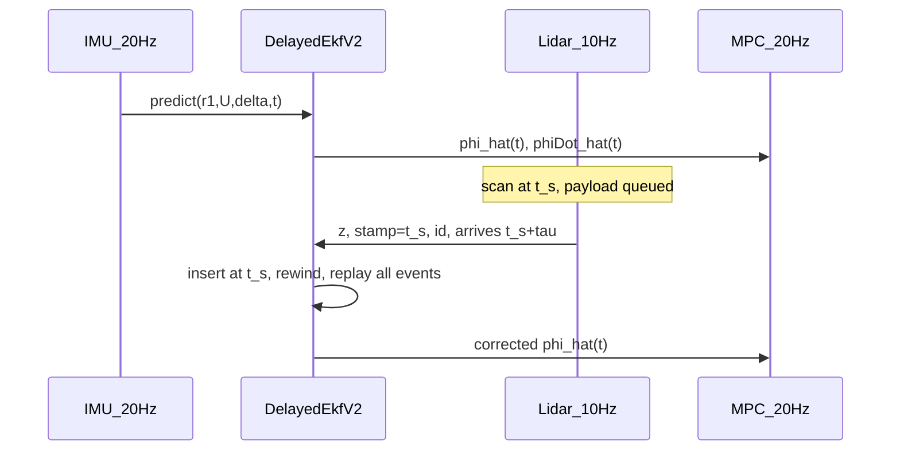
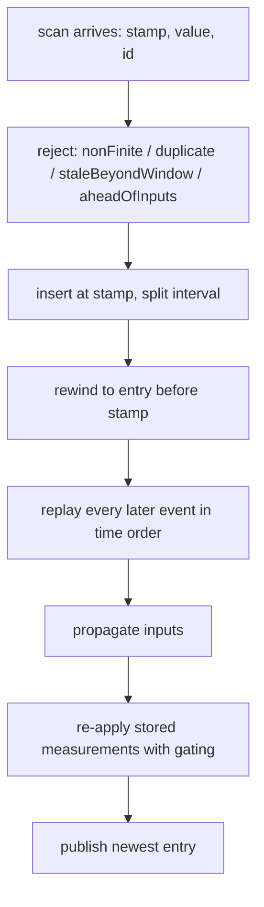

# 重卡铰接角多速率时延融合（Delayed EKF v2）

本文是**可落地的实车方案说明书**：状态、过程/量测模型、时延补偿、调参与验收以本文为准。
车辆几何与横向动力学以
[`1_truck_model_key_formula.md`](1_truck_model_key_formula.md) 为准，其适用边界见该文 1.4 节。

**内部一律 SI：角度 rad，角速度 rad/s，速度 m/s，时间 s。** UI 上的度只是显示换算。

**目标工作区若已有一套 EKF 实现类，移植时必须在该类上扩充**（`predict` / `update` /
\(x,P\)），不要另起卡尔曼核。本仓库的实现是算法对照与可运行基准，不是要照搬的类层次。

| 角色 | 路径 |
|---|---|
| OOSM 外壳（与模型无关） | [`include/truck_model/delayed_ekf.hpp`](../include/truck_model/delayed_ekf.hpp) |
| 两个过程模型与门面 | [`include/truck_model/articulation_estimator.hpp`](../include/truck_model/articulation_estimator.hpp)、[`src/articulation_estimator.cpp`](../src/articulation_estimator.cpp) |
| 矩阵指数与 Van Loan | [`include/truck_model/matrix_exponential.hpp`](../include/truck_model/matrix_exponential.hpp) |
| 雷达时延仿真与闭环接线 | [`examples/mpc_demo/demo_session.cpp`](../examples/mpc_demo/demo_session.cpp) |
| 运行记录 | [`examples/mpc_demo/session_log.cpp`](../examples/mpc_demo/session_log.cpp) |
| 验收用例 | [`tests/test_articulated_vehicle.cpp`](../tests/test_articulated_vehicle.cpp)、[`tests/test_mpc_demo.cpp`](../tests/test_mpc_demo.cpp) |

---

## 0. 冻结结论（先读）

实车约束：铰接角 \(\phi\) 只有激光雷达，约 **10 Hz**，时延 **100–400 ms** 且时变；高频量
只有 \(\delta,U,r_1\)；没有挂车 IMU \(r_2\)，没有铰接编码器。横向 MPC 约 20 Hz，要的是
**当前** \(\hat\phi,\hat{\dot\phi}\)。

方案由四部分组成，每部分都可以单独验收：

1. **事件化 OOSM 外壳**（第 6 节）。缓存输入与量测两类事件；迟到雷达按扫描戳插入，
   状态回退到其前一个检查点，再按时间序重放**全部**事件。后验只取决于事件集合，
   与到达顺序无关。
2. **一致的噪声契约**（第 5 节）。过程噪声一律是连续功率谱密度，用 Van Loan 精确离散。
3. **可观的状态设计**（第 4 节）。雷达偏置 \(b_\phi\) 默认冻结为离线标定常数，
   在线状态退化为结构可观的 \([\phi,b_{r2}]\)。
4. **可选的动态过程模型**（第 7 节）。默认仍是运动学 (K5)；需要更好的 \(\dot\phi\) 时
   切到以实测 \(r_1\) 为输入的降阶 (K27)。

四条硬约束：

| # | 约束 | 违反后果 |
|---|---|---|
| 0 | 复用目标仓已有 EKF 核，只新增模型与时延外壳 | 两套卡尔曼核难以同步维护 |
| 1 | `historyHorizon` **严格大于**最大雷达时延（建议 \(\tau_{\max}+\Delta t_{\mathrm{ctrl}}\)） | 超窗量测被丢弃，且无告警 |
| 2 | \(R\) 与雷达噪声方差同量级 | \(R\) 过小会让马氏门限批量误拒 |
| 3 | 滤波输出只写 MPC 的铰接通道；Plant/底盘积分不要用估计值 | 估计误差被闭环放大 |

约束 1 现在由配置校验强制：`DemoSettings::validationError` 在
`lidarDelayMax > ekf.historyHorizon` 时直接拒绝。

### 0.1 与 v1 的差异

| 项 | v1 | v2 | 原因 |
|---|---|---|---|
| 迟到量测对齐 | 吸附到最近历史帧 | 在扫描戳处**精确切分**区间 | 最近邻有最多半个输入周期的对齐误差 |
| 重放内容 | 只重放输入 | 重放输入**与量测** | 乱序旧包会抹掉其后已融合的校正 |
| 过程噪声 | 对角欧拉，\(q\Delta t\) 与 \(\sigma^2\Delta t^2\) 混用 | 连续 PSD + Van Loan | 单位不自洽，且丢掉交叉项与 \(T^3\) 项 |
| \(b_\phi\) | 在线估计 | 默认冻结为标定值 | 定常工况下三状态可观秩仅 2 |
| 未来戳 | 接受 `newest+0.05` | 拒绝 | 用未来观测修正当前状态违反时序 |
| 重复包 | 重复融合 | 按 id 去重 | 同一信息被用两次 |
| coasting | 单一标志，长时延下误亮 | 拆成 `coasting` 与 `linkStalled` | 信息年龄与链路健康是两件事 |
| \(\dot\phi\) | 无独立验收 | 一等指标 | MPC 同时消费 \(\hat\phi\) 与 \(\hat{\dot\phi}\) |
| 历史窗默认 | 0.4 s | 0.55 s | 0.4 s 对 400 ms 工况没有裕量 |

`ArticulationCompatibility` 保留 `nearestFrameAlignment` 与
`diagonalEulerProcessNoise` 两个开关，用于与历史 `runs/` 对照；默认均为关闭。

---

## 1. 传感器、符号与接口

### 1.1 符号

\[
\phi=\theta_1-\theta_2,\qquad
r_1=\dot\theta_1,\qquad
r_2=\dot\theta_2,\qquad
\dot\phi=r_1-r_2.
\]

轴距与铰接偏置（式 (K1)）：

\[
L_1=a_1+b_1,\qquad
L_2=a_2+b_2,\qquad
\ell_h=b_1-d_1 .
\]

\(\ell_h=0\)（铰接点在卡车后轴，本仓库默认 \(d_1=b_1\)）时 (K5) 退化为 (K6)。
**注意 \(\ell_h\) 项是本节符号最容易出错的地方**，第 2 节逐步给出投影。

Plant（仿真真值）是线性轮胎模型 (K27)，状态
\(z=[v_{y1},r_1,r_2,\phi]^\top\)。MPC 误差状态（式 (K36)–(K40)）
\(x_c=[e_y,\dot e_y,e_\psi,\dot e_\psi,\phi,\dot\phi]^\top\)，代码里 `state[4]`、`state[5]`
就是 \(\phi,\dot\phi\)。融合开启后这两维来自 EKF，不是 Plant。

### 1.2 传感器

| 量 | 来源 | 典型频率 | 时延 | 用途 |
|---|---|---|---|---|
| \(\delta\) | 转角 | \(\ge 20\,\mathrm{Hz}\) | 可忽略 | 动态模型的输入；运动学模型只用于残差诊断 |
| \(U\) | 车速 | \(\ge 20\,\mathrm{Hz}\) | 可忽略 | 两个模型的输入 |
| \(r_1\) | 拖头 IMU | \(\ge 20\,\mathrm{Hz}\) | 可忽略 | 两个模型的输入，优于 \((U/L_1)\tan\delta\) |
| \(\phi_{\mathrm{lidar}}\) | 感知雷达 | \(\approx 10\,\mathrm{Hz}\) | **100–400 ms，时变** | 唯一直接铰接观测量 |
| \(r_2\) | — | 无 | — | 由模型重建 |
| 铰接编码器 | — | 无 | — | 无 |

雷达给出的是扫描时刻 \(t_s\) 的 \(\phi(t_s)\)，在 \(t_s+\tau\) 才到达。
\(\dot\phi=10^\circ/\mathrm{s}\) 时 300 ms 滞后约 \(3^\circ\)。过时的
\(\phi_{\mathrm{lidar}}\) **禁止**直接写入 \(x_c\)。

雷达工控机与车端必须时间同步（PTP/GNSS）。**stamp 必须是扫描时刻，不是到达时刻**；
戳错等于故意把更新打到错误的历史帧。

### 1.3 时序



---

## 2. 过程模型一：铰接运动学 (K5)

滤波器默认**不**使用 (K27) 轮胎力。原因：\(C_\alpha,m_2,I_2\) 随载重变化，大 \(\phi\)
时线性化失效，而 (K5) 只需要轴距。高速侧偏造成的 \(r_2\) 误差由 \(b_{r2}\) 吸收。
这一取舍的代价见第 3 节，替代方案见第 7 节。

### 2.1 (K5) 原式

为免跨文档跳转，先抄录
[`1_truck_model_key_formula.md`](1_truck_model_key_formula.md) 式 (K5) 中与滤波有关的两行：

\[
\boxed{
\dot\theta_2=\frac{U\sin\phi+\ell_h r_1\cos\phi}{L_2},
\qquad
\dot\phi=r_1-\frac{U\sin\phi+\ell_h r_1\cos\phi}{L_2}.
}
\tag{F0}
\]

下面重新推导一次，确认符号。

### 2.2 铰接点速度投影

纯滚动、无侧偏时，卡车纵速 \(U_1=U\)，横摆 \(r_1\)。铰接点在**卡车体轴**下的速度是式 (K4)：

\[
\begin{bmatrix} v_{P_h,x1}\\ v_{P_h,y1} \end{bmatrix}
=
\begin{bmatrix} U \\ \ell_h r_1 \end{bmatrix}.
\tag{F1a}
\]

要转到**拖车体轴**。拖车标架相对卡车标架转过
\(\theta_2-\theta_1=-\phi\)，分量变换用 \(R(-\psi)\big|_{\psi=-\phi}=R(\phi)\)：

\[
\begin{bmatrix} v_{P_h,x2}\\ v_{P_h,y2} \end{bmatrix}
=
\begin{bmatrix}\cos\phi&-\sin\phi\\ \sin\phi&\cos\phi\end{bmatrix}
\begin{bmatrix} U \\ \ell_h r_1 \end{bmatrix},
\]

即

\[
\boxed{
\begin{aligned}
v_{P_h,x2}&= U\cos\phi-\ell_h r_1\sin\phi,\\
v_{P_h,y2}&= U\sin\phi+\ell_h r_1\cos\phi.
\end{aligned}}
\tag{F1b}
\]

等价地可以直接点乘单位向量核对：
\(\boldsymbol e_{x2}^T\boldsymbol e_{y1}=-\sin\phi\)，
\(\boldsymbol e_{y2}^T\boldsymbol e_{x1}=\sin\phi\)，
\(\boldsymbol e_{y2}^T\boldsymbol e_{y1}=\cos\phi\)（见 (D25)、(D26)）。

### 2.3 挂车轴纯滚动

铰接点位于挂车轴前方 \(L_2\)，即
\(\boldsymbol p_{P_h}=\boldsymbol p_{R_2}+L_2\boldsymbol e_{x2}\)。求导：

\[
\boldsymbol v_{P_h}=\boldsymbol v_{R_2}+L_2r_2\boldsymbol e_{y2}.
\]

无侧偏时挂车轴横向速度为零，\(\boldsymbol e_{y2}^T\boldsymbol v_{R_2}=0\)，故

\[
\boxed{v_{P_h,y2}=+L_2r_2.}
\tag{F1c}
\]

**符号提示**：(F1c) 是 \(+L_2r_2\)。与 (F1b) 第二式联立：

\[
\boxed{
r_{2,\mathrm{kin}}
=\frac{U\sin\phi+\ell_h r_1\cos\phi}{L_2}
}
\tag{F1}
\]

与 (F0) 一致。于是

\[
\dot\phi=r_1-r_{2,\mathrm{kin}}.
\]

\(\ell_h=0\) 时 \(\dot\phi=r_1-(U/L_2)\sin\phi\)，再代入
\(r_1=(U/L_1)\tan\delta\) 即式 (K6)。

**滤波器不要用自行车公式代替 IMU 的 \(r_1\)**：轮胎侧偏时 IMU 的 \(r_1\) 才是
\(\dot\theta_1\)。\(\delta\) 只用来算诊断量

\[
r_{1,\mathrm{bicycle}}=\frac{U}{L_1}\tan\delta,\qquad
\tilde r_1=r_1-r_{1,\mathrm{bicycle}}
\]

（代码 `truckYawResidual`）。

函数 `kinematicTrailerYawRate` 实现 (F1)；`tests` 中
`testKinematicTrailerYawRateMatchesK5` 对轴与偏轴两种几何都与 (K5) 的
\(\dot\theta_2\) 对齐。

---

## 3. \(b_{r2}\) 的物理含义

把 \(b_{r2}\) 当成"慢变偏置"是 v1 的主要建模弱点。它其实有闭式物理来源。

放开挂车轴纯滚动假设，令挂车轴横向速度为 \(v_{2r}=v_{y2}-b_2r_2\)。(F1c) 变为
\(v_{P_h,y2}=v_{2r}+L_2r_2\)，于是

\[
r_2=r_{2,\mathrm{kin}}-\frac{v_{2r}}{L_2}
\quad\Longrightarrow\quad
b_{r2}\equiv r_2-r_{2,\mathrm{kin}}=-\frac{v_{2r}}{L_2}.
\tag{F2a}
\]

由 (K7) 的 \(\alpha_{2r}=-v_{2r}/U\) 与 \(F_{2r}=C_{2r}\alpha_{2r}\)：

\[
\boxed{
b_{r2}=\frac{U\,\alpha_{2r}}{L_2}=\frac{U\,F_{2r}}{L_2C_{2r}}.
}
\tag{F2b}
\]

**\(b_{r2}\) 就是挂车轴侧偏角折算出的横摆率。** 由此可读出三件事：

1. 它随侧向力变化，稳态过弯时正比于 \(U^2\rho\)，不是常值。
2. 它有确定的动态。消去铰接力 \(H\) 后，挂车子系统给出
   \(a_2m_2(\dot v_{y2}+Ur_2)+I_2\dot r_2=L_2F_{2r}\)，代入 (F2b) 整理得

   \[
   \dot b_{r2}=-\lambda(U)\,b_{r2}
   +\frac{U}{L_2}r_2
   +\frac{a_2b_2m_2-I_2}{a_2m_2L_2}\dot r_2,
   \qquad
   \boxed{\lambda(U)=\frac{C_{2r}L_2}{a_2m_2U}.}
   \tag{F2c}
   \]

   本仓库名义参数下 \(\lambda(15)=3.24\,\mathrm s^{-1}\)，即 \(\tau=0.31\,\mathrm s\)；
   \(U=25\) 时 \(\tau=0.51\,\mathrm s\)。**时间常数随车速增大。**
3. 稳态（\(\dot b=\dot r_2=0\)）给出
   \(b_{r2}=k_\beta(U)\,r_2\)，\(k_\beta=m_2a_2U^2/(L_2^2C_{2r})\)；
   \(U=12\) 时 \(k_\beta=0.42\)。

结论：\(\tau\approx0.3\text{–}0.5\,\mathrm s\) 远长于 50 ms 控制周期，随机游走**跟不上**
这段动态。这就是 v1 的 \(\dot\phi\) 幅值偏瘦的根因，也是第 7 节动态模型的动机。

(F2c) 含 \(\dot r_2\)，实现上需要噪声很大的 \(\dot r_1\)；因此本方案不直接实现 (F2c)，
而是用第 7 节的降阶 (K27)，它用 \(v_{y1}\) 作状态从而避免输入微分。

---

## 4. 状态设计与可观性

### 4.1 运动学模型的状态

\[
x=\begin{bmatrix}\phi& b_{r2}& b_\phi\end{bmatrix}^\top,
\qquad
z=\phi+b_\phi+v,
\qquad
H=\begin{bmatrix}1&0&1\end{bmatrix}.
\]

- \(\phi\)：当前铰接角。
- \(b_{r2}\)：挂车横摆运动学残差（第 3 节），建模为随机游走。
- \(b_\phi\)：雷达系统偏差（安装/标定）。

### 4.2 三状态在定常工况秩亏

令

\[
a=\frac{\partial r_{2,\mathrm{kin}}}{\partial\phi}
=\frac{U\cos\phi-\ell_h r_1\sin\phi}{L_2},
\qquad
A=\begin{bmatrix}-a&-1&0\\0&0&0\\0&0&0\end{bmatrix}.
\]

则 \(HA=[-a,-1,0]\)，\(HA^2=[a^2,a,0]=-a\,HA\)，故

\[
\boxed{
\operatorname{rank}\begin{bmatrix}H\\HA\\HA^2\end{bmatrix}=2,
\qquad
n=\begin{bmatrix}1&-a&-1\end{bmatrix}^\top
}
\tag{F3}
\]

是不可观方向：\(\delta\phi=\varepsilon,\ \delta b_{r2}=-a\varepsilon,\
\delta b_\phi=-\varepsilon\) 在一阶上既不改变输出也不改变动态。

冻结输入下的非线性可观行列式为 \(-g''(\phi)\dot\phi=g(\phi,u)\dot\phi\)，
所以直行附近（\(g\approx0\)）或稳态转弯（\(\dot\phi\approx0\)）仍然退化。
工况激励能改善有限时域可辨识性，但不能把 (F3) 变成满秩。

**因此不要宣称 \(b_\phi\) 在线可辨识。**

### 4.3 默认：冻结 \(b_\phi\)，在线状态为可观的两状态

令 \(P_{b_\phi}(0)=0\)、\(q_{b_\phi}=0\)，则 \(b_\phi\) 的行列恒为零，
\(K_{b_\phi}\equiv0\)，它永远停在配置的标定值 `lidarBiasCalibration`。
在线自由度退化为 \([\phi,b_{r2}]\)：

\[
A_2=\begin{bmatrix}-a&-1\\0&0\end{bmatrix},
\quad
H_2=\begin{bmatrix}1&0\end{bmatrix},
\quad
\mathcal O_2=\begin{bmatrix}1&0\\-a&-1\end{bmatrix},
\quad
\det\mathcal O_2=-1 .
\tag{F4}
\]

与 \(U\)、\(a\) 无关地结构可观。`estimateLidarBias = true` 可恢复三状态，
但要接受 (F3)。

### 4.4 标定偏差的风险量化

设真实偏置为 \(\bar b_\phi+\Delta c\)，标定只去掉了 \(\bar b_\phi\)。强量测更新会让
\(\hat\phi-\phi\approx\Delta c\)，再经 \(\dot\phi\) 通道放大：

\[
\boxed{
|\Delta\dot\phi|\approx a\,|\Delta c|,
\qquad
a\approx\frac{U}{L_2}.
}
\tag{F5}
\]

名义 \(U=15,L_2=7\) 时 \(a=2.14\,\mathrm s^{-1}\)：**未建模 \(1^\circ\) 的雷达偏置约产生
\(2.14^\circ/\mathrm s\) 的 \(\dot\phi\) 误差。** 因此采用冻结方案前必须给出

\[
|\Delta c|_{\max}\le E_\phi^{\mathrm{alloc}},
\qquad
a_{\max}|\Delta c|_{\max}+|\dot{\Delta c}|_{\max}\le E_{\dot\phi}^{\mathrm{alloc}}
\]

的全寿命（温漂、安装重复性、换挂车）边界。标定误差是跨帧相关的系统误差，
**不能简单并进 \(R\)**，否则重复量测会把它错误地平均掉。若边界无法保证，
保留 `estimateLidarBias = true` 的强先验版本，并明确其弱可观。

`tests::testFrozenLidarBiasStaysCalibrated` 验证冻结行为，
`tests::testLidarInstallationBiasNeedsCalibration` 验证标定的必要性。

---

## 5. 噪声契约与离散化

### 5.1 唯一契约：连续功率谱密度

**所有过程噪声字段都是连续时间 PSD，不是每拍方差。** 这样把步长减半不会改变建模的噪声量。
`ArticulationNoiseDensities` 的单位：

| 符号 | 字段 | 单位 |
|---|---|---|
| \(q_\phi\) | `noiseDensity.articulationRate` | \(\mathrm{rad^2/s}\) |
| \(q_{b_{r2}}\) | `noiseDensity.trailerYawBias` | \(\mathrm{rad^2/s^3}\) |
| \(q_{b_\phi}\) | `noiseDensity.lidarBias` | \(\mathrm{rad^2/s}\) |
| \(\sigma_{r1}^2\) | `noiseDensity.truckYawRate` | \(\mathrm{rad^2/s}\) |
| \(\sigma_U^2\) | `noiseDensity.speed` | \(\mathrm{m^2/s}\) |
| \(q_{v_{y1}}\) | `noiseDensity.truckLateralVelocity` | \(\mathrm{m^2/s^3}\) |
| \(q_{r_2}\) | `noiseDensity.trailerYawRate` | \(\mathrm{rad^2/s^3}\) |

量纲自检：\(Q_{\phi\phi}\) 必须是 \(\mathrm{rad^2}\)，而它由 \(q_\phi\) 对时间积分得到，
故 \([q_\phi]=\mathrm{rad^2/s}\)。**v1 文档把它标成 \(\mathrm{rad^2/s^2}\) 是错的**；
数值不用改，改的是单位与离散方式。

连续过程噪声矩阵（运动学模型）：

\[
Q_c=
\operatorname{diag}\!\left(
\eta q_\phi
+\Big(\tfrac{\partial\dot\phi}{\partial r_1}\Big)^2\sigma_{r1}^2
+\Big(\tfrac{\partial\dot\phi}{\partial U}\Big)^2\sigma_U^2,
\;\;q_{b_{r2}},\;\;q_{b_\phi}
\right),
\tag{F6}
\]

\[
\frac{\partial\dot\phi}{\partial r_1}=1-\frac{\ell_h\cos\phi}{L_2},
\qquad
\frac{\partial\dot\phi}{\partial U}=-\frac{\sin\phi}{L_2},
\]

\(\eta\) 是 coasting 倍率（第 8 节），非 coasting 时为 1。

### 5.2 Van Loan 精确离散

对 \(\dot x=Ax+w\)、\(w\sim Q_c\)，构造

\[
\boxed{
M=\begin{bmatrix}-A&Q_c\\0&A^\top\end{bmatrix}\Delta t,
\qquad
e^{M}=\begin{bmatrix}M_{11}&M_{12}\\0&M_{22}\end{bmatrix},
}
\]

\[
\boxed{
\Phi=M_{22}^\top,
\qquad
Q_d=\Phi\,M_{12}.
}
\tag{F7}
\]

实现是 `discretizeVanLoan`，复用 `matrixExponential`（缩放平方 + Taylor）。

**为什么不能只填对角。** 以 \(b_{r2}\) 的随机游走为例，它经
\(\dot\phi=\cdots-b_{r2}\) 直接驱动 \(\phi\)，精确解为

\[
Q_d\simeq
\begin{bmatrix}
q_\phi T+\tfrac13 q_{b_{r2}}T^3 & -\tfrac12 q_{b_{r2}}T^2\\[2pt]
-\tfrac12 q_{b_{r2}}T^2 & q_{b_{r2}}T
\end{bmatrix}.
\tag{F8}
\]

v1 只保留了 \(\operatorname{diag}(q_\phi T,\;q_{b_{r2}}T)\)，丢掉了 \(T^3\) 项和交叉项。
`tests::testVanLoanMatchesAnalyticRandomWalk` 逐项比对 (F8)，
`tests::testProcessNoiseIsStepInvariant` 验证 \(Q_d\) 满足分段复合
\(Q_{[0,T]}=F_2Q_{[0,T_1]}F_2^\top+Q_{[T_1,T]}\) —— 这条性质正是精确切分（第 6 节）
所依赖的。

### 5.3 输入噪声的分段相关性

(F6) 把 \(r_1,U\) 的误差当作**连续白噪声**并入 PSD。若目标平台的传感器误差在一个采样周期内
保持不变（sample-and-hold），严格做法是把该误差建成独立的有色状态；
把 \(\sigma^2\Delta t^2\) 与 \(q\Delta t\) 混在一起是 v1 的不自洽处。
按 PSD 处理的代价是在分段时略微低估相关性，收益是 \(Q_d\) 与步长严格一致。
**不要只把旧字段改名为密度而沿用原语义**，要按本节重新解释。

### 5.4 状态转移

- **运动学模型**：均值用 (F1) 的非线性欧拉一步，
  转移矩阵取该映射的精确雅可比 \(F=I+A\Delta t\)；\(Q_d\) 取 (F7)。
  `tests::testKinematicJacobianMatchesFiniteDifference` 用中心差分核对 \(F\)。
- **动态模型**（第 7 节）：调度车速后是线性的，均值与 \(\Phi\) 都用增广矩阵指数精确 ZOH。

### 5.5 量测与 Joseph 更新

\[
\hat z=\mathrm{wrap}(\phi+b_\phi),
\quad
y=\mathrm{wrap}(z-\hat z),
\quad
S=HPH^\top+R .
\]

\(S\le0\) 或非有限视为实现错误，抛异常。增益 \(K=PH^\top S^{-1}\)，更新

\[
x\leftarrow x+Ky,\quad \phi\leftarrow\mathrm{wrap}(\phi),
\qquad
P\leftarrow (I-KH)P(I-KH)^\top+KRK^\top .
\]

Joseph 形式在 \(K\) 与 \(P\) 略有数值不一致时仍保持对称半正定；实现另做一次显式对称化。
**注意是半正定，不是正定**，不要过度声称。

`wrap` 用 `std::remainder` 折到 \((-\pi,\pi]\)，上界闭合以保证表示唯一；
v1 的双 `while` 会让 \(\pm\pi\) 都可达。

### 5.6 马氏门限

\[
d=\frac{y^2}{S}\sim\chi_1^2 .
\]

\(d>\) `mahalanobisGate`（默认 9，约 \(3\sigma\)）则拒绝，不改该帧 \(x,P\)。
理想误拒率约 \(0.27\%\)，10 Hz 下平均约 37 s 一次，**不是"几乎不会"**，
复盘时应按此预期核对。

---

## 6. 事件化 OOSM：核心算法

### 6.1 时间线

外壳维护一条按时间排序的事件表。每个条目记录

\[
\{\,t,\;u_{\mathrm{gov}},\;(\text{可选})z,\;\mathrm{id},\;x,\;P,\;t_{\mathrm{acc}},\;n_{\mathrm{rej}}\,\}
\]

其中 \(x,P\) 是**处理完该条目之后**的后验，\(u_{\mathrm{gov}}\) 是支配
"上一条目到本条目"这段区间的输入，\(t_{\mathrm{acc}}\) 是该点已知的最新被接受扫描戳。
条目按 `historyHorizon` 裁剪。

沿用 v1 的右端点 ZOH 约定：区间 \([t_k,t_{k+1}]\) 使用 \(u_{k+1}\)。

### 6.2 精确切分

量测落在区间 \([t_k,t_{k+1}]\) 内时，在 \(t_s\) 处插入一个条目，把区间切成
\([t_k,t_s]\) 与 \([t_s,t_{k+1}]\)，**两段都沿用原区间的 \(u_{k+1}\)**。
这样切分不改变输入语义，对齐误差为零。

v1 的最近邻吸附等价于给量测附加

\[
e_t\approx-\dot\phi(t_s)\,\epsilon,
\qquad |\epsilon|\le \tfrac12\Delta t_{\mathrm{ctrl}},
\]

的额外误差。\(\Delta t=50\,\mathrm{ms}\)、\(\dot\phi=40^\circ/\mathrm s\) 时最坏约
\(1^\circ\)；对 \(4^\circ\) 噪声尚可忽略，对 \(0.5^\circ\) 级雷达不可忽略。

### 6.3 回退与重放



重放从 \(t_s\) 前一个条目开始，对其后**每一个**条目依次：按 \(u_{\mathrm{gov}}\) 传播，
若该条目带量测则重新做门限与 Joseph 更新。

**为什么必须重放量测。** v1 只重放输入，于是一个迟到的旧包会把它之后所有已融合的校正
覆盖成纯预测结果，`lastAcceptedStamp` 还会倒退。
`tests::testLateScanPreservesNewerCorrection` 就是这条回归。

### 6.4 顺序无关性

coasting 倍率 \(\eta\) 在重放时由前向游走中的 \(t_{\mathrm{acc}}\) 现算，
而 \(t_{\mathrm{acc}}\) 只取决于**按戳排序**的量测前缀，与到达顺序无关。
配合"重放全部事件"，得到：

> **性质。** 给定同一组输入事件与量测事件，最终 \((x,P)\) 与量测的**到达顺序无关**。

`tests::testReplayIsArrivalOrderIndependent` 用正序、逆序、乱序三种投递核对到机器精度。
这条性质也是 (F8) 分段复合成立的必要前提。

### 6.5 边界处理

| 情况 | 判定 | 处理 |
|---|---|---|
| \(t_s<\) 最老条目 | `staleBeyondWindow` | 丢弃，计一次拒绝。这是 `historyHorizon` 不足的唯一症状 |
| \(t_s>\) 最新输入 | `aheadOfInputs` | 拒绝。外推最新输入会凭空造信息；先调 `predict` |
| id 重复 | `duplicate` | 拒绝，避免同一信息用两次 |
| \(d>\) 门限 | `gated` | 不改该帧，计一次拒绝 |
| 其余 | `accepted` | Joseph 更新 |

v1 允许 \(t_s\le\) `newest + 0.05`，即接受最多 50 ms 的未来戳并对齐到最新帧；v2 拒绝。
`tests::testMeasurementBoundaryHandling` 覆盖全部五种结局。

### 6.6 移植到已有 EKF 核

| 本仓库 | 目标仓已有 EKF |
|---|---|
| `Model::propagate` 的 \(f,F,Q_d\) | `predict` + 本文第 2/5/7 节的模型 |
| `DelayedEkf::applyMeasurement` 的 \(y,S,K,\) Joseph | `update` |
| `insertMeasurement` + `replayFrom` | 时延外壳：`restore` → 依次 `predict`/`update` |
| 时间线条目 | 外壳缓冲区，不是 EKF 内部状态机 |

已有 EKF 若缺能力，只做最小扩展：

| 缺口 | 扩法 |
|---|---|
| 不能读写完整 \(x,P\) | 增加 `snapshot()` / `restore(x,P)` |
| \(Q\) 每步不同 | 预测接口允许本步传入 \(Q_d\) |
| 角度创新不 wrap | 本量测的残差回调里 wrap |
| 状态维写死 | 用模板/配置设为 \(n=3\)（或 \(n=4\)），不要新开滤波库 |

**快照必须覆盖该核的全部内部统计状态**，不只是 \(x,P\)：若平台用平方根因子或自适应统计，
仅存 \(x,P\) 无法完整恢复。

---

## 7. 过程模型二：以实测 \(r_1\) 为输入的降阶 (K27)

### 7.1 动机

第 3 节表明 \(b_{r2}\) 有 \(0.3\text{–}0.5\,\mathrm s\) 的真实动态，随机游走跟不上。
直接给残差建动态需要 \(\dot r_2\)（见 (F2c)），而降阶 (K27) 用 \(v_{y1}\) 作状态，
避免了输入微分。

### 7.2 推导

(K27) 给出 \(\dot{\boldsymbol x}_p=A_p\boldsymbol x_p+B_p\delta\)，
\(\boldsymbol x_p=[v_{y1},r_1,r_2,\phi]^\top\)。既然 \(r_1\) 由 IMU 实测，
就**删掉 \(\dot r_1\) 那一行**，把 \(r_1\) 移到输入侧。取

\[
x_r=\begin{bmatrix}v_{y1}\\ r_2\\ \phi\end{bmatrix},
\qquad
u_r=\begin{bmatrix}r_1\\ \delta\end{bmatrix},
\]

由 (K27) 的第 1、3、4 行直接得到

\[
\boxed{
\dot x_r=
\begin{bmatrix}
a_{11}&a_{13}&a_{14}\\
a_{31}&a_{33}&a_{34}\\
0&-1&0
\end{bmatrix}x_r
+
\begin{bmatrix}
a_{12}&\beta_1\\
a_{32}&\beta_3\\
1&0
\end{bmatrix}u_r .
}
\tag{F9}
\]

第三行就是 \(\dot\phi=r_1-r_2\)，是恒等式而非近似。再加冻结的 \(b_\phi\) 得四维状态
\([v_{y1},r_2,\phi,b_\phi]\)，量测 \(H=[0,0,1,1]\)。

输出

\[
\hat{\dot\phi}=r_1-\hat r_2
\]

直接来自状态，**不要对 \(\hat\phi\) 做数值差分**。

### 7.3 可观性

对 (F9) 的三个物理状态，\(H_r=[0,0,1]\)：

\[
\mathcal O_r=
\begin{bmatrix}
0&0&1\\
0&-1&0\\
-a_{31}&-a_{33}&-a_{34}
\end{bmatrix},
\qquad
\boxed{\det\mathcal O_r=-a_{31}.}
\tag{F10}
\]

本仓库名义参数下 \(a_{31}=0.2875\)，结构可观。
但 \(v_{y1}\) 只能通过 \(\phi\) 的二阶动态被感知，10 Hz 高噪声量测下数值可观性较弱，
结果依赖 (K27) 参数。`tests::testDynamicObservabilityRank` 断言秩与 \(a_{31}\) 的量级。

### 7.4 车速调度

\(a_{ij},\beta_i\) 是 \(U\) 的函数。实现按 `modelRefreshSpeedStep`（默认 0.25 m/s）
重建，低于 `minimumModelSpeed`（默认 0.5 m/s）时用下限，避免 (K27) 的 \(1/U\) 发散。
这与 Demo 的 MPC 调度是同一思路，其冻结时间近似的代价见 docs/1 的 1.4.3 节。

### 7.5 何时不要用它

| 条件 | 原因 |
|---|---|
| 载重、惯量或 \(C_{2r}\) 未知或变化大 | (F9) 的每个系数都依赖它们 |
| 低速、倒车、强制动、大侧偏、大铰接角 | (K27) 的 \(1/U\)、恒速与线性轮胎假设失效 |
| 只能用同参数的 (K27) Plant 验收 | 逆犯罪，得到虚假优势 |

因此**默认仍是运动学模型**；动态模型通过 `processModel = dynamic` 显式开启，
并建议先以影子模式（第 9 节）与运动学模型并跑取证。
`tests::testDynamicModelSurvivesParameterMismatch` 在 \(m_2,I_2,C_{2r}\) 各 ±30%
失配下要求动态模型不劣于运动学模型。

---

## 8. Coasting 与链路健康：两个不同的量

v1 把两件事混成一个标志，导致长时延下"误报"。v2 拆开：

\[
\boxed{
\text{informationAge}=t_{\mathrm{now}}-t_{\mathrm{acc}},
\qquad
\text{arrivalGap}=t_{\mathrm{now}}-t_{\mathrm{arrive,last}} .
}
\tag{F11}
\]

- `informationAge`：当前估计背后最新融合信息的年龄。**过程噪声倍率由它决定**：
  超过 `lostTimeout`（默认 0.6 s）或连续拒绝达 `consecutiveRejectLimit` 时
  \(\eta=4\)。400 ms 时延下它本来就接近 0.4 s —— 这不是误报，估计确实在外推。
- `arrivalGap`：距上次成功更新的墙钟时间。**链路健康由它决定**，
  超过 `linkTimeout`（默认 0.5 s）置 `linkStalled`。

`lostTimeout` 默认取 0.6 s > 400 ms 最大时延，正常工况不会触发。

重放期间 \(\eta\) 由前向游走现算（第 6.4 节），因此协方差不依赖回放策略。

MPC 目前不消费 \(P\)。长时间 coasting 没有自动降级，**上层必须自行定义失效上限**。

---

## 9. Demo 如何模拟雷达

`lidarFusionEnabled == true` 时，每个控制拍 `updateMeasuredErrorState`：

1. `sensedInputs()`：由 Plant 的 \(r_1,U\) 叠加 `inputYawRateBias`、
   `inputYawRateNoiseStd`、`inputSpeedNoiseStd` 得到**传感器读数**，而不是真值。
2. `predict(inputs)`（主估计器，以及启用时的影子估计器）。
3. `captureDelayedLidar`：距上次扫描 \(\ge\) `lidarPeriod` 时入队
   \[
   z=\phi_{\mathrm{plant}}(t_s)+b_{\phi}^{\mathrm{inst}}
     +\sigma_{\mathrm{lidar}}n,\quad
   \tau\sim\mathrm{Unif}[\tau_{\min},\tau_{\max}],
   \]
   `deliverTime = t_s + tau`，`stamp = t_s`，并分配唯一 id。
4. `deliverDueLidar`：**按 `deliverTime` 排序**投递所有已到期包。
5. `state[4]=ekf.phi`，`state[5]=ekf.phi_dot`。Plant 仍按 (K27) 积分。

两处与 v1 的关键差异：

- v1 只检查队首，形成队头阻塞，实际时延分布被歪曲且**永远不会乱序**；
  v2 按到达时间投递，短时延包可以超越长时延包，真正触发第 6 节的重放。
  `tests::testOutOfOrderDeliveryStillTracks` 断言乱序确实发生且跟踪不退化。
- v1 用 `physicalState_[3]`（Plant 真值）初始化 EKF。实车无编码器时做不到，
  故 v2 默认 `initializeEstimatorFromTruth = false` 冷启动。
  `tests::testColdStartWithNoisySensors` 覆盖"冷启动 + 带噪带偏输入"。

**影子估计器**：`shadowEstimatorEnabled` 时第二个估计器吃同样的事件，
结果进遥测与 CSV，但**不进控制回路**。用于在同一条轨迹上无风险对比两种过程模型。

实车替换第 3–4 步：把感知包的**扫描时间戳**和 \(\phi_{\mathrm{lidar}}\)（rad）送进外壳；
高频 `predict` 用车端 IMU/车速。不要把到达时刻当 `stamp`。

---

## 10. 运行记录

面板「导出本次记录」，或 run `finished`/`faulted` 时写入 `runs/YYYYMMDD_HHMMSS/`：

| 文件 | 内容 |
|---|---|
| `settings.txt` | 车型、MPC、雷达、EKF、当时 \(A_d,B_d\) |
| `timeseries.csv` | 每控制步一行 |
| `mpc_horizon.csv` | 预测域 \(x_c(k)\) |
| `path.csv` | 参考线 |
| `README.txt` | 列说明 |

与融合有关的列：

- Plant：`plant_vy1,plant_r1,plant_r2,plant_vy2,plant_phi,plant_phi_dot`
- 控制反馈（融合后）：`ctrl_phi,ctrl_phi_dot`
- 雷达：`lidar_z,lidar_stamp,lidar_delay,lidar_queue`
- 雷达布尔（只描述本拍最后一个包）：`lidar_delivered,lidar_accepted,lidar_gated`
- **逐包计数**：`lidar_delivered_count,lidar_accepted_count,lidar_gated_count,lidar_dropped_count`
- EKF 状态：`ekf_phi,ekf_phi_dot,ekf_r2,ekf_r2_kin,ekf_b_r2,ekf_b_phi,ekf_vy1,ekf_truck_yaw_residual`
- EKF 协方差与增益：`ekf_P_phi,ekf_P_br2,ekf_P_bphi,ekf_K_phi,ekf_K_br2,ekf_K_bphi`
- EKF 创新：`ekf_innovation,ekf_S,ekf_mahalanobis`
- 时序诊断：`ekf_history_size,ekf_replayed,ekf_aligned_stamp,ekf_last_accepted_stamp,ekf_information_age,ekf_arrival_gap`
- 状态标志：`ekf_consecutive_rejects,ekf_accepted,ekf_gated,ekf_coasting,ekf_link_stalled,ekf_outcome`
- 影子：`shadow_phi,shadow_phi_dot,shadow_r2,shadow_b_r2,shadow_P_phi`
- 传感器读数：`sensed_r1,sensed_speed`

`ekf_outcome` 是第 6.5 节五种结局的字符串，与布尔列一样只反映本拍最后一个包。

**逐包计数是 v2 新增的，必须用它做接受率统计。** v1 每个控制拍只保留最后一个包的诊断，
一拍内处理多个包时前面的结局会被覆盖，导致按布尔列统计出的"送达数"实际是
"发生过送达的控制拍数"。

复盘顺序：

1. `lidar_delay` 分布是否覆盖目标区间；`ekf_outcome` 有无 `staleBeyondWindow`。
2. 接受率用 `lidar_accepted_count / lidar_delivered_count`；
   马氏均值应 \(O(1)\)，误拒率预期约 0.27%（第 5.6 节）。
3. `ekf_phi` vs `plant_phi`：RMSE、互相关滞后、幅值比。
4. **`ekf_phi_dot` vs `plant_phi_dot`：同样三项。** 不能只看角度。
5. 原始 `lidar_z` vs 当前 `plant_phi`：应明显差于 EKF。
6. `plant_r2` vs `ekf_r2_kin`：过程模型的侧偏误差，对应第 3 节。
7. 开影子时比较 `shadow_*` 与 `ekf_*`。

---

## 11. 参数表

面板上的标准差是**度**；写入配置前换成 rad 再平方。勾选「R 跟随雷达噪声」时
\(R=\max(\sigma_{\mathrm{lidar}},0.25^\circ)^2\)。

| 项 | 字段 | 默认 | 说明 |
|---|---|---|---|
| 过程模型 | `processModel` | `kinematic` | 动态模型见第 7 节 |
| 历史窗 | `historyHorizon` | **0.55** | 必须 \(\ge\tau_{\max}\)，由配置校验强制 |
| \(R\) | `measurementVariance` | \(3.046\times10^{-4}\)（\(1^\circ\)） | 等于雷达 \(\sigma^2\) |
| \(q_\phi\) | `noiseDensity.articulationRate` | \(2.742\times10^{-3}\) | \(\mathrm{rad^2/s}\) |
| \(q_{b_{r2}}\) | `noiseDensity.trailerYawBias` | \(2\times10^{-4}\) | \(\mathrm{rad^2/s^3}\) |
| \(q_{b_\phi}\) | `noiseDensity.lidarBias` | \(10^{-10}\) | 冻结时不参与 |
| \(\sigma_{r1}^2\) | `noiseDensity.truckYawRate` | \(2.742\times10^{-5}\) | \(\mathrm{rad^2/s}\) |
| \(\sigma_U^2\) | `noiseDensity.speed` | \(0.04\) | \(\mathrm{m^2/s}\) |
| \(q_{v_{y1}}\) | `noiseDensity.truckLateralVelocity` | \(0.05\) | 动态模型；\(0.3\,\mathrm{m/s^2}\)、\(\tau=0.2\,\mathrm s\) |
| \(q_{r_2}\) | `noiseDensity.trailerYawRate` | \(1.5\times10^{-4}\) | 动态模型；\(1^\circ/\mathrm s^2\)、\(\tau=0.2\,\mathrm s\) |
| 偏置估计 | `estimateLidarBias` | `false` | 开启会回到秩 2（第 4.2 节） |
| 偏置标定 | `lidarBiasCalibration` | \(0\) | 冻结时 \(b_\phi\) 的取值 |
| 门限 | `mahalanobisGate` | \(9\) | \(R\) 对齐后不要再拧死 |
| 连续拒 | `consecutiveRejectLimit` | \(3\) | |
| 信息年龄阈值 | `lostTimeout` | \(0.6\) | 决定 \(\eta\) |
| 链路阈值 | `linkTimeout` | \(0.5\) | 只做诊断 |
| \(P_\phi(0)\) | `initialArticulationVariance` | \((2^\circ)^2\) | |
| \(P_{b_{r2}}(0)\) | `initialTrailerYawBiasVariance` | \((2^\circ/\mathrm s)^2\) | |
| \(P_{b_\phi}(0)\) | `initialLidarBiasVariance` | \((0.3^\circ)^2\) | 冻结时强制为 0 |
| \(P_{v_{y1}}(0)\) | `initialTruckLateralVelocityVariance` | \(0.25\) | 动态模型 |
| \(P_{r_2}(0)\) | `initialTrailerYawRateVariance` | \((2^\circ/\mathrm s)^2\) | 动态模型 |
| 调度步长 | `modelRefreshSpeedStep` | \(0.25\) | 动态模型重建阈值 |
| 最低建模车速 | `minimumModelSpeed` | \(0.5\) | 防 \(1/U\) 发散 |

**禁止**在雷达 3°–4° 噪声时仍用 \(1^\circ\) 的 \(R\)：v1 曾因此丢掉约一半量测。

几何参数必须与实车一致：\(a_2,b_2,b_1,d_1\)。\(L_2\) 错 10% 会系统性扭曲 (F1)。

---

## 12. 验收

### 12.1 仓库内已实现的用例

| 用例 | 断言 | 位置 |
|---|---|---|
| Van Loan vs 解析随机游走 | 逐元素等于 (F8) | `testVanLoanMatchesAnalyticRandomWalk` |
| \(Q_d\) 分段复合 | \(Q_{[0,T]}=F_2Q_1F_2^\top+Q_2\) | `testProcessNoiseIsStepInvariant` |
| \(F\) vs 中心差分 | 逐元素 \(<10^{-6}\) | `testKinematicJacobianMatchesFiniteDifference` |
| 三状态秩 2、两状态满秩 | 与 (F3)(F4) 一致 | `testKinematicObservabilityRank` |
| 降阶 (K27) 可观 | 秩 3，\(a_{31}\) 非零 | `testDynamicObservabilityRank` |
| **到达顺序无关** | 正序/逆序/乱序后验一致 | `testReplayIsArrivalOrderIndependent` |
| 迟到包不抹掉新校正 | 融合后仍贴近已校正值 | `testLateScanPreservesNewerCorrection` |
| 五种结局 | stale/ahead/duplicate/gated/accepted | `testMeasurementBoundaryHandling` |
| 亚帧对齐 | `alignedStamp == stamp` | `testSubFrameAlignmentIsExact` |
| 冻结偏置 | 不漂移、零增益、零方差 | `testFrozenLidarBiasStaysCalibrated` |
| \(r_{2,\mathrm{kin}}\) | 对轴/偏轴均与 (K5) 一致 | `testKinematicTrailerYawRateMatchesK5` |
| 固定 200 ms 时延 | RMSE \(<0.015\) rad 且优于原始迟到量测 | `testDelayedEkfCompensatesLidarLatency` |
| 大野值 | 被门限拒绝 | `testLidarOutlierIsGated` |
| 长时间无雷达 | 进入 coasting | `testEstimatorCoastsAfterDropout` |
| **\(\dot\phi\) 改善** | 动态模型 RMSE \(<0.8\times\) 运动学 | `testDynamicModelImprovesRateTracking` |
| **参数失配** | \(m_2,I_2,C_{2r}\) ±30% 下不劣 | `testDynamicModelSurvivesParameterMismatch` |
| 优于原始迟到量测 | 两个模型都 \(<0.5\times\) | `testBothModelsBeatDelayedMeasurement` |
| 闭环乱序 | 确有乱序且 RMSE \(<0.05\) | `testOutOfOrderDeliveryStillTracks` |
| 冷启动带噪 | 收敛，RMSE \(<0.06\) | `testColdStartWithNoisySensors` |
| 影子并跑 | 动态影子的 \(\dot\phi\) 更好 | `testShadowEstimatorRunsInParallel` |
| 历史窗校验 | \(\tau_{\max}>\) 窗口被拒 | `testHistoryHorizonMustCoverLatency` |
| 安装偏差 | 标定后误差降至一半以下 | `testLidarInstallationBiasNeedsCalibration` |

\(\dot\phi\) 的幅值比在单元测试中与运动学基线**相对**比较而非绑定绝对区间：
\(\dot\phi=r_1-r_2\) 是两个大量的差，10 Hz 带噪单角量测下必然残留抖动。
绝对区间（下表）留给有真值的实车验收。

### 12.2 仓库内基准（可复现）

用 Demo 默认 S 形路径、冷启动、带噪传感器跑一次得到下表。配置：

```
lidarFusionEnabled = true      lidarPeriod = 0.1      lidarDelay = 0.1-0.4 s
lidarNoiseStd = 0.0698 rad (4 deg)                    initializeEstimatorFromTruth = false
inputYawRateNoiseStd = 0.005 rad/s                    inputSpeedNoiseStd = 0.2 m/s
shadowEstimatorEnabled = true  shadowProcessModel = dynamic
```

统计区间 \(t\ge1\,\mathrm s\)，303 个控制拍，158 个雷达包（157 接受、1 门限拒、0 丢弃，
接受率 99.4%）：

| 量 | 运动学 (K5，主) | 动态 (K27r，影子) | 原始迟到雷达 |
|---|---|---|---|
| \(\phi\) RMSE | \(0.99^\circ\) | \(\mathbf{0.37^\circ}\) | \(4.16^\circ\) |
| \(\dot\phi\) RMSE | \(1.31^\circ/\mathrm s\) | \(\mathbf{1.11^\circ/\mathrm s}\) | — |
| \(\dot\phi\) 幅值比 | \(0.74\) | \(\mathbf{1.12}\) | — |

两点结论：

1. 两个模型都远优于原始迟到雷达（\(4.16^\circ\)），时延补偿确实在工作。
2. 运动学模型的 \(\dot\phi\) 幅值比 \(0.74\) 复现了第 3 节预测的"偏瘦"；
   动态模型把它拉到 \(1.12\)，代价是略微过冲。

**这组数字不能作为动态模型的最终证据**：本仓库的 Plant 就是 (K27)，与动态模型同源，
属于逆犯罪。`testDynamicModelSurvivesParameterMismatch` 在 \(m_2,I_2,C_{2r}\) 各 ±30%
失配下做了初步对冲，但真正的判定要靠 12.3 节的实车影子验证。

### 12.3 上车前仍需补做

本仓库的 Plant 是 (K27)，与动态模型同源，因此仓库内的对比**不能**作为动态模型的最终证据。
替换默认过程模型前建议同时满足：

| 类别 | 门槛 |
|---|---|
| 角度 | \(\phi\) RMSE 不劣于基线；幅值比 \(0.97\text{–}1.03\) |
| 角速度 | \(\dot\phi\) RMSE 至少降低 20%；幅值比 \(0.90\text{–}1.10\) |
| 相位 | 不超过 1 个 MPC 拍 |
| 闭环 | \(e_y,e_\psi\) 不恶化；转角 RMS 与速率不恶化超过 5% |
| 鲁棒 | 跨载荷/速度/温度的最差分位不恶化 |
| 实时 | 20 Hz 平台 p99 \(<5\,\mathrm{ms}\)，重放有预算上限 |
| 统计 | 多随机种子配对实验；有真值时检查 NEES 与覆盖率 |

真值来源：开发阶段临时加装铰接编码器、挂车 IMU 或光学基准；量产车不需要。

---

## 13. 已知限制

1. **运动学模型的过程是 (K5)，Plant 是 (K27)。** \(b_{r2}\) 的随机游走跟不上第 3 节的
   \(0.3\text{–}0.5\,\mathrm s\) 动态，\(\dot\phi\) 幅值系统性偏瘦。动态模型是针对性的解法，
   但引入参数敏感性。
2. **\(b_\phi\) 冻结依赖标定质量。** 见 (F5) 的量化。
3. **输入噪声按连续 PSD 处理**，未建 sample-and-hold 的跨分段相关性（第 5.3 节）。
4. **\(v_{y1}\) 在动态模型中弱可观**，(F10) 虽满秩但条件数差。
5. **单雷达、单峰噪声。** 多峰或错误关联只靠马氏门限。
6. **无挂车 IMU。** \(r_2\) 的快动态只能靠模型，任何滤波器都不能凭空增加信息。
7. **时间同步是前提。** stamp 错 100 ms 等于把更新打到错误历史帧。本方案不估计时钟偏差。
8. **重放有成本。** 大量迟到包会造成回放突发；`maximumTimelineEntries` 提供上限，
   但上层仍应监控 `ekf_replayed`。
9. **并发。** 参考实现无锁；实车 IMU 与雷达回调必须串行化。
10. **MPC 不吃 \(P\)。** 长时间 coasting 无自动降级。

---

## 14. 移植清单

1. 定位已有 EKF 类，确认能否快照与恢复；不能则按第 6.6 节做最小扩展。
2. 新增**模型**：默认第 2 节的三状态（\(b_\phi\) 冻结），需要时加第 7 节的降阶 (K27)。
3. 新增**时延外壳**：事件时间线、精确切分、回退、重放全部事件、按 id 去重。
   几何只需 \(L_2,b_1,d_1\)，不必依赖本仓库的 `Parameters` 类型。
4. 噪声按第 5 节的 PSD 契约重新解释，用 Van Loan 离散。**不要只改名沿用旧数值语义。**
5. `historyHorizon = tau_max + dt_ctrl`，并在配置期校验；\(R=\sigma_{\mathrm{lidar}}^2\)。
6. 拆开 `informationAge` 与 `arrivalGap`，分别驱动 \(\eta\) 与链路告警。
7. 输出 \(\hat\phi,\hat{\dot\phi}\) 写入横向控制器的铰接通道；底盘/Plant 积分不要用估计值。
8. 记录逐包计数与 \(\dot\phi\) 指标；按第 12 节回归。
9. **不要**：忽略时延；把 \(\delta\) 代入 (K6) 代替 IMU 的 \(r_1\)；在 \(R\) 未对齐时拧死门限；
   把本仓库文件整体拷成第二套 EKF；只用同参数 (K27) Plant 验收动态模型。
