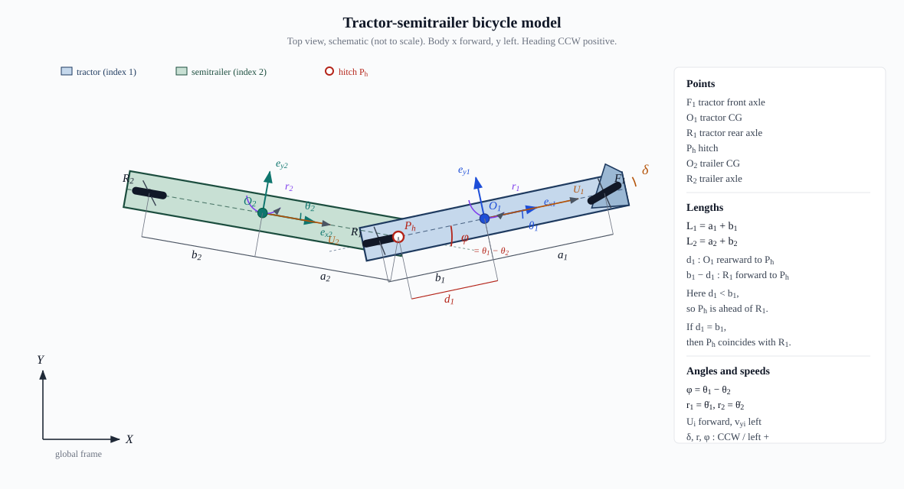
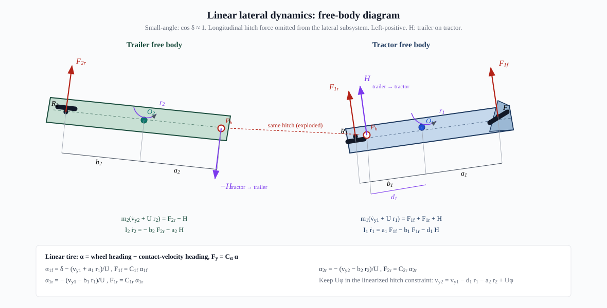

# 卡车—半挂车铰接单轨模型

本文从刚体几何、轮胎侧偏、两车受力、铰接约束、DAE 消元一直推导到控制误差
状态空间。推荐按“几何图 → 速度约束 → 受力图 → 矩阵消元”的顺序阅读。全文默认
使用 SI 单位：长度 m、质量 kg、时间 s、角度 rad、力 N、侧偏刚度 N/rad。

> **核心结论。** 铰接点使卡车和拖车的运动相互约束。
> \(v_{y1},r_1,v_{y2},r_2,\phi\) 中只有四个独立量；铰接横向力 \(H\) 是维持
> 约束的拉格朗日乘子，不应被当作独立控制输入。

## 1. 模型边界与符号约定

本文采用右手平面坐标系：车体 \(x\) 轴向前、\(y\) 轴向左、偏航角逆时针为正。所有
\(C_{\alpha}>0\) 均表示整轴侧偏刚度，轮胎横向力向左为正。定义

\[
U\equiv v_x>0,\qquad
\phi\equiv\theta_{12}=\theta_1-\theta_2,\qquad
r_i=\dot\theta_i .
\]

图中 \(O_1,O_2,H\) 分别是卡车质心、拖车质心和铰接点。下标 1 表示卡车，
下标 2 表示拖车；\(f,r\) 分别表示前轴和后轴。常用符号与代码字段的对应关系为：

| 物理量 | 数学符号 | 代码字段/状态 | 正方向或单位 |
|---|---:|---|---|
| 恒定纵向速度 | \(U\) | `vx` | 车体前方，m/s |
| 前轮转角 | \(\delta\) | `steering` | 左转为正，rad |
| 两车航向 | \(\theta_1,\theta_2\) | `theta1`, `theta2` | 逆时针为正，rad |
| 铰接角 | \(\phi=\theta_1-\theta_2\) | `theta12` | 卡车相对拖车逆时针为正 |
| 横向速度 | \(v_{y1},v_{y2}\) | `vy1`, `vy2` | 各车体左方为正，m/s |
| 偏航角速度 | \(r_1,r_2\) | `r1`, `r2` | 逆时针为正，rad/s |
| 侧偏刚度 | \(C_{1f},C_{1r},C_{2r}\) | `c1f`, `c1r`, `c2r` | 每整轴，N/rad |
| 铰接横向力 | \(H\) | `hitchState`, `hitchInput` | 拖车作用于卡车、向左为正 |

角度、横向速度和横向力的正号必须成套使用。若改用
\(F_y=-C_\alpha\alpha\) 的侧偏角定义，后面的轮胎公式和矩阵 \(L\) 也必须整体改号。

铰接点位于卡车质心后方 \(d_1\)，指定工况取 \(d_1=b_1\)。拖车质心位于铰接点
后方 \(a_2\)，拖车轴又位于质心后方 \(b_2\)。

需要特别区分两层模型：

1. **非线性运动学模型**：轮胎纯滚动，可保留 \(\tan\delta\)、\(\sin\phi\)；
2. **横向动力学模型**：共同恒定纵速 \(U\)、小转角、小侧偏、小铰接角，线性轮胎。

两层模型回答的问题不同：

- 运动学模型假设车轮无侧滑，适合低速倒库、路径几何生成；状态是位置和航向；
- 动力学模型允许轮胎侧偏，适合中高速稳定性与控制；状态包含横向速度和偏航率；
- 不能一边用动力学方程求 \(v_y\)，一边又强制每个轮胎横向速度为零，否则会重复
  施加互相矛盾的约束。

题设没有拖车纵向速度和铰接纵向力，因此不足以闭合任意大侧偏下的全非线性平面
动力学。本文的动力学模型是这些给定状态下严格闭合的线性横向模型，而不是把线性
模型误称为全非线性模型。

## 2. 精确非线性运动学

选择铰接点 \((X_h,Y_h)\) 作为位置状态，并令

\[
L_1=a_1+b_1,\qquad L_2=a_2+b_2,\qquad \ell_h=b_1-d_1 .
\]

### 2.1 卡车偏航率

卡车前轴中心相对后轴中心的刚体速度为 \(L_1r_1\)，方向沿卡车横向。前轮纯滚动
意味着前轴速度方向与前轮平面一致，因此

\[
\tan\delta
=\frac{\text{前轴横向速度}}{\text{前轴纵向速度}}
=\frac{L_1r_1}{U},
\qquad
r_1=\frac{U}{L_1}\tan\delta .
\]

这里的 \(U\) 定义在卡车后轴方向。若 \(\delta>0\)，则 \(r_1>0\)，与“左转、
逆时针为正”的约定一致。

### 2.2 从后轴速度搬移到铰接点

平面刚体上任意两点 \(A,B\) 的速度满足

\[
\boldsymbol v_B=\boldsymbol v_A+
\boldsymbol\omega\times\boldsymbol r_{B/A}.
\]

铰接点相对卡车后轴沿车体纵向向前偏置
\(\ell_h=b_1-d_1\)，故在卡车坐标系中

\[
{}^1\boldsymbol v_H=
\begin{bmatrix}U\\\ell_hr_1\end{bmatrix}.
\]

将它旋转到全局坐标系，

\[
\begin{bmatrix}\dot X_h\\\dot Y_h\end{bmatrix}
=
\begin{bmatrix}
\cos\theta_1&-\sin\theta_1\\
\sin\theta_1& \cos\theta_1
\end{bmatrix}
\begin{bmatrix}U\\\ell_hr_1\end{bmatrix}.
\]

### 2.3 拖车纯滚动条件

拖车轴到铰接点的距离为 \(L_2=a_2+b_2\)。铰接点速度在拖车横向轴上的投影，
一方面由卡车给出，另一方面等于拖车绕其后轴转动产生的 \(L_2r_2\)：

\[
\begin{aligned}
{}^2v_{H,y}
&=\begin{bmatrix}-\sin\theta_2&\cos\theta_2\end{bmatrix}
\begin{bmatrix}\dot X_h\\\dot Y_h\end{bmatrix}\\
&=U\sin(\theta_1-\theta_2)
+\ell_hr_1\cos(\theta_1-\theta_2)
=L_2r_2.
\end{aligned}
\]

代入 \(\phi=\theta_1-\theta_2\) 后，得到一般形式

\[
\begin{aligned}
r_1=\dot\theta_1 &= \frac{U}{L_1}\tan\delta,\\
\dot X_h &= U\cos\theta_1-\ell_h r_1\sin\theta_1,\\
\dot Y_h &= U\sin\theta_1+\ell_h r_1\cos\theta_1,\\
\dot\theta_2
&=\frac{U\sin\phi+\ell_h r_1\cos\phi}{L_2},\\
\dot\phi
&=r_1-\frac{U\sin\phi+\ell_h r_1\cos\phi}{L_2}.
\end{aligned}
\]

题设 \(d_1=b_1\) 时 \(\ell_h=0\)，上式退化为常用后轴铰接形式
\(\dot X_h=U\cos\theta_1\)、
\(\dot Y_h=U\sin\theta_1\)、
\(\dot\theta_2=U\sin\phi/L_2\)，但方程并不奇异。

还可直接检查铰接角的物理趋势：直行时若 \(\phi>0\)，则
\(\dot\theta_2=U\sin\phi/L_2>0\)，拖车会向卡车航向旋转；当卡车不继续转向
\((r_1=0)\) 时，\(\dot\phi<0\)，铰接角自然衰减。

两个质心位置由几何关系恢复：

\[
\begin{aligned}
X_1&=X_h+d_1\cos\theta_1,&
Y_1&=Y_h+d_1\sin\theta_1,\\
X_2&=X_h-a_2\cos\theta_2,&
Y_2&=Y_h-a_2\sin\theta_2.
\end{aligned}
\]

该运动学模型适用于低速路径跟踪。动力学模型中的 \(v_{y1},v_{y2}\) 不再受轮胎
纯滚动条件限制，不能与上述运动学侧向速度条件同时强制使用。

### 2.4 一个非后轴铰接的数值例子

取 \(U=15\)、\(a_1=1.5\)、\(b_1=2.5\)、\(d_1=1.8\) m、
\(\delta=0.1\) rad，则 \(L_1=4\) m、\(\ell_h=0.7\) m。在
\(\theta_1=\theta_2=0\) 时：

\[
r_1=0.3763\ {\rm rad/s},\qquad
\dot Y_h=\ell_hr_1=0.2634\ {\rm m/s},
\]

\[
r_2=\frac{\dot Y_h}{L_2}
=\frac{0.2634}{7}=0.03763\ {\rm rad/s}.
\]

这说明即使两车瞬时航向相同，只要铰接点不在卡车后轴上，卡车转动也会给铰接点
带来横向速度，并立即驱动拖车转动。令 \(d_1=b_1\) 后该项才消失。

## 3. 线性轮胎模型

动力学模型不再要求轮胎严格纯滚动。对车体上纵向坐标为 \(x\) 的一点，刚体速度
搬移公式给出

\[
v_x(x)\approx U,\qquad v_y(x)=v_y+xr.
\]

速度方向相对车体纵轴的小角度近似为
\(\beta(x)\approx(v_y+xr)/U\)。本文把“车轮指向角减去速度方向角”定义为侧偏角，
所以卡车前轴、后轴和拖车轴分别有

\[
\begin{aligned}
\alpha_{1f}&=\delta-\beta_{1f},
&\beta_{1f}&\approx\frac{v_{y1}+a_1r_1}{U},\\
\alpha_{1r}&=0-\beta_{1r},
&\beta_{1r}&\approx\frac{v_{y1}-b_1r_1}{U},\\
\alpha_{2r}&=0-\beta_{2r},
&\beta_{2r}&\approx\frac{v_{y2}-b_2r_2}{U}.
\end{aligned}
\]

在线性工作区，横向力与侧偏角成正比：\(F_y=C_\alpha\alpha\)。因此在 \(U>0\)
下，各轴侧偏角和横向力为

\[
\begin{aligned}
\alpha_{1f}&=\delta-\frac{v_{y1}+a_1r_1}{U},&
F_{1f}&=C_{1f}\alpha_{1f},\\
\alpha_{1r}&=-\frac{v_{y1}-b_1r_1}{U},&
F_{1r}&=C_{1r}\alpha_{1r},\\
\alpha_{2r}&=-\frac{v_{y2}-b_2r_2}{U},&
F_{2r}&=C_{2r}\alpha_{2r}.
\end{aligned}
\]

这里没有采用常见但容易混淆的 \(F_y=-C_\alpha\alpha\) 记法；上述侧偏角定义已使
正前轮转角产生正横向力。

例如车辆原本完全直行，即 \(v_y=r=0\)，施加 \(\delta>0\) 后，
\(\alpha_{1f}=\delta>0\)、\(F_{1f}>0\)，前轴立即受到向左的力。这个极限工况是
检查符号是否一致的最简单方法。

线性轮胎只在 \(|\alpha|\) 较小时可信。实际轮胎达到附着极限后，\(F_y\) 不再随
\(\alpha\) 线性增长；本文模型不能预测甩尾、折叠或极限侧向加速度。

## 4. 两车动力学与铰接约束

令 \(H\) 为拖车施加在卡车上的铰接横向力。小角度下两车横向轴可视为平行：

\[
\begin{aligned}
m_1(\dot v_{y1}+Ur_1)&=F_{1f}+F_{1r}+H,\\
I_{z1}\dot r_1&=a_1F_{1f}-b_1F_{1r}-d_1H,\\
m_2(\dot v_{y2}+Ur_2)&=F_{2r}-H,\\
I_{z2}\dot r_2&=-b_2F_{2r}-a_2H.
\end{aligned}
\]

式中 \(m(\dot v_y+Ur)\) 来自车体旋转坐标系中的加速度。若质心速度在车体坐标系
写成 \([U,v_y]^T\)，则

\[
{}^b\boldsymbol a
=\frac{d}{dt}{}^b\boldsymbol v+
\boldsymbol\omega\times{}^b\boldsymbol v
\approx
\begin{bmatrix}0\\\dot v_y+Ur\end{bmatrix}.
\]

因此 \(Ur\) 不是轮胎力，而是旋转坐标系下由纵向速度产生的横向加速度项。偏航
方程分别对质心取矩；铰接力对卡车产生 \(-d_1H\)，对拖车产生 \(-a_2H\)。

### 4.1 铰接点速度约束的逐步推导

同一个物理铰接点不能在卡车和拖车的描述中拥有两种速度。先在卡车坐标系计算：
铰接点位于 \(O_1\) 后方，位置向量为

\[
{}^1\boldsymbol\rho_{H/O_1}=\begin{bmatrix}-d_1\\0\end{bmatrix},
\]

所以

\[
{}^1\boldsymbol v_H
=\begin{bmatrix}U\\v_{y1}\end{bmatrix}
+\left(
\begin{bmatrix}0\\0\\r_1\end{bmatrix}\times
\begin{bmatrix}-d_1\\0\\0\end{bmatrix}
\right)_{xy}
=\begin{bmatrix}U\\v_{y1}-d_1r_1\end{bmatrix}.
\]

再在拖车坐标系计算。铰接点位于 \(O_2\) 前方：

\[
{}^2\boldsymbol\rho_{H/O_2}=\begin{bmatrix}a_2\\0\end{bmatrix},
\qquad
{}^2v_{H,y}=v_{y2}+a_2r_2.
\]

要比较两者，必须把卡车表达的速度投影到拖车横向单位向量
\({}^1\boldsymbol e_{y2}=[\sin\phi,\cos\phi]^T\) 上。因此精确关系为

\[
v_{y2}+a_2r_2
=U\sin\phi+(v_{y1}-d_1r_1)\cos\phi .
\]

使用
\(\sin\phi=\phi+O(\phi^3)\)、\(\cos\phi=1+O(\phi^2)\)，并丢弃二阶小量后，
得到位置级速度约束

\[
\boxed{v_{y1}-d_1r_1-v_{y2}-a_2r_2+U\phi=0.}
\]

它表明 \([v_{y1},r_1,v_{y2},r_2,\phi]\) 五个量并非五个独立状态，系统只有四个
独立横向状态。若直接构造任意五维 ODE，会引入不满足几何约束的虚假模态。

约束中各项都有速度单位：

- \(v_{y1},v_{y2}\)：质心横向平动速度；
- \(d_1r_1,a_2r_2\)：质心到铰接点的刚体转动速度；
- \(U\phi\)：两车纵向轴不平行造成的横向投影速度。

这也是检查公式漏项和符号错误的有效方法。

## 5. 约束力消元：全过程矩阵组装

定义冗余速度、质量矩阵和约束梯度

\[
q=\begin{bmatrix}v_{y1}&r_1&v_{y2}&r_2\end{bmatrix}^{T},\quad
M=\operatorname{diag}(m_1,I_{z1},m_2,I_{z2}),\quad
g=\begin{bmatrix}1&-d_1&-1&-a_2\end{bmatrix}^{T}.
\]

将轮胎力逐项代入四条动力学方程：

\[
M\dot q-gH=Lq+F_\delta\delta,
\]

其中

\[
L=\begin{bmatrix}
-\frac{C_{1f}+C_{1r}}U&
\frac{-a_1C_{1f}+b_1C_{1r}}U-m_1U&0&0\\
\frac{-a_1C_{1f}+b_1C_{1r}}U&
-\frac{a_1^2C_{1f}+b_1^2C_{1r}}U&0&0\\
0&0&-\frac{C_{2r}}U&\frac{b_2C_{2r}}U-m_2U\\
0&0&\frac{b_2C_{2r}}U&-\frac{b_2^2C_{2r}}U
\end{bmatrix},
\qquad
F_\delta=
\begin{bmatrix}C_{1f}\\a_1C_{1f}\\0\\0\end{bmatrix}.
\]

以第一行为例，完整展开过程是

\[
\begin{aligned}
m_1\dot v_{y1}
&=F_{1f}+F_{1r}+H-m_1Ur_1\\
&=C_{1f}\delta
-\frac{C_{1f}+C_{1r}}U v_{y1}\\
&\quad+
\left(\frac{-a_1C_{1f}+b_1C_{1r}}U-m_1U\right)r_1+H.
\end{aligned}
\]

这正好给出 \(L\) 第一行、\(F_\delta\) 第一项以及 \(-gH\) 移到等号左侧后的
第一项。其余三行按相同步骤收集 \(v_y,r,\delta,H\) 的系数即可。矩阵各行依次
对应：卡车横向平动、卡车偏航、拖车横向平动、拖车偏航。

### 5.1 为什么必须对约束求导

当前未知量是四个加速度 \(\dot q\) 和约束力 \(H\)，共五个。四条动力学方程还
缺一条方程；它来自“速度约束在运动过程中始终为零”。对

\[
g^Tq+U\phi=0
\]

求时间导数。因 \(U\) 恒定且 \(\dot\phi=r_1-r_2\)，

\[
g^T\dot q+U(r_1-r_2)=0,
\]

故

\[
g^T\dot q=s^Tq,\qquad
s=\begin{bmatrix}0&-U&0&U\end{bmatrix}^{T}.
\]

于是完整的加速度级 DAE 为

\[
\begin{bmatrix}M&-g\\g^T&0\end{bmatrix}
\begin{bmatrix}\dot q\\H\end{bmatrix}
=
\begin{bmatrix}Lq+F_\delta\delta\\s^Tq\end{bmatrix}.
\]

这里的块矩阵不是普通质量矩阵：最后一行没有惯性项，它只负责强制约束。因此该
系统本质上是微分—代数方程（DAE），\(H\) 的作用与约束力/拉格朗日乘子相同。

### 5.2 Schur 补逐步消去 \(H\)

DAE 第一行先左乘 \(M^{-1}\)：

\[
\dot q=M^{-1}(Lq+F_\delta\delta)+M^{-1}gH.
\]

再代入加速度约束 \(g^T\dot q=s^Tq\)：

\[
g^TM^{-1}(Lq+F_\delta\delta)
+g^TM^{-1}g\,H=s^Tq.
\]

定义正标量

\[
D=g^TM^{-1}g
=\frac1{m_1}+\frac{d_1^2}{I_{z1}}
+\frac1{m_2}+\frac{a_2^2}{I_{z2}}>0.
\]

所以 \(d_1=b_1\) **不会使该约束求解退化**。Schur 补给出铰接力

\[
\boxed{
H=\frac{s^Tq-g^TM^{-1}(Lq+F_\delta\delta)}D
}
\]

因为 \(M\) 正定且 \(g\ne0\)，\(D=g^TM^{-1}g\) 必然严格为正。这里是否
\(d_1=b_1\) 只改变 \(d_1^2/I_{z1}\) 的数值，不会令整个 \(D\) 消失。把上式的
\(H\) 代回 \(\dot q\)：

\[
\begin{aligned}
\dot q
&=M^{-1}(Lq+F_\delta\delta)\\
&\quad+\frac{M^{-1}g}{D}
\left[s^Tq-g^TM^{-1}(Lq+F_\delta\delta)\right],
\end{aligned}
\]

以及消去铰接力后的冗余速度方程

\[
\dot q=A_q q+B_q\delta,
\]

\[
\begin{aligned}
P&=M^{-1}-\frac{M^{-1}gg^TM^{-1}}D,\\
A_q&=PL+\frac{M^{-1}g}{D}s^T,\\
B_q&=PF_\delta .
\end{aligned}
\]

矩阵 \(P\) 是满足铰接加速度约束的质量加权投影。该四维速度 ODE 必须与
\(g^Tq+U\phi=0\) 及 \(\dot\phi=r_1-r_2\) 一起使用。

还可以直接验证投影性质

\[
g^TP=0.
\]

因此任何经 \(P\) 投影的广义力都不会在约束方向上产生加速度；缺少的约束方向
加速度由 \((M^{-1}g/D)s^Tq\) 补回，使 \(g^T\dot q=s^Tq\) 恒成立。

## 6. 无冗余的动力学状态空间

选取最小状态

\[
z=\begin{bmatrix}v_{y1}&r_1&r_2&\phi\end{bmatrix}^{T}.
\]

由铰接约束直接恢复拖车横向速度：

\[
\boxed{v_{y2}=v_{y1}-d_1r_1-a_2r_2+U\phi.}
\]

选择 \(z=[v_{y1},r_1,r_2,\phi]^T\) 不是唯一方案，但它有两个优点：卡车横向
速度直接保留，便于路径跟踪；拖车横向速度由约束代数恢复，不会因数值积分累积
约束漂移。

写成 \(q=Rz\)：

\[
R=
\begin{bmatrix}
1&0&0&0\\
0&1&0&0\\
1&-d_1&-a_2&U\\
0&0&1&0
\end{bmatrix}.
\]

令

\[
S=\begin{bmatrix}
1&0&0&0\\
0&1&0&0\\
0&0&0&1
\end{bmatrix},\qquad
t^T=\begin{bmatrix}0&1&-1&0\end{bmatrix}.
\]

矩阵 \(S\) 从 \(\dot q=[\dot v_{y1},\dot r_1,\dot v_{y2},\dot r_2]^T\)
中选出第 1、2、4 行；第三行 \(\dot v_{y2}\) 不再独立积分。状态最后一行由
\(\dot\phi=r_1-r_2=t^Tz\) 给出。因此

\[
\dot z=
\begin{bmatrix}
S\dot q\\t^Tz
\end{bmatrix}
=
\begin{bmatrix}
SA_qR\\t^T
\end{bmatrix}z+
\begin{bmatrix}SB_q\\0\end{bmatrix}\delta.
\]

即标准连续时间模型为

\[
\boxed{\dot z=A_z z+B_z\delta}
\]

\[
\boxed{
A_z=\begin{bmatrix}SA_qR\\t^T\end{bmatrix},\qquad
B_z=\begin{bmatrix}SB_q\\0\end{bmatrix}.
}
\]

这是建议用于 LQR、MPC、观测器和数值积分的模型；它不存在冗余五状态模型的约束
漂移。铰接力可写为

\[
H=K_Hz+D_H\delta,
\]

\[
K_H=\frac{(s^T-g^TM^{-1}L)R}{D},\qquad
D_H=-\frac{g^TM^{-1}F_\delta}{D}.
\]

给定任意合法的 \(z\)，先用 \(q=Rz\) 恢复冗余速度，再计算约束残差：

\[
g^Tq+U\phi=g^TRz+U\phi\equiv0.
\]

这是恒等式，而不是“近似等于零”。实际程序若得到明显非零残差，通常意味着状态
排列、\(d_1/a_2\) 参数或 \(\phi\) 正号有误。

## 7. 面向横向控制的运动学—动力学融合模型

### 7.1 步骤 1：误差状态与物理状态转换

令 \(e_y\) 是卡车质心相对参考路径的左向横向误差，
\(e_\Phi=\theta_1-\theta_{\mathrm{ref}}\)，参考曲率为 \(\kappa\)。这里采用
**按时间给定的参考轨迹**，其航向率定义为
\(\dot\theta_{\mathrm{ref}}=U\kappa\)。小误差下

\[
\dot e_y=v_{y1}+Ue_\Phi,\qquad
\dot e_\Phi=r_1-U\kappa .
\]

第一式可由速度投影理解：卡车质心自身的横向速度贡献 \(v_{y1}\)，航向相对参考
路径偏转 \(e_\Phi\) 后，纵向速度产生附加横向分量
\(U\sin e_\Phi\approx Ue_\Phi\)。第二式就是两航向角速度之差：

\[
\dot e_\Phi=\dot\theta_1-\dot\theta_{\rm ref}
=r_1-U\kappa.
\]

这里的 \(e_y\) 明确定义在卡车质心 \(O_1\)，不是后轴中心或铰接点。改变误差
参考点会改变 \(\dot e_y\) 以及后续状态变换矩阵。

若改用“车辆到路径最近点”的严格 Frenet 投影，并把 \(\kappa\) 当作非小量，则
\(\dot s=(U\cos e_\Phi-v_{y1}\sin e_\Phi)/(1-\kappa e_y)\)，线性化还会产生
\(-U\kappa^2e_y\) 项；该时变路径坐标模型不属于本文的 LTI/准 LTI 组装假设。

选取控制状态

\[
x_c=
\begin{bmatrix}
e_y&\dot e_y&e_\Phi&\dot e_\Phi&\phi&\dot\phi
\end{bmatrix}^{T}.
\]

逐项反解：

\[
\begin{aligned}
v_{y1}&=\dot e_y-Ue_\Phi,\\
r_1&=\dot e_\Phi+U\kappa,\\
r_2&=r_1-\dot\phi=\dot e_\Phi+U\kappa-\dot\phi,\\
v_{y2}&=\dot e_y-Ue_\Phi
-(d_1+a_2)(\dot e_\Phi+U\kappa)
+a_2\dot\phi+U\phi.
\end{aligned}
\]

第四式来自第 6 节的铰接约束：

\[
\begin{aligned}
v_{y2}
&=v_{y1}-d_1r_1-a_2r_2+U\phi\\
&=(\dot e_y-Ue_\Phi)-d_1(\dot e_\Phi+U\kappa)\\
&\quad-a_2(\dot e_\Phi+U\kappa-\dot\phi)+U\phi,
\end{aligned}
\]

合并同类项后即得到上式。这样每一项的来源都可追溯：\(-Ue_\Phi\) 来自误差
运动学，\(-(d_1+a_2)\dot e_\Phi\) 来自两个刚体转动臂，
\(a_2\dot\phi\) 来自两车偏航率差。

前三式和 \(\phi\) 写成

\[
z=T x_c+t_\kappa\kappa,
\]

\[
T=
\begin{bmatrix}
0&1&-U&0&0&0\\
0&0&0&1&0&0\\
0&0&0&1&0&-1\\
0&0&0&0&1&0
\end{bmatrix},\qquad
t_\kappa=\begin{bmatrix}0&U&U&0\end{bmatrix}^{T}.
\]

### 7.2 步骤 2：代数展开

先将物理模型代入：

\[
\dot z=A_zTx_c+A_zt_\kappa\kappa+B_z\delta.
\]

再利用

\[
\begin{aligned}
\ddot e_y&=\dot v_{y1}+U\dot e_\Phi,\\
\ddot e_\Phi&=\dot r_1-U\dot\kappa,\\
\ddot\phi&=\dot r_1-\dot r_2.
\end{aligned}
\]

若 \(a_i^T\) 表示 \(A_z\) 第 \(i\) 行，\(b_i\) 表示 \(B_z\) 第 \(i\) 项，则

\[
\begin{aligned}
\ddot e_y
&=a_1^TTx_c+U\dot e_\Phi+b_1\delta
  +a_1^Tt_\kappa\kappa,\\
\ddot e_\Phi
&=a_2^TTx_c+b_2\delta
  +a_2^Tt_\kappa\kappa-U\dot\kappa,\\
\ddot\phi
&=(a_2^T-a_3^T)Tx_c+(b_2-b_3)\delta
  +(a_2^T-a_3^T)t_\kappa\kappa.
\end{aligned}
\]

上式已经把每个误差加速度明确追溯到物理动力学矩阵；而 \(A_z\) 又由第 5、6 节
的 \(M,g,L,F_\delta\) 完全展开，因此没有未定义的经验系数。

需要特别注意链式法则中的两个容易遗漏项：

1. \(\ddot e_y=\dot v_{y1}+U\dot e_\Phi\)，所以 \(A_c\) 第二行额外包含
   \(+Ue_4^T\)；
2. \(r_1=\dot e_\Phi+U\kappa\)，在 \(U\) 恒定时
   \(\dot r_1=\ddot e_\Phi+U\dot\kappa\)，所以
   \(\ddot e_\Phi=\dot r_1-U\dot\kappa\)。

第二点正是 \(E_{\dot\kappa}\) 第四项为 \(-U\) 的来源。

### 7.3 步骤 3：标准控制状态空间矩阵

定义 \(e_i^T\) 为六维第 \(i\) 个单位行向量，得到

\[
\boxed{
\dot x_c=A_cx_c+B_c\delta+E_\kappa\kappa+
E_{\dot\kappa}\dot\kappa
}
\]

\[
A_c=
\begin{bmatrix}
e_2^T\\
a_1^TT+Ue_4^T\\
e_4^T\\
a_2^TT\\
e_6^T\\
(a_2^T-a_3^T)T
\end{bmatrix},
\qquad
B_c=
\begin{bmatrix}
0\\b_1\\0\\b_2\\0\\b_2-b_3
\end{bmatrix},
\]

\[
E_\kappa=
\begin{bmatrix}
0\\a_1^Tt_\kappa\\0\\a_2^Tt_\kappa\\0\\
(a_2^T-a_3^T)t_\kappa
\end{bmatrix},
\qquad
E_{\dot\kappa}=
\begin{bmatrix}0\\0\\0\\-U\\0\\0\end{bmatrix}.
\]

输出可按控制目标选择，例如

\[
y=
\begin{bmatrix}e_y&e_\Phi&\phi\end{bmatrix}^{T}
=
\begin{bmatrix}
1&0&0&0&0&0\\
0&0&1&0&0&0\\
0&0&0&0&1&0
\end{bmatrix}x_c.
\]

## 8. 完整数值验算

下面使用仓库测试中的参数，单位均为 SI：

| 参数 | 数值 | 参数 | 数值 |
|---|---:|---|---:|
| \(m_1\) | 8000 | \(I_{z1}\) | 25000 |
| \(a_1,b_1,d_1\) | 1.5, 2.5, 2.5 | \(C_{1f},C_{1r}\) | 220000, 300000 |
| \(m_2\) | 18000 | \(I_{z2}\) | 140000 |
| \(a_2,b_2\) | 4.0, 3.0 | \(C_{2r}\) | 500000 |
| \(U\) | 15 |  |  |

取

\[
z=\begin{bmatrix}0.7&0.08&0.03&0.04\end{bmatrix}^T,\qquad
\delta=0.015.
\]

### 8.1 恢复拖车横向速度并检查约束

\[
\begin{aligned}
v_{y2}
&=0.7-2.5(0.08)-4(0.03)+15(0.04)\\
&=0.98\ {\rm m/s}.
\end{aligned}
\]

因此

\[
\begin{aligned}
g^Tq+U\phi
&=0.7-2.5(0.08)-0.98-4(0.03)+15(0.04)\\
&=0.
\end{aligned}
\]

### 8.2 轮胎侧偏角和横向力

\[
\begin{aligned}
\alpha_{1f}&=0.015-\frac{0.7+1.5(0.08)}{15}
=-0.03967,\\
\alpha_{1r}&=-\frac{0.7-2.5(0.08)}{15}
=-0.03333,\\
\alpha_{2r}&=-\frac{0.98-3(0.03)}{15}
=-0.05933.
\end{aligned}
\]

对应横向力为

\[
F_{1f}=-8726.7\ {\rm N},\qquad
F_{1r}=-10000.0\ {\rm N},\qquad
F_{2r}=-29666.7\ {\rm N}.
\]

虽然 \(\delta>0\)，此瞬时状态的横向速度和偏航率已经使三个侧偏角均为负。这并不
矛盾：轮胎力由“轮胎指向与接地点速度方向之差”决定，而不是只由转向角决定。

### 8.3 计算铰接力和加速度

本组参数下

\[
D=5.44841\times10^{-4},
\qquad
H=8124.46\ {\rm N}.
\]

由 \(\dot q=M^{-1}(Lq+F_\delta\delta+gH)\) 得

\[
\dot q=
\begin{bmatrix}
-2.52528&-0.336046&-2.54951&0.403587
\end{bmatrix}^T.
\]

加速度级约束残差为

\[
\begin{aligned}
&\dot v_{y1}-d_1\dot r_1-\dot v_{y2}-a_2\dot r_2
+U(r_1-r_2)\\
&=-2.52528-2.5(-0.336046)-(-2.54951)
-4(0.403587)+15(0.08-0.03)\\
&\approx0.
\end{aligned}
\]

这同时验证了三件事：\(R\) 恢复的速度满足位置级约束，Schur 补求得的 \(H\)
维持加速度级约束，最小状态模型不会离开合法约束流形。测试文件还进一步逐项验证
了四条力与力矩平衡方程。

## 9. 离散化、初始化和使用限制

控制周期 \(T_s\) 下，推荐使用零阶保持

\[
A_d=e^{A_cT_s},\qquad
B_d=\int_0^{T_s}e^{A_c\tau}B_c\,d\tau
\]

并以相同方式离散 \(E_\kappa,E_{\dot\kappa}\)。仅在
\(\|A_cT_s\|\ll1\) 时使用欧拉近似 \(A_d\approx I+A_cT_s\)。

仓库当前只返回连续时间矩阵，零阶保持离散化应由调用方完成。对组合输入
\(w=[\delta,\kappa,\dot\kappa]^T\)，可一次构造
\(B_w=[B_c,E_\kappa,E_{\dot\kappa}]\) 再做 ZOH，避免对三个输入采用不一致的
离散方式。

推荐初始化流程：

1. 已知物理状态时，直接设置 \(z=[v_{y1},r_1,r_2,\phi]^T\)；
2. 通过 \(v_{y2}=v_{y1}-d_1r_1-a_2r_2+U\phi\) 恢复拖车横向速度；
3. 用 `hitchConstraintResidual` 检查残差接近机器精度；
4. 已知控制误差状态时，用 \(z=Tx_c+t_\kappa\kappa\) 转换，不能遗漏曲率偏置；
5. 数值积分始终积分 \(z\) 或 \(x_c\)，不要独立积分冗余的 \(v_{y2}\)。

模型使用时必须满足：

- \(U>0\)；低速或倒车需切换到非线性运动学模型并重新处理符号；
- \(|\delta|,|\alpha_{ij}|,|\phi|\) 足够小，轮胎未饱和；
- \(C_{1f},C_{1r},C_{2r}\) 是整轴刚度，不能再乘轮胎数量；
- 初始化冗余状态时必须满足铰接约束，推荐直接使用最小状态 \(z\)；
- 若要研究大铰接角、制动/驱动、纵向载荷转移，必须增加两车纵向速度、铰接二维
  作用力和非线性轮胎模型，形成更高维 DAE。

## 10. 代码对应关系

- `nonlinearKinematics`：第 2 节；
- `buildDynamicModel`：第 3–6 节，返回 \(A_z,B_z,K_H,D_H,R\)；
- `buildErrorModel`：第 7 节，返回
  \(A_c,B_c,E_\kappa,E_{\dot\kappa},T,t_\kappa\)；
- `hitchConstraintResidual`：检查 \(g^Tq+U\phi\)；
- 测试覆盖约束恢复、约束微分不变性和误差—物理状态导数一致性。
