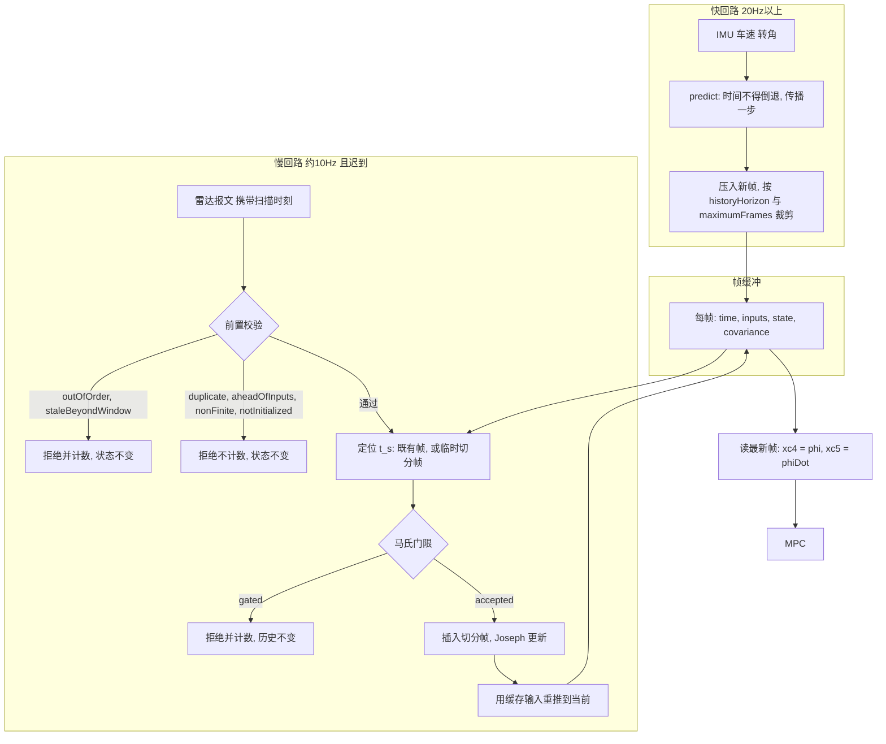
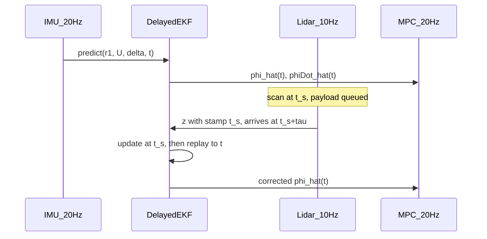
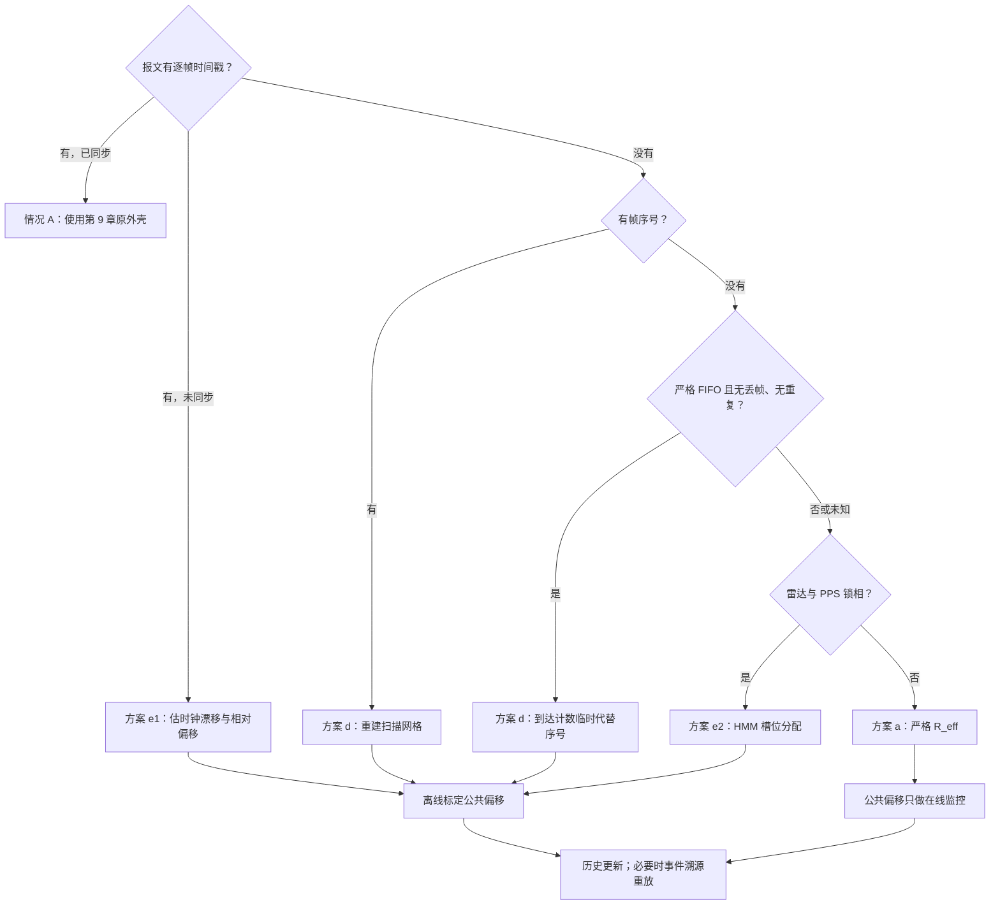

# 铰接角时延融合滤波器：技术说明与移植指南

## 0. 这份文档是什么

卡车只有一个激光雷达能观测铰接角 \(\phi\)，它约 10 Hz、带 100–400 ms 的可变时延；
而横向 MPC 每 50 ms 需要**当前**的 \(\phi\) 和 \(\dot\phi\)。本文给出解决这个问题的
滤波器。

滤波器只有**一套框架**（量测模型、噪声离散、时延处理三者共用），其中**过程模型有两个
可选实现**：运动学 (K5) 和降阶动力学 (K27r)。本文按这两个模型**对照**展开。

**读者**：要把这套滤波器移植到另一个代码仓的人（或 AI）。因此本文：

- 第 2 章先讲清整套方案在干什么，再进推导；
- 每个符号在第一次使用前都在参数表中定义，含单位与物理意义；
- 每个公式都从上一步推出来，不跳步；
- 两个过程模型的每个环节都并排给出，便于取舍；
- 每一节都标注对应的代码位置（第 12 章有完整对照表）；
- 第 15 章是分步移植清单，每步有独立验收条件。

**几何与车辆动力学**以
[`1_truck_model_key_formula.md`](1_truck_model_key_formula.md) 为准，
其适用边界见该文 1.4 节。本文引用的 (K…) 编号都来自那里。

**单位约定**：全文 SI。角度 rad，角速度 rad/s，速度 m/s，时间 s。
界面显示的度只是换算，配置里一律存 rad。

### 0.1 一分钟概览

| 项 | 运动学模型 | 动力学模型 |
|---|---|---|
| 代码枚举 | `ArticulationProcessModel::kinematic` | `::dynamic` |
| 状态维数 | 2 | 3 |
| 状态 | \([\phi,\;b_{r2}]^\top\) | \([v_{y1},\;r_2,\;\phi]^\top\) |
| 依赖参数 | 仅 \(L_2,\ell_h\) | 质量、惯量、轮胎刚度 |
| 量测 | \(z=\phi+v\)，\(H=[1,\,0]\) | \(z=\phi+v\)，\(H=[0,\,0,\,1]\) |
| \(\phi\) RMSE（0.5° 扫描） | 0.56° | **0.30°** |
| \(\dot\phi\) RMSE（0.5° 扫描） | 1.53°/s | **0.60°/s** |
| 默认 | **是** | 否，需显式开启 |

共用部分：量测模型（第 7 章）、噪声离散（第 8 章）、时延处理（第 9 章）。

**三条先说的结论**：

1. 两个模型都**没有**把 \(\dot\phi\) 建成观测量，因为没有任何传感器测它
   （第 7.3 节）。\(\dot\phi\) 是模型输出。
2. 整套方案由你交给 `update()` 的那个**时间戳**参数化。它的含义与可信度是最重要的
   集成决策，不是一个参数（第 2.2 节）。
3. 若只知道时延的大致范围而拿不到逐帧扫描戳，方案**仍然值得做**，但它做的是
   "消掉时延均值、剩下抖动"，不是精确消除（第 2.2 节）；若还能拿到帧序号或保证
   管线先进先出，就能进一步重建扫描时刻（第 18 章）。

---

## 1. 问题定义

### 1.1 传感器清单

| 量 | 符号 | 来源 | 频率 | 时延 | 在滤波器中的角色 |
|---|---|---|---|---|---|
| 拖头横摆角速度 | \(r_1\) | 拖头 IMU | ≥20 Hz | 可忽略 | **输入**（两个模型都用） |
| 车速 | \(U\) | 轮速/组合导航 | ≥20 Hz | 可忽略 | **输入**（两个模型都用） |
| 前轮转角 | \(\delta\) | 转向系统 | ≥20 Hz | 可忽略 | 动力学模型的**输入**；运动学模型仅用于诊断 |
| 铰接角 | \(\phi_{\text{lidar}}\) | 感知雷达 | ≈10 Hz | **100–400 ms，时变** | **唯一量测** |
| 挂车横摆角速度 | \(r_2\) | — | 无传感器 | — | 由模型重建 |
| 铰接角速度 | \(\dot\phi\) | — | 无传感器 | — | 由模型重建 |

**关键约束**：没有挂车 IMU，没有铰接编码器。\(r_2\) 和 \(\dot\phi\) 都**不可直接测量**。
任何滤波器都不能凭空增加信息 —— 这一点决定了后面所有取舍，也是第 7.3 节的依据。

### 1.2 时间参考：你实际能拿到什么

这是整套方案最关键的集成前提，比任何一个滤波参数都重要。

雷达描述的是**扫描时刻** \(t_s\) 的 \(\phi(t_s)\)，在 \(t_s+\tau\) 才送达。
\(\dot\phi=10°/\text{s}\) 时，300 ms 的滞后就是 3° 的误差 —— 比雷达本身的噪声还大。
所以把迟到的 \(\phi_{\text{lidar}}\) 直接当成当前值写进控制器是错的。

问题在于：**\(t_s\) 你未必拿得到。** 两种情况必须分清，它们决定方案能做到什么：

| | 情况 A | 情况 B |
|---|---|---|
| 你有什么 | 每帧可信的扫描时间戳 | 只有到达时刻，加一个经验范围 |
| 交给 `update()` 的戳 | 直接用报文里的 \(t_s\) | 合成：\(t_s=t_{\text{arr}}-\bar\tau\) |
| 残余定时误差 | 时钟同步精度（PTP 微秒级） | \(\varepsilon=\tau_{\text{真}}-\bar\tau\)，量级 0.1 s |
| 前提 | 感知与车端时间同步 | 时延范围的经验值可靠 |

`ArticulationLidarMeasurement::stamp` 的 API 契约始终是"扫描时刻，不是到达时刻"。
情况 B 下你**仍然要遵守这个契约**，只是那个扫描时刻是你估出来的而不是读出来的。
误差预算见第 2.2 节，完整的设计与原型数据见第 18 章。

> **除第 18 章外，本文所有实测数字都取自情况 A。** demo 与测试都直接把精确扫描
> 时刻交给滤波器（`pending.measurement.stamp = time_`），只延迟*投递*。demo 还有
> 几项会影响数字的约定（按到达顺序投递、扫描戳落在控制网格上、两个滤波器都从
> Plant 真值 \(\phi\) 起步等），逐条列在第 13.1 节。

### 1.3 输出接口

MPC 的误差状态（式 (K35)）是
\(x_c=[e_y,\dot e_y,e_\psi,\dot e_\psi,\phi,\dot\phi]^\top\)。
滤波器负责填最后两维：

\[
x_c[4]=\hat\phi,\qquad x_c[5]=\hat{\dot\phi}.
\]

底盘/Plant 的积分**不要**用估计值，只有控制器用。

---

## 2. 方案总览

本章回答三个问题：为什么普通 EKF 不行、时延到底怎么被消掉、整套东西怎么跑。
看完本章应该能判断这个方案适不适合你的系统，再决定要不要读后面的推导。

### 2.1 为什么不用普通 EKF

普通 EKF 的量测方程是

\[
z=h(x_{\text{now}})+v,
\]

它假设量测描述的是**当前**状态。这里这个前提直接不成立：扫描描述的是 100–400 ms
之前的 \(\phi\)。把迟到的扫描当当前值喂进去，同时坏掉三件事：

1. **注入系统性偏差。** 误差约 \(\dot\phi\cdot\tau\)：\(\dot\phi=10°/\text{s}\)、
   \(\tau=0.25\) s 时是 2.5°，与雷达噪声同量级甚至更大。滤波器会把一个确定性偏差
   当成零均值噪声处理。
2. **新息不再是白噪声。** 卡尔曼增益失去最优性，\(P\) 低估真实误差 ——
   滤波器"自信地错着"，而 \(P\) 正是上层判断可信度的唯一依据。
3. **门限反向工作。** \(\tau\) 时变意味着偏差也时变，标定不掉；急转弯时 \(\dot\phi\)
   大、表观新息大，马氏门限会在最需要量测的时刻开始拒绝好包。

所以问题不是"EKF 不够用"，而是它的量测方程在这里是假的。
**本方案不改卡尔曼数学，只把同一套更新用在正确的时间点上。**

### 2.2 时延怎么被消掉：两种情况的误差预算

**情况 A（有可信扫描戳）。** 处理时的扫描年龄 \(t_{\text{now}}-t_s\) 由时间戳直接
算出，不需要估计（它等于传输时延 \(\tau=t_{\text{arr}}-t_s\) 加上服务等待）。消除的
办法不是补偿，而是**回到正确的时间点做更新**：

\[
\text{回退到 } t_s
\;\longrightarrow\;
\text{在历史帧上做标准 EKF 更新}
\;\longrightarrow\;
\text{用缓存的输入重新前推到 } t_{\text{now}}
\]

重推用的是沿途记录下来的 \(r_1,U,\delta\)，也就是用过程模型沿记录的输入重新
积分，而不是用最新输入外推。

**"精确"到什么程度，要说清楚。** 第 9.8 节证明了一个性质：在四个前提下
（扫描戳单调；扫描落在历史窗内；拒绝计数从未达到 `consecutiveRejectLimit`；
保持默认 `snapToNearestFrame = false`），延迟滤波器与下面这个参考滤波器执行
**完全相同的浮点运算序列**，结果逐位一致：

> 把所有被接受扫描的落点（与扫描戳相差不超过 \(10^{-9}\) s）插入输入网格，得到
> "细化网格"；在细化网格上按时间顺序逐点运行同一个 EKF，每个扫描都在自己的时刻
> 准时融合。

所以延迟本身不引入额外误差。与"不细化的原输入网格"相比：

- 动力学模型在精确算术下仍然一致：线性零阶保持满足半群性质，同一冻结
  \((A,Q_c)\) 下 Van Loan 离散可以分段复合（第 8.3 节）；前提是被切分的区间内
  \(\phi\) 不触发 \(\pm\pi\) 处的 wrap（第 6.5、9.8 节）；
- 运动学模型每步用一次欧拉，被切分的区间变成两次欧拉，每个这样的区间相差
  \(O(\Delta t^2)\)。

测试 `testDelayedFusionEqualsOnTimeFusion` 在两个模型上按 \(10^{-12}\) 相对容差
逐项比较状态与协方差，并附带检查上面两条关于原网格的结论。

代价是一个硬前提：感知与车端必须时间同步。**戳错 100 ms 等于把更新打到错误的
历史时刻，而本方案没有任何机制能自检这件事。**

**情况 B（只有到达时刻和一个范围）。** 必须合成 \(t_s=t_{\text{arr}}-\bar\tau\)。
由 \(t_{\text{arr}}=t_s^{\text{真}}+\tau_{\text{真}}\) 得

\[
t_s=t_s^{\text{真}}+\underbrace{(\tau_{\text{真}}-\bar\tau)}_{\varepsilon},
\qquad
\boxed{\varepsilon=\tau_{\text{真}}-\bar\tau .}
\]

即合成戳比真实扫描时刻**晚** \(\varepsilon\)（\(\varepsilon>0\) 时）。全文统一用这个
符号约定，第 18 章沿用。

取范围 100–400 ms、均匀分布，\(\bar\tau\) 取均值 0.25 s。合成后残余的定时误差为

\[
\sigma_\varepsilon^2=\operatorname{Var}\tau=\frac{(0.4-0.1)^2}{12}=0.0075\ \text{s}^2,
\qquad
\sigma_\varepsilon=0.0866\ \text{s}.
\]

不处理时，决定滞后的时间因子是 \(\tau\) 本身，其 RMS 为

\[
\sqrt{E[\tau^2]}=\sqrt{\operatorname{Var}\tau+(E\tau)^2}
=\sqrt{0.0075+0.25^2}=0.2646\ \text{s}.
\]

| 做法 | 当前时刻的角度误差 | 量级（RMS 的时间因子） |
|---|---|---|
| 不处理，迟到扫描当当前值 | \(\dot\phi\,\tau\) | 0.26 s |
| 情况 B，合成戳 | \(\dot\phi(\tau-\bar\tau)\) | **0.087 s** |
| 情况 A，真实戳 | \(\dot\phi\times\)时钟误差 | 可忽略 |

\[
\boxed{
\text{情况 B 下方案消掉时延的\textbf{均值}，剩下\textbf{抖动}：单帧定时误差 RMS 从 0.26 s 降到 0.087 s，约 3 倍。}
}
\]

这个"约 3 倍"有三条口径限定：

1. 它是"扫描到达瞬间"的比较。若基线还要计入 10 Hz 零阶保持带来的额外年龄
   \(u\sim U[0,0.1]\) s（与 \(\tau\) 独立），则
   \(\sqrt{E[(\tau+u)^2]}=\sqrt{0.0075+0.00083+0.30^2}=0.314\) s，约 3.6 倍。
2. 它假设 \(\dot\phi\) 在时延区间内近似恒定。
3. 它是**单帧量测**误差之比，不是滤波输出误差之比：逐帧抖动会被滤波部分平均，
   而标称时延与真实均值之差会以接近 1 的增益直接进入输出（第 18 章）。

这既回答了"时延未知还值不值得做"（值得），也纠正了一个容易产生的误解：
它不是精确消除。情况 B 下定时误差可能成为主导误差源，必须按第 18 章处理，
否则马氏门限会在转弯时批量误拒。

### 2.3 候选方案横向对比

| 方案 | 可变 \(\tau\) | 参数依赖 | 算力 | 结论 |
|---|---|---|---|---|
| 雷达 ZOH 直接用 | 不处理 | 无 | 无 | 对照基线：10 Hz 阶梯叠 100–400 ms 滞后直接进 MPC |
| 开环 (K5) + 雷达覆盖 | 覆盖发生在 \(t_s\) | 低 | 极低 | 当前值仍落后 \(\tau\)，且没有协方差可用 |
| 互补滤波 + \(\dot\phi\tau\) 外推 | 只对常值 \(\tau\) | 低 | 极低 | \(\tau\) 时变时失效；可作故障降级 |
| 标准 EKF（迟到量测当当前） | 不处理 | 低 | 低 | 把估计往过去拉，见 2.1 |
| 状态增广 KF（缓存延迟状态副本） | 固定整数档 | 低 | 中 | \(\tau\) 连续波动时维数膨胀且需插值；情况 B 下档位未知，要改用多假设（第 18 章） |
| 全状态 (K27) Delayed EKF | 可以 | 高 | 中 | 载重敏感；本方案第 6 章的动力学模型就是它的降阶版 |
| UKF / 粒子滤波 | 可以 | 低 | 高 | 情况 A 下 (K5) 的非线性只有 \(\sin,\cos\)，不值得；情况 B 的时延多峰问题另见第 18 章 |
| **历史重传播 Delayed EKF** | **可以** | **低（仅轴距）** | **低** | **采用** |

选它的理由：\(\tau\) 在区间内随机，而状态维数不随 \(\tau\) 膨胀；更新对齐到 \(t_s\)
后再用缓存输入积分回来，等价于在细化网格上按扫描戳准时滤波（第 9.8 节）。
注意这是**滤波解，不是平滑解**：\(t_s\) 之前的帧不会被回改。实现上只是
"在历史帧上调一次已有的 `update`，再调几次已有的 `predict`"。

### 2.4 整体流程

两个回路共享一个帧环形缓冲：快回路只往前推，慢回路负责回插校正。



时序上看，两条链的交错关系是：



端到端伪代码：

```
# 快回路，每个 IMU/控制拍
on_input(r1, U, delta, t):
    ekf.predict({r1, U, delta}, t)          # 见 9.3
    phi, phiDot = ekf.publish()             # 见 5.8 / 6.6
    controller.articulation_channel(phi, phiDot)

# 慢回路，每个雷达报文
on_scan(payload):
    t_s = payload.scan_time                 # 情况 A
    # t_s = arrival_time - tau_bar          # 情况 B 的最简做法，见第 18 章
    outcome = ekf.update(t_s, payload.phi)  # 见 9.4
    log(outcome)                            # 8 个结局码，见 9.4
```

同一服务拍内若既有输入又有报文，**先 predict 再 update**（demo 即如此）。
反过来做，戳等于本拍时刻的报文会因没有输入覆盖而得到 `aheadOfInputs`。

**移植时最容易做错的一步**：把 `on_scan` 里的 `t_s` 写成到达时刻。那等于回到 2.1
的普通 EKF，而且因为多了一层历史机制，症状更隐蔽。

重推只需要输入、不必重放量测，这一点的正当性**完全**来自扫描戳单调前提（第 9.1 节）。
若该前提不成立，整个简化失效。

---

## 3. 全局符号表

后续所有推导只使用本表加上各模型节内声明的附加符号。

### 3.1 几何参数（常量，来自 (K1)）

| 符号 | 含义 | 单位 | 代码字段 |
|---|---|---|---|
| \(a_1\) | 卡车质心到前轴距离 | m | `Parameters::a1` |
| \(b_1\) | 卡车质心到后轴、**沿车体 x 向后**的距离 | m | `Parameters::b1` |
| \(d_1\) | 卡车质心到铰接点、**沿车体 x 向后**的距离 | m | `Parameters::d1` |
| \(a_2\) | 挂车质心到铰接点距离 | m | `Parameters::a2` |
| \(b_2\) | 挂车质心到挂车轴距离 | m | `Parameters::b2` |
| \(L_1=a_1+b_1\) | 卡车轴距 | m | 派生 |
| \(L_2=a_2+b_2\) | 铰接点到挂车轴距离 | m | 派生 |
| \(\ell_h=b_1-d_1\) | 卡车后轴到铰接点的**有向**距离 | m | `hitchOffset()` |

\(\ell_h\) 是本文最容易搞错符号的量。\(b_1\) 与 \(d_1\) 都从质心**向后**量，所以

\[
\boxed{\ell_h>0\iff\text{铰接点在后轴\textbf{前方}（沿 }\boldsymbol e_{x1}\text{ 正向）}.}
\]

落在后轴上时 \(\ell_h=0\)。本仓库默认 \(d_1=b_1\)，即 \(\ell_h=0\)。
此约定与 [docs/2](2_truck_model_derivation.md) (D16)
（\(\boldsymbol p_{P_h}=\boldsymbol p_{R_1}+(b_1-d_1)\boldsymbol e_{x1}\)；
(D7) 只定义 \(L_1,L_2\)）、[中文模型长文](articulated_vehicle_model_zh-CN.md) §2.2 一致
（该文 §2.4 的数值例取 \(d_1=1.8<b_1=2.5\)，得 \(\ell_h=0.7\) m，铰接点在后轴前方）。

### 3.2 运动学量

| 符号 | 含义 | 单位 |
|---|---|---|
| \(\theta_1,\theta_2\) | 卡车、挂车航向角 | rad |
| \(\phi=\theta_1-\theta_2\) | 铰接角 | rad |
| \(r_1=\dot\theta_1\) | 卡车横摆角速度 | rad/s |
| \(r_2=\dot\theta_2\) | 挂车横摆角速度 | rad/s |
| \(\dot\phi=r_1-r_2\) | 铰接角速度 | rad/s |
| \(U\) | 卡车纵向速度。运动学各节对应 docs/1 的 \(U_1\)；动力学各节是两车共同的名义恒速（docs/1 在线性化时取 \(U_1=U+O(\varepsilon^2)\)） | m/s |
| \(\delta\) | 前轮转角（全文只表示转角；小扰动用 \(\Delta\) 前缀） | rad |
| \(\rho\) | 路径曲率，定义见 docs/1 第 1.3 节 | 1/m |
| \(v_{y1}\) | 卡车质心横向速度 | m/s |
| \(v_{1r}=v_{y1}-b_1r_1\) | 卡车**后轴**横向速度 | m/s |
| \(P_h\) | 铰接点 | — |
| \(R_2\) | 挂车轴中心 | — |
| \(\boldsymbol e_{x1},\boldsymbol e_{y1}\) | 卡车体轴单位向量 | — |
| \(\boldsymbol e_{x2},\boldsymbol e_{y2}\) | 挂车体轴单位向量 | — |

### 3.3 滤波量

| 符号 | 含义 | 单位 |
|---|---|---|
| \(x\) | 状态向量（各模型不同） | — |
| \(P\) | 状态协方差 | — |
| \(A\) | 连续时间雅可比 \(\partial\dot x/\partial x\) | \([A_{ij}]=[\dot x_i]/[x_j]\)，各元素不同 |
| \(F\) | 实际用于 \(P\) 递推的离散转移矩阵 | — |
| \(\Phi_{\text{VL}}\) | Van Loan 内部的精确转移 \(e^{A\Delta t}\)，用于构造 \(Q_d\) | — |
| \(Q_c\) | 连续过程噪声功率谱密度 | 见 8.1 |
| \(Q_d\) | 离散过程噪声协方差 | — |
| \(H\) | 量测雅可比 | — |
| \(z\) | 雷达量测 | rad |
| \(R\) | 量测方差 | rad² |
| \(y\) | 量测残差（新息） | rad |
| \(S\) | 新息方差 | rad² |
| \(K\) | 卡尔曼增益 | — |
| \(d\) | 马氏距离平方 | — |
| \(\Delta t\) | 积分步长 | s |
| \(T\) | 第 8.3 节解析推导里的单步长，与 \(\Delta t\) 同义 | s |
| \(\tau\) | 雷达传输时延：到达时刻减扫描时刻 | s |
| \(t_{\text{now}}-t_s\) | 扫描年龄：处理时刻减扫描时刻，等于 \(\tau\) 加服务等待 | s |
| \(\bar\tau\) | 时延的标称值（情况 B） | s |
| \(\varepsilon\) | 残余定时误差 \(\tau_{\text{真}}-\bar\tau\)（只用于此义） | s |
| \(\eta\) | 开环噪声膨胀倍率，只乘在 \(q_\phi\) 上 | — |
| \(\tau_c\) | 第 11 章参数依据里扰动的相关时间 | s |

**下标约定。** \(P_{ij}\)、\(Q_{d,ij}\) 的数字下标按代码状态数组**从 0 起**：
运动学 0 = \(\phi\)、1 = \(b_{r2}\)；动力学 0 = \(v_{y1}\)、1 = \(r_2\)、2 = \(\phi\)。
\(a_{ij}\)、\(\beta_i\) 沿用 docs/1 (K24)(K25) 的数学写法，**从 1 起**。
所以 \(P_{11}\) 是运动学的 \(P_{b_{r2}b_{r2}}\)，而 \(a_{31}\) 是 (K27) 第 3 行第 1 列。
不带下标的 \(a\) 专指 (F8) 的灵敏度 \(\partial r_{2,\text{kin}}/\partial\phi\)，
与几何量 \(a_1,a_2\) 和矩阵元素 \(a_{ij}\) 都无关。

---

## 4. 两个过程模型的分工

先说清楚为什么有两个，再分别推导。

| 维度 | 运动学 (K5) | 动力学 (K27r) |
|---|---|---|
| 物理假设 | 轮胎纯滚动，无侧偏 | 线性轮胎，小角度，恒速 |
| 过程模型**实际用到**的参数 | \(L_2,\ell_h\)（即 \(a_2,b_2,b_1,d_1\)） | 再加 \(a_1,m_1,m_2,I_1,I_2,C_{1f},C_{1r},C_{2r}\) |
| 参数随载重变化 | 否 | **是**，质量/惯量/刚度都变 |
| 侧偏的处理 | 归入残差状态 \(b_{r2}\)，按随机游走 | 显式建模 |
| \(\dot\phi\) 精度（0.5° 扫描） | 弱（1.53°/s） | 强（0.60°/s） |
| \(\dot\phi\) 精度（4° 扫描） | 1.37°/s | 1.11°/s，优势缩小 |
| 失效工况 | 大侧偏、高速急弯 | 低速、倒车、大侧偏、参数失配 |
| 逆犯罪风险 | 低（与 Plant 不同源） | **高**（本仓库 Plant 就是 K27） |

> 注意区分"过程模型用到什么"与"API 要求你填什么"：即使选运动学，
> `ArticulationEstimator::configure()` 仍会校验完整的 `Parameters`
> （`requireValid`），所以质量、惯量、刚度字段必须填合法值。
> 区别在于运动学的**结果**不依赖它们，填得不准也不会影响估计。

**默认选运动学**，因为它只需要两个几何尺寸，不会因为载重变化而失准。
动力学模型作为可选项，在参数可信**且扫描噪声较低**时能显著改善 \(\dot\phi\) ——
注意这个优势随噪声增大而缩小（第 14.1 节）。

---

## 5. 过程模型 A：运动学 (K5)

代码：`KinematicArticulationModel`（`src/articulation_estimator.cpp`）。

### 5.1 本节附加符号

| 符号 | 含义 | 单位 | 首次出现 |
|---|---|---|---|
| \(v_{P_h,x1},v_{P_h,y1}\) | 铰接点速度在**卡车**体轴的分量 | m/s | (F1) |
| \(v_{P_h,x2},v_{P_h,y2}\) | 铰接点速度在**挂车**体轴的分量 | m/s | (F2) |
| \(r_{2,\text{kin}}\) | 纯滚动假设下的挂车横摆角速度 | rad/s | (F4) |
| \(b_{r2}=r_2-r_{2,\text{kin}}\) | 挂车横摆角速度残差（状态） | rad/s | 5.5 |
| \(v_{2r}=v_{y2}-b_2r_2\) | 挂车轴横向速度 | m/s | (F6) |
| \(\alpha_{1r}\) | 卡车后轴侧偏角 | rad | (F6) |
| \(\alpha_{2r}\) | 挂车轴侧偏角 | rad | (F6) |
| \(C_{1r},C_{2r}\) | 卡车后轴、挂车轴侧偏刚度 | N/rad | (F6a) |
| \(F_{1r},F_{2r}\) | 卡车后轴、挂车轴侧向力 | N | (F6a) |
| \(F_H\) | 铰接横向力（docs/1 (K8) 记作 \(H\)；本文 \(H\) 专指量测雅可比） | N | 5.5 |
| \(k_{\beta,\text{full}}\) | 稳态比值 \(b_{r2}/r_2\) | — | (F6c) |
| \(k_\beta\) | \(\alpha_{1r}\equiv0\) 简化下的稳态比值，即 (F6c) 第一项 | — | (F6c) |
| \(\lambda,\ \tau_b=1/\lambda\) | 简化模型 (F7) 的极点与时间常数 | 1/s，s | (F7) |
| \(a\) | \(\partial r_{2,\text{kin}}/\partial\phi\) | 1/s | (F8) |

### 5.2 第一步：铰接点在卡车体轴下的速度

纯滚动、无侧偏时，卡车后轴中心速度沿车体前向，大小 \(U\)；卡车以 \(r_1\) 横摆。
铰接点相对后轴沿车体前向偏置 \(\ell_h\)。由刚体速度关系
\(\boldsymbol v_{P}=\boldsymbol v_{O}+\boldsymbol\omega\times\boldsymbol r_{OP}\)，
其中 \(\boldsymbol\omega=r_1\boldsymbol e_z\)、
\(\boldsymbol r_{OP}=\ell_h\boldsymbol e_{x1}\)，
而 \(\boldsymbol e_z\times\boldsymbol e_{x1}=\boldsymbol e_{y1}\)：

\[
\boxed{
\begin{bmatrix} v_{P_h,x1}\\ v_{P_h,y1}\end{bmatrix}
=\begin{bmatrix} U\\ \ell_h r_1\end{bmatrix}.}
\tag{F1}
\]

这就是式 (K4)。

### 5.3 第二步：转到挂车体轴

挂车标架相对卡车标架转过 \(\theta_2-\theta_1=-\phi\)。把同一个向量的分量从卡车标架
换算到挂车标架，要左乘旋转矩阵 \(\mathcal R(-(-\phi))=\mathcal R(\phi)\)
（记号 \(\mathcal R\) 以区别于量测方差 \(R\)）：

\[
\begin{bmatrix} v_{P_h,x2}\\ v_{P_h,y2}\end{bmatrix}
=\begin{bmatrix}\cos\phi&-\sin\phi\\[2pt]\sin\phi&\cos\phi\end{bmatrix}
\begin{bmatrix} U\\ \ell_h r_1\end{bmatrix},
\]

展开：

\[
\boxed{
\begin{aligned}
v_{P_h,x2}&=U\cos\phi-\ell_h r_1\sin\phi,\\
v_{P_h,y2}&=U\sin\phi+\ell_h r_1\cos\phi.
\end{aligned}}
\tag{F2}
\]

**独立核对**（移植时建议照做）。用单位向量点积，由 (D25)(D26) 有
\(\boldsymbol e_{y2}^{T}\boldsymbol e_{x1}=\sin\phi\)、
\(\boldsymbol e_{y2}^{T}\boldsymbol e_{y1}=\cos\phi\)，所以

\[
v_{P_h,y2}
=\boldsymbol e_{y2}^{T}\!\left(U\boldsymbol e_{x1}+\ell_h r_1\boldsymbol e_{y1}\right)
=U\sin\phi+\ell_h r_1\cos\phi,
\]

与 (F2) 第二式一致。两条独立路径得到同一结果，说明旋转方向没搞反 ——
这一步值得做，旋转方向与 \(v_{P_h,y2}\) 的符号约定必须**成对**自洽，
单看任何一个都可能自圆其说。

### 5.4 第三步：挂车轴纯滚动约束

铰接点位于挂车轴前方 \(L_2\)：
\(\boldsymbol p_{P_h}=\boldsymbol p_{R_2}+L_2\boldsymbol e_{x2}\)。
对时间求导，用 \(\dot{\boldsymbol e}_{x2}=r_2\boldsymbol e_{y2}\)：

\[
\boldsymbol v_{P_h}=\boldsymbol v_{R_2}+L_2r_2\boldsymbol e_{y2}.
\]

左乘 \(\boldsymbol e_{y2}^{T}\)。纯滚动意味着挂车轴无横向速度，即
\(\boldsymbol e_{y2}^{T}\boldsymbol v_{R_2}=0\)，于是

\[
\boxed{v_{P_h,y2}=+L_2r_2.}
\tag{F3}
\]

注意符号是 \(+L_2r_2\)，与 5.3 的 \(\mathcal R(\phi)\) 约定配套。

联立 (F2) 第二式与 (F3)：

\[
\boxed{
r_{2,\text{kin}}(\phi,U,r_1)=\frac{U\sin\phi+\ell_h r_1\cos\phi}{L_2}}
\tag{F4}
\]

\[
\boxed{
\dot\phi=r_1-r_{2,\text{kin}}
=r_1-\frac{U\sin\phi+\ell_h r_1\cos\phi}{L_2}}
\tag{F5}
\]

与 (K5) 的 \(\dot\theta_2\)、\(\dot\phi\) 两行完全一致。
\(\ell_h=0\) 时退化为 \(\dot\phi=r_1-(U/L_2)\sin\phi\)，再代入
\(r_1=(U/L_1)\tan\delta\) 即 (K6)。

代码：`kinematicTrailerYawRate()` 实现 (F4)。

> **不要用自行车公式代替 IMU 的 \(r_1\)。** 轮胎侧偏时 IMU 测到的 \(r_1\) 才是真正的
> \(\dot\theta_1\)；\(\delta\) 只用来算诊断量 \(\tilde r_1=r_1-(U/L_1)\tan\delta\)
> （代码字段 `truckYawResidual`），它**不进**过程模型。

### 5.5 第四步：残差状态 \(b_{r2}\) 的物理含义

(F4) 假设**两根轴**都纯滚动，真实车辆两根轴都会侧偏，所以
\(r_2\neq r_{2,\text{kin}}\)。定义

\[
b_{r2}\;\equiv\;r_2-r_{2,\text{kin}}.
\]

**完整推导。** 放开两处纯滚动假设。由 docs/2 (D50)，铰接点速度在卡车体轴下的
横向分量精确为 \(v_{y1}-d_1r_1\)，把它按后轴分解：

\[
v_{y1}-d_1r_1=\underbrace{(v_{y1}-b_1r_1)}_{v_{1r}}+\underbrace{(b_1-d_1)}_{\ell_h}r_1 .
\]

即 (F1) 的第二行在有侧偏时应为 \(v_{1r}+\ell_hr_1\)。挂车侧同理，(F3) 变成
\(v_{P_h,y2}=v_{2r}+L_2r_2\)。代回 (F2) 的投影关系（这正是 (K9)，因为
\(v_{y2}+a_2r_2=v_{2r}+L_2r_2\)）：

\[
v_{2r}+L_2r_2=U\sin\phi+\ell_hr_1\cos\phi+v_{1r}\cos\phi .
\]

两边减去 \(L_2r_{2,\text{kin}}=U\sin\phi+\ell_hr_1\cos\phi\)（式 (F4)）再除以 \(L_2\)：

\[
\boxed{
b_{r2}=\frac{v_{1r}\cos\phi-v_{2r}}{L_2}.}
\tag{F6}
\]

这一式是精确的。再用 (K7) 的 \(v_{1r}=-U\alpha_{1r}\)、\(v_{2r}=-U\alpha_{2r}\)
（线性轮胎、两车共同纵速 \(U\)）：

\[
b_{r2}=\frac{U(\alpha_{2r}-\alpha_{1r}\cos\phi)}{L_2}
=\frac{U(\alpha_{2r}-\alpha_{1r})}{L_2}+\frac{U\alpha_{1r}(1-\cos\phi)}{L_2}.
\]

\(\alpha_{1r},\phi\) 都是一阶小量时末项为三阶，所以一阶有
\(b_{r2}\approx U(\alpha_{2r}-\alpha_{1r})/L_2\)。

**\(b_{r2}\) 是两根轴侧偏角之差折算成的横摆角速度**，不只是挂车轴的。
只有在卡车后轴纯滚动（\(\alpha_{1r}=0\)）这一特例下才退化为常见的

\[
b_{r2}=\frac{U\alpha_{2r}}{L_2}=\frac{U\,F_{2r}}{L_2\,C_{2r}}.
\tag{F6a}
\]

**(F6a) 在本车上不成立。** 下面从 (K8) 求稳态转弯，直接算出两根轴的侧偏之比。
稳态时 \(\dot v_{y1}=\dot v_{y2}=\dot r_1=\dot r_2=0\)、\(r_1=r_2=r\)。
(K8) 挂车两式为

\[
m_2Ur=F_{2r}-F_H,\qquad 0=-b_2F_{2r}-a_2F_H .
\]

由第二式 \(F_H=-(b_2/a_2)F_{2r}\)，代入第一式得 \(m_2Ur=F_{2r}L_2/a_2\)，所以

\[
F_{2r}=\frac{a_2m_2}{L_2}Ur,\qquad F_H=-\frac{b_2m_2}{L_2}Ur .
\]

(K8) 卡车两式为

\[
m_1Ur=F_{1f}+F_{1r}+F_H,\qquad 0=a_1F_{1f}-b_1F_{1r}-d_1F_H .
\]

由第二式 \(F_{1f}=(b_1F_{1r}+d_1F_H)/a_1\)，代入第一式：

\[
m_1Ur=\frac{L_1}{a_1}F_{1r}+\frac{a_1+d_1}{a_1}F_H
\;\Rightarrow\;
F_{1r}=\frac{a_1m_1Ur-(a_1+d_1)F_H}{L_1}
=\frac{a_1m_1L_2+(a_1+d_1)b_2m_2}{L_1L_2}\,Ur .
\]

线性轮胎 \(F=C\alpha\)，两式相除：

\[
\boxed{
\frac{\alpha_{1r}}{\alpha_{2r}}=\frac{F_{1r}/C_{1r}}{F_{2r}/C_{2r}}
=\frac{\big(a_1m_1L_2+(a_1+d_1)b_2m_2\big)\,C_{2r}}{a_2m_2L_1C_{1r}},}
\tag{F6b}
\]

与车速无关。**本仓库参数下这个比值是 1.736**：卡车后轴的侧偏比挂车轴还大。
原因是铰接点在卡车后轴附近，卡车后轴除了承担自身份额，还要承担整个铰接侧向力
\(|F_H|=(b_2/L_2)m_2Ur\)；挂车越重这部分越大。\(m_2\to\infty\) 时比值趋于
\((a_1+d_1)b_2C_{2r}/(a_2L_1C_{1r})=1.25\)，仍大于 1。所以"挂车重载时 (F6a)
成立得较好"的直觉在本车上恰好是反的。

把两个侧偏角代入 (F6) 的一阶形式（\(\alpha_{2r}=F_{2r}/C_{2r}\)，\(\alpha_{1r}\) 由
(F6b) 给出），得稳态增益

\[
\boxed{
b_{r2}=k_{\beta,\text{full}}(U)\,r_2,\qquad
k_{\beta,\text{full}}=\frac{U^2}{L_2}\left[\frac{a_2m_2}{L_2C_{2r}}
-\frac{a_1m_1L_2+(a_1+d_1)b_2m_2}{L_1L_2C_{1r}}\right].}
\tag{F6c}
\]

第一项就是 (F6a) 下的 \(k_\beta=m_2a_2U^2/(L_2^2C_{2r})\)，第二项来自卡车后轴。
本仓库参数：

| \(U\) [m/s] | 第一项 \(k_\beta\) | \(k_{\beta,\text{full}}\) | \(r_2=0.15\) rad/s 时的 \(b_{r2}\) |
|---|---|---|---|
| 12 | 0.423 | **−0.312** | −0.047 rad/s（−2.7°/s） |
| 15 | 0.661 | **−0.487** | −0.073 rad/s（−4.2°/s） |

**本车的 \(b_{r2}\) 在稳态转弯时与 \(r_2\) 反号。** 测试
`testTrailerYawResidualOpposesTrailerYawRate` 用 K27 被控对象跑到稳态，验证
\(b_{r2}/r_2\) 与 (F6c) 相差不到 2%，并验证运动学滤波器学到的 \(\hat b_{r2}\) 同样为负、
与真值相差不到 5%。

三个推论（不依赖 (F6a)）：

1. 它随侧向力变化，**不是常值**。
2. 它随整车横向动态变化，不是白噪声驱动的随机游走。
3. 稳态下 \(b_{r2}=k_{\beta,\text{full}}(U)\,r_2\)，绝不是小量；符号由两轴侧偏之差决定，
   因车而异。

**简化模型 (F7) 及其适用范围。** 若 \(\alpha_{1r}\equiv0\) 始终成立（即 (F6a)），
\(b_{r2}\) 有一个一阶动态。额外前提是恒速、线性轮胎、(K8a) 纵向铰接力可略。
由 (F6a)，挂车轴的横向速度与侧向力都能用 \(b_{r2}\) 表示：

\[
v_{2r}=-L_2b_{r2},\qquad
v_{y2}=v_{2r}+b_2r_2=b_2r_2-L_2b_{r2},\qquad
F_{2r}=C_{2r}\alpha_{2r}=\frac{L_2C_{2r}}{U}b_{r2}.
\]

(K8) 挂车第二式给 \(F_H=-(I_2\dot r_2+b_2F_{2r})/a_2\)，代入第一式
\(m_2(\dot v_{y2}+Ur_2)=F_{2r}-F_H\) 并乘 \(a_2\)：

\[
a_2m_2(\dot v_{y2}+Ur_2)-I_2\dot r_2=L_2F_{2r}
\]

（注意 \(I_2\) 项是**减号**）。代入上面三式（\(\dot v_{y2}=b_2\dot r_2-L_2\dot b_{r2}\)）：

\[
a_2m_2\big(b_2\dot r_2-L_2\dot b_{r2}+Ur_2\big)-I_2\dot r_2=\frac{L_2^2C_{2r}}{U}b_{r2},
\]

两边除以 \(a_2m_2L_2\) 并整理：

\[
\dot b_{r2}=-\lambda(U)\,b_{r2}+\frac{U}{L_2}r_2
+\frac{a_2b_2m_2-I_2}{a_2m_2L_2}\dot r_2,
\qquad
\boxed{\lambda(U)=\frac{C_{2r}L_2}{a_2m_2U}.}
\tag{F7}
\]

令 \(\dot b_{r2}=\dot r_2=0\) 得 \(b_{r2}=\frac{U}{\lambda L_2}r_2=k_\beta r_2\)，
正是 (F6c) 的第一项。

(F7) 在本车上**不能**直接使用：

- 它以 \(\alpha_{1r}\equiv0\) 为前提，而 (F6b) 表明本车 \(\alpha_{1r}\) 比 \(\alpha_{2r}\) 还大；
- \(\lambda\) 是"把 \(r_2\) 当外部输入时"\(r_2\to b_{r2}\) 这一环节的极点，不是整车模态。
  本仓库参数下 \(\lambda(15)=3.24\ \text{s}^{-1}\)（\(\tau_b=0.31\) s），而
  \(U=15\) m/s 时 (K27) 的特征值是 −4.61、−2.26 ± 2.67j、−0.286 s⁻¹，没有一个等于它。

另外，本仓库的 (K27) 在 \(U>17.55\) m/s 时 \(\det A_p\) 变号、出现正实特征值
（\(U=25\) m/s 时为 +0.55 s⁻¹），即开环不稳定，没有稳态转弯可言。本节所有
"稳态"结论都只适用于临界车速以下。

#### 5.5.1 量级与符号：怎么判断它是否合理

(F6c) 给了 \(b_{r2}\) 的稳态量级和符号，可以直接核对。

| 工况 | \(b_{r2}\) 的表现 | 依据 |
|---|---|---|
| 直线行驶 | 趋近 0 | 侧向力趋近 0 |
| 稳态左转（\(r_2>0\)） | 约 \(k_{\beta,\text{full}}r_2\)；**本车与 \(r_2\) 反号** | (F6c)，本车 \(k_{\beta,\text{full}}<0\) |
| 车速加倍、**曲率不变** | 约放大 **8 倍** | (F6c) 两项都 \(\propto U^2\)，且 \(r_2\approx U\rho\)，故 \(b_{r2}\propto U^3\rho\) |
| 车速加倍、**\(r_2\) 不变** | 约放大 4 倍 | 只有 \(U^2\) 起作用 |
| 载重变化 | 方向不定 | (F6c) 两项都随 \(m_2\) 变，侧偏刚度也随轴荷变 |

两条车速行的前提是：仍在线性稳态区、侧偏刚度不变、低于临界车速。固定曲率过弯时
\(r_2\) 本身正比于 \(U\)，所以总效应是三次方。

本仓库参数、\(U=12\) m/s：\(k_{\beta,\text{full}}=-0.31\)。若 \(r_2=0.15\) rad/s，
则 \(b_{r2}\approx-0.047\) rad/s ≈ −2.7°/s。

**排错用**：把估出的 \(\hat b_{r2}\) 与 \(k_{\beta,\text{full}}(U)\,r_2\) 的预测值比较，
不要只看符号；直线段不回零仍是有效判据。只有在持续稳态转弯（\(\dot r_2\approx0\)）
中长期偏离预测的符号或量级，才优先排查 \(L_2\)、\(\ell_h\) 与 \(r_1\) 的符号约定：
瞬态中 (F7) 类的 \(\dot r_2\) 项和侧偏动态都会让它暂时偏离。

#### 5.5.2 在遥测和日志里看它

| 量 | `ArticulationEstimate` 字段 | CSV 列 |
|---|---|---|
| \(\hat b_{r2}\) | `trailerYawBias` | `ekf_b_r2` |
| \(r_{2,\text{kin}}\)（式 (F4)） | `kinematicTrailerYawRate` | `ekf_r2_kin` |
| \(\hat r_2\)（合成值） | `trailerYawRate` | `ekf_r2` |
| 协方差 | `covarianceTrailerBias` | `ekf_P_br2` |
| 卡尔曼增益 | `kalmanGainTrailerBias` | `ekf_K_br2` |

三者恒满足 \(\hat r_2=r_{2,\text{kin}}+\hat b_{r2}\)，可用作日志自检。

**最后两行的含义随模型而变**，读日志时务必注意：

| 字段 | 运动学模式 | 动力学模式 |
|---|---|---|
| `covarianceTrailerBias` / `ekf_P_br2` | \(P_{b_{r2}b_{r2}}\) | \(P_{r_2r_2}\) —— **不是** \(b_{r2}\) 的方差 |
| `kalmanGainTrailerBias` / `ekf_K_br2` | \(K_{b_{r2}}\) | \(K_{r_2}\) |

两者都取状态向量下标为 1 的分量，而该分量在两个模型里是不同的物理量。

因为动力学模型里 \(r_2\) 是状态而 \(b_{r2}\) 是派生量
\(\hat b_{r2}=\hat r_2-r_{2,\text{kin}}(\hat\phi)\)，而 \(r_{2,\text{kin}}\) 又依赖
状态 \(\phi\)，所以 \(\operatorname{Var}(b_{r2})\neq P_{r_2r_2}\)。一阶近似下
\(\delta\hat b_{r2}=\delta\hat r_2-a\,\delta\hat\phi\)（\(a\) 取 (F8)），于是
\(\operatorname{Var}(\hat b_{r2})\approx P_{11}-2aP_{12}+a^2P_{22}\)
（动力学下标：1 = \(r_2\)，2 = \(\phi\)）。代码没有输出这个量。

**动力学模型也输出 \(b_{r2}\)**，但那是**诊断量**：代码反推
\(\hat b_{r2}=\hat r_2-r_{2,\text{kin}}\)，衡量"动力学解偏离纯滚动多远"。
两个模型的 `ekf_b_r2` 列因此可以直接对比：若运动学估出的 \(b_{r2}\) 幅值明显小于
动力学的，就是 5.6 节说的跟不上。

#### 5.5.3 整定 \(q_b\)：能调到什么程度

把 \(b_{r2}\) 建成随机游走后，\(q_b\) 决定它能变多快。一个常用的数量级估计，是把
真实 \(b_{r2}\) 看成时间常数 \(\tau_b\) 的 Ornstein–Uhlenbeck（OU）过程

\[
db=-\frac{1}{\tau_b}\,b\,dt+\sqrt{q_b}\,dW .
\]

它的方差 \(V\) 满足 \(\dot V=-2V/\tau_b+q_b\)，稳态时 \(V=\sigma_b^2=q_b\tau_b/2\)，即

\[
q_b=\frac{2\sigma_b^{2}}{\tau_b}.
\tag{F7a}
\]

而且当 \(h\ll\tau_b\) 时
\(\operatorname{Var}[b(t+h)-b(t)]=2\sigma_b^2(1-e^{-h/\tau_b})=q_bh\,(1+O(h/\tau_b))\)，
也就是说在短时间尺度上它与 PSD 为 \(q_b\) 的随机游走一致。

代入本车。\(\sigma_b\) 取 \(U=12\) m/s、\(r_2=0.15\) rad/s 时的稳态幅值
\(|b_{r2}|=0.047\) rad/s（(F6c)；这是一个工况的幅值，不是统计意义上的标准差）。
\(\tau_b\) 没有单一取值：(F7) 的 \(\lambda\) 在本车上不适用（5.5 节），真实 \(b_{r2}\)
由整车各模态共同驱动，\(U=12\) m/s 时 (K27) 各模态的时间常数在
0.19 s（\(1/5.29\)）到 1.43 s（\(1/0.699\)）之间。于是

\[
q_b\approx\frac{2\times0.047^2}{1.43\ \sim\ 0.19}\approx3\times10^{-3}\ \sim\ 2\times10^{-2}.
\]

这只是数量级估计。实测扫描如下（`tools/fusion_probe.cpp`，其余条件同 14.1 节）：

| \(q_b\) [rad²/s³] | \(\phi\) RMSE | \(\dot\phi\) RMSE |
|---|---|---|
| \(2\times10^{-5}\) | 0.580° | 1.561°/s |
| \(1\times10^{-4}\) | 0.567° | 1.545°/s |
| \(2\times10^{-4}\)（默认） | 0.556° | 1.527°/s |
| \(1\times10^{-3}\) | **0.524°** | **1.460°/s** |
| \(5\times10^{-3}\) | 0.526° | 1.460°/s |
| \(2.56\times10^{-2}\)（旧版 (F7a) 估算，混用了两个工况，保留作参照） | 0.597° | 1.507°/s |
| \(5\times10^{-2}\) | 0.655° | 1.533°/s |

三点结论：

1. 在本场景采样的七个点中，\(1\times10^{-3}\)–\(5\times10^{-3}\) 最好且相当平坦，
   恰好落在上面数量级估计的下端；再往上开始变差。七个离散点、单一场景和单一
   随机种子不足以证明全局最优。
2. **默认 \(2\times10^{-4}\) 偏保守**：\(\phi\) 差 6.1%，\(\dot\phi\) 差 4.6%。保留
   默认是因为这只是单一场景、单一随机种子的结果，不足以支撑改默认；实车整定时
   建议从 \(1\times10^{-3}\) 起扫。
3. **整个扫描区间 \(\dot\phi\) 只在 1.46–1.56°/s 之间变化**，而动力学模型是
   0.60°/s。在所扫描的范围内，调 \(q_b\) 没能缩小这个差距：随机游走没有自己的
   动态，只能靠新息被动追赶 \(b_{r2}\)，这个限制是结构性的。这是第 6 章存在的
   根本理由。

在所扫描范围内，\(\phi\) 与 \(\dot\phi\) 两个指标始终同向变化（唯一不同步的是
\(10^{-3}\to5\times10^{-3}\) 一段：\(\phi\) 差 0.002°，\(\dot\phi\) 不变），没有观察到
通常预期的"平滑与跟随"之间的取舍。

#### 5.5.4 初值 \(P_{11}(0)\)

`initialTrailerYawBiasVariance` 默认精确取 \((2°/\text{s})^2=1.2185\times10^{-3}\)
rad²/s²。5.5.1 表明本车 \(b_{r2}\) 的稳态量级约 3–4°/s（\(r_2=0.15\) rad/s 时），
所以这是较宽但仍有信息的零均值先验，而不是"一无所知"。

它确实影响收敛速度：\(P_{11}(0)\) 直接进入首次更新的 \(P_{10}\) 与增益
\(K_b=P_{10}/S\)（式 (F11a)），调大会让前几帧对 \(b_{r2}\) 的修正更激进。
调得过小则会在起步阶段压制修正，应避免。真正决定稳态收敛速度的是 \(q_b\)
与量测率，不是初值。

### 5.6 因此本模型的已知短板

真实 \(b_{r2}\) 随整车横向动态变化（5.5 节），而随机游走没有自己的动态，只能靠
雷达新息被动追赶：每当 \(b_{r2}\) 变化，估计都要滞后一段由 \(q_b\) 与 \(R\) 决定的
时间。代价主要落在 \(\dot\phi\) 上（实测 1.53°/s，对比动力学 0.60°/s）。

本方案**不**直接实现 (F7) 来补这段动态。常见的理由"(F7) 含 \(\dot r_2\)，实现它
要对噪声很大的 \(r_1\) 求导"并不成立：代入 \(r_2=r_{2,\text{kin}}+b_{r2}\) 可以把
\(\dot r_2\) 隐式消去。记 \(c=\frac{a_2b_2m_2-I_2}{a_2m_2L_2}\)，则
\(1-c=\frac{I_2+m_2a_2^2}{a_2m_2L_2}>0\)；对 (F4) 求导，

\[
\dot r_{2,\text{kin}}=a\,(r_1-r_{2,\text{kin}}-b_{r2})
+\frac{\sin\phi}{L_2}\dot U+\frac{\ell_h\cos\phi}{L_2}\dot r_1 ,
\]

把 \(\dot r_2=\dot r_{2,\text{kin}}+\dot b_{r2}\) 代入 (F7) 并移项：

\[
(1-c)\,\dot b_{r2}=-\Big(\lambda-\frac{U}{L_2}\Big)b_{r2}
+\frac{U}{L_2}r_{2,\text{kin}}+c\,\dot r_{2,\text{kin}} .
\]

\(\ell_h=0\) 且恒速（这本就是 (F7) 的前提）时，右端不含任何输入导数；\(\ell_h\neq0\)
时出现的 \(\dot r_1\) 项也可以用状态变换
\(\xi=b_{r2}-\frac{c\,\ell_h\cos\phi}{(1-c)L_2}\,r_1\) 消去。

真正的理由是：(F7) 依赖对载重敏感的 \(m_2,a_2,I_2,C_{2r}\)，而且它的前提
\(\alpha_{1r}\equiv0\) 在本车不成立（(F6b)）。所以本方案把第 6 章的降阶动力学模型
作为可选替代，它直接使用 (K27) 的完整横向动态，不需要这个前提。

### 5.7 状态、雅可比与可观性

\[
x=\begin{bmatrix}\phi\\ b_{r2}\end{bmatrix},
\qquad
\dot\phi=r_1-r_{2,\text{kin}}(\phi)-b_{r2},
\qquad
\dot b_{r2}=0+w_b .
\]

令

\[
a\;\equiv\;\frac{\partial r_{2,\text{kin}}}{\partial\phi}
=\frac{U\cos\phi-\ell_h r_1\sin\phi}{L_2},
\tag{F8}
\]

则

\[
\boxed{
A_{\text{kin}}=\frac{\partial\dot x}{\partial x}
=\begin{bmatrix}-a&-1\\[2pt]0&0\end{bmatrix}.}
\tag{F9}
\]

代码：`KinematicArticulationModel::continuousJacobian()`。

量测 \(H_{\text{kin}}=[1,\;0]\)（代码 `measurementJacobian()`）。可观性矩阵

\[
\mathcal O_{\text{kin}}=\begin{bmatrix}H\\ HA\end{bmatrix}
=\begin{bmatrix}1&0\\ -a&-1\end{bmatrix},
\qquad
\boxed{\det\mathcal O_{\text{kin}}=-1 .}
\tag{F10}
\]

行列式恒为 \(-1\)，**与车速、与铰接角无关**。这两个状态在任何工作点都结构可观，
不需要工况激励。测试 `testKinematicObservabilityRank`。

### 5.8 \(\dot\phi\) 怎么出来

\[
\hat r_2=r_{2,\text{kin}}(\hat\phi,U,r_1)+\hat b_{r2},
\qquad
\boxed{\hat{\dot\phi}=r_1-\hat r_2 .}
\tag{F11}
\]

代码：`publish()` 中 `trailerRate = kinematicRate + trailerBias`，
再 `estimate.articulationRate = inputs.truckYawRate - trailerRate`。
**不是**对 \(\hat\phi\) 做数值差分。

下面四小节回答同一个常见疑问：状态向量里只有 \([\phi,b_{r2}]\)，
既看不到 \(\dot\phi\) 这个状态，\(H\) 里也没有 \(\dot\phi\) 这个观测，
那 \(\dot\phi\) 到底是从哪来的、又凭什么会越估越准？

#### 5.8.1 \(\dot\phi\) 就是 \(\phi\) 的状态方程本身

(F11) 不是额外补的一个后处理公式，它**就是** (F5) 的右端项。
传播函数每一步都在用它推进 \(\phi\)：

```
// KinematicArticulationModel::propagate()
const double trailerRate =
    kinematicTrailerYawRate(parameters_, inputs.speed,
                            inputs.truckYawRate, state[0])   // r2_kin(phi)
    + state[1];                                              // + b_r2
...
state[0] = wrapAngle(state[0] + dt * (inputs.truckYawRate - trailerRate));
//                                    ^^^^^^^^^^^^^^^^^^^^^^^^^^^^^^^^^ 这就是 phiDot
```

最后一行是 \(\phi^{+}=\phi+\Delta t\cdot\dot\phi\)，括号内即 (F11)。
`publish()` 对外输出 \(\hat{\dot\phi}\) 时用的是**同一个表达式**，不是另算一遍。

一句话：在状态空间模型 \(\dot x=f(x,u)\) 中，\(f\) 本身就是对导数的建模。
\(\dot\phi\) 不在状态向量里，不等于它没被建模 —— 它在方程的左边。

#### 5.8.2 为什么这套状态里 \(\dot\phi\) 不必是状态

给定 \((\phi,b_{r2})\) 与输入 \((r_1,U)\)，(F11) 的取值唯一确定，
没有剩余自由度。在**这组状态**里再把它加进去，等于引入一个是其它状态确定函数的
冗余坐标，协方差在该方向上退化。

这是对当前参数化的判断，不是普遍禁令：换一组状态（例如把 \([\phi,\dot\phi]\)
当成二阶积分链、把模型信息挪到过程噪声里）当然也能建，只是那样就放弃了 (F5)
提供的几何约束，通常更差。

> 对比 MPC：(K35) 的状态向量里 \(\phi\) 与 \(\dot\phi\) 是分开的两项，
> 因为那是二阶误差模型，\(\dot\phi\) 在那里是独立坐标。滤波器这边不是。
> 两处的 \(\phi,\dot\phi\) 含义相同，但**地位不同**，移植时不要照搬维数。

#### 5.8.3 雷达只测 \(\phi\)，怎么把 \(\dot\phi\) 带准

量测雅可比 \(H=[1,\;0]\) 第二列为零，看似碰不到 \(b_{r2}\)。但卡尔曼增益是

\[
K=PH^{\top}S^{-1}
=\frac{1}{S}\begin{bmatrix}P_{00}\\ P_{10}\end{bmatrix},
\tag{F11a}
\]

传播通常会建立非零的 \(P_{10}\)（下文给出它的两个来源），只要新息非零，
**雷达更新就会修正 \(b_{r2}\)**，走的是互协方差 \(P_{10}\) 这条路；刚复位、尚未传播时
\(P_{10}=0\)，那一次更新不动 \(b_{r2}\)。修正链条：

\[
z=\phi+v
\;\xrightarrow{\;P_{10}\;}\;
\hat b_{r2}
\;\xrightarrow{\;(F11)\;}\;
\hat{\dot\phi}.
\]

\(P_{10}\) 的一步预测可以直接写出来。由 (F9)，
\(F=I+A\Delta t=\begin{bmatrix}1-a\Delta t&-\Delta t\\0&1\end{bmatrix}\)。
\(FPF^\top\) 的 \((1,0)\) 元等于 \(F\) 的第 1 行 \([0,\,1]\) 左乘 \(P\)、再右乘 \(F\) 的
第 0 行 \([1-a\Delta t,\,-\Delta t]\) 的转置：

\[
(FPF^\top)_{10}=\begin{bmatrix}0&1\end{bmatrix}P
\begin{bmatrix}1-a\Delta t\\-\Delta t\end{bmatrix}
=(1-a\Delta t)P_{10}-\Delta t\,P_{11}.
\]

加上过程噪声：

\[
P^-_{10}=(1-a\Delta t)P_{10}-\Delta t\,P_{11}+Q_{d,10}.
\]

所以 \(P_{10}\) 有两个来源，**都不可忽略**：

1. **状态转移。** 即使先验对角（\(P_{10}=0\)），一步之后也有 \(-\Delta t\,P_{11}\neq0\)。
   这是主要通路：\(b_{r2}\) 通过 \(\dot\phi=\cdots-b_{r2}\) 直接驱动 \(\phi\)，
   二者必然相关。
2. **过程噪声。** Van Loan 离散给出交叉项（推导见 8.3 节）

   \[
   Q_{d,10}=-\frac{q_b}{a}\Big[T-\frac{1-e^{-aT}}{a}\Big]
   =-q_b\Big(\frac{T^2}{2}-\frac{aT^3}{6}\Big)+O(T^4),
   \]

   它与 \(q_\phi\) 无关，\(a\to0\) 时退化为 (F20) 的 \(-\tfrac12q_bT^2\)。默认参数
   （\(a=15/7\ \text{s}^{-1}\)、\(T=0.05\) s、\(q_b=2\times10^{-4}\)）下精确值为
   \(-2.413\times10^{-7}\)，\(a=0\) 的近似值 \(-2.500\times10^{-7}\) 比它大 3.6%。

> 这解释了 8.3 节"不能只填对角"的实际影响范围：把 \(Q_d\) 简化成
> \(\operatorname{diag}(q_\phi T,\,q_b T)\) **不会**切断 \(b_{r2}\) 的可观性
> （通路 1 仍在），但会减少每步注入 \(P_{10}\) 的量（它对增益 \(K_b\) 的净效应
> 没有单独测量）。对 \(Q_{00}\) 的偏差**方向取决于参数**，不一定是低估：见 8.3 节
> 的数值。测试 `testVanLoanMatchesAnalyticRandomWalk` 以相对容差守住交叉项。

可观性行列式 \(\det\mathcal O_{\text{kin}}=-1\)（式 (F10)，恒定、与车速无关）
就是这条链恒久畅通的形式化保证。

#### 5.8.4 链条通了，为什么精度仍然有限

链条能把 \(b_{r2}\) 校准到"当前平均水平"，但过程模型假设
\(\dot b_{r2}=0+w_b\)（随机游走），而 5.5 节表明真实 \(b_{r2}\) 随整车横向动态变化。
模型没有这段动态，只能靠新息追赶，误差就落在 \(\dot\phi\) 上。

这解释了实测数据（14.1 节）为什么在两个量上差距不同：

| | 运动学 | 动力学 | 差距 | 原因 |
|---|---|---|---|---|
| \(\phi\) | 0.56° | 0.30° | 1.9× | 有雷达直接托底 |
| \(\dot\phi\) | 1.53°/s | 0.60°/s | **2.5×** | 主要靠过程模型 |

动力学模型把 \(r_2\) 建成**有自己微分方程的独立状态**（(F12) 第二行），
而不是一个随机游走偏置，所以 \(\dot\phi\) 明显更准。这正是第 6 章存在的理由。

---

## 6. 过程模型 B：降阶动力学 (K27r)

代码：`DynamicArticulationModel`（`src/articulation_estimator.cpp`）。
"r" 表示 reduced，即在 (K27) 基础上降了一阶。

### 6.1 本节附加符号

| 符号 | 含义 | 单位 |
|---|---|---|
| \(m_1,m_2\) | 卡车、挂车质量 | kg |
| \(I_1,I_2\) | 卡车、挂车绕质心转动惯量 | kg·m² |
| \(C_{1f},C_{1r}\) | 卡车前轴、后轴侧偏刚度 | N/rad |
| \(C_{2r}\) | 挂车轴侧偏刚度 | N/rad |
| \(\boldsymbol x_p\) | (K27) 的四维状态 | — |
| \(A_p,B_p\) | (K27) 的系统、输入矩阵 | — |
| \(a_{ij}\) | \(A_p\) 的元素（\(U\) 的函数） | — |
| \(\beta_i\) | \(B_p\) 的元素（\(U\) 的函数） | — |
| \(x_r\) | 降阶后的三维状态 | — |
| \(u_r\) | 降阶后的输入 | — |

### 6.2 为什么能降阶

(K27) 给出

\[
\dot{\boldsymbol x}_p=A_p\boldsymbol x_p+B_p\delta,
\qquad
\boldsymbol x_p=[v_{y1},\;r_1,\;r_2,\;\phi]^{\top}.
\]

四个状态里 \(r_1\) **是直接测量的**（拖头 IMU）。既然测得到，就没必要再估计它：
把 \(\dot r_1\) 那一行删掉，把 \(r_1\) 从状态挪到输入。这样做的收益是
少一个状态、少一份过程噪声，而且 \(r_1\) 的信息直接以传感器精度进入模型，
不必等雷达来校正。

代价见 6.7 节末：这样处理把 \(r_1\) 当成了**无噪输入**，其传感器噪声只能折进
\(Q\)（式 (F18)），这是一个近似。

还有一个隐含假设要写明。(K27) 的第 1、3 行是经 \(M_e^{-1}\)（(K24)）解出的，卡车与
挂车通过铰接约束的耦合在那里已经用**模型自己预测的** \(\dot r_1\) 消去。把 \(r_1\)
改成测量输入后，这两行仍然含这个隐含的模型 \(\dot r_1\)，而不是实测 \(r_1\) 的导数。
实测 \(r_1\) 与模型一致时降阶是精确的；二者失配时（例如参数不准）这两行与实测
\(r_1\) 并不完全自洽，差异只能由过程噪声吸收。这也说明了降阶模型为什么不需要对
\(r_1\) 求导：导数已经由模型提供，因此降阶后的系数也经卡车横摆方程依赖 \(I_1\)。
严格地"以实测 \(r_1\) 为条件"应回到 docs/1 的 (K16)：那样第 1、3 行会显式出现
\(\dot r_1\)（系数分别为 \(-m_2d_1\) 与 \(m_2d_1a_2\)），且不再含 \(I_1\)。

### 6.3 降阶推导

取

\[
x_r=\begin{bmatrix}v_{y1}\\ r_2\\ \phi\end{bmatrix},
\qquad
u_r=\begin{bmatrix}r_1\\ \delta\end{bmatrix}.
\]

保留 (K27) 的第 1、3、4 行（\(\dot v_{y1},\dot r_2,\dot\phi\)），
把原先乘 \(r_1\) 的那一列整体移到输入矩阵：

\[
\boxed{
\dot x_r=
\underbrace{\begin{bmatrix}
a_{11}&a_{13}&a_{14}\\
a_{31}&a_{33}&a_{34}\\
0&-1&0
\end{bmatrix}}_{A_{\text{dyn}}}x_r
+
\underbrace{\begin{bmatrix}
a_{12}&\beta_1\\
a_{32}&\beta_3\\
1&0
\end{bmatrix}}_{B_{\text{dyn}}}u_r }
\tag{F12}
\]

代码逐元素对应（`DynamicArticulationModel::refresh()`）：

```
continuous_[0][*] = plant.a[0][{0,2,3}]   // 第 1 行：vy1
continuous_[1][*] = plant.a[2][{0,2,3}]   // 第 2 行：r2
continuous_[2][1] = -1.0                  // 第 3 行：phi
inputYawRate_     = {plant.a[0][1], plant.a[2][1], 1.0}
inputSteering_    = {plant.b[0],    plant.b[2],    0.0}
```

**第三行不是近似。** 它就是恒等式

\[
\dot\phi=r_1-r_2,
\]

其中 \(-1\) 乘状态 \(r_2\)（`continuous_[2][1]`），\(+1\) 乘输入 \(r_1\)
（`inputYawRate_[2]`）。这一行把"铰接角速度"这个**约束关系**写进了过程模型 ——
注意这与"把 \(\dot\phi\) 当成观测量"是完全不同的两件事，见第 7.3 节。

### 6.4 可观性

量测 \(H_{\text{dyn}}=[0,\;0,\;1]\)（代码 `measurementJacobian()`）。

\[
\mathcal O_{\text{dyn}}=
\begin{bmatrix}H\\ HA\\ HA^2\end{bmatrix}
=\begin{bmatrix}
0&0&1\\
0&-1&0\\
-a_{31}&-a_{33}&-a_{34}
\end{bmatrix},
\qquad
\boxed{\det\mathcal O_{\text{dyn}}=-a_{31}.}
\tag{F13}
\]

推导：\(HA\) 是 \(A_{\text{dyn}}\) 的第 3 行，即 \([0,-1,0]\)；
\(HA^2=(HA)A_{\text{dyn}}\) 等于 \(A_{\text{dyn}}\) 第 2 行取负，即
\([-a_{31},-a_{33},-a_{34}]\)。按第一行展开：

\[
\det\mathcal O_{\text{dyn}}
=1\cdot\det\begin{bmatrix}0&-1\\-a_{31}&-a_{33}\end{bmatrix}
=0\cdot(-a_{33})-(-1)(-a_{31})=-a_{31}.
\]

\(a_{31}\) 由 (K24) 的 \(A_v=M_e^{-1}K_e\) 算出。\(K_e\) 的第一列（\(v_{y1}\) 列）
全部来自轮胎项、都正比于 \(1/U\)，而 \(M_e\) 与 \(U\) 无关，所以
\(a_{31}\approx4.3125/U\)（SI 单位；更精确的系数是 4.31245）。\(U=15\) m/s 时
\(a_{31}=0.2875\)，且对任何 \(U>0\) 都为正，所以结构可观。

"数值可观性弱"不能单凭条件数下结论，因为 \(\mathcal O_{\text{dyn}}\) 的条件数取决于
状态的单位：\(U=15\) m/s 时 SI 单位下 \(\operatorname{cond}(\mathcal O_{\text{dyn}})\approx421\)，
把 \(v_{y1}\) 换成 \(v_{y1}/U\) 后约为 32。要评估实际的数值可观性，应在状态归一化后
计算有限时域可观 Gramian。能确定的是，\(v_{y1}\) 只通过 \(\phi\) 的二阶动态被感知，
比 \(r_2\) 隔了一个积分阶次。
测试 `testDynamicObservabilityRank` 同时断言秩为 3 与 \(\det=-a_{31}\)。

### 6.5 车速调度与离散

\(a_{ij},\beta_i\) 都是 \(U\) 的函数。实现按量化车速建立矩阵
（`scheduledModelSpeed()`）：

\[
U_s=\max\big(U_{\min},\;\Delta_U\operatorname{round}(U/\Delta_U)\big),
\]

其中 \(\operatorname{round}\) 取最近整数，**恰好在中点时远离零**（C++ `std::round`；
不要换成"中点取偶"的实现，否则会进入不同的车速桶）。例如 \(U=10.125\) m/s 时
\(U/\Delta_U=40.5\)，取 41，\(U_s=10.25\) m/s（测试 `testScheduledSpeedQuantization`）。
\(\Delta_U\) = `modelRefreshSpeedStep`（默认 0.25 m/s），\(U_{\min}\) =
`minimumModelSpeed`（默认 0.5 m/s）。高于下限时调度误差 \(|U_s-U|\le\Delta_U/2\)。
\(U_s\) 是当前样本车速的**纯函数**，缓存只在同一个桶内命中，所以重推回访旧区间时
重建出的矩阵与前向过程逐位相同。`reset` 不清空这个缓存，但缓存命中与否只决定是否
重算，不影响结果：复位前后同一个桶得到的矩阵逐位相同。这是第 9.8 节等价性的前提
之一。

车速低于下限时（包括 \(U\le0\)，即倒车）一律按 \(U_{\min}\) 调度。这只是为了避免
(K27) 中 \(1/U\) 项发散，**不**意味着模型在低速或倒车时有效，见 6.7 节。

调度后模型是线性的，所以均值用 5×5 **增广矩阵指数**做精确零阶保持（`propagate()`，
3 状态 + 2 输入），而不是欧拉。协方差递推用的 \(F\) 取**这个 5×5 增广指数的左上
3×3 块**（数学上等于 \(e^{A_{\text{dyn}}\Delta t}\)）；Van Loan 只取它的 \(Q_d\)，丢弃它
另算出的转移矩阵（第 8 章）。两条路径在浮点下只差 \(10^{-15}\) 量级，但要求数值行为
逐位一致的移植应照此取法。

\(\phi\) 在每次传播和更新后都折到 \((-\pi,\pi]\)。K27r 是 \(\phi\approx0\) 附近的线性模型，
\(a_{14},a_{34}\) 让 \(\phi\) 线性进入另外两行，所以跨过 \(\pm\pi\) 时会注入 \(2\pi\) 的跳变。
这只会发生在小角度假设早已失效的区域；实现不做保护，集成方应在 \(|\phi|\) 远未接近
\(\pi\) 时就判定模型失效。

### 6.6 \(\dot\phi\) 怎么出来

\(r_2\) 本身就是状态，所以

\[
\boxed{\hat{\dot\phi}=r_1-\hat r_2=r_1-\hat x_r[1].}
\tag{F14}
\]

代码：`publish()` 中 `trailerRate = state[1]`，再走与运动学同一行
`estimate.articulationRate = inputs.truckYawRate - trailerRate`。
同样**不做数值差分**。两者输出公式完全一致，差别只在 \(\hat r_2\) 的来源：
运动学是 \(r_{2,\text{kin}}+\hat b_{r2}\)，动力学是直接的状态分量。

### 6.7 何时不要用

| 条件 | 原因 |
|---|---|
| 载重、\(I_2\)、\(C_{2r}\) 未知或变化大 | (F12) 每个系数都依赖它们 |
| 低速、倒车、强制动 | (K27) 的 \(1/U\) 与恒速假设失效；低于 \(U_{\min}\) 时按 \(U_{\min}\) 调度，输出看似正常但没有物理意义 |
| 大侧偏、大铰接角 | 线性轮胎与小角度假设失效；\(\phi\) 接近 \(\pm\pi\) 时 wrap 还会注入跳变（6.5 节） |
| 车速高于 17.55 m/s | 本仓库 (K27) 开环不稳定（5.5 节），本文没有验证这一区间 |
| 扫描噪声大（3–4°） | \(\dot\phi\) 优势从 2.5× 缩到约 1.24×（14.1 节） |
| 只能用同参数 (K27) 仿真验收 | **逆犯罪**，会得到虚假优势 |

测试 `testDynamicModelSurvivesParameterMismatch` 在 \(m_2,I_2\) 同比例 ±30%
与 \(C_{2r}\) ±30% 的组合失配下，要求动力学模型的 \(\dot\phi\) RMSE 不劣于运动学。
两处覆盖缺口，实车取证时应补上：它**没有**让 \(m_2\) 与 \(I_2\) 独立变化，
而且对 \(\phi\) 只检查绝对上限 0.05 rad，并未与运动学逐项比较。

**一个未实现的替代结构**：把 \(r_1\) 保留为状态（回到 (K27) 四维），
IMU 就成了货真价实的第二行量测
\(H=\begin{bmatrix}0&0&0&1\\0&1&0&0\end{bmatrix}\)，
而不是像现在这样把 \(r_1\) 当无噪输入、再把它的噪声折进 \(Q\)。
统计上这更干净，代价是多一个状态、多一份调参，且要求 IMU 噪声模型可信。
本仓库未实现，记录在此供后续评估。

---

## 7. 量测模型（两个模型共用）

### 7.1 量测方程

\[
z=\phi+v,\qquad v\sim\mathcal N(0,R).
\]

唯一区别是 \(\phi\) 在状态向量中的位置：

| 模型 | 状态 | \(H\) | 代码 |
|---|---|---|---|
| 运动学 | \([\phi,b_{r2}]\) | \([1,\;0]\) | `KinematicArticulationModel::measurementJacobian()` |
| 动力学 | \([v_{y1},r_2,\phi]\) | \([0,\;0,\;1]\) | `DynamicArticulationModel::measurementJacobian()` |

### 7.2 更新方程

\[
\hat z=\text{wrap}(\phi),\qquad
y=\text{wrap}(z-\hat z),\qquad
S=HPH^{\top}+R .
\]

\(S\le0\) 或非有限时 `update` 抛 `std::runtime_error`。这与坏雷达包不同（坏包返回
`nonFinite`，第 9.4 节）：\(S\) 非法说明 \(P\) 已经损坏，属于数值或实现错误。
增益 \(K=PH^{\top}S^{-1}\)，更新

\[
x\leftarrow x+Ky,\quad\phi\leftarrow\text{wrap}(\phi),
\]
\[
\boxed{P\leftarrow(I-KH)P(I-KH)^{\top}+KRK^{\top}.}
\tag{F15}
\]

推导：更新后误差 \(e^+=x-\hat x^+=(I-KH)e^--Kv\)。若先验误差 \(e^-\) 与量测噪声 \(v\)
独立，\(P^+=E[e^+e^{+\top}]=(I-KH)P^-(I-KH)^\top+KRK^\top\)。这对任意 \(K\) 都成立，
不要求 \(K\) 是最优增益。

精确算术下，只要 \(P^-\succeq0\)、\(R>0\)，(F15) 对任意 \(K\) 都给出半正定结果
（不是正定，不要过度声称）。浮点下 Joseph 形式显著降低失去半正定的风险，但不能
严格保证。实现另做一次显式对称化，它只保证对称，**不做**特征值修正；每次传播后
同样对称化（第 9.2 节）。

`wrap` 用 `std::remainder` 折到 \((-\pi,\pi]\)。

**马氏门限**：\(d=y^2/S\)，\(d>\) `mahalanobisGate`（默认 9，约 \(3\sigma\)）则拒绝，
不改状态。若 \(Z=y/\sqrt S\sim\mathcal N(0,1)\)，则 \(d=Z^2\sim\chi^2_1\)，

\[
P(d>9)=P(|Z|>3)=\operatorname{erfc}(3/\sqrt2)=0.0027,
\]

10 Hz 下平均每 \(1/(10\times0.0027)=37\) 秒误拒一次 —— 这不是"几乎不会发生"，
复盘时应按此预期核对。这个数字有四个前提：新息高斯、零均值、\(S\) 与真实新息方差
一致（滤波器一致）、逐帧近似独立。运动学模型有 5.6 节的结构性滞后，\(P\) 可能偏小，
实际误拒率会高于 0.27%。

> 情况 B 下定时误差会使实际误差远大于 \(R_{\text{sensor}}\)，误拒率急剧上升，
> 见第 18 章。

### 7.3 为什么 \(\dot\phi\) 不是观测量

这是移植时最容易做错的地方，单独说明。

**事实**：两个过程模型都**没有**把 \(\dot\phi\) 建成观测量。
两个 \(H\) 矩阵（7.1 表）都只有 \(\phi\) 对应的那一列非零。

**原因**：观测量必须对应一个真实传感器。第 1.1 节的清单里没有任何设备输出
\(\dot\phi\) —— 没有铰接编码器，没有挂车 IMU。凭空加一行
"\(z_2=\dot\phi\)" 等于向滤波器注入不存在的信息，会让 \(P\) 虚假收缩，
估计看起来很稳，实际已经错了。

**三个概念要分清**：

| 概念 | 运动学模型 | 动力学模型 |
|---|---|---|
| \(\dot\phi\) 是**状态**吗 | 否 | 否 |
| \(\dot\phi\) 是**观测量**吗 | **否** | **否** |
| \(\dot\phi\) 是**输出**吗 | 是，\(r_1-(r_{2,\text{kin}}+\hat b_{r2})\) | 是，\(r_1-\hat r_2\) |
| 过程模型里有 \(\dot\phi\) 的**方程**吗 | 有，(F5) 是 \(\phi\) 的状态方程 | 有，(F12) 第三行 |

第四行和第二行的区别是本节的要点：**过程模型里写 \(\dot\phi=r_1-r_2\)，
是在描述状态如何随时间演化**（一个运动学恒等式）；
**把 \(\dot\phi\) 写进 \(H\)，是在声称有传感器测到了它**（一个不存在的事实）。
前者必须有，后者绝不能有。

**\(\dot\phi\) 的精度主要由过程模型决定**，这是两个模型在 \(\dot\phi\) 上差距
（1.53 对 0.60 °/s）远大于在 \(\phi\) 上差距（0.56 对 0.30°）的原因 ——
\(\phi\) 有量测直接托底，\(\dot\phi\) 没有。但"主要"不等于"完全"：
\(R\)、时延 \(\tau\) 和 \(r_1\) 的噪声都会经状态更新传到 \(\hat{\dot\phi}\)。
14.1 节的三档噪声数据可以看到这种依赖。

#### 7.3.1 如果将来装了传感器，正确的加法是什么

- **铰接编码器**：它测的是 \(\phi\)，不是 \(\dot\phi\)。正确做法是增加第二行
  \(\phi\) 量测（不同的 \(R\) 与时延），**不是**对它差分再当成 \(\dot\phi\) 量测 ——
  差分不产生新信息，只会把编码器噪声放大并引入与自身相关的伪量测。
- **挂车 IMU**：它测 \(r_2\)。运动学模型下 \(H\) 增加一行
  \([\,\partial r_2/\partial\phi,\;1\,]=[\,a,\;1\,]\)；动力学模型下直接是
  \([\,0,\;1,\;0\,]\)。注意 \(b_{r2}\)（或 \(r_2\)）本来就已经结构可观（(F10)(F13)），
  所以这不是"从不可观变可观"，而是把 \(\dot\phi\) 从**主要靠过程模型**变成
  **有直接量测支撑**，从而摆脱 5.8.4 那个随机游走滞后的限制。
- **时延本身的在线辨识**：见第 18 章，那是往状态里加时延偏移，不是加
  \(\dot\phi\) 量测。

### 7.4 为什么没有雷达偏置状态

早期版本在运动学模型上加过第三个状态 \(b_\phi\)（雷达安装偏差），
此时 \(H=[1,0,1]\)。在**冻结线性化工作点**（\(a\) 视为常数）上，可观性矩阵

\[
\mathcal O=\begin{bmatrix}1&0&1\\-a&-1&0\\ a^2&a&0\end{bmatrix}
\]

第三行等于 \(-a\) 乘第二行，秩只有 2。不可观方向为
\([1,\,-a,\,-1]^\top\)：取扰动 \(\Delta\phi=\xi\)、\(\Delta b_{r2}=-a\xi\)、
\(\Delta b_\phi=-\xi\)，输出变化 \(\Delta\phi+\Delta b_\phi=0\)，
\(\phi\) 的导数变化 \(-a\Delta\phi-\Delta b_{r2}=0\)，所以在一阶上既不改变输出也不改变动态。

严格说，\(a=(U\cos\phi-\ell_hr_1\sin\phi)/L_2\) 会随车速与角度变化，
不可观方向也随之转动，因此长时间跨工况下 \(b_\phi\) 并非**绝对**不可观。
但 \(a\) 缓变，激励很弱，实测对精度无贡献，所以移除。（\(a>0\) 当且仅当
\(U\cos\phi>\ell_hr_1\sin\phi\)；默认 \(\ell_h=0\)、\(|\phi|<90°\) 时即 \(U>0\)，倒车时
\(a<0\)。）

**没有这个状态时，一个常值安装偏差 \(\beta\) 会落到哪里。** 两状态模型收到
\(z=\phi+\beta+v\)。沿上面的不可观方向，\((\phi+\beta,\;b_{r2}-a\beta)\) 与真实状态
产生完全相同的量测，所以冻结工作点下滤波器收敛到
\(\hat\phi=\phi+\beta\)、\(\hat b_{r2}=b_{r2}-a\beta\)。代入 (F11)：

\[
\hat{\dot\phi}=r_1-r_{2,\text{kin}}(\phi+\beta)-(b_{r2}-a\beta)
\approx r_1-\big(r_{2,\text{kin}}(\phi)+a\beta\big)-b_{r2}+a\beta=\dot\phi .
\]

即**稳态下 \(\hat{\dot\phi}\) 无偏**，偏差落在 \(\hat\phi\)（整整一个 \(\beta\)）和
\(\hat b_{r2}\)（\(-a\beta\)，\(U=15\) m/s 时每度约 −2.14°/s，与 5.5.1 的物理 \(b_{r2}\)
同量级，会干扰那里的诊断）上。\(\hat{\dot\phi}\) 只在两种时候出现瞬态误差：偏差刚出现、
\(\hat b_{r2}\) 还没适应时（上限 \(-a\beta\)）；以及 \(a\) 变化（主要是变速）时
（约 \(-\Delta a\,\beta\)），随后按 \(\hat b_{r2}\) 的适应速率衰减。这个分析只适用于
运动学模型；动力学模型的 \(\hat{\dot\phi}=r_1-\hat r_2\) 不显含 \(\hat\phi\)，需要另行分析。

**若实车确有安装偏差，离线标定后从量测中减掉，不要建成状态。**

---

## 8. 噪声与离散化（两个模型共用）

### 8.1 唯一契约：连续功率谱密度

**所有过程噪声参数都是连续时间 PSD，不是每拍方差。**
这样把步长减半不会改变建模的噪声总量，第 9 章的区间切分才自洽。

这个不变性是就 \(Q\) 本身而言的：对**同一个冻结的线性时不变对** \((A,Q_c)\)，
Van Loan 量满足
\(Q_{[0,T]}=\Phi_{\text{VL},2}Q_{[0,T_1]}\Phi_{\text{VL},2}^{\top}+Q_{[T_1,T]}\)，
其中 \(\Phi_{\text{VL},2}=e^{A(T-T_1)}\)，\(Q_{[0,T_1]}\)、\(Q_{[T_1,T]}\) 是两段各自的
(F19) 结果（推导见 8.3 节；测试 `testProcessNoiseIsStepInvariant` 用一个 \(2\times2\)
幂零 \(A\) 与对角 \(Q_c\) 以相对容差验证）。运动学模型每步都重新线性化，两段的 \(A\)
一般不同，这个恒等式只在同一冻结 \(A\) 下成立。**整条 \(P\) 递推并不严格步长不变**，
因为运动学模型用 \(F=I+A\Delta t\) 递推 \(P\) 而 \(Q_d\) 来自 \(e^{A\Delta t}\)，
\(a\neq0\) 时两者复合有 \(O(\Delta t^2)\) 残差。这个残差属于欧拉离散化误差，
与噪声参数化无关；把 \(q\) 写成每拍方差会额外引入一个与步长成正比的**建模**错误，
那才是本节要防的。

| 符号 | 代码字段 | 单位 | 默认 | 用于 |
|---|---|---|---|---|
| \(q_\phi\) | `noiseDensity.articulationRate` | rad²/s | \(2.742\times10^{-3}\) | 两者 |
| \(q_b\) | `noiseDensity.trailerYawBias` | rad²/s³ | \(2\times10^{-4}\) | 运动学 |
| \(\sigma_{r1}^2\) | `noiseDensity.truckYawRate` | rad²/s | \(2.742\times10^{-5}\) | 两者 |
| \(\sigma_U^2\) | `noiseDensity.speed` | m²/s | \(0.04\) | 运动学 |
| \(q_{v_{y1}}\) | `noiseDensity.truckLateralVelocity` | (m/s)²/s | \(0.05\) | 动力学 |
| \(q_{r_2}\) | `noiseDensity.trailerYawRate` | rad²/s³ | \(1.5\times10^{-4}\) | 动力学 |

**量纲自检**（移植时务必做）：\(Q_{\phi\phi}\) 必须是 rad²，它由 \(q_\phi\) 对时间
积分得到，故 \([q_\phi]=\text{rad}^2/\text{s}\)。若误当成"角速度方差"
（rad²/s²）会差一个时间量纲。

### 8.2 各模型的 \(Q_c\)

**运动学**。\(r_1,U\) 的噪声通过 (F5) 进入 \(\dot\phi\)：

\[
\frac{\partial\dot\phi}{\partial r_1}=1-\frac{\ell_h\cos\phi}{L_2},
\qquad
\frac{\partial\dot\phi}{\partial U}=-\frac{\sin\phi}{L_2},
\tag{F16}
\]

\[
\boxed{
Q_{c,\text{kin}}=\operatorname{diag}\!\left(
\eta q_\phi
+\Big(\tfrac{\partial\dot\phi}{\partial r_1}\Big)^{2}\sigma_{r1}^2
+\Big(\tfrac{\partial\dot\phi}{\partial U}\Big)^{2}\sigma_U^2,
\;\;q_b\right)}
\tag{F17}
\]

推导：令 \(g_r=\partial\dot\phi/\partial r_1\)、\(g_U=\partial\dot\phi/\partial U\)
（式 (F16)），输入噪声 \(n_r,n_U\) 的 PSD 为 \(\sigma_{r1}^2,\sigma_U^2\)。把它们与
未建模激励 \(w_\phi,w_b\) 一起写成状态噪声

\[
w_x=\begin{bmatrix}w_\phi+g_rn_r+g_Un_U\\ w_b\end{bmatrix}.
\]

四项**互不相关**时，\(Q_c\) 的 (0,0) 元是各项 PSD 之和，(1,1) 元是 \(q_b\)，
交叉项为零，即 (F17)。

代码：`KinematicArticulationModel::propagate()`。

**动力学**。对角项为 \(\operatorname{diag}(q_{v_{y1}},\,q_{r_2},\,\eta q_\phi)\)，
再叠加 \(r_1\) 传感器噪声 —— 因为 \(r_1\) 是输入，其噪声 \(n_r\) 按输入列
\(b_r=B_{\text{dyn}}[:,0]\) 进入全部三个状态，\(w_x=w_0+b_rn_r\)，产生**满矩阵**贡献：

\[
\boxed{
Q_{c,\text{dyn}}=\operatorname{diag}(q_{v_{y1}},q_{r_2},\eta q_\phi)
+\sigma_{r1}^2\,B_{\text{dyn}}[:,0]\,B_{\text{dyn}}[:,0]^{\top}}
\tag{F18}
\]

代码：`DynamicArticulationModel::propagate()`。注意这里有交叉项，不能只填对角。
(F18) 同样要求各噪声源互不相关。动力学模型把转角 \(\delta\) 和调度车速当作精确输入；
若转角噪声不可忽略，应再加 \(\sigma_\delta^2B_{\text{dyn}}[:,1]B_{\text{dyn}}[:,1]^\top\)
（当前实现没有这一项）。

动力学模型的第三行是恒等式 \(\dot\phi=r_1-r_2\)（6.3 节），物理上没有未建模激励。
(F18) 仍给它加 \(\eta q_\phi\)，这一项只能理解为吸收输入零阶保持误差与离散化误差的
整定项。

\(\eta\) 是开环膨胀倍率（第 10 章），正常时为 1。它**只乘在 \(q_\phi\) 上**，不乘
\(q_b\)、\(q_{v_{y1}}\)、\(q_{r_2}\) 与输入噪声项；动力学模型开环时，只有上面那条
恒等式通道被膨胀。

### 8.3 Van Loan 离散

对 \(\dot x=Ax+w\)、\(w\) 的 PSD 为 \(Q_c\)，构造 \(2n\times2n\) 矩阵

\[
M=\begin{bmatrix}-A&Q_c\\ 0&A^{\top}\end{bmatrix}\Delta t,
\qquad
e^{M}=\begin{bmatrix}\Gamma_{11}&\Gamma_{12}\\ 0&\Gamma_{22}\end{bmatrix}
\]

（\(\Gamma_{ij}\) 是 \(e^M\) 的分块，不是 \(M\) 的分块；代码注释里记作 M12、M22），则

\[
\boxed{\Phi_{\text{VL}}=\Gamma_{22}^{\top}=e^{A\Delta t},\qquad Q_d=\Phi_{\text{VL}}\,\Gamma_{12}.}
\tag{F19}
\]

推导：记 \(T=\Delta t\)，目标是 \(Q_d=\int_0^Te^{As}Q_ce^{A^\top s}\,ds\)。块上三角矩阵
\(\begin{bmatrix}X&Y\\0&Z\end{bmatrix}\) 的指数，其右上块为
\(\int_0^1e^{X(1-\sigma)}Ye^{Z\sigma}d\sigma\)。取 \(X=-AT\)、\(Y=Q_cT\)、\(Z=A^\top T\)，
换元 \(s=T\sigma\)：

\[
\Gamma_{12}=\int_0^Te^{-A(T-s)}Q_ce^{A^\top s}\,ds .
\]

左乘 \(e^{AT}\)，被积函数变成 \(e^{As}Q_ce^{A^\top s}\)，所以 \(e^{AT}\Gamma_{12}=Q_d\)；
右下块 \(\Gamma_{22}=e^{A^\top T}\)，转置即 \(\Phi_{\text{VL}}\)。

**分段复合。** 对同一冻结 \((A,Q_c)\)，令 \(T=T_1+T_2\)，把积分拆成 \([0,T_2]\) 与
\([T_2,T]\) 两段，后一段换元 \(s=T_2+s'\)：

\[
Q_d(T)=\int_0^{T_2}e^{As}Q_ce^{A^\top s}ds
+e^{AT_2}\Big(\int_0^{T_1}e^{As'}Q_ce^{A^\top s'}ds'\Big)e^{A^\top T_2}
=Q_d(T_2)+\Phi(T_2)\,Q_d(T_1)\,\Phi(T_2)^\top ,
\]

这就是 8.1 节用到的恒等式。

> **记号提醒。** \(\Phi_{\text{VL}}\) 是 Van Loan 内部用来构造 \(Q_d\) 的精确转移矩阵，
> 它**不一定**就是实际用来递推 \(P\) 的那个矩阵。本文用 \(F\) 表示后者：
> 运动学模型取 \(F=I+A\Delta t\)（与欧拉均值自洽），动力学模型取均值用的 5×5
> 增广指数的左上块，数学上等于 \(e^{A\Delta t}=\Phi_{\text{VL}}\)。见 8.4 节。两个模型的
> `propagate()` 都只取 `discretizeVanLoan(...).processNoise`，丢弃其 transition。

代码：`discretizeVanLoan()`（`include/truck_model/matrix_exponential.hpp`），
内部复用 `matrixExponential()`，算法常数如下（要求数值行为一致的移植应照抄；
否则可换成任何等价的矩阵指数，但门限附近的接受/拒绝可能因此不同）：

- 缩放：取无穷范数（最大行和）\(\|M\|_\infty\)，大于 0.5 时除以 \(2^s\)，
  \(s=\lceil\log_2(\|M\|_\infty/0.5)\rceil\)；
- Taylor 级数最多 40 项，某一项的最大元素绝对值小于 \(10^{-15}\) 时提前终止；
- 再平方 \(s\) 次恢复；
- `discretizeVanLoan()` 最后对 \(Q_d\) 的非对角元做一次对称平均。

没有有限性检查，也不估计截断误差。

**为什么不能只填对角。** \(b_{r2}\) 通过 \(\dot\phi=\cdots-b_{r2}\) 直接驱动
\(\phi\)，所以 \(Q_d\) 必然有交叉项。取**解析可验的特例**
\(A=\begin{bmatrix}0&-1\\0&0\end{bmatrix}\)（即 (F9) 中 \(a=0\)）、
\(Q_c=\operatorname{diag}(0,q_b)\)，(F19) 给出闭式

\[
Q_{d}\big|_{a=0,\,q_\phi=0}=
\begin{bmatrix}
\tfrac13 q_b T^{3} & -\tfrac12 q_b T^{2}\\[3pt]
-\tfrac12 q_b T^{2} & q_b T
\end{bmatrix}.
\tag{F20}
\]

推导：这个 \(A\) 幂零（\(A^2=0\)），所以 \(e^{As}=I+As=\begin{bmatrix}1&-s\\0&1\end{bmatrix}\)，

\[
e^{As}Q_ce^{A^\top s}
=\begin{bmatrix}1&-s\\0&1\end{bmatrix}
\begin{bmatrix}0&0\\0&q_b\end{bmatrix}
\begin{bmatrix}1&0\\-s&1\end{bmatrix}
=q_b\begin{bmatrix}s^2&-s\\-s&1\end{bmatrix},
\]

对 \(s\in[0,T]\) 积分即得 (F20)。

\[
\boxed{
\text{(F20) 只是 } a=0,\;q_\phi=0 \text{ 的特例，不是一般小步长展开。}}
\]

**一般情形。** \(A=\begin{bmatrix}-a&-1\\0&0\end{bmatrix}\)，
\(Q_c=\operatorname{diag}(q_\phi,q_b)\)。可以直接验证
\(e^{As}=\begin{bmatrix}e^{-as}&-g(s)\\0&1\end{bmatrix}\)，其中
\(g(s)=\frac{1-e^{-as}}{a}\)（满足 \(\frac{d}{ds}e^{As}=Ae^{As}\)、\(e^{A\cdot0}=I\)）。于是

\[
e^{As}Q_ce^{A^\top s}
=\begin{bmatrix}q_\phi e^{-2as}+q_bg(s)^2&-q_bg(s)\\-q_bg(s)&q_b\end{bmatrix},
\]

逐元素积分：

\[
Q_{d,00}=q_\phi\frac{1-e^{-2aT}}{2a}
+\frac{q_b}{a^2}\Big[T-\frac{2(1-e^{-aT})}{a}+\frac{1-e^{-2aT}}{2a}\Big],
\]
\[
Q_{d,01}=-\frac{q_b}{a}\Big[T-\frac{1-e^{-aT}}{a}\Big],
\qquad
Q_{d,11}=q_bT .
\]

这组闭式要求 \(a\neq0\)（\(a\to0\) 时是 0/0 型）。\(a=0\) 而 \(q_\phi\neq0\) 时，
\(e^{As}=\begin{bmatrix}1&-s\\0&1\end{bmatrix}\)，直接积分得

\[
Q_d\big|_{a=0}=
\begin{bmatrix}
q_\phi T+\tfrac13q_bT^3&-\tfrac12q_bT^2\\[3pt]
-\tfrac12q_bT^2&q_bT
\end{bmatrix},
\]

与闭式在 \(a\to0\) 的极限一致。实现中不要直接套这组闭式：\(|aT|\) 很小时会有严重的
相消误差，应走 (F19) 或稳定的级数。

把 \(e^{-x}=1-x+\tfrac{x^2}{2}-\tfrac{x^3}{6}+O(x^4)\) 代入并按 \(T\) 展开：

\[
Q_{d,00}=q_\phi T-a\,q_\phi T^{2}
+\Big(\tfrac23a^2q_\phi+\tfrac13q_b\Big)T^{3}+O(T^4),
\tag{F20a}
\]
\[
Q_{d,01}=-q_b\Big(\frac{T^2}{2}-\frac{aT^3}{6}\Big)+O(T^4).
\]

所以一般情形下 \(Q_{d,00}\) 含 \(q_\phi T\) 与 \(-aq_\phi T^2\) 这些比 \(T^3\) 低阶的项
（前者只要 \(q_\phi\neq0\) 就存在，后者还要求 \(a\neq0\)），必须走 (F19) 而不是套
(F20)。测试 `testVanLoanMatchesAnalyticRandomWalk` 在 (F20) 的特例上以
\(10^{-10}\) 相对容差逐元素比对，`testProcessNoiseIsStepInvariant` 在
\(q_\phi,q_b\) 都非零的对角 \(Q_c\)、同一冻结 \(A\) 下验证分段复合。

**只填对角错在哪里，以及错多少。** 对角近似必然丢掉非零的交叉协方差
\(Q_{d,01}\)，它的首项才是 \(-\tfrac12q_bT^2\)；默认参数下精确值与首项相差 3.6%
（5.8.3 节）。\(Q_{00}\) 的偏差方向则要看参数，由 (F20a) 判断。

取 \(a=U/L_2=15/7=2.143\)，\(T=0.05\)，\(q_\phi=2.742\times10^{-3}\)，
\(q_b=2\times10^{-4}\)（为便于核对，这里只用 (F17) 的 \(q_\phi\) 项，
**忽略**输入噪声贡献 \(\sigma_{r1}^2,\sigma_U^2\)；完整 \(Q_{c,00}\) 略大）：

| | \(Q_{d,00}\) | 相对精确值 |
|---|---|---|
| (F19) 精确值 | \(1.2339\times10^{-4}\) | — |
| (F20a) 展开 | \(1.2345\times10^{-4}\) | \(+0.04\%\) |
| 只填对角 \(q_\phi T\) | \(1.3708\times10^{-4}\) | \(+11.1\%\) |

即此处对角近似**高估**约 11%，而不是低估 —— 因为 \(a>0\) 时 \(-aq_\phi T^2\) 为负。
按 (F20a) 保留到 \(T^3\) 项，对角近似高估当且仅当
\(q_\phi T>Q_{d,00}\)，即 \(q_b<3aq_\phi/T-2a^2q_\phi\)（本例约 0.327 rad²/s³）。
默认 \(q_b\) 下，只有 \(a\lesssim q_bT/(3q_\phi)=1.2\times10^{-3}\ \text{s}^{-1}\)（约
\(U<8.5\) mm/s）时符号才会翻过来，远在实用范围之外。所以正确的说法是：
**对角近似必然丢交叉项，而它对 \(Q_{00}\) 的偏差方向取决于参数**，
两者都得靠 (F19) 避免。复算脚本：`tools/q00_check.cpp`。

### 8.4 均值与转移矩阵

| | 运动学 | 动力学 |
|---|---|---|
| 均值 | (F5) 一步欧拉，\(\phi^{+}=\text{wrap}(\phi+\Delta t\,\dot\phi)\) | 增广矩阵指数，精确 ZOH |
| \(P\) 递推用的 \(F\) | 欧拉映射的精确雅可比 \(I+A\Delta t\) | \(e^{A\Delta t}\)（同一增广指数） |
| \(Q_d\) 来源 | (F19)，仅取 \(Q_d\)，丢弃 \(\Phi_{\text{VL}}\) | (F19) |
| 为何不同 | 模型非线性，\(F\) 必须与均值映射自洽，否则 \(P\) 与均值描述的不是同一条轨迹 | 调度后线性，均值与 \(F\) 可同取精确解 |

两处都用 \(P\leftarrow FPF^{\top}+Q_d\)，之后外壳对 \(P\) 做一次对称平均（第 9.2 节）。
运动学这里 \(F\neq\Phi_{\text{VL}}\) 是为了与欧拉均值映射自洽而**有意选择**的，
代价是相对连续模型的 \(O(\Delta t^2)\) 离散化残差（8.1 节）。

测试 `testKinematicJacobianMatchesFiniteDifference` 用中心差分核对运动学的
\(F\) 与均值映射一致。

---

## 9. 时延处理（两个模型共用）

代码：`DelayedEkf<Model>`（`include/truck_model/delayed_ekf.hpp`），
两个过程模型分别作为模板参数实例化。

### 9.1 前提：扫描戳严格递增

\[
\boxed{\text{后到达的扫描，其 stamp 严格晚于之前任何已处理过的 stamp}.}
\]

"已处理"指通过了顺序与窗口检查，**包括随后被马氏门限拒绝的扫描**。算法正确性
本身只需要"不早于任何已融合的 stamp"；实现检查的是上面这个更强的条件，相同的
stamp 判为 `duplicate`。

**为什么这个前提让算法变简单。** 当 \(t_s\) 的扫描到达时，所有已融合的扫描戳都
\(\le t_s\)。于是从 \(t_s\) 向前重推时，后面**不存在**任何已融合的校正会被覆盖，
只重推输入就够了。若扫描可能乱序，前向过程还必须重新应用那些更晚的量测，
需要完整的事件日志。

单雷达、单感知管线、FIFO 传输通常满足该前提。demo 是例外：它按到达顺序投递，
故意制造乱序来覆盖拒绝路径（第 13.1 节）。

**不要默认它成立，要校验。** 实现对 stamp \(\le\) 上一次已处理 stamp 的报文直接
拒绝，并给出独立结局码。这样一旦管线真的乱序，会表现为一个可见的计数器，
而不是被静默损坏的状态。

> **情况 B 下这层保护会失效。** 合成戳 \(t_s=t_{\text{arr}}-\bar\tau\) 由单调的到达
> 时刻减一个常数得到，因此**天然单调**，`outOfOrder` 永远不会触发，真实的扫描
> 乱序检测不到。不过每个合成戳都各带自己的定时误差 \(\varepsilon\)，乱序本身不会
> 引入 \(\varepsilon\) 之外的额外误差；失去的是诊断能力。有帧序号就能恢复
> （第 18 章）。

### 9.2 数据结构

```
Frame:
    time         : double            # 该帧对应的时刻
    inputs       : {r1, U, delta}    # 支配"上一帧 -> 本帧"区间的输入
    state        : Vector<n>         # 处理完本帧后的后验
    covariance   : Matrix<n,n>

DelayedEkf:
    frames               : deque<Frame>   # 按时间严格升序
    lastAcceptedStamp    : double         # 最近一次 Joseph 更新所在的戳；
                                          # reset 时置为复位时刻
    lastMeasurementStamp : double         # 最近一条通过顺序与窗口检查的戳，
                                          # 含随后被马氏门限拒掉的；
                                          # 不含 duplicate/outOfOrder/stale/ahead
    everAccepted         : bool           # reset 以来是否接受过扫描
    consecutiveRejects   : int            # 自上次接受以来计入的拒绝数
                                          # （outOfOrder、staleBeyondWindow、gated）
```

区间约定：**右端点 ZOH**，区间 \([t_k,t_{k+1}]\) 使用 \(u_{k+1}\)。

两条不变式，第 9.8 节的等价性依赖它们：

- **帧的 `inputs` 一经用于传播就不再改写**（9.3 节）；
- **每个存储帧的 \(P\) 都严格对称**：前向传播、切分、重推之后，外壳都对 \(P\) 做一次
  对称平均 \(P\leftarrow\tfrac12(P+P^\top)\)，Joseph 更新之后也是。不做特征值修正，
  也不做半正定检查。

### 9.3 predict：每个 IMU/控制拍

```
predict(u, t):
    if t < frames.back().time - 1e-15:   # 时间倒退：集成错误
        throw invalid_argument
    if t <= frames.back().time + 1e-15:  # 同一时刻：历史一律不动
        return
    next.time   = t
    next.inputs = u
    next.state, next.covariance =
        propagate(frames.back().state, frames.back().covariance,
                  u, t - frames.back().time, noiseScale(frames.back().time))
    symmetrize(next.covariance)
    frames.push_back(next)
    trim()

trim():
    while frames.size() > 2 and
          frames.back().time - frames.front().time > historyHorizon + 1e-12:
        frames.pop_front()
    while frames.size() > maximumFrames:
        frames.pop_front()
```

**同一时刻的第二个样本为什么不改历史。** 最新帧的状态已经用它存的输入传播过了。
如果改写这个输入，之后任何落在该区间的扫描，重推时都会用一个前向过程从未用过的
输入，结果既不等于原前向过程，也不等于准时滤波。demo 确实会发这种样本：自适应车速
重建 MPC 模型时，会在同一时刻再调用一次 `predict`。门面（`ArticulationEstimator`）
把最新样本另存一份。状态、协方差与历史都不变，但所有依赖最新输入的派生输出都用它
重算：两种模式下都有 `articulationRate`、`kinematicTrailerYawRate` 与
`truckYawResidual`；运动学模式还有 `trailerYawRate`（\(=r_{2,\text{kin}}+\hat b_{r2}\)），
动力学模式还有诊断量 `trailerYawBias`（\(=\hat r_2-r_{2,\text{kin}}\)）。

**时间倒退为什么抛异常。** IMU 与控制拍由集成方自己的时钟产生，倒退说明集成有错，
按程序错误处理（抛 `std::invalid_argument`，与非有限输入相同）。这与坏雷达包不同：
雷达包来自外部传感器，是运行时事件，只报告不抛异常（9.4 节）。

**步长契约。** 相邻输入间隔没有上限检查，任意长的间隔都只传播一步。动力学模型的
零阶保持对任意步长都精确（输入按零阶保持理解）；运动学模型的一步欧拉要求
\(|a|\Delta t\ll1\)（\(a\) 在倒车或偏轴铰接时可为负，5.7、7.4 节；默认
\(a\Delta t=2.14\times0.05=0.11\)）。输入中断较久时应由集成层
`reset`，而不是用一次 `predict` 跨过去。

`trim()` 至少保留 2 帧，所以时间大跳后跨度可以远超 `historyHorizon`；update 另有
硬年龄检查（9.4 节）防止因此放进过老的扫描。

稳态下摊销 O(1)。单次调用最坏是 O(N)：时间大跳或 `maximumFrames` 被撑满时，
`trim()` 会一次弹出多帧。

### 9.4 update：雷达报文到达

```
update(stamp, z):
    # --- 前置检查，顺序不可调换 ---
    if not initialized:                                  return notInitialized
    if stamp or z not finite:                            return nonFinite
    if stamp == lastMeasurementStamp:                    return duplicate
    if stamp <  lastMeasurementStamp:        rejects++;  return outOfOrder
    if stamp <  frames.front().time - 1e-9 or
       stamp <  frames.back().time - historyHorizon - 1e-9:
                                             rejects++;  return staleBeyondWindow
    if stamp >  frames.back().time + 1e-9:               return aheadOfInputs
    lastMeasurementStamp = stamp            # 从这里起，这个戳算"已处理"

    target = locate(stamp)                  # 见 9.5
    if target 是既有帧 i:
        outcome = applyMeasurement(frames[i], z)
        if outcome == accepted: repropagate(i)
        return outcome
    # 需要切分：先在临时帧上判门限，接受后才插入历史
    f = split(target.after, stamp)          # 见 9.5
    outcome = applyMeasurement(f, z)
    if outcome != accepted: return outcome  # gated：历史保持原样
    frames.insert(target.after, f)
    repropagate(target.after)
    while frames.size() > maximumFrames: frames.pop_front()
    return accepted

applyMeasurement(frame, z):
    y = wrap(z - wrap(frame.phi));  S = H frame.P H^T + R
    if not (S > 0 and finite):  throw runtime_error      # P 已损坏
    d = y^2 / S
    if not (d <= mahalanobisGate):  rejects++;  return gated   # 状态不变
    Joseph 更新 (F15)，symmetrize(frame.P)，wrap(frame.phi)
    lastAcceptedStamp = frame.time;  everAccepted = true;  rejects = 0
    return accepted

repropagate(i):                             # 用缓存输入把修正推回当前
    for k = i .. frames.size()-2:
        frames[k+1].state, frames[k+1].covariance =
            propagate(frames[k].state, frames[k].covariance,
                      frames[k+1].inputs, frames[k+1].time - frames[k].time,
                      noiseScale(frames[k].time))
        symmetrize(frames[k+1].covariance)
```

**噪声倍率在区间左端点求值。** \(\eta\) = `noiseScale(t)` 在信息年龄
\(t-\)`lastAcceptedStamp` 超过 `lostTimeout`、或 `consecutiveRejects` 达到
`consecutiveRejectLimit` 时取 `coastingProcessNoiseScale`，否则取 1。每个区间都用
左端点 \(t_k\) 求值。重推时 Joseph 更新已经把 `lastAcceptedStamp` 前移到 \(t_s\)，
拒绝计数也已清零，所以重推段度量的是"自本次校正以来的开环时长"，这正是准时滤波
在 \(t_s\) 之后会看到的时钟。

默认配置下重推跨度不超过 `historyHorizon`（0.55 s）< `lostTimeout`（0.6 s），所以
重推段不会触发膨胀。窗口内有多帧、跨度又超过 `lostTimeout` 时，重推段后部才会被
膨胀（测试 `testReplaySpanIsCoastedWhenItExceedsLostTimeout`）。注意时间大跳后
`trim()` 只留两帧，重推只有一个区间，它左端点的信息年龄为 0、倍率为 1：左端点规则
在这种情况下**不会**把长区间膨胀。需要时可在跨过 `lostTimeout` 的时刻再切一次区间，
当前未实现。

**拒绝计数在报文被处理时生效**，不在被拒扫描的戳处生效：从被拒扫描的戳到处理
时刻之间的帧不会重算。这是开环启发式的有意取舍；第 9.8 节的等价性要求拒绝计数从未
达到上限，就是为了排除这一点。

`MeasurementOutcome` 共 8 个取值，全部列出。"计数"列表示是否计入
`consecutiveRejects`；"消费戳"列表示之后以同一 stamp 重发是否会得到 `duplicate`。

| 结局码 | 触发条件 | 计数 | 消费戳 | 处理 |
|---|---|---|---|---|
| `notInitialized` | 还没调过 `reset()` | 否 | 否 | 拒绝 |
| `nonFinite` | stamp 或 \(z\) 非有限 | 否 | 否 | 拒绝并上报；上游数据损坏。**不抛异常** —— 控制回路里不能因为一个坏包而栈展开。本次量测的诊断字段（新息、\(S\)、马氏距离、增益、`alignedStamp`）一并清零，避免和上一包的数值一起被记录 |
| `duplicate` | stamp 与上一条已处理的 stamp **精确相等** | 否 | — | 拒绝 |
| `outOfOrder` | stamp 早于上一条已处理的 stamp | 是 | 否 | 拒绝；**前提被违反的信号**（用固定标称时延合成戳时永不触发，见 9.1） |
| `staleBeyondWindow` | stamp 早于最老帧 − 1e-9，或早于最新帧 − `historyHorizon` − 1e-9 | 是 | 否 | 拒绝；`historyHorizon` 不足的症状 |
| `aheadOfInputs` | stamp 晚于最新帧 + 1e-9 | 否 | 否 | 拒绝。外推最新输入会凭空造信息，应先 `predict`；库不排队重试 |
| `gated` | \(d>\) 门限（\(d\) 为 NaN 也算） | 是 | **是** | 拒绝；状态与历史都不变 |
| `accepted` | 其余 | 清零 | 是 | 插入切分帧（如需）、Joseph 更新、重推 |

"计数"是自上次接受以来的计数型拒绝数，不是字面意义上的"连续"：`duplicate`、
`aheadOfInputs`、`nonFinite`、`notInitialized` 既不计数也不清零。

**全部数值容差：**

| 容差 | 用途 |
|---|---|
| \(10^{-15}\) s | `predict`：与最新帧时刻相差不超过它视为同一时刻 |
| \(10^{-9}\) s | 窗口两端的余量。落在余量内、但在已存跨度之外的扫描直接融合到端帧，`alignedStamp` 与 stamp 相差不超过 \(10^{-9}\) s |
| \(10^{-12}\) s | 与某个既有帧相差不超过它时不切分，直接落在该帧；也是 `trim()` 跨度比较的余量 |
| 精确相等 | `duplicate` 判定 |
| \(10^{-9}\max(1,\lvert P_{ij}\rvert,\lvert P_{ji}\rvert)\) | `reset` 时协方差的对称性检查（绝对与相对混合） |

**开销。** 定位、插入、重推都是 O(N)（N 为帧数）；即使扫描落在最新帧，定位也线性
扫描一遍。每次传播做矩阵指数：运动学一次 4×4（Van Loan），动力学一次 5×5（均值）
加一次 6×6（Van Loan）。扫描落在最老区间时，一次更新约做运动学 N 次、动力学 2N 次
矩阵指数；默认 0.55 s 窗口、20 Hz 下 N 约为 12。

### 9.5 精确切分

扫描戳一般落在两帧之间。默认在 \(t_s\) 处切分，把区间切成
\([t_k,t_s]\) 与 \([t_s,t_{k+1}]\)，**两段都沿用原区间的 \(u_{k+1}\)**。
切分不改变输入语义。具体步骤：

1. **构造临时帧**：时刻 \(t_s\)，输入 \(u_{k+1}\)，状态与协方差从帧 \(k\) 出发传播
   \(t_s-t_k\)，噪声倍率取更新**之前**的 `noiseScale(t_k)`，传播后对称化；
2. **在临时帧上判门限**：被拒（`gated`）就丢弃临时帧，历史保持原样（测试
   `testGatedSubFrameScanLeavesHistoryUntouched`）；
3. **接受后才插入**：在临时帧上做 Joseph 更新，把它插入历史，再从它开始重推，
   最后执行 `maximumFrames` 上限（测试 `testUpdateRespectsMaximumFrames`）。

两种情况不切分：stamp 与左邻或右邻帧相差不超过 \(10^{-12}\) s 时，直接在那一帧上
更新；stamp 落在窗口两端 \(10^{-9}\) s 的余量内、但在已存跨度之外时，融合到端帧
（9.4 节容差表）。

\[
\boxed{
\text{切分使对齐误差相对\textbf{报告戳}为零；相对\textbf{真实扫描时刻}仍有 }\varepsilon.}
\]

这个区分在情况 B 下很重要：精确切分消除的是历史网格量化误差，**不是**时间戳本身
的误差。它让你不必再担心前者，仅此而已。

替代做法是吸附到最近的已有帧（`snapToNearestFrame`）。把 \(t_s\) 的量测当成帧时刻
\(t_f\) 的量测使用，记 \(\Delta_{\text{grid}}=t_f-t_s\)，等效量测误差为
\(\phi(t_s)-\phi(t_f)\)，一阶为

\[
e_{\text{grid}}\approx-\dot\phi(t_s)\cdot\Delta_{\text{grid}},
\qquad|\Delta_{\text{grid}}|\le\tfrac12G_{\max},
\]

其中 \(G_{\max}\) 是历史跨度内相邻存储帧的最大间隔。吸附在全部存储帧中找最近的
一帧，两侧等距时取较早的那帧。这个界适用于 \(t_s\) 落在存储跨度之内、且历史至少
有两帧的情形；窗口检查允许 \(t_s\) 越出跨度两端至多 \(10^{-9}\) s（9.4 节），这时
最近帧就是端点帧，\(|\Delta_{\text{grid}}|\le10^{-9}\) s，只有一帧时也属此情形。
输入间隔可以任意长（9.3 节），所以一般只有 \(G_{\max}/2\) 这个界；固定、无跳变的
控制网格上 \(G_{\max}\le\Delta t_{\text{ctrl}}\)，界不超过 \(\tfrac12\Delta t_{\text{ctrl}}\)。

\(\Delta t=50\) ms、\(\dot\phi=40°/\text{s}\) 时最坏约 \(40\times0.025=1°\)：
对 4° 噪声可忽略，对 0.5° 级雷达不可忽略。默认用精确切分。
测试 `testSubFrameAlignmentIsExact` 断言扫描落在自己的戳上、历史多出一帧、重推帧数
大于 0，并且当前估计朝量测方向被校正。

### 9.6 历史窗

\[
\boxed{\texttt{historyHorizon}\;\ge\;\tau_{\text{可见,max}}+2\,\Delta t_{\text{ctrl}}}
\]

其中 \(\tau_{\text{可见,max}}\) 是**滤波器看得见的**最大扫描年龄：
情况 A 下它就是真实的 \(\tau_{\max}\)；情况 B 下它约等于 \(\bar\tau\)（见本节末）。

**为什么是两个控制周期，不是一个。** 这一条容易漏，两个周期各有来源：

1. **服务量化。** 报文在下一个控制拍才被处理，所以标称时延 \(\tau\) 的扫描，
   真正被处理时年龄可达 \(\tau+\Delta t_{\text{ctrl}}\)。
2. **`trim()` 的余量。** 它一旦发现跨度已经不超过 `historyHorizon` 就停止弹出，
   而最后那次弹出会把跨度砍掉整整一帧。所以**实际可用跨度只保证
   \(\ge\texttt{historyHorizon}-\Delta t_{\text{ctrl}}\)**，不是 `historyHorizon`。

两项相加即得上式。扫描时刻恰好落在控制网格上时，第 1 项会退化、一个周期也够用；
但真实雷达与控制环异步，扫描戳落在帧之间，此时必须留两个周期。
`tools/window_check.cpp` 实测了这一点：\(\tau_{\max}=0.401\)、
\(\Delta t=0.05\) 且扫描时刻异步时，窗口取 \(\tau_{\max}+\Delta t\) 仍有 3 个报文被
`staleBeyondWindow` 拒绝，取 \(\tau_{\max}+2\Delta t\) 则全部通过。

**"两个周期"成立的前提**（移植到别的时序前先核对）：

| 前提 | 不成立时 |
|---|---|
| 控制周期固定为 \(\Delta t\) | 用实际的最大相邻 `predict` 间隔代替 |
| 报文最迟在下一拍被处理 | 用实际的最大服务等待 \(J_{\max}\) 代替第 1 项 |
| `maximumFrames` 不会先截断历史 | 帧数上限会二次裁剪，需增大它 |

一般形式是

\[
\texttt{historyHorizon}\;\ge\;\tau_{\text{可见,max}}+J_{\max}+G_{\max},
\]

其中 \(J_{\max}\) 是到达后最大服务等待，\(G_{\max}\) 是 `trim()` 可能一次丢掉的最大
相邻帧间隔。本仓库的 20 Hz 固定网格下两者都等于 \(\Delta t_{\text{ctrl}}\)，
才化简成 \(+2\Delta t\)。

默认 0.55 s 覆盖 400 ms 工况加两个 50 ms 周期后仍有余量。

9.4 节的硬年龄检查（stamp 早于最新帧 − `historyHorizon`）在上式成立时不会误拒任何
合法扫描：合法扫描被处理时的年龄不超过 \(\tau_{\text{可见,max}}+J_{\max}
\le\texttt{historyHorizon}-G_{\max}\)。

**这个关系在哪里被强制。** Demo 的配置校验
（`DemoSettings::validationError`）检查

```
lidarDelayMax + 2 * mpc.sampleTime <= articulationEstimator.historyHorizon
```

不满足直接报错，测试 `testHistoryHorizonMustCoverLatency` 覆盖 0/1/2 个周期余量
三种情形。

> **库本身不做这个检查。** `ArticulationEstimatorConfig::validationError()` 只校验
> `historyHorizon > 0`，因为库不知道你的雷达时延上界和控制周期 —— 那是集成层的信息。
> **移植时必须在自己的配置层加上这条校验**，否则窗口配小了只会表现为偶发的
> `staleBeyondWindow` 计数，不会有任何报错。

**情况 B 下窗口不再是你对长时延的防线。** 这一点反直觉，必须讲清楚：
窗口判定用的是**合成戳**，而合成戳的可见年龄恒为

\[
t_{\text{now}}-t_s=t_{\text{now}}-t_{\text{arr}}+\bar\tau\approx\bar\tau+\text{服务量化},
\]

与真实时延 \(\tau_{\text{真}}\) **无关**。所以一个真实时延 500 ms 的扫描不会触发
`staleBeyondWindow`，它会被当成年龄只有 \(\bar\tau\) 的包，融合到一个**过新**的时刻上。

两个后果：

- 窗口只需覆盖 \(\bar\tau\) 加服务裕量即可避免 stale；按 \(\tau_{\max}\) 配是无害的
  保守做法，但**解决不了**时刻错误。这一条只对"固定标称时延合成戳"成立；重建扫描
  时刻的方案（第 18 章的网格重建、多假设、偏移状态）会产生更老的戳，窗口仍需按
  \(\tau_{\max}+J_{\max}+G_{\max}\) 配。
- 长时延的真正代价是定时误差 \(\varepsilon=\tau_{\text{真}}-\bar\tau\) 变大，
  按 (F21) 转成角度误差。这只能靠第 18 章的手段处理，不能靠调窗口。

### 9.7 定时不确定性（情况 B）

情况 B 的完整处理在第 18 章：统一的时序误差模型 (F21)、严格形式的有效量测方差
(F22)、对旧版结论的修正、五类方案的推导与误差预算、原型验证数据和推荐架构。
与本章外壳直接相关的只有三点：

1. 按固定标称时延合成的戳天然单调，`outOfOrder` 不再能检测真实乱序（9.1 节）；
   网格重建等恢复扫描时刻的方案可以恢复这一检测；
2. 窗口判定看到的是合成戳的年龄，不是真实时延（9.6 节末）；
3. 外壳目前只有一个常数 \(R\)，也不对外提供历史帧的先验。第 18 章的方案需要
   "逐量测 \(R\)"与"锚点帧先验查询"等新接口（第 18 章的 I1–I8）。

### 9.8 延迟融合等价于准时融合

**定理【严格】。** 设以下四个前提成立：

1. 扫描戳单调：每条被处理的扫描，其 stamp 严格晚于之前所有已处理的 stamp；
2. 每条扫描都通过窗口检查（不是 `staleBeyondWindow`、`aheadOfInputs`）；
3. 从 `reset` 起，拒绝计数 `consecutiveRejects` 从未达到 `consecutiveRejectLimit`。
   于是开环倍率 \(\eta\) 只可能由信息年龄触发；信息年龄这一部分不破坏等价（见证明）；
4. `snapToNearestFrame = false`。

定义参考滤波器 \(\mathcal R'\)：把所有被**接受**扫描的**落点** `alignedStamp` 插入
输入网格，得到细化网格。落点与扫描戳相差不超过 \(10^{-9}\) s：扫描落在窗口两端的
余量内，或与某个既有帧相差不超过 \(10^{-12}\) s 时，落点取那一帧的时刻（9.4 节
容差表）；其余情况落点就是扫描戳。每个细化区间使用原输入网格中覆盖它的那个区间的
右端点输入（右端点零阶保持）；在细化网格上按时间顺序运行同一个 EKF——同一过程模型、
同一 Van Loan 离散、同一门限、同一 Joseph 更新与对称化，噪声倍率取区间左端点——
每个扫描在自己的落点准时融合。那么在处理过同一批扫描之后，延迟滤波器的每个存储帧
\((x,P)\) 与 \(\mathcal R'\) 在同一时刻的 \((x,P)\) 执行了相同的浮点运算序列，逐位相同。

**证明要点。** 按扫描被处理的顺序归纳。设处理第 \(j\) 个扫描之前，每个存储帧都等于
\(\mathcal R'\) 在该时刻的后验。

- **(a) 没有校正会被覆盖。** 扫描 \(j\) 的戳 \(t_s\) 晚于此前所有已处理的戳（前提 1），
  所以 \(t_s\) 之后的帧里不含任何已融合的校正，都是从 \(t_s\) 之前的状态用缓存输入
  前推得到的。
- **(b) 锚点先验相同。** 若落点就是某个既有帧，该帧的先验按归纳假设已经等于
  \(\mathcal R'\) 在该时刻的先验。否则设 \(t_k<t_s<t_{k+1}\)，\(t_k\) 是 \(t_s\) 之前
  最近的存储帧（若 \((t_k,t_s)\) 内有别的被接受扫描，它的落点早已作为一帧插入，
  \(t_k\) 就是它）。临时帧从帧 \(k\) 出发，用区间 \((t_k,t_{k+1}]\) 的输入 \(u_{k+1}\)
  传播到 \(t_s\)，噪声倍率在 \(t_k\) 求值。此时的 `lastAcceptedStamp` 是 \(t_s\) 之前
  最后一个被接受的落点，不晚于 \(t_k\)，正是 \(\mathcal R'\) 在 \(t_k\) 看到的值
  （前提 1）；拒绝计数不影响倍率（前提 3）。所以临时帧的先验等于 \(\mathcal R'\) 在
  \(t_s\) 的先验。门限、Joseph 更新与对称化是同一段代码，后验也相同。被门限拒绝时
  临时帧被丢弃，而 \(\mathcal R'\) 按定义也不在被拒的戳上插点。
- **(c) 重推逐位复现。** 重推从落点的后验出发，按时间顺序用每帧存储的输入传播。
  帧的输入一经传播就不再改写（9.3 节），所以就是 \(\mathcal R'\) 用的输入；\(\Delta t\)
  是同一对浮点数相减；动力学模型的调度车速是样本车速的纯函数（6.5 节），重建出的
  矩阵相同；噪声倍率在区间左端点求值，而更新已把 `lastAcceptedStamp` 前移到落点，
  这与 \(\mathcal R'\) 在落点之后看到的信息年龄一致，拒绝计数则被前提 3 排除在外；
  传播后的对称化也相同。

所以处理完扫描 \(j\) 之后，每个存储帧仍等于 \(\mathcal R'\)。

**与原输入网格的差别。** \(\mathcal R'\) 与"只在原输入网格上运行的 EKF"不同，差别
只来自细化：

- **动力学模型**：线性零阶保持的转移 \(e^{A(t_b-t_a)}\) 满足半群性质，同一冻结
  \((A,Q_c)\) 下 Van Loan 可以分段复合（8.3 节）。所以在精确算术下，切分不改变没有
  被更新的区间的传播结果。前提是区间内 \(\phi\) 不触发 wrap：代码每个子步都把
  \(\phi\) 折回 \((-\pi,\pi]\)，而 (K27r) 对 \(\phi\) 不是 \(2\pi\) 周期的（6.5 节），
  跨越 \(\pm\pi\) 时两种网格的结果不同。这已在 K27r 的小角度有效域之外；
- **运动学模型**：一步欧拉被换成两步欧拉（\(b_{r2}\) 在传播中不变，差别只在
  \(\phi\)）。设两段长 \(\Delta t_1,\Delta t_2\)，由中值定理，两步与一步之差为
  \(\Delta t_2\big(f(\phi_0+\Delta t_1f(\phi_0))-f(\phi_0)\big)=-\Delta t_1\Delta t_2\,a(\xi)\,f(\phi_0)\)，
  \(\xi\) 在 \(\phi_0\) 与 \(\phi_0+\Delta t_1f(\phi_0)\) 之间；所以幅值不超过
  \((\Delta t/2)^2\sup|a|\,|f(\phi_0)|\)，其中 \(f(\phi_0)\) 是区间起点的 \(\dot\phi\)。
  \(U=15\) m/s、\(\dot\phi\approx11°/\text{s}\) 时约 \(2.6\times10^{-4}\) rad。

**前提被破坏时会怎样：**

| 被破坏的前提 | 后果 |
|---|---|
| 1（乱序、重复） | 报 `outOfOrder` / `duplicate`，这些扫描不参与融合；已融合部分仍满足定理 |
| 2（窗口外） | 报 `staleBeyondWindow` / `aheadOfInputs`，同上；库不排队重试 |
| 3（拒绝计数达到上限） | 计数在报文被处理时才生效，被拒扫描的戳到处理时刻之间的帧不重算，而 \(\mathcal R'\) 会从那个戳开始膨胀。这是开环启发式的有意取舍 |
| 4（吸附模式） | 按设计不等价，误差见 9.5 节 |

落点与扫描戳之间不超过 \(10^{-9}\) s 的差，在 \(\dot\phi=40°/\text{s}\) 时对应
\(7\times10^{-10}\) rad 的量测时刻误差，可以忽略；定理之所以按落点而不是扫描戳陈述，
只是为了让"逐位一致"严格成立。

**以什么为基准。** 定理比较的是"同一批被接受的扫描"。若以传感器实际产出的全部
扫描为基准，被判 `outOfOrder`、`staleBeyondWindow`、`aheadOfInputs` 的扫描不参与
融合，两者就不等价；demo 按到达顺序投递，约 13% 的扫描因此被丢弃（第 13.1 节）。
需要保留它们时，应在集成层按扫描戳排序缓冲、放大窗口，并把 `aheadOfInputs` 的报文
排队到下一次 `predict` 之后再送入。

测试 `testDelayedFusionEqualsOnTimeFusion` 构造了上述全部要素：两个模型、跨越
8 个调度桶的车速、落在帧间和帧上的戳、重推区间内的同一时刻 `predict`；按
\(10^{-12}\) 相对容差逐项比较状态与协方差，并检查原网格的两条结论。

---

## 10. 开环与链路健康：两个不同的量

\[
\boxed{
\text{informationAge}=t_{\text{f}}-t_{\text{lastAccepted}},
\qquad
\text{arrivalGap}=t_{\text{f}}-t_{\text{f,acc}} .}
\]

\(t_{\text{f}}\) 是滤波器时钟，即最新输入帧的时刻，**不是墙钟**；
\(t_{\text{lastAccepted}}\) 是最近一次被接受更新的落点 `alignedStamp`（默认精确切分
模式下与扫描戳相差不超过 \(10^{-9}\) s；`snapToNearestFrame = true` 时是最近帧的时刻，
可差半个帧间隔）；\(t_{\text{f,acc}}\) 是那次接受
发生时的滤波器时刻。`reset` 把两个基线都置为复位时刻，所以首次接受之前，两个量都
从复位时刻起算。

- **informationAge**：当前估计背后最新融合信息的年龄（按扫描戳）。它与拒绝计数一起
  决定开环：年龄超过 `lostTimeout`（默认 0.6 s）或计数达到 `consecutiveRejectLimit`
  （默认 3）时 `coasting` 置真，同时 \(q_\phi\) 乘以 \(\eta\) =
  `coastingProcessNoiseScale`（默认 4）。400 ms 时延下它本来就接近 0.4 s，这不是
  误报 —— 估计确实在外推。`coasting` 直接由这两个条件判定，即使把倍率设为 1 也照样
  报告（测试 `testCoastingFlagWithUnitNoiseScale`）。
- **arrivalGap**：滤波器时间轴上距上次**被接受**更新的间隔，超过 `linkTimeout`
  （默认 0.5 s）置 `linkStalled`。它衡量"融合是否还在进行"，不是纯粹的传输链路健康：
  报文持续到达、却被门限拒绝或判为乱序时，它同样会增长。`updateLidar` 没有到达时间
  参数，真正的链路诊断（每个包的实际到达时刻，包括被拒的包）要由集成层记录。
- **hasAcceptedMeasurement**：`reset` 以来是否接受过扫描。为假时，上面两个量只表示
  "距复位多久"，不代表曾经融合过。

把 informationAge 与 arrivalGap 混成一个标志会让长时延被误报成断链。

`lostTimeout` 的裕量要按信息年龄的**峰值**算，不能只和最大时延比。不丢包时，下一包被
接受前的峰值约为扫描周期 + 最大时延 + 最大服务等待 = 0.1 + 0.4 + 0.05 = 0.55 s，
低于默认的 0.6 s，但只剩 50 ms：只要丢掉或门限拒掉一包，峰值就到 0.65 s，`coasting`
会置位。正常工况不触发，但它离阈值很近。

情况 B 下 `lastAcceptedStamp` 是合成或重建的戳，informationAge 因此只是**标称**
信息年龄，与真实开环时间相差 \(\varepsilon\)；基于它的 `lostTimeout` 判定可能偏早
或偏晚。诊断应同时报告有效扫描时刻的不确定度（第 18 章 I7）。

MPC 目前不消费 \(P\)，demo 打开开关 b 后也无条件使用估计值。**长时间开环没有
自动降级，上层必须自行定义失效策略。** 一个可移植的最小示例（阈值由上层决定）：

```
if not est.hasAcceptedMeasurement:
    使用降级来源（例如停用铰接通道，或只用运动学开环）
elif est.coasting and est.informationAge > T_fail:   # 例如 T_fail = 1.0 s
    降级：提高控制器对 phi 的不信任度，或切到保守策略
elif est.linkStalled:
    报融合告警，排查链路或门限，不一定立即降级
```

---

## 11. 参数表

面板上的标准差是**度**，写入配置前换成 rad 再平方。

| 项 | 字段 | 默认 | 适用 | 说明 |
|---|---|---|---|---|
| 过程模型 | `processModel` | `kinematic` | — | `kinematic` / `dynamic` |
| 历史窗 | `historyHorizon` | 0.55 s | 两者 | \(\ge\tau_{\text{可见,max}}+2\Delta t_{\text{ctrl}}\)；**只有 Demo 配置层强制**，库不查，见 9.6 |
| \(R\) | `measurementVariance` | \(3.046\times10^{-4}\)（1°） | 两者 | 情况 A：等于雷达 \(\sigma^2\)。情况 B：用第 18 章的有效方差 (F22) |
| \(q_\phi\) | `noiseDensity.articulationRate` | \(2.742\times10^{-3}\) | 两者 | rad²/s |
| \(q_b\) | `noiseDensity.trailerYawBias` | \(2\times10^{-4}\) | 运动学 | rad²/s³，整定见 5.5.3 |
| \(\sigma_{r1}^2\) | `noiseDensity.truckYawRate` | \(2.742\times10^{-5}\) | 两者 | rad²/s |
| \(\sigma_U^2\) | `noiseDensity.speed` | 0.04 | 运动学 | m²/s |
| \(q_{v_{y1}}\) | `noiseDensity.truckLateralVelocity` | 0.05 | 动力学 | 按 \(2\sigma^2\tau_c\)（\(\sigma=0.3\,\text{m/s}^2\)、\(\tau_c=0.2\) s）得 0.036，默认上调约 40%；实测对这一差别不敏感（14.3 节） |
| \(q_{r_2}\) | `noiseDensity.trailerYawRate` | \(1.5\times10^{-4}\) | 动力学 | 按 \(2\sigma^2\tau_c\)（\(\sigma=1°/\text{s}^2\)、\(\tau_c=0.2\) s）得 \(1.2\times10^{-4}\)，默认上调约 25%；同样不敏感 |
| 门限 | `mahalanobisGate` | 9 | 两者 | \(R\) 对齐后不要再拧死 |
| 拒绝计数阈值 | `consecutiveRejectLimit` | 3 | 两者 | 计数型拒绝数，见 9.4 |
| 信息年龄阈值 | `lostTimeout` | 0.6 s | 两者 | 与拒绝计数一起决定开环 |
| 开环膨胀 | `coastingProcessNoiseScale` | 4.0 | 两者 | \(\eta\) 的取值，只乘 \(q_\phi\)；须 \(\ge1\) |
| 链路阈值 | `linkTimeout` | 0.5 s | 两者 | 仅诊断，见第 10 章 |
| 最大帧数 | `maximumFrames` | 4096 | 两者 | 须 \(\ge2\)；`predict` 与插帧的 `update` 之后都执行 |
| 吸附对齐 | `snapToNearestFrame` | false | 两者 | 置真则退回最近邻，见 9.5 |
| \(P_\phi(0)\) | `initialArticulationVariance` | 精确 \((2°)^2=1.2185\times10^{-3}\) | 两者 | |
| \(P_b(0)\) | `initialTrailerYawBiasVariance` | 精确 \((2°/\text{s})^2\) | 运动学 | |
| \(P_{v_{y1}}(0)\) | `initialTruckLateralVelocityVariance` | 0.25 | 动力学 | |
| \(P_{r_2}(0)\) | `initialTrailerYawRateVariance` | 精确 \((2°/\text{s})^2\) | 动力学 | |
| 调度步长 | `modelRefreshSpeedStep` | 0.25 m/s | 动力学 | 量化步长 \(\Delta_U\)，见 6.5 |
| 最低建模车速 | `minimumModelSpeed` | 0.5 m/s | 动力学 | 防 \(1/U\) 发散；低于它（含倒车）一律按它调度 |

`coastingProcessNoiseScale`、`maximumFrames`、`snapToNearestFrame` 经
`ArticulationEstimatorConfig` 转发给外壳（`Impl::limits()`），由
`validationError()` 校验，并写入 demo 的会话日志。

**校验规则**（任一不满足，`configure` 抛 `std::invalid_argument`）：

- 有限且严格为正：`historyHorizon`、`measurementVariance`、`mahalanobisGate`、
  `lostTimeout`、`linkTimeout`、四个初始方差、`modelRefreshSpeedStep`、
  `minimumModelSpeed`、`noiseDensity.articulationRate`；
- 有限且非负：其余五个噪声密度（`trailerYawBias`、`truckYawRate`、`speed`、
  `truckLateralVelocity`、`trailerYawRate`）；
- `consecutiveRejectLimit` \(\ge1\)；`coastingProcessNoiseScale` 有限且 \(\ge1\)；
  `maximumFrames` \(\ge2\)；
- 车辆参数 `Parameters::validationError()`：`m1`、`iz1`、`a1`、`b1`、`c1f`、`c1r`、
  `m2`、`iz2`、`a2`、`b2`、`c2r`、`vx` 有限且严格为正，`d1` 有限且非负。**即使选运动学
  模型也照样校验**（第 4 章）。

库**不**校验 `historyHorizon` 与雷达时延、控制周期的关系（9.6 节），也不校验
`maximumFrames` 是否够装下整个窗口。

**\(R\) 必须与实际量测误差同量级**，注意是"实际误差"而不是"传感器噪声"：
情况 B 下两者差很多（第 18 章）。雷达 3°–4° 噪声却用 1° 的 \(R\)，会让马氏门限批量误拒。
Demo 中 `ekfMeasurementFollowsLidar` 开关负责跟随传感器噪声那一部分：打开时（默认）
\(R=\max(\sigma_{\text{lidar}},0.25°)^2\)，并覆盖手设的 `measurementVariance`。

几何参数必须与实车一致：\(a_2,b_2,b_1,d_1\)。\(L_2\) 错 10% 会系统性扭曲 (F4)。

---

## 12. 公式与代码对照表

| 公式 | 含义 | 代码位置 |
|---|---|---|
| (F4) | \(r_{2,\text{kin}}\) | `kinematicTrailerYawRate()` |
| (F5) | 运动学均值传播 | `KinematicArticulationModel::propagate()` |
| (F9) | \(A_{\text{kin}}\) | `KinematicArticulationModel::continuousJacobian()` |
| (F11) | 运动学 \(\hat{\dot\phi}\) | `publish()` |
| (F12) | \(A_{\text{dyn}},B_{\text{dyn}}\) | `DynamicArticulationModel::refresh()` |
| (F14) | 动力学 \(\hat{\dot\phi}\) | `publish()` |
| (F15) | Joseph 更新 | `DelayedEkf::applyMeasurement()` |
| (F17) | \(Q_{c,\text{kin}}\) | `KinematicArticulationModel::propagate()` |
| (F18) | \(Q_{c,\text{dyn}}\) | `DynamicArticulationModel::propagate()` |
| (F19) | Van Loan | `discretizeVanLoan()` in `matrix_exponential.hpp` |
| (F6c) | 稳态 \(b_{r2}/r_2\) | 无代码；测试 `testTrailerYawResidualOpposesTrailerYawRate` 核对 |
| (F21)、(F22) | 情况 B 的定时误差与 LMMSE 更新 | **未实现**，情况 B 需补（第 18.2 节） |
| (F23)–(F39) | 情况 B 的速率雅可比、可观性、网格重建、历史窗 | **未实现**；原型见 `tools/case_b_probe.cpp`，所需接口见第 18 章 I1–I8 |
| 6.5 | 调度车速 \(U_s\) | `scheduledModelSpeed()` |
| 7.1 表 | \(H\) | `measurementJacobian()`（两个模型各一份） |
| 9.2 | 传播后对称化 | `DelayedEkf::propagateFrom()`、`symmetrize()` |
| 9.3 | predict | `DelayedEkf::predict()` |
| 9.4 | update | `DelayedEkf::update()`、`applyMeasurement()` |
| 9.5 | 定位与切分 | `DelayedEkf::locateTarget()`、`splitFrame()` |
| 9.4 重推 | 重传播 | `DelayedEkf::repropagateFrom()` |
| 9.3 裁剪 | trim 与帧数上限 | `DelayedEkf::trim()`、`enforceFrameLimit()` |
| 第 10 章 | 开环判定 | `DelayedEkf::openLoop()`、`coasting()`、`informationAge()` |

外部 API 只有一个门面类 `ArticulationEstimator`，它按 `processModel` 选用两个
`DelayedEkf` 实例之一：

```
configure(parameters, config)          // 校验、建当前模型的外壳、置为未初始化
reset(time, articulation)              // 建锚点帧，置初值
predict(inputs) -> Estimate            // 每个控制拍
updateLidar(measurement) -> Estimate   // 每个雷达报文
estimate() -> Estimate                 // 读当前值
```

**生命周期契约：**

- `configure`：参数或配置非法抛 `std::invalid_argument`。只构建当前 `processModel`
  对应的那个外壳，并把估计器置为**未初始化**、清空估计。运行中调用（包括切换
  `processModel`）会丢掉全部历史。
- `reset(time, articulation)`：未 `configure` 抛 `std::logic_error`；参数非有限抛
  `std::invalid_argument`。建立一个锚点帧：\(\phi\) 取给定值（折到 \((-\pi,\pi]\)），
  **其余状态一律置 0**（运动学 \(b_{r2}=0\)；动力学 \(v_{y1}=r_2=0\)）；`reset` 本身
  不接收 \(r_1\)，复位后立即发布的 \(\hat{\dot\phi}\) 为 0，第一次 `predict` 之后动力学
  模式的输出约为最新的 \(r_1\)（此时 \(\hat r_2\) 仍接近 0）；协方差取第 11 章的对角初值；
  `lastAcceptedStamp` 与 `arrivalGap` 的基线都置为复位时刻；拒绝计数清零。
- `predict(inputs)`：未 `configure` 或未 `reset` 都抛 `std::logic_error`（**不再**
  静默以 \(\phi=0\) 自启，测试 `testPredictBeforeResetThrows`）；输入非有限或时间
  倒退抛 `std::invalid_argument`（测试 `testOlderInputThrows`）；同一时刻的样本不改
  历史，只更新发布用的最新输入（9.3 节，测试 `testSameTimePredictKeepsHistory`）。
- `updateLidar(measurement)`：未 `configure` 抛 `std::logic_error`；已 `configure`
  未 `reset` 返回 `notInitialized`；其余按 9.4 节的结局码返回，不抛异常，唯一例外是
  \(S\) 非法这种内部错误。
- **初值建议**：用首个可信雷达角或上层给出的初值调用 `reset`，不要默认 0。`reset`
  的 `time` 必须是这个角度的有效时刻：用雷达角时就是它的扫描戳，不是到达时刻。
  首包迟到时，要么在扫描戳处 `reset` 再按时间顺序补喂此后缓存的输入样本，要么先用
  输入把角度外推到当前时刻再 `reset`。demo 两个滤波器都从 Plant 真值起步（第 13.1 节）。
- **并发**：类本身无锁。IMU 回调与雷达回调必须串行化到同一个执行器上，同一服务拍内
  先 `predict` 后 `updateLidar`（2.4 节）。

**`ArticulationEstimate` 逐字段含义：**

| 字段 | 单位 | 运动学模式 | 动力学模式 |
|---|---|---|---|
| `time` | s | 滤波器时刻（最新输入帧），不是扫描戳 | 同左 |
| `articulation` | rad | 状态 \(\hat\phi\) | 状态 \(\hat\phi\) |
| `articulationRate` | rad/s | \(r_1-\hat r_2\)，\(r_1\) 取最新输入样本 | 同左 |
| `trailerYawRate` | rad/s | \(r_{2,\text{kin}}+\hat b_{r2}\) | 状态 \(\hat r_2\) |
| `kinematicTrailerYawRate` | rad/s | (F4)，用最新输入样本与 \(\hat\phi\) | 同左 |
| `trailerYawBias` | rad/s | 状态 \(\hat b_{r2}\) | 派生诊断 \(\hat r_2-r_{2,\text{kin}}\) |
| `truckLateralVelocity` | m/s | 恒为 0 | 状态 \(\hat v_{y1}\) |
| `truckYawResidual` | rad/s | \(r_1-U\tan\delta/L_1\)，诊断用 | 同左 |
| `covariancePhi` | rad² | \(P_{00}\) | \(P_{22}\) |
| `covarianceTrailerBias` | 见左 | \(P_{11}=P_{b_{r2}b_{r2}}\)（rad²/s²） | \(P_{11}=P_{r_2r_2}\)，**不是** \(b_{r2}\) 的方差 |
| `innovation`、`innovationCovariance`、`mahalanobis` | rad、rad²、— | 最近一次走到门限计算的报文；被门限拒时也有值 | 同左 |
| `kalmanGainPhi` | — | \(K_0\)；被拒时为 0 | \(K_2\) |
| `kalmanGainTrailerBias` | 1/s | \(K_1\)（\(b_{r2}\) 通道）；被拒时为 0 | \(K_1\)（\(r_2\) 通道） |
| `alignedStamp` | s | 更新实际落点的时刻：默认模式下与 stamp 相差不超过 \(10^{-9}\) s；吸附模式下是最近帧的时刻，可差半个帧间隔 | 同左 |
| `outcome`、`measurementAccepted`、`measurementGated` | — | 9.4 节 | 同左 |
| `coasting`、`linkStalled`、`hasAcceptedMeasurement` | — | 第 10 章 | 同左 |
| `lastAcceptedStamp`、`informationAge`、`arrivalGap` | s | 第 10 章 | 同左 |
| `consecutiveRejects` | — | 9.4 节的计数型拒绝数 | 同左 |
| `historySize` | — | 当前帧数，包括插入的切分帧 | 同左 |
| `repropagatedFrames` | — | 最近一次更新重推的帧数 | 同左 |

两处的错误处理是有意不同的：

- `updateLidar` 对损坏的**报文**返回 `nonFinite` 而不抛异常 —— 那是不受信的外部
  数据，控制回路不该因为一个坏包而栈展开。
- `predict` 对非有限**输入**（时间、\(r_1\)、\(U\)、\(\delta\) 四项全查）抛异常 ——
  那是车端自己的数据，出现 NaN 属于编程错误，应当尽早暴露。

**量测诊断字段的生命周期**（读日志前务必弄清）：

| 字段 | `updateLidar` 入口 | `predict` |
|---|---|---|
| `innovation`、`innovationCovariance`、`mahalanobis` | 清零 | **保留** |
| `alignedStamp`、`kalmanGainPhi`、`kalmanGainTrailerBias` | 清零 | **保留** |
| `outcome`、`measurementAccepted`、`measurementGated` | 重置 | 重置（`outcome` 置 `notInitialized`） |
| `repropagatedFrames` | 清零 | 清零 |

`updateLidar` 清零是为了让被拒的报文不带着上一包的数值进日志。
`predict` 保留上表前两行那六个数值字段是有意的：两次扫描之间最近一次更新的诊断
仍然可见，便于按控制拍
读日志。代价是 `predict` 发布的 `outcome` 恒为 `notInitialized`，会和那一行里仍然
有效的诊断数值并存 —— **判断"这一行有没有量测"要看 `lidar_delivered_count` 之类的
逐包计数列，不要看 `outcome`。**

---

## 13. Demo 中的三个开关

Studio 面板"铰接角雷达融合"下有三个开关，语义相互正交。

| 开关 | 字段 | 作用 | 默认 |
|---|---|---|---|
| **a** 启用融合滤波 | `lidarFusionEnabled` | 运行主滤波器，模型由 `articulationEstimator.processModel` 选 | 关 |
| **b** MPC 使用融合结果 | `mpcUsesFusedArticulation` | 开：控制器读 \(\hat\phi,\hat{\dot\phi}\)；关：读 Plant 真值，**滤波器照常运行** | 关 |
| **c** 启用对照估计器 | `shadowEstimatorEnabled` | 第二个滤波器，吃同样的扫描和输入，模型由 `shadowProcessModel` 选，**永不进回路** | 关 |

b 和 c 都依赖 a（配置校验会拒绝单独打开）。

**自检性质**：a 与 c 选**同一**过程模型时，两条估计曲线必须重合（运算完全相同，
理论上逐位一致；测试按 \(10^{-12}\) 容差检查）——
两个滤波器拿到的是同一个 `inputs` 对象和同一个 `measurement` 对象，
唯一的差别只可能来自过程模型。不重合就说明接线出了问题。
测试 `testSameProcessModelMakesBothFiltersAgree`（阈值 \(10^{-12}\)）与
`testDifferentProcessModelsDiverge` 分别守住这两个方向。

**b 为什么默认关**：先看滤波器本身好不好，再看它进回路会怎样。这两件事混在一起
正是 14.2 节那个现象的来源。

**Demo 模拟的是情况 A。** `captureDelayedLidar` 写入
`pending.measurement.stamp = time_`，即精确扫描时刻，只有投递被延迟。
因此 demo **无法**复现第 18 章的定时误差效应；情况 B 的数据来自独立原型
`tools/case_b_probe.cpp`。

### 13.1 会影响实测数字的 demo 约定

移植后若要复现或对比第 14 章的数字，下面几条都要知道：

1. **按到达顺序投递，故意制造乱序。** 时延在 [0.1, 0.3] s 内独立均匀分布、扫描
   周期 0.1 s 时，相邻两帧的时延差超过一个周期就会反转：
   \(P(\tau_k-\tau_{k+1}>0.1)=\frac{(0.2-0.1)^2}{2\times0.2^2}=12.5\%\)；隔帧反转要求
   时延差超过 0.2 s，概率为 0。被超车的旧帧判 `outOfOrder`，不参与融合。实测
   （`tools/fusion_probe.cpp`）0.5° 下接受 86.9%、`outOfOrder` 13.1%、门限拒绝 0；
   2° 与 4° 下门限拒绝至多 0.6%。第 14 章的数字包含这一效应。测试
   `testOutOfOrderDeliveryStillTracks`
   守住乱序投递下仍能跟踪。
2. **扫描戳都落在控制网格上。** `stamp = time_` 在同一拍 `predict(time_)` 之后写入，
   所以 demo 从不走亚帧切分路径；切分只由单元测试覆盖（9.5 节、9.8 节）。
3. **两个滤波器都从 Plant 真值 \(\phi\) 起步**（`seedArticulation = physicalState_[3]`），
   其余状态为 0。第 14 章的数字不是"从未知初值启动"的表现。
4. **\(R\) 跟随雷达**（`ekfMeasurementFollowsLidar`，默认开）：
   \(R=\max(\sigma_{\text{lidar}},0.25°)^2\)，并覆盖手设值。
5. **感知车速钳到不低于 0.1 m/s**，只在开启车速噪声时起作用；动力学模型的调度下限
   仍是 0.5 m/s。
6. **自适应车速重建 MPC 模型时，会在同一时刻再调用一次 `predict`**（9.3 节）。
7. 开关 a 关闭时只有 `ekf_phi`、`ekf_phi_dot`、`ekf_r2` 填 Plant 真值，其余数值与
   布尔 `ekf_*` 列为 0，`ekf_outcome` 为 `notInitialized`（`ArticulationEstimate` 的
   默认值）；14.2 节"不融合"行的 est/plant = 1.000 即由此而来。此时
   \(\hat r_2=r_{2,\text{kin}}+\hat b_{r2}\) 的列间恒等式不成立。开关 c 关闭时
   `shadow_*` 列镜像主滤波器。

---

## 14. 实测数据

Demo 默认 S 形路径，雷达 10 Hz、0.1–0.3 s 时延，统计区间 \(t\ge1\) s，
b 关（开环评估，控制器不受估计影响）。复现见 14.3。

**所有数字取自情况 A**（精确扫描戳），并带着第 13.1 节的 demo 约定：约 13% 的
扫描因乱序被丢弃、从真值起步、单一路径、固定随机种子。数据表本身可以复现，但因果
解释只能写成"与该机制一致"。情况 B 的数据见第 18 章。

### 14.1 两个模型的精度与噪声依赖

| 扫描噪声 | 量 | 运动学 K5 | 动力学 K27r | 原始迟到雷达 |
|---|---|---|---|---|
| **0.5°**（demo 默认） | \(\phi\) RMSE | 0.56° | **0.30°** | 1.02° |
| | \(\dot\phi\) RMSE | 1.53°/s | **0.60°/s** | 观测不到 |
| **2.0°** | \(\phi\) RMSE | 0.79° | **0.48°** | 2.25° |
| | \(\dot\phi\) RMSE | 1.44°/s | **1.19°/s** | 观测不到 |
| **4.0°**（工程对比档，本仓库没有实车标定依据） | \(\phi\) RMSE | 0.92° | **0.40°** | 4.17° |
| | \(\dot\phi\) RMSE | 1.37°/s | **1.11°/s** | 观测不到 |

每档噪声下全程送达 160 个扫描，两个模型的接受率都是 86.2–86.9%，`outOfOrder`
13.1%（第 13.1 节）；门限拒绝在 0.5° 下为 0，在 2° 与 4° 下至多 0.6%。

三点值得注意：

1. **噪声越大，融合的价值越大。** 运动学 \(\phi\) 相对原始雷达的改善从 1.8×（0.5°）
   涨到 4.5×（4°），动力学从 3.4× 涨到 10.4×。这与"时延补偿的收益与噪声无关、
   滤波平均的收益随噪声增长"这一机制一致。
2. **动力学模型的 \(\dot\phi\) 优势随噪声缩小，但不单调**：0.5° 时 2.5×，2° 时
   1.21×，4° 时 1.24×。这与"它依赖量测把 \(v_{y1}\) 钉住，噪声大时这条通路变弱"
   的机制一致。另外动力学 2° 档的 \(\phi\) RMSE（0.48°）反而高于 4° 档（0.40°），
   单一随机种子的数据不能判断这是波动还是系统性现象。选型时若实车感知是 3–4°，
   不要按 0.5° 的对比结果估收益。
3. **运动学模型的 \(\dot\phi\) 反而随噪声略有改善**（1.53 → 1.37°/s），与"\(R\)
   变大后滤波更依赖模型、量测驱动的抖动减少，而它的主要误差是 \(b_{r2}\) 滞后造成的
   系统性偏差"一致。

**注意**：本仓库的仿真 Plant 就是 (K27)，与动力学模型同源，
所以上表对动力学有利的部分属于**逆犯罪**，不能作为最终证据。

### 14.2 开关 b 对闭环的影响

铰接角跟踪实验（控制器闭环跟踪 \(\phi_{\text{ref}}\)，正弦 0.12 rad / 0.12 Hz）：

| 配置 | plant/ref | est/plant |
|---|---|---|
| 不融合 | 0.992 | 1.000 |
| K5 滤波运行，**b 关** | **0.992** | 0.866 |
| K5 **b 开**（进回路） | **1.156** | 0.865 |
| K27r **b 开**（进回路） | 0.990 | 1.005 |

**这组数据说明了三件事**：

1. **滤波器本身不会让 plant 超过参考。** 第二行 b 关时 plant/ref 保持 0.992，
   和完全不融合时一模一样 —— 滤波器在跑，但不碰控制回路。
2. **超调只在 b 打开时出现**，且量值可由估计器偏差算出。一般关系是
   \(\text{plant/ref}=(\text{est/ref})/(\text{est/plant})\)。控制器把**估计**压到
   参考（本行 est/ref \(=1.156\times0.865=1.000\)），而 K5 的估计只读到真值的 86.5%，
   所以 plant/ref \(=1/0.865=1.156\)，与实测一致。这个换算的前提是相位误差和控制
   跟踪误差可以忽略。
3. **估计足够准时超调消失。** K27r 的 est/plant = 1.005（几乎无偏），
   闭环后 plant/ref = 0.990，没有任何超调。

在本正弦工况中，幅值偏差是超调的主导解释；看到 plant 超过参考，应当先查估计器的
幅值比。但这组数据不能排除相位误差、非线性与控制器增益等其他闭环原因。

也因此，**铰接角跟踪实验不能用作融合验收**：它把估计误差经闭环放大，
测的是"估计器偏差 × 控制器增益"的乘积，不是估计精度本身。
验收要用 b 关的开环配置，即 14.1 节。

### 14.3 复现方法与口径

```
tools/fusion_probe.cpp   # 产生 14.1、14.2、5.5.3 的全部数字，以及接受率与下表
```

编译命令（MinGW，不属于 CMake 构建）：

```
g++ -std=c++17 -O2 -I include -I examples/mpc_demo tools/fusion_probe.cpp src/*.cpp \
    examples/mpc_demo/articulation_reference.cpp examples/mpc_demo/demo_paths.cpp \
    examples/mpc_demo/demo_session.cpp examples/mpc_demo/path_editor.cpp \
    examples/mpc_demo/session_log.cpp -o build-verify/fusion_probe.exe
```

动力学模型两个过程噪声密度的敏感性（其余条件同 14.1 节）：

| \((q_{v_{y1}},q_{r_2})\) | 噪声 | \(\phi\) RMSE | \(\dot\phi\) RMSE |
|---|---|---|---|
| 默认 \((0.05,\ 1.5\times10^{-4})\) | 0.5° | 0.300° | 0.602°/s |
| \(2\sigma^2\tau_c\) 值 \((0.036,\ 1.2\times10^{-4})\) | 0.5° | 0.299° | 0.602°/s |
| 默认 | 4° | 0.400° | 1.106°/s |
| \(2\sigma^2\tau_c\) 值 | 4° | 0.399° | 1.105°/s |

两组取值的差别在千分之一度量级，所以默认值与其依据之间的差距不影响结论。

口径差异需注意：**原始雷达 RMSE 只在有扫描送达的控制拍上统计**（约 10 Hz 的子集），
而滤波 RMSE 在全部控制拍上统计（20 Hz）。两者采样集合不同，
比值只能作量级参考，不是严格配对比较。

---

## 15. 移植清单

按顺序做，每步有独立验收条件，不要跳步。

### 步骤 1：确定你处在情况 A 还是情况 B

这是第一件事，它决定后面所有取舍（第 1.2、2.2 节）。

- [ ] 感知报文里**有没有**逐帧扫描时间戳？
- [ ] 若有：它是扫描时刻还是发布时刻？偏置与抖动标定过吗？
- [ ] 若无：时延范围的经验值从哪来、有多可靠？
- [ ] 车端与感知时间同步（PTP/GNSS）？情况 A 完全依赖它。
- [ ] 若是情况 B：读第 18 章，按其决策树选方案，至少把 (F22) 列入实现范围。
- [ ] 感知链路的扫描戳严格单调？若否，9.1 的简化不成立：要么在集成层按戳重排，
      要么扩成事件重放。
- [ ] 已知滤波器可见的最大扫描年龄？情况 A 是 \(\tau_{\max}\)。情况 B 按方案定：
      只用固定标称时延合成戳的方案 (a) 约是 \(\bar\tau\)；重锚、多假设、网格重建或
      事件重放按最大候选年龄算，通常是 \(\tau_{\max}\)，见 (F39)。据此设
      `historyHorizon`（9.6 节），并确认 `maximumFrames` 不先绑定。
- [ ] 确认**没有**任何传感器测 \(\dot\phi\)（若有，见 7.3.1）。

### 步骤 2：选过程模型

先只实现运动学。它只要两个几何尺寸，不会因载重变化失准。
第 4 章的对照表是取舍依据。动力学留到步骤 8。

### 步骤 3：接上已有 EKF 核

目标仓若已有 EKF 类，**在它上面扩充**，不要另起卡尔曼核。需要的能力：

| 能力 | 若缺失 |
|---|---|
| 读写完整 \(x,P\) | 增加 `snapshot()` / `restore(x,P)`，历史回退要用 |
| 每步传入不同 \(Q_d\) | 预测接口允许本步传 \(Q\) |
| 角度残差 wrap | 在本量测的残差回调里 wrap，不要改其它滤波 |
| 状态维可配 | 设为 \(n=2\)（动力学为 3） |

**快照必须覆盖该核的全部内部统计状态**，不只是 \(x,P\)。若平台用平方根因子或
自适应统计，仅存 \(x,P\) 无法完整恢复。

**验收**：snapshot → 若干步 predict → restore → 重放，得到逐位相同的结果。

### 步骤 4：实现运动学过程模型

实现 (F4)(F5)(F9)(F17)。

**验收**：
- \(r_{2,\text{kin}}\) 在 \(\ell_h=0\) 与 \(\ell_h\ne0\) 两种情形下都与 (K5) 的
  \(\dot\theta_2\) 一致；
- \(F\) 与均值映射的中心差分一致，逐元素误差 \(<10^{-6}\)；
- 可观矩阵行列式为 \(-1\)。

### 步骤 5：实现噪声离散

实现 (F19)。

**验收**：
- 在 \(a=0,\;q_\phi=0\) 的特例下，\(Q_d\) 以相对容差逐元素等于 (F20) 的解析值；
- 同一冻结 \((A,Q_c)\) 下分段复合成立：
  \(Q_{[0,T]}=\Phi_{\text{VL},2}\,Q_{[0,T_1]}\,\Phi_{\text{VL},2}^{\top}+Q_{[T_1,T]}\)。
- 用相对容差，不要用绝对容差：\(Q_{d,00}\approx q_bT^3/3\) 只有 \(10^{-7}\) 量级，
  \(10^{-7}\) 的绝对容差连系数写错都查不出来。

### 步骤 6：实现时延外壳

实现 9.2–9.6。

**验收**：
- 亚帧扫描戳（如 5/17/25/43 ms 相位）的 `alignedStamp` 等于 stamp 本身，历史多出
  一帧，当前估计朝量测方向被校正；
- 8 个结局码都能触发并正确上报，其中 `nonFinite` 必须是返回值而不是异常；计数与
  消费戳的规则符合 9.4 节的表；
- 被门限拒绝的亚帧扫描不改变历史：帧数不变，之后的更新结果与它从未到达时逐位相同；
- `update` 插帧之后帧数不超过 `maximumFrames`；
- `predict` 的时间倒退抛异常；同一时刻的第二个样本不改历史帧；
- **等价性（最重要的一条）**：按 9.8 节构造细化网格上的准时 EKF，两者在
  \(10^{-12}\) 相对容差内一致；
- **配置层**：窗口余量不足两个控制周期时拒绝该配置（0 个和 1 个周期都要拒）；
- **运行时**：戳恰好等于最老保留帧时应当**接受**；stale 的判据是
  `stamp < front.time − 1e-9` 或 `stamp < back.time − historyHorizon − 1e-9`。
  时间大跳后，早于 `back.time − historyHorizon` 的戳即使仍在已存跨度内也必须判
  stale。配置校验与窗口边界语义是两件事，不要混为一谈。

### 步骤 7：接线

- IMU/控制拍调 `predict`，用车端 \(r_1,U,\delta\)；
- 雷达回调把**扫描时刻**（情况 B 则是合成戳）和 \(\phi\)（rad）送进 `update`；
- \(\hat\phi,\hat{\dot\phi}\) 写入控制器的铰接通道；
- 底盘/Plant 积分不要用估计值。

**建议**：先按 13 章的 b 关模式接，即滤波器跑起来但控制器仍用原来的信号源，
确认精度达标后再切到估计值。

**验收**：固定 200 ms 时延、无噪声，真值带一个滤波器必须学出来的挂车残差、
横摆角速度时变、滤波器初值错 0.1 rad 的仿真下，当前 \(\hat\phi\) 的 RMSE
\(<0.008\) rad，小于原始迟到量测的 0.5 倍，也小于不做更新的开环预测的 0.4 倍；每个
被接受的迟到扫描都重推了至少 10 帧，并把当前估计朝量测方向拉。

注意验收设计本身：若真值与滤波模型同源、初值精确、又无噪声，开环预测本身就等于
真值，删掉更新那一行也能通过，这个验收就失去了区分力。仓库里的这条测试
（`testDelayedEkfCompensatesLidarLatency`）已经避开这一点，但它的真值仍与运动学
模型同构（常值残差正好是随机游走能表示的），所以它验证的是时延处理，不是模型精度；
模型精度看 `testDynamicModelImprovesRateTracking` 等用 K27 被控对象的测试。

### 步骤 8：是否加动力学模型

只有在载荷参数可信、且扫描噪声不大时才值得做（6.7 节）。
先以对照模式（13 章的 c）并跑，不要直接替换默认。判定门槛见 16.3。

**验收**：参数 ±30% 失配下 \(\dot\phi\) RMSE 不劣于运动学模型。
仓库内的那条测试对 \(\phi\) 只查绝对上限，实车取证时应把 \(\phi\) 也做逐项比较。

### 不要做的事

- 不要忽略时延，把迟到 \(z\) 当当前量测（2.1 节）；
- 不要把到达时刻当成 `stamp` 直接送进 `update`；
- 不要把 \(\dot\phi\) 建成观测量（7.3 节）；
- 不要把编码器读数差分后当 \(\dot\phi\) 量测（7.3.1 节）；
- 不要用 (K3) 的自行车公式 \(r_1=(U/L_1)\tan\delta\) 代替 IMU 的 \(r_1\)；
- 不要在 \(R\) 未与**实际**量测误差对齐时拧死门限（第 18 章）；
- 不要让 `predict` 的时间倒退，也不要用同一时刻的新样本改写已传播帧的输入（9.3 节）；
- 不要把雷达安装偏差建成在线状态（7.4 节）；
- 不要只用同参数的 (K27) 仿真验收动力学模型；
- 不要用闭环跟踪实验验收融合精度（14.2 节）；
- 情况 B：不要用到达时刻的 \(\hat{\dot\phi}\) 算定时方差，要用锚点帧的更新前先验
  （18.2 节）；
- 情况 B：不要用闭环新息对 \(\hat{\dot\phi}\) 回归来标定公共时延（18.3.4 节）；
- 情况 B：不要同时假定"时延独立同分布"与"管线严格 FIFO"（18.2.5 节）；
- 情况 B：不要让合成时间戳兼任报文的唯一标识，批量投递会让它重复（18.7.5 节）。

---

## 16. 验收

### 16.1 仓库内已实现的用例

| 用例 | 断言 | 测试名 |
|---|---|---|
| Van Loan vs 解析（\(a=0\) 特例） | 以 \(10^{-10}\) 相对容差逐元素等于 (F20) | `testVanLoanMatchesAnalyticRandomWalk` |
| \(Q_d\) 分段复合 | 同一冻结 \(A\)、\(q_\phi,q_b\) 都非零的对角 \(Q_c\)：\(Q=\Phi_{\text{VL},2}Q_1\Phi_{\text{VL},2}^\top+Q_2\)，相对容差 \(10^{-10}\) | `testProcessNoiseIsStepInvariant` |
| 运动学 \(F\) vs 中心差分 | \(<10^{-6}\) | `testKinematicJacobianMatchesFiniteDifference` |
| 运动学可观性 | \(\det\mathcal O=-1\) | `testKinematicObservabilityRank` |
| 动力学可观性 | 秩 3 且 \(\det\mathcal O=-a_{31}\) | `testDynamicObservabilityRank` |
| \(r_{2,\text{kin}}\) | 对轴/偏轴均与 (K5) 一致 | `testKinematicTrailerYawRateMatchesK5` |
| 稳态 \(b_{r2}\) 符号 | K27 稳态下 \(b_{r2}/r_2\) 与 (F6c) 相差 \(<2\%\) 且为负；运动学滤波器学到的 \(\hat b_{r2}\) 为负、误差 \(<5\%\) | `testTrailerYawResidualOpposesTrailerYawRate` |
| 亚帧对齐 | `alignedStamp == stamp`，历史多一帧，重推帧数 \(>0\)，当前估计朝量测方向校正 | `testSubFrameAlignmentIsExact` |
| 调度车速量化 | 中点远离零（10.125 → 10.25 m/s）；低速与倒车取 `minimumModelSpeed` | `testScheduledSpeedQuantization` |
| 延迟融合 = 准时融合 | 两个模型、跨 8 个调度桶、帧间与帧上的戳、重推区间内含同一时刻 predict：与细化网格准时 EKF 相对误差 \(<10^{-12}\)；动力学切分区间与整区间一致，运动学相差 \(O(\Delta t^2)\) | `testDelayedFusionEqualsOnTimeFusion` |
| 乱序/重复 | 接受一包后，更早戳报 `outOfOrder`、同戳报 `duplicate`，均不改状态 | `testDelayedScanOrdering` |
| 边界结局 | stale / ahead / accepted / duplicate（**不含** gated） | `testMeasurementBoundaryHandling` |
| 时间大跳后的硬年龄 | 已存跨度内、但早于最新帧 − `historyHorizon` 的戳报 stale | `testHardWindowAfterTimeJump` |
| 门限拒绝不改历史 | 被拒的亚帧扫描不增帧、不改状态；之后的更新与它从未到达时逐位相同（两个模型） | `testGatedSubFrameScanLeavesHistoryUntouched` |
| 帧数上限 | `update` 插帧后帧数 \(\le\) `maximumFrames` | `testUpdateRespectsMaximumFrames` |
| 损坏报文 | 返回 `nonFinite`，不抛异常，不改状态，诊断字段清零 | `testNonFiniteMeasurementIsReportedNotThrown` |
| 非有限输入 | 时间、\(r_1\)、\(U\)、\(\delta\) 任一非有限，`predict` 抛 `invalid_argument` | `testNonFiniteInputsAreRejected` |
| 未 reset 就 predict | 抛 `logic_error`，不初始化 | `testPredictBeforeResetThrows` |
| reset 协方差校验 | 不对称或对角为负时抛 `invalid_argument` | `testResetRejectsInvalidCovariance` |
| 输入时间倒退 | 抛 `invalid_argument`，发布时间不变 | `testOlderInputThrows` |
| 同一时刻第二个样本 | 不改状态；发布的 \(\dot\phi\) 用新样本；落在该区间的迟到扫描重推结果与没有这个样本时逐位相同（两个模型） | `testSameTimePredictKeepsHistory` |
| 固定 200 ms 时延 | 真值含待学残差、初值错 0.1 rad、\(r_1\) 时变：RMSE \(<0.008\) rad，\(<0.5\times\) 原始迟到量测、\(<0.4\times\) 开环预测；每次接受都重推 \(\ge10\) 帧并朝量测方向校正 | `testDelayedEkfCompensatesLidarLatency` |
| 大野值 | 被门限拒绝 | `testLidarOutlierIsGated` |
| 长时间无雷达 | 进入开环 | `testEstimatorCoastsAfterDropout` |
| 开环标志与倍率无关 | 倍率设为 1 时仍报告 `coasting`；未接受过扫描时 `hasAcceptedMeasurement` 为假 | `testCoastingFlagWithUnitNoiseScale` |
| 非法配置 | `historyHorizon`、`coastingProcessNoiseScale`、`maximumFrames` 非法时拒绝 | `testEstimatorRejectsInvalidConfig` |
| 动力学改善 \(\dot\phi\) | RMSE \(<0.8\times\) 运动学（滤波器与被控对象使用同一转角输入） | `testDynamicModelImprovesRateTracking` |
| 参数失配 | ±30% 下动力学的 \(\dot\phi\) 不劣于运动学；\(\phi\) 只查绝对上限 0.05 rad，**未**与运动学比较 | `testDynamicModelSurvivesParameterMismatch` |
| 优于原始迟到量测 | 两模型都 \(<0.5\times\) | `testBothModelsBeatDelayedMeasurement` |
| demo 融合跟踪 | 固定 200 ms、无噪声：RMSE \(<0.08\) rad 且不劣于原始迟到量测 | `testLidarFusionTracksPlantArticulation` |
| demo 乱序投递 | 时延 0.1–0.5 s 下确实出现乱序到达、被超车的扫描确实被拒绝（丢弃计数 \(>0\)），RMSE 仍 \(<0.05\) rad | `testOutOfOrderDeliveryStillTracks` |
| 带噪传感器 | 收敛 | `testFilterConvergesWithNoisySensors` |
| 历史窗校验 | 余量 0 个与 1 个控制周期都被拒，2 个通过 | `testHistoryHorizonMustCoverLatency` |
| 开关 a=c 同模型 | 两路在 \(10^{-12}\) 容差内重合 | `testSameProcessModelMakesBothFiltersAgree` |
| 开关 a≠c 异模型 | 两路确实分叉 | `testDifferentProcessModelsDiverge` |
| 开关 b | 开→控制器读估计；关→读 Plant，滤波仍跑 | `testFusedDataReachesControllerOnlyWhenSwitchBIsOn` |
| 对照模型并跑 | 动力学 \(\dot\phi\) 更好 | `testShadowEstimatorRunsInParallel` |
| 闭环放大估计偏差 | 14.2 节现象可复现 | `testTrackingLoopAmplifiesEstimatorAmplitudeBias` |
| 重推段被正确计入开环 | 窗口长于 `lostTimeout` 时重推段膨胀协方差 | `testReplaySpanIsCoastedWhenItExceedsLostTimeout` |
| 日志导出 | **抽查**若干关键设置项与表头是否写出，非逐列校验 | `testSessionLogExportContainsFusionColumns` |

**已知覆盖缺口**（移植时应补，不要假定已验证）：

- `testFilterConvergesWithNoisySensors` 从 Plant 真值初始化。初值错误下的收敛只在
  `testDelayedEkfCompensatesLidarLatency` 中覆盖（运动学、无噪声）。
- `testDynamicModelSurvivesParameterMismatch` 让 \(m_2\) 与 \(I_2\) 同比例变化，
  未独立验证三个参数各自失配。
- **回归测试不覆盖情况 B。** 情况 B 只有原型工具 `tools/case_b_probe.cpp` 的数值结果
  （第 18 章），它不在 CMake 构建和 ctest 里。
- 所有回归测试都在扫描戳精确的前提下运行；demo 从不走亚帧切分路径（第 13.1 节），
  切分只由单元测试覆盖。

### 16.2 开环验收（推荐）

用 13 章的 b 关配置，比较 \(\hat\phi,\hat{\dot\phi}\) 与真值。
这样测到的是估计精度本身，不含控制器反馈。
情况 B 下还应按 \(\dot\phi\) 分层统计，定时误差只在大 \(\dot\phi\) 段暴露。

### 16.3 替换默认过程模型的门槛

| 类别 | 门槛 |
|---|---|
| 角度 | \(\phi\) RMSE 不劣于基线；幅值比 0.97–1.03 |
| 角速度 | \(\dot\phi\) RMSE 至少降低 20%；幅值比 0.90–1.10 |
| 相位 | 不超过 1 个控制拍 |
| 闭环 | \(e_y,e_\psi\) 不恶化；转角 RMS 与速率不恶化超 5% |
| 鲁棒 | 跨载荷/速度/温度的最差分位不恶化 |
| 实时 | 20 Hz 平台 p99 \(<5\) ms |
| 统计 | 多随机种子配对实验；有真值时检查 NEES 与覆盖率 |

真值来源：开发阶段临时加装铰接编码器、挂车 IMU 或光学基准；量产车不需要。

---

## 17. 已知限制

1. **时延不是已知量。** 除非拿得到可信的逐帧扫描戳（情况 A），否则残余定时误差
   \(\varepsilon\) 可能成为主导误差源，且与 \(\dot\phi\) 相关。本仓库**未实现** (F22)
   的 \(R\) 膨胀，情况 B 下必须补（第 18 章）。
2. **除第 18 章的原型数据外，本文实测数字都取自情况 A。** demo 与测试都喂精确
   扫描戳，所以它们既不能证明也不能证伪情况 B 下的表现。
3. **用固定标称时延合成戳时，乱序检测失效。** 这种戳天然单调，`outOfOrder` 恒不
   触发（9.1 节）；有帧序号的网格重建能恢复真实顺序，也就恢复了检测（第 18 章）。
4. **默认过程模型是 (K5)，真实车辆有轮胎侧偏。** 随机游走没有自己的动态，只能靠
   新息追赶 \(b_{r2}\) 的变化（5.6 节），\(\dot\phi\) 幅值系统性偏瘦。动力学模型是
   针对性解法，但引入参数敏感性，且优势随扫描噪声缩小。
5. **本车的 \(b_{r2}\) 与 \(r_2\) 反号。** 常见的简化公式 \(k_\beta\)（(F6a)）以卡车
   后轴纯滚动为前提，而本车两轴侧偏之比为 1.74（(F6b)）：\(k_\beta\) 不仅偏大，符号
   也相反，应使用 (F6c) 的 \(k_{\beta,\text{full}}\)。(F7) 的时间常数同样只属于那个
   简化模型。
6. **\(\dot\phi\) 主要是模型输出**（7.3 节）。任何滤波器都不能凭空增加信息。
7. **雷达安装偏差不在状态里**（7.4 节），必须离线标定后从量测中减掉。未标定的
   常值偏差 \(\beta\) 在稳态下落到 \(\hat\phi\)（整个 \(\beta\)）和 \(\hat b_{r2}\)
   （\(-a\beta\)）上，\(\hat{\dot\phi}\) 稳态无偏；只在偏差刚出现或车速变化时出现瞬态
   误差，上限约 \(a\beta\)（\(U=15\) m/s 时每度约 2.14°/s）。这个分析只适用于运动学
   模型。
8. **输入噪声按连续 PSD 处理**，未建 sample-and-hold 的跨分段相关性。
   动力学模型把 \(r_1\) 当无噪输入，其噪声只折进 \(Q\)（6.7 节末），转角噪声则没有
   建模（8.2 节）。
9. **依赖扫描戳单调**（9.1 节）。违反会被拒绝并计数，但那些报文的信息就丢失了；
   demo 按到达顺序投递，约 13% 的扫描因此被丢弃（13.1 节）。
10. **\(v_{y1}\) 只通过 \(\phi\) 的二阶动态被感知。** (F13) 满秩；数值可观性的强弱依赖
    状态缩放，本文没有做 Gramian 分析（6.4 节）。
11. **单雷达、单峰噪声。** 多峰或错误关联只靠马氏门限。
12. **参考实现无并发保护。** 实车 IMU 与雷达回调必须串行化，同一服务拍内先
    `predict` 后 `update`。
13. **MPC 不消费 \(P\)。** 长时间开环无自动降级（第 10 章给了上层策略示例）。
14. **仓库内的动力学优势含逆犯罪成分**（14.1 节注），实车需重新取证。
15. **动力学模型的有效范围不由库判定。** 低于 0.5 m/s（含倒车）按 0.5 m/s 调度；
    \(|\phi|\) 接近 \(\pi\) 时 wrap 会注入跳变；车速高于 17.55 m/s 时被控对象开环不稳定。
    库对这些情况都不报健康标志，要由集成层判定（6.5、6.7 节）。
16. **输入步长没有上限检查**（9.3 节）。运动学的一步欧拉要求 \(|a|\Delta t\ll1\)，输入
    中断较久时应由集成层 `reset`。
17. **只凭到达时刻，分不开扫描相位与公共时延偏移**（第 18 章定理 18-4）。绝对锚点
    必须来自 \(\tau_{\min}\)、已知均值、一次标定、PPS 锁相或车辆动态似然；未同步的
    源时间戳只恢复顺序与相对间隔。
18. **情况 B 的一阶时间展开会漏掉二阶项**：\(\ddot\phi=100°/\text{s}^2\)、残余时间
    150 ms 时最坏约 1.1°（(F25)）。

---

## 18. 情况 B：没有扫描时间戳时的时延处理

本章只讨论情况 B：雷达报文没有可信的逐帧扫描时间戳，车端只能记录到达时刻，
并且只知道时延大致位于 0.1–0.4 s。情况 A 的回退、切分、更新、重推仍按第 9 章执行；
本章解决的是“第 9 章应当回退到哪个时刻，以及这个时刻有多不确定”。

【严格】没有逐帧扫描时间信息时，历史重传播不能精确消除时延；它最多把量测放到一个
估计的时刻，再显式携带剩余的定时不确定性。【近似】工程上最小可用方案是“标称时延
加锚点先验处的严格 \(R_{\text{eff}}\)”；若能取得帧序号、未同步时间戳或雷达锁相信号，
应优先重建扫描时间网格。

### 18.1 适用范围与本章附加符号

本章沿用第 3 章的全局符号，并增加下表。表中的 \(a_k\) 是第 \(k\) 帧的**到达时刻**，
不要与第 5 章的标量 \(a=\partial r_{2,\text{kin}}/\partial\phi\) 混淆。

| 符号 | 含义 | 单位 |
|---|---|---|
| \(a_k\) | 第 \(k\) 帧在车端被接收层记录的到达时刻 | s |
| \(s_k\) | 第 \(k\) 帧的真实有效扫描时刻 | s |
| \(\tau_k=a_k-s_k\) | 第 \(k\) 帧端到端时延 | s |
| \(\bar\tau\) | 合成扫描戳使用的标称时延 | s |
| \(\tilde t_k=a_k-\bar\tau\) | 交给历史外壳的合成扫描时刻 | s |
| \(\varepsilon_k=\tau_k-\bar\tau\) | 合成戳相对真实扫描时刻的定时误差 | s |
| \(\mu=\mathbb E[\varepsilon]\) | 定时误差均值，即公共时延偏差 | s |
| \(\sigma^2=\operatorname{Var}(\varepsilon)\) | 去均值后的定时抖动方差 | s² |
| \(\omega=\dot\phi\) | 锚点时刻的铰接角速度 | rad/s |
| \(J=\partial\omega/\partial x\) | 铰接角速度对状态的雅可比 | 依状态而定 |
| \(q_{\text{in}}\) | 输入噪声及独立模型误差贡献的 \(\omega\) 方差 | rad²/s² |
| \(P_\omega=JPJ^\top+q_{\text{in}}\) | 更新前先验的 \(\omega\) 总方差 | rad²/s² |
| \(c=\mathbb E[\tau]-\bar\tau=\mu\) | 方案 (b) 使用的公共偏移状态 | s |
| \(g=\dot\omega+a\omega=\ddot\phi+a\dot\phi\) | K5 公共偏移的可观性激励量 | rad/s² |
| \(T\) | 名义扫描周期，本章默认 0.1 s | s |
| \(\theta\) | 固定扫描网格的相位 | s |
| \(c_k=a_k-kT\) | 去掉名义扫描周期后的到达时刻 | s |
| \(L_N,U_N\) | \(N\) 帧对扫描相位给出的可行区间端点 | s |
| \(R\) | 雷达本身的角度量测方差 | rad² |

注意 \(c\)（公共偏移，一个常数）与 \(c_k\)（第 \(k\) 帧去掉名义周期后的到达时刻）
是两个不同的量；第 5.6 节里临时记作 \(c\) 的系数与本章无关。

本章的默认数量级为
\(L_2=7\) m、\(\ell_h=0\)、\(U=15\) m/s，因而
\(a=U/L_2=2.14\ {\rm s}^{-1}\)。若
\(\tau\sim U[0.1,0.4]\) s 且 \(\bar\tau=0.25\) s，则
\(\mu=0\)、\(\sigma=0.3/\sqrt{12}=86.6\) ms，且
\(|\varepsilon|\le0.15\) s。

### 18.2 统一量测模型与严格的一阶更新

#### 18.2.1 从真实扫描时刻到合成戳

由 \(a_k=s_k+\tau_k\) 与 \(\tilde t_k=a_k-\bar\tau\)，逐步得到

\[
\tilde t_k=s_k+\tau_k-\bar\tau=s_k+\varepsilon_k,
\qquad
s_k=\tilde t_k-\varepsilon_k .
\]

雷达量测为 \(z_k=\phi(s_k)+v_k\)，其中
\(v_k\) 是零均值、方差为 \(R\) 的传感器误差。在 \(\tilde t_k\) 处作一阶展开：

\[
\begin{aligned}
z_k
&=\phi(\tilde t_k-\varepsilon_k)+v_k\\
&=\phi(\tilde t_k)-\dot\phi(\tilde t_k)\varepsilon_k
  +O(\varepsilon_k^2)+v_k .
\end{aligned}
\]

所以，在合成戳处施加量测时，新增的一阶角度误差为

\[
\boxed{
e_{t,k}\approx-\dot\phi(\tilde t_k)\,\varepsilon_k
=-\omega_k\varepsilon_k .}
\tag{F21}
\]

【严格】(F21) 的符号与第 2.2 节一致：\(\varepsilon>0\) 表示合成戳晚于真实扫描时刻，
此时应从合成时刻的角度减去 \(\omega\varepsilon\) 才回到真实扫描时刻。

【严格】不补偿时，时间误差的 RMS 是
\(\sqrt{\mathbb E[\tau^2]}=0.2646\) s；减去 0.25 s 后是 0.0866 s，二者之比为
3.06。这个“三倍”只描述单帧的**定时误差分量**，不等于最终
\(\phi\) 或 \(\dot\phi\) RMSE 必然改善三倍。

#### 18.2.2 含均值项和速率不确定度的 LMMSE

以下推导在每个量测锚点独立进行。令更新前先验为
\(x=\hat x+\delta x\)、\(\mathbb E[\delta x]=0\)、
\(\operatorname{Cov}(\delta x)=P\)。把锚点处速率线性化为

\[
\omega=\hat\omega+J\delta x+n_{\text{in}},
\]

其中 \(n_{\text{in}}\) 与 \(\delta x\)、\(\varepsilon\)、\(v\) 独立，
\(\mathbb E[n_{\text{in}}]=0\)，
\(\operatorname{Var}(n_{\text{in}})=q_{\text{in}}\)。因此
\(P_\omega=JPJ^\top+q_{\text{in}}\)。

一阶量测模型是 \(z=Hx-\omega\varepsilon+v\)。先算均值：

\[
\mathbb E[z]=H\hat x-\hat\omega\mu .
\]

再算状态与量测的互协方差。由
\(\operatorname{Cov}(x,\omega\varepsilon)=\mu PJ^\top\)，得到

\[
\operatorname{Cov}(x,z)
=PH^\top-\mu PJ^\top
=P(H-\mu J)^\top .
\]

最后计算 \(\omega\varepsilon\) 的方差：

\[
\begin{aligned}
\operatorname{Var}(\omega\varepsilon)
&=\mathbb E[\omega^2]\mathbb E[\varepsilon^2]
  -(\mathbb E[\omega]\mathbb E[\varepsilon])^2\\
&=(\hat\omega^2+P_\omega)(\sigma^2+\mu^2)
  -\hat\omega^2\mu^2\\
&=\sigma^2(\hat\omega^2+P_\omega)+\mu^2P_\omega .
\end{aligned}
\]

把它与
\(\operatorname{Cov}(Hx,\omega\varepsilon)=\mu HPJ^\top\) 合并。定义
\(H_{\text{eff}}=H-\mu J\)，则严格的一阶线性最小均方误差更新为

\[
\boxed{
\begin{aligned}
\hat z&=H\hat x-\mu\hat\omega,\\
S&=(H-\mu J)P(H-\mu J)^\top
   +R+\sigma^2(\hat\omega^2+P_\omega)+\mu^2q_{\text{in}},\\
K&=P(H-\mu J)^\top S^{-1}.
\end{aligned}}
\tag{F22}
\]

为继续使用 Joseph 形式，定义

\[
R_{\text{eff}}
=R+\sigma^2(\hat\omega^2+P_\omega)+\mu^2q_{\text{in}},
\]

然后按 \(H_{\text{eff}}\) 和 \(R_{\text{eff}}\) 更新：

\[
x^+=x^-+K\,\operatorname{wrap}(z-\hat z),
\]

\[
P^+=(I-KH_{\text{eff}})P^-(I-KH_{\text{eff}})^\top
    +KR_{\text{eff}}K^\top .
\]

【严格】(F22) 是在“一阶时间展开、\(\varepsilon\) 与先验独立”的模型下的 LMMSE，
不要求 \(\varepsilon\) 是高斯；非高斯只意味着后验不再严格为高斯。

【严格】当 \(\mu=0\) 时，
\(H_{\text{eff}}=H\) 且
\(R_{\text{eff}}=R+\sigma^2(\hat\omega^2+P_\omega)\)。
旧式 \(R+\hat\omega^2\sigma^2\) 漏掉了速率估计方差 \(P_\omega\)。

【工程建议】\(\hat\omega,J,P,q_{\text{in}}\) 必须取自
\(\tilde t_k\) 处、融合本帧量测**之前**的历史先验，并在本次更新中冻结。
不能使用到达时刻 \(a_k\) 的当前输出，也不能用更新后的状态重算
\(R_{\text{eff}}\)，否则会把本帧数据使用两次。

#### 18.2.3 两个过程模型的速率雅可比

对 K5，

\[
\omega
=r_1-\frac{U\sin\phi+\ell_h r_1\cos\phi}{L_2}-b_{r2}.
\]

令输入向量为 \(u=[r_1,U,\delta]^\top\)，输入样本协方差为
\(\Sigma_u\)。逐项求导得

\[
\boxed{
\begin{aligned}
J_{\text{K5}}&=[-a,\,-1],\\
G_{u,\text{K5}}
&=\frac{\partial\omega}{\partial u}
=\left[
1-\frac{\ell_h\cos\phi}{L_2},\
-\frac{\sin\phi}{L_2},\
0
\right],\\
q_{\text{in,K5}}&=G_{u,\text{K5}}\Sigma_uG_{u,\text{K5}}^\top
+q_{\omega,\text{model}} .
\end{aligned}}
\tag{F23}
\]

这里 \(q_{\omega,\text{model}}\) 是可选的独立速率模型误差方差，不是第 8 章的连续 PSD。
如果状态误差与输入误差相关，还必须保留相应互协方差，不能直接使用 (F23) 的独立和。

对 K27r，\(\omega=r_1-r_2\)，所以

\[
\boxed{
J_{\text{K27r}}=[0,\,-1,\,0],
\qquad
q_{\text{in,K27r}}=(\Sigma_u)_{r_1r_1}
+q_{\omega,\text{model}} .}
\tag{F24}
\]

【严格】K27r 的 \(P_\omega\) 至少包含
\(P_{r_2r_2}\) 与 \(r_1\) 的样本方差；只取 \(\hat\omega^2\) 会在机动起始、
模型尚未跟上时低估门限分母。

#### 18.2.4 二阶项、白性与非高斯性

令锚点处 \(\alpha=\ddot\phi\)。保留二阶项：

\[
\boxed{
z=\phi-\omega\varepsilon+\frac12\alpha\varepsilon^2+v
+O(\varepsilon^3).}
\tag{F25}
\]

若 \(\varepsilon\) 关于零对称，记
\(m_2=\mathbb E[\varepsilon^2]\)、
\(m_4=\mathbb E[\varepsilon^4]\)，则二阶项的均值和去均值后的方差分别为

\[
\mathbb E[e_2]=\frac12\alpha m_2,
\qquad
\operatorname{Var}(e_2)=\frac14\alpha^2(m_4-m_2^2).
\]

对 \(\varepsilon\sim U[-h,h]\)，
\(m_2=h^2/3\)、\(m_4=h^4/5\)。
取 \(h=0.15\) s、\(\alpha=100^\circ/{\rm s^2}\)，最坏二阶项为

\[
\frac12|\alpha|h^2=1.125^\circ\approx1.1^\circ .
\]

【严格】因此，0.5° 级雷达在高角加速度段不能默认忽略二阶项。
【近似】短期实现可以继续使用一阶 (F22)，但应按
\(|\ddot\phi|\) 分层检查 NIS；若高加速度档持续偏大，再加入二阶均值修正或多假设。

【严格】若 \(\varepsilon_k\) 独立同分布、零均值，并与车辆轨迹独立，则对
\(k\ne l\) 有

\[
\mathbb E[(\omega_k\varepsilon_k)(\omega_l\varepsilon_l)]=0.
\]

所以定时误差是**白的、异方差的、通常非高斯的**；“与 \(\omega\) 成比例”不等于
“与状态误差相关”。只有 FIFO 排队、共享负载或慢漂移使
\(\operatorname{Cov}(\varepsilon_k,\varepsilon_l)\ne0\) 时，它才是有色噪声。

#### 18.2.5 “i.i.d. 时延”与“严格 FIFO”不能同时假定

设相邻真实扫描间隔为 \(T\)，独立时延均匀分布的宽度为
\(W=\tau_{\max}-\tau_{\min}\)。后一帧先到达的条件是
\(\tau_k-\tau_{k+1}>T\)。两个独立均匀变量之差服从三角分布，因此

\[
\boxed{
\Pr(a_{k+m}<a_k)
=\frac{(W-mT)^2}{2W^2},
\qquad 0\le mT\le W .}
\tag{F26}
\]

本章 \(W=0.3\) s、\(T=0.1\) s，于是相邻帧乱序概率为 22.2%，
隔一帧乱序概率为 5.6%。

【严格】若感知管线保证严格 FIFO，上述乱序不会发生，但输出时延必然被排队机制约束，
相邻 \(\tau_k\) 不再是独立均匀变量。感知团队必须确认真实管线属于哪一种；
这应当是情况 B 集成检查的第一项。

### 18.3 公共偏移的可观性与逐帧信息上限

#### 18.3.1 K5 的完整不可观方向

本节把公共偏移定义为
\(c=\mathbb E[\tau]-\bar\tau=\mu\)。在简化 K5 线性化中，
\(\delta b\) 表示 \(b_{r2}\) 扰动，\(a\) 可以沿轨迹变化：

\[
\delta\dot\phi=-a\,\delta\phi-\delta b,
\qquad
\delta\dot b=0,
\qquad
\delta\dot c=0.
\]

量测描述的是比合成锚点早 \(c\) 的角度，所以一阶输出扰动为

\[
\delta y=\delta\phi-\omega\,\delta c.
\]

要使该扰动在整个区间恒为零，必须有
\(\delta\phi=\omega\delta c\)。对时间求导：

\[
\delta\dot\phi=\dot\omega\,\delta c.
\]

代回状态方程：

\[
\dot\omega\,\delta c=-a\omega\,\delta c-\delta b,
\]

所以

\[
\delta b=-(\dot\omega+a\omega)\delta c=-g\,\delta c.
\]

而 \(\delta b\) 必须在区间内保持常数。由此得到：

\[
\boxed{
g(t)=\ddot\phi(t)+a(t)\dot\phi(t),\qquad
v_{\text{unobs}}(t)=
\begin{bmatrix}\omega(t)\\-g(t)\\1\end{bmatrix}.}
\tag{F27}
\]

由 K5 的速率表达式继续求导，还可写成

\[
g=
\dot r_1\left(1-\frac{\ell_h\cos\phi}{L_2}\right)
-\frac{\dot U\sin\phi}{L_2}-\dot b_{r2}.
\]

默认 \(\ell_h=0\)、\(U\) 恒定且 \(b_{r2}\) 在局部为常数时，
它退化为 \(g=\dot r_1\)。

**定理 18-1（K5 公共偏移的区间可观性）【严格】。**
在上述线性时变模型、\(c\) 与 \(b_{r2}\) 均为常数的假设下，
\(c\) 在一个区间内不可观，当且仅当 \(g(t)\) 在该区间为常数；
只有 \(g(t)\) 随时间变化，公共偏移才与 \(\phi,b_{r2}\) 扰动可区分。

由 (F27) 直接得到三个容易误判的工况：

- 【严格】直线段 \(\omega=0,g=0\)，不可观。
- 【严格】稳态转弯时铰接角稳定，\(\omega=0,g=0\)，不可观。
- 【严格】转向阶跃结束后的指数收敛段满足
  \(\dot\omega=-a\omega\)，虽然 \(|\omega|\) 可以很大，但 \(g=0\)，仍不可观。

【严格】因此“\(|\dot\phi|\) 大就容易辨识公共时延”是错误结论。
真正提供信息的是 \(g\) 的**变化**，例如 S 弯、换道或输入曲率持续变化的区段。
若 \(b_{r2}\) 允许随机游走，只有快于它跟踪带宽的那部分激励才可靠。

#### 18.3.2 K27r 的冻结工作点可以满秩

在 \(c=0\) 处冻结 K27r，令
\(H_0=[0,0,1]\)，增广状态为
\([v_{y1},r_2,\phi,c]^\top\)。因为量测一阶项为
\(\phi-\omega c\)，有

\[
A_{\text{aug}}=\operatorname{diag}(A_{\text{dyn}},0),
\qquad
H_{\text{aug}}=[0,0,1,-\omega].
\]

四阶可观矩阵沿最后一列展开，并使用
\(\det\mathcal O_{\text{dyn}}=-a_{31}\)，得到

\[
\boxed{
\det\mathcal O_{\text{aug}}
=-\omega\,a_{31}\det(A_{\text{dyn}}).}
\tag{F28}
\]

**定理 18-2（K27r 冻结可观性）【严格】。**
当
\(\omega a_{31}\det(A_{\text{dyn}})\ne0\) 时，冻结的四维增广模型可以满秩。
所以“任何冻结工作点都不可观”只适用于 K5 的
\([\phi,b_{r2},c]\) 结构，不能照搬到 K27r。

这里必须统一记号：本章的 \(g\) 已在 (F27) 定义为
\(\dot\omega+a\omega\)；(F28) 中的量是 \(\omega=\dot\phi\)。
若采用“以 \(g\) 表示速率”的另一套记号，其条件会写成
\(g\,a_{31}\det A\ne0\)，但两个 \(g\) 不是同一个量。

【近似】满秩只说明结构上可能辨识，不保证数值条件良好。3–4° 雷达噪声、
模型参数失配或 \(|\omega|\) 很小时，公共偏移仍可能没有可用精度。

#### 18.3.3 逐帧抖动通常无法稳定恢复

固定 \(\omega\) 并假设车辆状态已知时，一帧角度量测对时延的等效标准差约为

\[
\sigma_{\tau,\text{meas}}\approx\frac{\sigma_v}{|\omega|},
\]

其中 \(\sigma_v=\sqrt R\)。例如 \(|\omega|=20^\circ/{\rm s}\) 时，
0.5° 雷达对应 25 ms，而 4° 雷达对应 200 ms。
与 86.6 ms 的均匀先验结合后，高斯近似的后验标准差分别约为 24 ms 和 79.5 ms。

【近似】因此更准确的表述是：i.i.d. 逐帧时延通常无法稳定、精确地逐帧恢复；
但在低噪声、大 \(|\omega|\)、可信过程模型下，一帧仍能提供有限后验信息。

还可以给出不依赖具体估计算法的信息上限。令
\(\varepsilon\sim U[-h,h]\)、\(v\sim\mathcal N(0,R)\)，并定义
\(n=v-\omega\varepsilon\)。记 \(J(n)\) 为位置参数的 Fisher 信息，
\(J_G=1/(R+\omega^2\sigma^2)\) 为同方差高斯近似的信息。Cramér–Rao
不等式给出 \(J(n)\ge J_G\)，Stam 不等式给出 \(J(n)\le1/R\)，所以

\[
\boxed{
1\le\frac{J(n)}{J_G}
\le1+\frac{\omega^2\sigma^2}{R}.}
\tag{F29}
\]

下表每格为“均匀先验卷积高斯的数值信息比 / Stam 严格上界”。
数值积分只用于说明量级；上界由 (F29) 严格给出。

| \(\sigma_v\) \ \(|\omega|\) | 5°/s | 10°/s | 20°/s | 40°/s |
|---|---:|---:|---:|---:|
| 0.5° | 1.01 / 1.75 | 1.20 / 4.00 | 1.96 / 13.00 | 3.69 / 49.00 |
| 1° | 1.00 / 1.19 | 1.01 / 1.75 | 1.20 / 4.00 | 1.96 / 13.00 |
| 2° | 1.00 / 1.05 | 1.00 / 1.19 | 1.01 / 1.75 | 1.20 / 4.00 |
| 4° | 1.00 / 1.01 | 1.00 / 1.05 | 1.00 / 1.19 | 1.01 / 1.75 |

【近似】左侧数值可看成方案 (c) 相对高斯矩匹配方案 (a) 的单帧理论收益量级。
在 3–4° 噪声下几乎没有收益；0.5°、大 \(|\omega|\) 时才值得保留非高斯形状。

#### 18.3.4 公共偏移不能用闭环新息直接回归

状态滤波器会沿 (F27) 的不可观方向吸收慢变时间偏差，所以量测更新后的闭环新息
已经被反馈压小。再把它对 \(\hat\omega\) 做最小二乘，会同时遭遇反馈相关、
自变量误差和过程模型相位误差，斜率通常向零偏。

【工程建议】公共偏移应使用以下任一方法标定：

1. 离线剖面似然：对一组候选 \(\bar\tau\) 分别从同一初值重放完整滤波，
   只累计每次更新前的 \(y_k,S_k\)，选择总创新似然最大的候选。
2. 与开环预测互相关：高通处理雷达角度与只由
   \(r_1,U,\delta\) 驱动、未吸收本批雷达量测的预测，取相关峰值的时移。

【严格】两种方法仍受 (F27) 的激励条件约束；直线、稳态转弯和阶跃后的指数段
不能凭算法产生时间信息。

### 18.4 方案 (a)：标称时延加严格 \(R_{\text{eff}}\)

#### 18.4.1 模型和实现

对每帧构造 \(\tilde t_k=a_k-\bar\tau\)，在该历史锚点取得更新前先验
\((\hat x,P,u)\)，按 (F23) 或 (F24) 计算
\(\hat\omega,J,P_\omega\)，再按 (F22) 做门限与 Joseph 更新。

【严格】本方案不估计时延，只把时延的不确定性边缘化。因此 K5 与 K27r 原有状态
可观性不变；\(\mu\) 与 \(\sigma^2\) 必须由外部提供。

【工程建议】先离线调整 \(\bar\tau\) 使 \(\mu\approx0\)。此时实现只需动态
\(R_{\text{eff}}=R+\sigma^2(\hat\omega^2+P_\omega)\)，最稳定，也最容易验收。

#### 18.4.2 误差预算

下表是一阶、\(\mu=0\) 时的单帧标准差。总标准差按
\(\sqrt{\sigma_v^2+\omega^2\sigma^2}\) 合成，尚未计入 \(P_\omega\)、
二阶项和模型失配。

| \(|\omega|\) | 定时项 | 与 0.5° 合成 | 与 4° 合成 |
|---:|---:|---:|---:|
| 5°/s | 0.43° | 0.66° | 4.02° |
| 10°/s | 0.87° | 1.00° | 4.09° |
| 20°/s | 1.73° | 1.80° | 4.36° |
| 40°/s | 3.46° | 3.50° | 5.29° |

【严格】若均值取错 \(\mu\)，还会出现约
\(-\omega\mu\) 的系统偏差；它不会像零均值抖动那样被多帧平均。

#### 18.4.3 前提、失效模式、计算量和接口

| 项 | 内容 |
|---|---|
| 前提 | 时延均值与方差可信；可查询锚点先验；一阶展开在主要工况可用 |
| 失效模式 | 均值漂移；长尾或双峰；高 \(\ddot\phi\)；FIFO 相关时延；锚点速率滞后 |
| 计算量 | 每帧增加若干标量与小矩阵运算，数量级不变 |
| 外壳接口 | I1、I2、I7；若统一按最大候选窗配置，再加 I8 |

【工程建议】这是没有任何额外感知元数据时的默认基线。它不需要 FIFO，也不需要
帧序号，但不能声称恢复了真实扫描时刻。

### 18.5 方案 (b)：增广公共偏移或相关抖动

#### 18.5.1 公共偏移状态与重锚

增广 \(x_a=[x^\top,c]^\top\)，令
\(\dot c=w_c\)，其中 \(w_c\) 只允许很慢的漂移。固定锚点写法为

\[
h(x,c)\approx\phi(\tilde t)-\omega(\tilde t)c .
\]

不重锚时，量测雅可比分别是

\[
H_{\text{K5,aug}}=[1+ac,\ c,\ -\omega],
\qquad
H_{\text{K27r,aug}}=[0,\ c,\ 1,\ -\omega].
\]

更稳妥的做法是用当前慢速估计 \(\hat c\) 重锚：

\[
t_a=a_k-\bar\tau-\hat c,\qquad
\Delta c=c-\hat c,
\]

\[
\boxed{
h\approx\phi(t_a)-\omega(t_a)\Delta c,\qquad
\begin{cases}
H_{\text{K5,reanchor}}=[1,0,-\omega],\\
H_{\text{K27r,reanchor}}=[0,0,1,-\omega].
\end{cases}}
\tag{F30}
\]

【严格】若改用旧版 9.7.3 节的
\(\delta_\tau=\bar\tau-\mathbb E[\tau]=-c\)，最后一列符号相反。
实现中只能选一种定义，不能在回归方向与雅可比之间混用。

#### 18.5.2 可观性与用途

K5 受定理 18-1 限制；K27r 的冻结模型满足 (F28) 时可以满秩。
但过程模型相位误差、雷达安装偏差和时间偏移会竞争同一份信息。

【工程建议】公共偏移状态只推荐做在线监控：使用很小的过程噪声，
只在 \(g\) 有足够变化的窗口更新；不可观窗口冻结；估计越过
\([\tau_{\min}-\bar\tau,\tau_{\max}-\bar\tau]\) 时投影并报警。
最终标定值仍应由离线剖面似然确认。

【近似】给出一个偏乐观的误差预算。令 \(\omega_{\text{hp}}\) 表示不能被
\(\phi,b_{r2}\) 慢状态吸收的有效速率激励，\(N_{\text{eff}}\) 表示有效独立帧数，则

\[
\sigma_c\gtrsim
\sqrt{\frac{R+\omega^2\sigma^2}
{N_{\text{eff}}\omega_{\text{hp}}^2}} .
\]

取 \(|\omega|=|\omega_{\text{hp}}|=10^\circ/{\rm s}\)：

| 雷达噪声 | \(N_{\text{eff}}=100\) | \(N_{\text{eff}}=1000\) |
|---:|---:|---:|
| 1° | 13 ms | 4.2 ms |
| 4° | 41 ms | 13 ms |

实际结果还会被不可观窗口、模型失配和相关时延进一步恶化；该表支持“在线监控，
离线定标”，不支持把公共偏移当作快速控制状态。

#### 18.5.3 逐帧抖动与相关抖动

【严格】在线性高斯的一阶模型中，把每帧
\(\varepsilon_k\) 作为独立状态，更新后再将它边缘化，得到的车辆状态边缘后验与
方案 (a) 完全相同。增加这个状态不会创造信息。

只有当抖动跨帧相关时，动态状态才可能有收益。令
\(\eta_k\) 为去掉公共偏移后的相关分量，\(m_k\) 为相邻报文跨过的扫描槽数，可用

\[
\boxed{
\varepsilon_k=c+\eta_k,\qquad
\eta_{k+1}=\rho^{m_k}\eta_k+\xi_k .}
\tag{F31}
\]

这里 \(\rho\) 是每个扫描周期的相关系数，\(\xi_k\) 是跨过 \(m_k\) 个扫描槽累积的驱动
噪声。若每槽的驱动方差为 \(q\)，把逐槽递推展开得
\(\xi_k=\sum_{i=0}^{m_k-1}\rho^iw_i\)，所以

\[
\operatorname{Var}\xi_k=q\sum_{i=0}^{m_k-1}\rho^{2i}=q\,\frac{1-\rho^{2m_k}}{1-\rho^2}.
\]

右端的分式要求 \(|\rho|<1\)；\(|\rho|=1\) 时直接用求和式，得 \(m_kq\)。丢帧或跨多槽时
必须按 \(m_k\) 取这个方差，不能用固定值。
【严格】若时延真为 i.i.d.，则 \(\rho=0\)，(F31) 退化回方案 (a)。
【工程建议】没有帧序号时，\(m_k\) 可能无法可靠获得，不应假装它恒为 1。

#### 18.5.4 前提、失效模式、计算量和接口

| 项 | 内容 |
|---|---|
| 前提 | 有足够 \(g\) 变化；过程模型相位可信；偏移慢变；重锚可重新查询历史 |
| 失效模式 | 不可观段漂移；模型误差被解释成时延；锚点跨越旧量测；后验撞边界 |
| 计算量 | 状态增加 1–2 维，核内计算小；移动锚点与事件重放是主要代价 |
| 外壳接口 | I3、I4、I6、I8 |

### 18.6 方案 (c)：多假设、高斯和或 IMM

#### 18.6.1 条件高斯混合

取 \(M\) 个时延候选
\(\tau^{(j)}\in[0.1,0.4]\)，候选先验为 \(\pi_j\)，网格宽度为
\(\Delta\)。第 \(j\) 个锚点是
\(t_j=a_k-\tau^{(j)}\)。外壳先以只读方式取得该点的先验
\((\hat x_j^-,P_j^-)\)，再计算

\[
\begin{aligned}
y_j&=\operatorname{wrap}\!\left(z-h(\hat x_j^-)\right),\\
S_j&=H_jP_j^-H_j^\top+R
 +\frac{\Delta^2}{12}(\hat\omega_j^2+P_{\omega,j}),\\
\ell_j&=-\frac12\left(\frac{y_j^2}{S_j}+\log S_j\right),\\
w_j&=\frac{\pi_j e^{\ell_j}}{\sum_{l=1}^M\pi_l e^{\ell_l}} .
\end{aligned}
\tag{F32}
\]

实现应使用 log-sum-exp，不能直接计算很小的指数。

【严格】给定离散候选 \(\tau^{(j)}\) 后，每个分支是普通条件高斯更新；
若候选先验本身就是离散分布，(F32) 给出的后验混合是精确的。
把每个宽度为 \(\Delta\) 的箱内分布折成方差 \(\Delta^2/12\) 是近似。

每个分支应独立更新并重推到当前，再按

\[
\bar x=\sum_jw_jx_j,\qquad
\bar P=\sum_jw_j\left[P_j+(x_j-\bar x)(x_j-\bar x)^\top\right]
\]

矩匹配；角度分量必须用圆周均值。后验明显多峰时，不应输出两个峰之间的虚假时延，
而应保留分支、输出 MAP 分支或进入时间同步降级。

#### 18.6.2 收益上限和网格误差

【严格】若一阶模型中 \(\varepsilon\) 为高斯、\(\omega\) 已知且网格趋于连续，
对时延做多假设积分与方案 (a) 的高斯边缘化等价。方案 (c) 的额外收益只来自
有界非高斯先验、非线性和速率不确定性，其单帧上限见 (F29) 的表。

【严格】50 ms 网格的量化标准差是 14.4 ms；它在
\(|\omega|=5,10,20,40^\circ/{\rm s}\) 时分别对应
0.072°、0.144°、0.289°、0.577° 的角度标准差。

#### 18.6.3 候选窗口重叠必须事件溯源

时延候选跨度 0.3 s，大于扫描周期 0.1 s。当前帧的某些候选锚点可能早于此前已经
融合的量测。此时若仍按第 9 章只重放输入，旧量测校正会被覆盖。

【严格】只要候选锚点可能跨越其他量测事件，就必须保存有序的输入与量测事件，
回退后按时间顺序重放两者。单纯保存 \(x,P\) 或把旧量测压成一个标量等效
\(\phi\) 量测，不能一般地保留多维互协方差。

#### 18.6.4 前提、失效模式、计算量和接口

| 项 | 内容 |
|---|---|
| 前提 | 候选覆盖真值；历史覆盖最大候选；过程模型可信；事件关联可解释 |
| 失效模式 | 直线等似然；周期运动产生别名；权重错误塌缩；模型误差被解释成时延 |
| 计算量 | 令 \(N_h\) 为重推帧数、\(n\) 为状态维数，约 \(O(MN_hn^3)\)；25/50 ms 网格对应 13/7 个分支 |
| 外壳接口 | I4、I5、I8 |

【工程建议】3–4° 雷达下不把方案 (c) 作为默认在线估计器；它更适合离线学习时延
直方图、构造有界支撑门限，或服务 0.5° 级低噪声传感器。

### 18.7 方案 (d)：利用固定扫描节拍重建时间网格

#### 18.7.1 区间交集

先假设扫描周期精确、扫描索引 \(k\) 已知：

\[
s_k=\theta+kT,\qquad
a_k=s_k+\tau_k .
\]

定义 \(c_k=a_k-kT=\theta+\tau_k\)。若可信时延边界是
\([\tau_{\min},\tau_{\max}]\)，每帧给出

\[
c_k-\tau_{\max}\le\theta\le c_k-\tau_{\min}.
\]

对 \(N\) 帧取交集：

\[
\boxed{
L_N=\max_{1\le k\le N}(c_k-\tau_{\max}),\qquad
U_N=\min_{1\le k\le N}(c_k-\tau_{\min}).}
\tag{F33}
\]

**定理 18-3（区间一致性）【严格】。**
在周期、索引与时延边界都正确时，真实 \(\theta\) 必在
\([L_N,U_N]\) 内。若 \(L_N>U_N\)，至少一个前提已失效；
必须报告冲突，不能继续输出一个看似精确的扫描戳。

【近似】若只知道可行区间而没有更好的先验，可取中点
\((L_N+U_N)/2\)，并暂用 \((U_N-L_N)^2/12\) 表示时间方差。
这相当于人为采用区间内均匀先验，不是由到达数据自动推出的后验。

#### 18.7.2 下包络误差

若 \(\tau_{\min}\) 稳定，可用
\(\hat\theta=\min_k c_k-\tau_{\min}\)。
对 i.i.d. 均匀时延，令
\(W=\tau_{\max}-\tau_{\min}\)，次序统计量给出

\[
\boxed{
\mathbb E[\hat\theta-\theta]
=\mathbb E[\min_k\tau_k-\tau_{\min}]
=\frac{W}{N+1}.}
\tag{F34}
\]

本章 \(W=0.3\) s。30 帧约 3 s，期望偏差 9.7 ms；
100 帧约 10 s，期望偏差 3.0 ms；600 帧约 60 s，期望偏差 0.50 ms。

【严格】(F34) 只对独立均匀样本成立。FIFO 排队使样本相关时，有效样本数小于 \(N\)；
如果时延从不到达下界，包络还会带固定偏差。

#### 18.7.3 仿射下包络和扫描周期漂移

令名义周期为 \(T_0\)，真实周期在窗口内为 \(T_0+\Delta T\)，扫描相位抖动为
\(\xi_k\)：

\[
s_k=\theta+k(T_0+\Delta T)+\xi_k .
\]

则

\[
c_k=a_k-kT_0
=\theta+\tau_{\min}+k\Delta T+\xi_k+d_k,
\qquad d_k=\tau_k-\tau_{\min}\ge0 .
\]

用仿射下包络估计截距和周期误差：

\[
\boxed{
(\hat\alpha,\hat\beta)
=\arg\max_{\alpha,\beta}\sum_{k\in\mathcal W}(\alpha+\beta k),
\quad
\text{s.t. }\alpha+\beta k\le c_k\ \forall k\in\mathcal W .}
\tag{F35}
\]

其中 \(\mathcal W\) 是滑动窗口，\(\hat\beta\) 估计 \(\Delta T\)，
\(\hat\alpha\) 估计“扫描相位 + 最小时延”。

**周期未知时的区间一致性。** 定理 18-3 假定周期精确、扫描时刻没有相位抖动。先保留
\(\xi_k=0\)，周期误差只知道 \(|\Delta T|\le\beta_{\max}\)。由上式
\(\theta+k\Delta T=c_k-\tau_k\)，前提成立时真实 \((\theta,\Delta T)\) 属于联合可行域

\[
\mathcal F_N=\bigl\{(\theta,\beta):|\beta|\le\beta_{\max},\ 
c_k-\tau_{\max}\le\theta+\beta k\le c_k-\tau_{\min},\ \forall k\in\mathcal W\bigr\}.
\]

固定 \(\beta\) 时，存在可行的 \(\theta\) 当且仅当
\(\max_k(c_k-\beta k)-\tau_{\max}\le\min_k(c_k-\beta k)-\tau_{\min}\)。记
\(D(\beta)=\max_k(c_k-\beta k)-\min_k(c_k-\beta k)\)，\(W=\tau_{\max}-\tau_{\min}\)，则

\[
\boxed{
\mathcal F_N\ne\varnothing
\iff
\min_{|\beta|\le\beta_{\max}}D(\beta)\le W .}
\tag{F35a}
\]

\(D\) 是仿射函数的逐点最大值加上另一组仿射函数的逐点最大值（
\(-\min_k x_k=\max_k(-x_k)\)），所以是凸函数，一维凸搜索即可求出最小值。
【严格】只有 \(\mathcal F_N=\varnothing\) 才能按定理 18-3 判为冲突。只在某个选定斜率
\(\hat\beta\) 上检查 \(D(\hat\beta)\le W\) 不够：斜率估计有误差时，
\(D(\hat\beta)>W\) 可以与 \(\mathcal F_N\ne\varnothing\) 同时成立。这种单斜率检查只能
当残差告警，不能触发停用。

**扫描相位抖动。** 若 \(|\xi_k|\le\Xi\)，由 \(\theta+k\Delta T=c_k-\tau_k-\xi_k\)，约束
放宽为 \(c_k-\tau_{\max}-\Xi\le\theta+\beta k\le c_k-\tau_{\min}+\Xi\)，(F35a) 的右端
相应变为 \(W+2\Xi\)。只有 \(\Xi\) 是可靠的硬上界时，这个检验才仍是【严格】的；
若抖动只有概率模型，超出只能算统计告警，不能据此停用。18.10 节原型的扫描网格
没有相位抖动。

**当前扫描时刻的可行区间。** 18.7.1 节的中点近似同样要推广到周期未知的情形。扫描
\(k_0\) 的网格时刻 \(u=\theta+\beta k_0\) 在 \(\mathcal F_N\) 上的取值集合，是凸集在
线性映射下的像，因而是一个区间。固定 \(\beta\) 时，可行的 \(u\) 构成
\([\ell(\beta),h(\beta)]\)，其中
\(\ell(\beta)=\max_k\bigl(c_k-\beta(k-k_0)\bigr)-\tau_{\max}\)、
\(h(\beta)=\min_k\bigl(c_k-\beta(k-k_0)\bigr)-\tau_{\min}\)；可行斜率集
\(\mathcal S=\{\beta:|\beta|\le\beta_{\max},\ D(\beta)\le W\}\) 是凸函数的下水平集，也是
区间。于是

\[
\boxed{
u\in\Bigl[\min_{\beta\in\mathcal S}\ell(\beta),\ \max_{\beta\in\mathcal S}h(\beta)\Bigr].}
\tag{F35b}
\]

\(\ell\) 凸、\(h\) 凹：求 \(D\) 的最小值判空，二分求 \(\mathcal S\) 的两端，再求 \(\ell\) 的
最小值与 \(h\) 的最大值，都是一维凸问题。区间宽度非负，可按 18.7.1 节取中点与
\(w^2/12\)；\(\mathcal F_N\) 为空时不输出。只在选定斜率 \(\hat\beta\) 上取
\([\ell(\hat\beta),h(\hat\beta)]\)，在 \(\hat\beta\notin\mathcal S\) 时宽度为负，不对应任何
可行区间，不能进入 (F22)。有相位抖动时用放宽后的约束计算，扫描时刻本身还含
\(\xi_{k_0}\)，区间两端再各放宽 \(\Xi\)：这样得到的是保证覆盖的保守外包络，不一定是
实际扫描时刻的精确取值范围。扫描 \(k_0\) 自己在窗口内时，它的实际时刻（减去
\(k_0T_0\)）总在 \([c_{k_0}-\tau_{\max},c_{k_0}-\tau_{\min}]\) 内，与外包络求交即可收紧。

【工程建议】扫描周期慢漂时使用滑动窗口或令
\(\Delta T_{k+1}=\Delta T_k+w_{T,k}\)；检测到转速切换、雷达重启或残差出现持续斜率时
重新初始化。不要用一个全局高阶多项式跨越重启点。

#### 18.7.4 仅靠到达时刻不能分离相位与公共偏移

arrival-only 模型为

\[
a_k=\theta+kT+\tau_k .
\]

对任意常数 \(\Delta\)，作变换

\[
\boxed{
\theta'=\theta+\Delta,\qquad
\tau_k'=\tau_k-\Delta,}
\tag{F36}
\]

所有 \(a_k\) 完全不变。

**定理 18-4（绝对时间不可辨识）【严格】。**
到达时刻与扫描周期只能识别“扫描相位 + 公共时延偏移”，不能自行分离二者。
至少还需要稳定的 \(\tau_{\min}\)、已知均值、一次真实扫描时刻标定、PPS 锁相或车辆
动态似然之一。未同步的源时间戳能恢复逐帧顺序与相对间隔，但它自己也有同样的公共
偏移歧义（18.8.1 节），不能单独充当绝对锚点。

#### 18.7.5 序号条件与失效模式

扫描索引的可信度按以下顺序下降：

1. 有单调帧序号：可识别丢帧、重复、回绕与重启。
2. 无序号，但严格 FIFO、无丢帧、无重复：到达计数可临时代替扫描索引。
3. 无序号且可能丢帧：索引会滑移，不能唯一恢复。
4. 无序号且允许帧超越：到达顺序不是扫描顺序，网格重建失效。

【严格】0.1–0.4 s 的时延宽度覆盖三个扫描周期，不能可靠地用
\(\operatorname{round}((a_k-a_{k-1})/T)\) 推断丢了几帧。

主要失效模式还包括：感知输出来自多帧跟踪器、雷达转速切换、下界漂移、
一圈输出多次、批量投递以及机械滚扫的量测时刻定义不固定。

批量投递有一个直接的软件风险：若多个报文共用同一个业务回调时刻，
\(\tilde t=a-\bar\tau\) 会重复，第二个报文会被当前外壳判为 `duplicate`。
【工程建议】到达时刻必须尽量在传输接收层逐包记录；同时用帧序号作为唯一事件标识，
不能用合成时间戳兼任唯一键。

#### 18.7.6 误差预算、计算量和接口

| 项 | 内容 |
|---|---|
| 误差预算 | 包络统计误差 + 周期/相位抖动 + \(\tau_{\min}\) 标定误差 |
| 前提 | 索引可信；周期稳定或可跟踪；时延能接近下界 |
| 计算量 | 直接窗口 \(O(N)\)；增量上下包络可做到摊销 \(O(1)\) |
| 外壳接口 | 前置 `ScanClock`，并使用 I4、I7、I8 |

【工程建议】有帧序号或任意源时间戳时，方案 (d) 的优先级高于逐帧时延状态；
它利用的是独立于车辆模型的时钟结构。

### 18.8 方案 (e)：其他可用信息与离线基准

#### 18.8.1 任意未同步的逐帧时间戳

源时间戳不必与车端同步。设源时钟读数为 \(r_k\)，在一个窗口内近似满足
\(a_k=\gamma+\lambda r_k+\tau_k\)，其中 \(\gamma\) 是时钟偏移，
\(\lambda\) 是时钟频率比例。对 \((r_k,a_k)\) 做仿射下包络，能估计 \(\lambda\) 与
\(\gamma+\tau_{\min}\)，但分不开 \(\gamma\) 与 \(\tau_{\min}\)：变换
\(\gamma'=\gamma+\Delta\)、\(\tau_k'=\tau_k-\Delta\) 使全部数据不变，与定理 18-4 同构。
所以未同步时间戳恢复的是逐帧顺序、丢帧与相对间隔；要映射到车端绝对时间，仍需
稳定的 \(\tau_{\min}\) 先验、已知均值、一次同步点或离线动态标定。

【严格】未同步时间戳仍保留逐帧顺序、丢帧和间隔信息；它比只有到达时刻强得多。
【工程建议】感知团队即使不能提供 PTP 时间，也应优先透传硬件或驱动的单调时间戳。

#### 18.8.2 PPS 锁相与 HMM 槽位分配

若雷达扫描与 PPS 锁相，扫描槽 \(s_n\) 已知。每个到达报文只需在满足
\(a_k-s_n\in[\tau_{\min},\tau_{\max}]\) 的少量槽位中选择。
令 \(n_k\) 为第 \(k\) 个报文对应的扫描槽，\(p_{\text{drop}}\) 为每槽丢帧概率，
FIFO 下可用

\[
\Pr(n_k=n_{k-1}+m)
=p_{\text{drop}}^{m-1}(1-p_{\text{drop}}),\qquad m\ge1 .
\]

发射概率取 \(p_\tau(a_k-s_{n_k})\)，用前向递推或 Viterbi 得到槽位后验。
【近似】可以再乘角度创新似然，但必须保留纯时间后验作对照，避免车辆模型形成
自我确认闭环。

#### 18.8.3 窗口似然估计公共偏移

令候选公共偏移为 \(d\)，窗口扫描索引集合为 \(\mathcal W\)，第 \(k\) 帧在该候选下的
一步预测新息和方差分别为 \(y_k(d),S_k(d)\)。忽略常数项的负二倍对数似然为

\[
\boxed{
\mathcal J(d)
=\sum_{k\in\mathcal W}
\left[
\frac{y_k(d)^2}{S_k(d)}+\log S_k(d)
\right].}
\tag{F37}
\]

选择使 \(\mathcal J(d)\) 最小的候选；若极小值附近近似二次，可用曲率估计偏移方差。

【工程建议】离线标定时每个候选都必须从相同初值重放完整滤波；
在线监控时使用慢窗口、遗忘因子，并保留多峰代价曲线。

#### 18.8.4 离线滑窗 MAP/MHE

在 1–2 s 固定窗口中联合优化车辆状态、扫描相位、公共偏移、可选逐帧时延与帧关联，
并加入过程模型、时延边界和鲁棒损失。该方法计算量高，但能处理非单调量测时间、
相关时延和多峰关联。

【工程建议】把滑窗 MAP/MHE 作为离线精度基准和产品上限，不作为第一版 20 Hz
在线实现。在线方案必须与它在同一数据集上比较。

#### 18.8.5 机械滚扫的有效时刻

若一帧点云跨越一段扫描时间，量测应写成

\[
z_k=\int w_k(\rho)\phi(s_k+\rho)\,d\rho+v_k,
\qquad
\int w_k(\rho)\,d\rho=1 ,
\]

其中 \(w_k(\rho)\) 是各时刻对最终铰接角拟合的归一化权重。定义

\[
\boxed{
t_{e,k}=s_k+\int\rho\,w_k(\rho)\,d\rho .}
\tag{F38}
\]

【严格】当 \(\phi\) 在扫描窗内为线性函数时，整帧量测等价于
\(t_{e,k}\) 的瞬时角度；存在明显 \(\ddot\phi\) 时还会有扫描模糊，不能只修正一个时间戳。

#### 18.8.6 方案 (e) 的工程约束

| 项 | 内容 |
|---|---|
| 模型与推导 | e1 用源时钟仿射映射；e2 用槽位 HMM；e3 用 (F37)；e4 联合窗口优化；滚扫用 (F38) |
| 可观性 | e2 由 PPS 绝对时钟打破绝对偏移歧义；e1 只恢复顺序与相对间隔，绝对偏移仍需锚点；e3/e4 仍受 (F27) 的车辆动态激励限制 |
| 误差预算 | 源时钟映射残差、PPS 相位误差、槽位误配概率、(F37) 曲率方差、滚扫二阶残差 |
| 前提 | 至少存在源时间戳、PPS、可信动态或离线批处理能力之一 |
| 失效模式 | 时钟跳变、PPS 丢锁、HMM 错槽、似然多峰、MHE 模型失配、滚扫权重错误 |
| 计算量 | e1 为低；e2 与候选槽数成正比；e3 需多次窗口重放；e4 最高 |
| 外壳接口 | e1/e2 使用 I7；e3 使用 I4/I5；e4 需要完整事件日志；最终更新仍使用 I1/I2 |

### 18.9 推荐架构、决策树与外壳接口

#### 18.9.1 推荐的数据流

推荐把时间同步与车辆状态估计分层：

1. **接收层**逐包记录车端到达时刻、原始 \(\phi\)、帧序号、源时间戳、质量字段和
   感知内部耗时；不在业务回调层重造到达时刻。
2. **`ScanClock` 前端**使用源时间戳、序号、PPS 或固定周期重建扫描网格，输出
   有效扫描时刻、时间方差/区间、扫描索引和一致性标志。
3. **慢速公共偏移层**用离线剖面似然或在线窗口似然跟踪公共偏移；在线结果只用于
   监控，稳定后才允许更新标称值。
4. **逐帧边缘化层**在锚点先验处按 (F22) 计算
   \(H_{\text{eff}},R_{\text{eff}}\)；后验多峰时保留多假设。
5. **历史 EKF**在重建或候选时刻更新。只要量测时间可能非单调，就使用事件溯源，
   重放输入和量测。
6. **诊断层**同时输出标称信息年龄、物理信息年龄区间、定时标准差、有效 \(R\)、
   分支熵、序号异常和门限接受率。

【工程建议】实施顺序是：先做方案 (a)；再确认元数据并做方案 (d)；
最后才评估窗口似然或方案 (c)。方案 (b) 不作为主路径。

#### 18.9.2 决策树



#### 18.9.3 外壳将来需要的 I1–I8

- **I1：动态定时量测。**
  `update(stamp, z, Timing{mean, variance}, R_sensor)`；
  在锚点先验处按 (F22) 计算门限和更新。
- **I2：过程模型速率钩子。**
  `rate(x,u)`、`rateJacobian(x,u)`、
  `rateInputVariance(x,u)`，分别提供
  \(\hat\omega,J,q_{\text{in}}\)。
- **I3：可重锚更新。**
  支持公共偏移改变后重新查询锚点，并检查新锚点是否跨越旧事件。
- **I4：事件溯源日志。**
  历史同时保存输入事件和量测事件；回退后按事件时间重放两者。
- **I5：候选只读评估。**
  `priorAt(stamp)`、不提交的切分、返回 \(y,S,\log L\)，以及分支克隆/合并接口。
- **I6：静态或慢状态约束。**
  公共偏移状态、过程噪声、投影边界、冻结/解冻条件。
- **I7：时间元数据与诊断。**
  独立的事件 ID/序号、到达时刻、有效时刻、时间区间、有效 \(R\)、分支权重、
  `ScanClock` 残差；合成戳不再兼任唯一键。
- **I8：按策略校验历史窗。**
  配置层知道最大候选年龄、最大服务等待和最大裁剪间隔。

若记最大候选扫描年龄为 \(\tau_{\text{candidate,max}}\)，最大服务等待为
\(J_{\max}\)，`trim()` 可能跨过的最大帧间隔为 \(G_{\max}\)，并假定帧数上限
`maximumFrames` 不先绑定（它不小于窗口内可能出现的最大帧数，即输入帧加切分帧；
否则帧数上限会先从前端裁掉所需历史，见 9.6 节的前提表），统一的保守条件是

\[
\boxed{
\texttt{historyHorizon}
\ge\tau_{\text{candidate,max}}+J_{\max}+G_{\max}.}
\tag{F39}
\]

【严格】纯方案 (a) 的候选年龄固定为 \(\bar\tau\)；方案 (b) 重锚、方案 (c) 和需要
事件重放的方案 (d) 应按其最大候选年龄配置，通常取 \(\tau_{\max}\)。
【工程建议】在各方案共用同一外壳时继续保留 0.55 s，避免切换策略时窗口不足。

### 18.10 原型验证结果

原型工具为 `tools/case_b_probe.cpp`。它不在 CMake 构建里，只依赖库源文件：

```
g++ -std=c++17 -O2 -I include tools/case_b_probe.cpp src/*.cpp -o build-caseb/case_b_probe.exe
build-caseb/case_b_probe.exe <结果文件> 20
```

第二个参数是随机种子数。8 线程下全部组合约 25 s 墙钟时间；结果逐位可复现
（只有耗时列会变）。

#### 18.10.1 实验设置

- **被控对象**：K27，1 ms 精确零阶保持。K5 滤波器配名义参数的被控对象（两者本来
  就不同源）；K27r 滤波器（名义参数）配 \(C_{2r}\times0.8\) 的失配被控对象，避免
  逆犯罪。
- **工况**：80 s，车速 12–15 m/s。公共偏移可观的段落有 S 弯（4°、0.2 Hz）、换道
  （4.5°）和紧急 S 弯（9°、0.4 Hz）；不可观的段落有直线和两段稳态转弯。横向加速度
  峰值约 3–4 m/s²，属于线性轮胎模型下的数值压力测试。
- **输入**：20 Hz 采样，\(r_1\)、\(U\)、\(\delta\) 分别加 0.2°/s、0.05 m/s、0.02° 白噪声。
- **雷达**：10 Hz，相对控制网格相位 13 ms（扫描戳落在帧间），周期误差 +200 ppm；
  噪声 0.5° 与 4°，两档用同一组标准正态样本缩放。
- **时延**：D1 为独立同分布 \(U[0.1,0.4]\)，实测 24.8% 的扫描被后一帧或隔一帧超车
  （(F26) 的 22.2% 与 5.6% 有重叠）；D2 为 80 ms 传输加单服务台 Lindley 排队，保序、
  相邻时延相关系数 0.76，为保证 \(\tau\le0.4\) s 做了截断，6.9% 的帧堆在 0.4 s 附近。
- **服务**：报文在到达后的第一个控制拍处理，同拍先 predict 再按到达顺序 update；
  `historyHorizon` = 0.70 s，门限 9，其余用库的默认值，\(R=\sigma^2\)。
- **评分**：20 个随机种子，\(t\ge5\) s 起每拍比较当前 \(\hat\phi\) 与 \(\hat{\dot\phi}\)；
  所有策略共用同一组报文与输入，可以配对比较。

对比策略：

| 代号 | 策略 |
|---|---|
| A | 真实扫描戳，按到达顺序服务（D1 下被超车的旧帧判 `outOfOrder`） |
| B0 | 到达时刻直接当扫描戳，\(R\) 不变 |
| B1 | 方案 (a)：戳取 \(a-0.25\) s，\(R_{\text{eff}}=R+\sigma^2(\hat\omega^2+\omega_{\text{floor}}^2)\)，\(\sigma=86.6\) ms，\(\omega_{\text{floor}}=2.5°/\text{s}\)，\(\hat\omega\) 取锚点帧的更新前先验 |
| B1c | B1 的戳，但 \(R_{\text{eff}}\) 为常数：用被控对象全程 RMS \(\dot\phi\) 代替 \(\hat\omega\) |
| B4 | 方案 (d)：最近 300 帧的仿射下包络 (F35)，斜率限制在 ±1000 ppm，\(\tau_{\min}=0.10\) s；序号在 D1 下取帧计数、D2 下取 FIFO 到达计数。戳取选定斜率下区间的**上端点** \(h(\hat\beta)\)（即下包络本身）；记该斜率下区间宽度为 \(w\)，(F22) 中取 \(\sigma^2=\max(w,1\text{ ms})^2/3\)、\(\mu=0\)，即不做均值修正。\(w<0\) 时（先验正确时占 9.8% / 36.3% 的扫描，D1 / D2）该斜率下没有可行区间，B4 仍输出这个值。\(w<-5\) ms 记为"残差告警"；另按 (F35a) 做严格的联合可行性检验。序号前进而戳没有前进时，把戳推到上一戳 + 1 ms |
| B4err | B4，但 \(\tau_{\min}\) 先验取 0.12 s（偏大 20 ms），重建戳因此提前约 17.5 ms |
| B4ML | B4err 的网格上开 13 条候选偏移（−75…+75 ms，步长 12.5 ms），按更新前新息的对数似然（遗忘因子 0.995/帧）选最大者 (F37) |
| B4mid | 诊断行，按生产应采用的方式重建：B4 的窗口，按 (F35b) 求当前扫描时刻在联合可行域上的区间，戳取其**中点**，\(\sigma^2=\max(w,1\text{ ms})^2/12\)、\(\mu=0\)（18.7.1 节的【近似】）；\(\mathcal F_N\) 为空时退回选定斜率（先验正确时从未发生） |

**B4 的两处近似。** 其一，\(\sigma^2=w^2/3\) 不是 (F22) 意义下的方差：在区间内均匀
先验下，上端点的误差 \(\varepsilon=U_N-\theta\sim U[0,w]\)，均值 \(w/2\)、方差
\(w^2/12\)；\(w^2/3\) 是它的二阶矩 \(\mathbb E[\varepsilon^2]\)。B4 把整个二阶矩并入 \(R\)
而不修正均值，这是保守近似，不是 (F22) 的一阶 LMMSE。其二，区间只在选定斜率上
计算：\(w<0\) 时没有对应的可行区间，B4 却仍输出下包络值，并把方差钳在 1 ms 下限。
符合 (F35b) 与 (F22) 的做法是先求联合可行区间，再取中点（B4mid：\(\mu=0\)、
\(\sigma^2=w^2/12\)），或保留其上端点、取 \(\mu=w/2\)、\(\sigma^2=w^2/12\)，并按 (F22)
同时修正预测量测与量测雅可比。热身后区间只有几毫秒宽，B4 与 B4mid 的角度精度
几乎相同（18.10.3 节结论 3）；但启动时 \(w\) 可达 \(W=0.3\) s，端点的均值偏差可达
150 ms，所以生产实现应采用 (F35b) 与 (F22) 的形式。均匀先验本身也只是近似：D2 下
B4mid 仍有约 +1 ms 偏差。

**原型与生产契约的一处有意差别**：两种自检都只计数、不停止，原型继续输出重建戳并
参与评分——目的是测量 B4err 这类先验错误的敏感性。生产代码必须以 (F35a) 的严格
检验为准：\(\mathcal F_N=\varnothing\) 时停用、降级或重新初始化扫描时钟，不能继续
输出看似精确的戳；单斜率的残差告警只能当预警。扫描有相位抖动时，还要按 18.7.3 节
放宽约束，否则严格检验本身会误报。

原型里的两个权宜做法：外壳的 `measurementVariance()` 不带参数，B1、B4 的状态相关
\(R_{\text{eff}}\) 靠包装模型实现——它利用外壳"先求雅可比、后取方差"的调用顺序，在
`measurementJacobian(state)` 拿到锚点帧先验时算出 \(\hat\omega\) 并缓存 \(R_{\text{eff}}\)；
外壳也不把 \(P\) 传给模型，所以 \(P_\omega\) 用 \(\omega_{\text{floor}}^2\) 代替。生产实现应
使用 I1、I2 接口（18.9.3 节）。

#### 18.10.2 结果

当前 \(\phi\) RMSE（20 个种子的均值，单位 °）：

| 策略 | D1·0.5°·K5 | D1·0.5°·K27r | D1·4°·K5 | D1·4°·K27r | D2·0.5°·K5 | D2·0.5°·K27r | D2·4°·K5 | D2·4°·K27r |
|---|---:|---:|---:|---:|---:|---:|---:|---:|
| A | 0.822 | 0.368 | 1.377 | 0.563 | 0.835 | 0.361 | 1.358 | 0.561 |
| B0 | 1.812 | 1.403 | 1.724 | 1.027 | 1.689 | 1.468 | 1.714 | 1.034 |
| B1 | 0.941 | 0.373 | 1.366 | 0.533 | 0.919 | 0.412 | 1.362 | 0.540 |
| B1c | 0.964 | 0.404 | 1.367 | 0.534 | 0.939 | 0.450 | 1.363 | 0.542 |
| B4 | 0.826 | 0.369 | 1.380 | 0.566 | 0.839 | 0.363 | 1.360 | 0.564 |
| B4err | 0.792 | 0.365 | 1.358 | 0.549 | 0.804 | 0.359 | 1.336 | 0.547 |
| B4ML | 0.751 | 0.373 | 1.330 | 0.566 | 0.766 | 0.367 | 1.310 | 0.564 |
| B4mid（诊断） | 0.823 | 0.367 | 1.377 | 0.563 | 0.837 | 0.362 | 1.359 | 0.562 |

当前 \(\dot\phi\) RMSE（°/s）：

| 策略 | D1·0.5°·K5 | D1·0.5°·K27r | D1·4°·K5 | D1·4°·K27r | D2·0.5°·K5 | D2·0.5°·K27r | D2·4°·K5 | D2·4°·K27r |
|---|---:|---:|---:|---:|---:|---:|---:|---:|
| A | 2.32 | 0.91 | 2.34 | 1.21 | 2.32 | 0.90 | 2.32 | 1.24 |
| B0 | 2.14 | 2.52 | 1.93 | 2.00 | 2.12 | 2.65 | 1.96 | 2.01 |
| B1 | 2.25 | 0.93 | 2.33 | 1.21 | 2.32 | 1.07 | 2.34 | 1.23 |
| B1c | 2.24 | 0.98 | 2.32 | 1.21 | 2.31 | 1.12 | 2.33 | 1.24 |
| B4 | 2.31 | 0.91 | 2.33 | 1.21 | 2.31 | 0.90 | 2.32 | 1.25 |
| B4err | 2.39 | 0.94 | 2.36 | 1.18 | 2.38 | 0.93 | 2.35 | 1.22 |
| B4ML | 2.52 | 0.90 | 2.40 | 1.21 | 2.50 | 0.90 | 2.38 | 1.24 |
| B4mid（诊断） | 2.32 | 0.91 | 2.34 | 1.21 | 2.31 | 0.90 | 2.32 | 1.24 |

交给外壳的戳减真实扫描时刻（ms，偏差 / RMSE）与接受率：

| 策略 | D1 | D2 | 接受率 D1 / D2 |
|---|---|---|---|
| A | 0 / 0 | 0 / 0 | 75.1–75.2% / 99.8–100% |
| B0 | +250.2 / 264.9 | +241.9 / 257.8 | 94.5–99.6% / 96.9–99.6% |
| B1 | +0.2 / 86.9 | −8.1 / 89.5 | 99.8–100% / 99.8–100% |
| B4 | +2.5 / 4.9 | +2.4 / 5.1 | 75.1–75.2% / 99.8–100% |
| B4err | −17.5 / 18.1 | −17.6 / 18.2 | 同 B4 |
| B4mid（诊断） | 0.0 / 2.3 | +1.1 / 2.7 | 同 B4 |

B4ML 按所选候选计的戳误差随模型而变，见结论 5。

扫描时钟自检（\(t\ge5\) s 起，按到达的扫描计）：

| 先验 | 选定斜率下 \(w<0\) D1 / D2 | 单斜率残差告警（\(w<-5\) ms）D1 / D2 | (F35a) 严格检验判不可行 D1 / D2 |
|---|---|---|---|
| 正确（B4、B4mid） | 9.8% / 36.3% | 1.0% / 4.1% | 0 / 0 |
| \(\tau_{\min}\) 偏大 20 ms（B4err、B4ML） | 99.2% / 99.4% | 98.2% / 99.3% | 99.2% / 99.4% |

#### 18.10.3 结论

每条标明是数据直接支持，还是推测。

1. **方案 (a) 相对不补偿（B1 对 B0）。** 数据：8 个配置下 \(\phi\) RMSE 都降低 21–73%，
   配对差都超过 10 个标准误；K27r 的 \(\dot\phi\) 降低 0.8–1.6°/s。戳误差 RMSE：D1 下
   从 265 ms 降到 87 ms，比值 3.05，与 2.2 节的理论值一致；D2 下从 258 ms 降到 90 ms，
   比值 2.88（D2 的实际均值时延 0.241 s 与标称值不符）。B0 在 0.5° 下：D1 的 NIS 为
   1.4–1.8、每次运行有 25–41 帧被门限拒绝；D2 为 0.8–1.2、11–24 帧。例外是 K5 的
   \(\dot\phi\)：B1 比 B0 差
   0.1–0.4°/s。推测：K5 的 \(\dot\phi\) 受模型结构限制（情况 A 下也有 2.3°/s），B0 的
   滞后恰好部分抵消了它，这不说明 B0 可取。
2. **状态相关 \(R_{\text{eff}}\) 相对常数膨胀（B1 对 B1c）。** 数据：0.5° 下 B1 好 2–8%，
   好处集中在 \(|\dot\phi|>20°/\text{s}\) 档（K27r·D2：0.62° 对 0.89°）；4° 下没有差别。
3. **网格重建（B4）。** 数据：0.5° 下 B4 比 B1 再好 9–12%（K5·D1 −0.115°、K5·D2
   −0.079°、K27r·D2 −0.050°），高速率档差别最大（K27r·D2 \(>20°/\text{s}\)：0.32° 对
   0.62°）；K27r·D1 持平，因为 B4 恢复了真实顺序、和 A 一样丢掉约 25% 的帧。4° 下
   B4 不优于 B1，K27r 反而差 4–6%。B4 与情况 A 的差距在全部 8 个配置中只有
   +0.002 到 +0.005°（不超过 0.6%），重建戳偏差约 +2.5 ms、RMSE 约 5 ms。改用
   (F35b) 的联合可行区间中点（B4mid）后戳偏差为 0.0 ms（D1）/ +1.1 ms（D2），RMSE
   2.3 / 2.7 ms；\(\phi\) RMSE 在全部 8 个配置中比 B4 好 0.001–0.004°，\(\dot\phi\) 的绝对
   差不超过 0.01°/s。所以热身后 B4 的两处近似（18.10.1 节）都不影响本节结论。这些结论
   成立于有帧序号或严格 FIFO、无丢帧、\(\tau_{\min}\) 先验正确、周期误差 200 ppm 的
   条件下，且只从 \(t\ge5\) s 起评分，不含启动段。
4. **\(\tau_{\min}\) 先验偏大 20 ms（B4err）。** 数据：戳偏差 −17.5 ms；总体 \(\phi\) 没有
   变差（反而略好 0.004–0.035°），退化集中在高速率档：K27r·0.5° 在
   \(>20°/\text{s}\) 档 \(\phi\) 增加 17–18%、\(\dot\phi\) 增加 34–37%。(F35a) 的严格
   可行性检验在先验错误时判 99.2%（D1）/ 99.4%（D2）的扫描不可行，先验正确时为 0；
   只在选定斜率上检查的残差告警分别为 98.2% / 99.3% 与 1.0% / 4.1%，先验正确时的
   那部分是斜率估计误差造成的误报。推测：戳提前约 17 ms 给当前估计带来超前，抵消了
   平滑滞后；这不能当作"\(\tau_{\min}\) 偏大无害"的证据。
5. **窗口似然能否纠正 B4err（B4ML）。**
   - K27r、0.5°（数据）：整段剖面似然的峰值对应净戳误差 −1.5 ± 3.1 ms（D1）与
     −2.0 ± 4.1 ms（D2），在线选择到 80 s 时为 −5.7 与 −8.2 ms；但在线选择的**全程
     时间平均**过冲到约 +15 ms，在真实戳上跑同样的剖面也得到 +15 ms。单种子追踪显示
     前 48 s 各候选的对数似然差不到 1 nat，直到紧急 S 弯出现才收敛——瓶颈是激励，
     不是窗长。这与定理 18-1 一致。
   - K27r、4°（数据）：峰值的标准差 16–18 ms，20 ms 的误差只约等于 1σ，辨识不出。
   - K5（数据）：0.5° 时，在真实戳上跑剖面，20 个种子全部停在 −75 ms 的边界，B4ML
     使 \(\phi\) 比 B4 好约 9%、\(\dot\phi\) 差约 9%；4° 时停在边界的种子为 10/20（D1）
     与 13/20（D2），\(\phi\) 好约 3.6%、\(\dot\phi\) 差 2.6–2.8%。推测：似然估计的是
     "时延偏移 + 模型相位误差"，
     K5 的随机游走 \(b_{r2}\) 跟不上挂车动态，产生的相位滞后被当成了时延。这正是
     18.3.4 节说"模型误差会被解释成时延"的实例。
6. **D1 与 D2。** 数据：D1 下 A 丢 24.8% 的帧，但 \(\phi\) 与 D2（全部接受）相差不到
   ±2%；按帧序号加重排缓冲后接受率为 100%，K27r 好 0.005–0.020°，K5·0.5° 反而差
   0.048°，\(\dot\phi\) 全部好 0.01–0.05°/s。B1 在 D2 下明显更差：K27r·0.5° 的 B1 − A
   从 +0.005° 增加到 +0.052°，\(\dot\phi\) 差距从 +0.03 增加到 +0.17°/s；同时戳偏差为
   −8 ms，因为 D2 的实际均值时延是 0.241 s 而不是 0.25 s。B4 在两种时延下都接近 A。
   推测：D2 的定时误差逐帧强相关（相关系数 0.76），滤波平均不掉，这与 18.2.4 节的
   "相关时延是有色噪声"一致；D1 里被丢掉的恰好是最旧的帧，所以代价小。
7. **两档噪声。** 数据：0.5° 下各策略差距显著；4° 下除 B0 以外都在 A 的 −5.3% 到
   +0.6% 之间，B1、B4err、B4ML 甚至略好于 A。NIS 在 4° 下为 0.89–0.97，在 0.5° 下
   只有 0.27–0.62，说明默认过程噪声对本场景偏保守。推测：4° 下定时误差已小于
   传感器噪声，策略排序主要由平滑决定，而不是由定时精度决定——与 (F29) 的
   信息比表一致。

**局限**：单一工况（真值不随种子变化）；没有模拟丢帧、重复和批量投递；噪声密度
未调参；K5 的 \(\dot\phi\) 结论受其模型误差主导；\(P_\omega\) 用常数下限代替。

### 18.11 感知团队确认清单

以下问题必须在选择方案前书面确认。第 1 项优先级最高。

1. [ ] 实际时延是近似 i.i.d.、允许帧超越，还是发布层严格 FIFO？
   两者不能同时作为模型前提；请提供相邻帧时延相关系数与乱序统计。
2. [ ] 是否存在任何未透传的逐帧时间戳：雷达硬件、驱动、点云帧头、
   UDP/PCAP、FPGA/GPU、扫描开始/结束中断？
3. [ ] 是否有帧序号、扫描计数器或转子圈计数？位宽、回绕、重启、
   丢帧与重复的语义分别是什么？
4. [ ] \(\phi\) 的时间语义是什么：扫描开始、中点、结束、整帧加权，
   还是多帧跟踪器的输出？
5. [ ] 雷达是否 PPS/PTP 锁相？名义周期、转速误差、温漂、启动漂移和
   自适应转速范围是多少？
6. [ ] 管线中多线程是否允许后帧先完成？网络会否重排？发布层会否重新排序？
7. [ ] 过载时丢最旧还是最新？队列上限多少？是否批量发布？
   车端的 `arrivalStamp` 在接收层还是业务回调层记录？
8. [ ] 0.1–0.4 s 来自实测还是经验？包含哪些阶段？分布是否均匀、双峰、
   长尾或随场景复杂度变化？\(\tau_{\min}\) 是否稳定？
9. [ ] 感知内部是否跨帧滤波？时间常数、额外相位滞后、输出相关性和质量字段是什么？
10. [ ] 雷达安装偏置、角度符号、wrap 区间和机械滚扫运动去畸变是否已标定？
11. [ ] 一圈内哪个方位扇区决定铰接角？其相对扫描相位是否固定？
12. [ ] 下一版最小成本能否增加一个字段：优先未同步硬件时间戳，其次帧序号，
    再次扫描中点时刻或内部处理耗时？

### 18.12 仿真与离线验证方案

#### 18.12.1 真值与工况

- 使用与估计器不同源的真值模型：非线性轮胎模型，或让
  \(m_2,I_2,C_{2r}\) 独立失配，避免 K27 逆犯罪。
- 覆盖直线、稳态转弯、转向阶跃、S 弯、换道、扫频转向和快速反向。
- 除 \(|\dot\phi|\) 四档外，再按 \(|\ddot\phi|\) 分档，专门检查 (F25)。
- 开环先验收：控制器不消费估计值；通过后再做闭环。

#### 18.12.2 时间模型

除原型的 D1、D2 外，离线验证还应加入：

- AR(1) 相关时延、双峰时延和慢速均值漂移；
- 突发拥塞、超范围卡顿、5% 丢帧、重复与批量到达；
- 有序号/无序号、FIFO/允许超越的交叉组合；
- 扫描周期误差 ±100 ppm 与 ±1000 ppm；
- 扫描相位抖动 0、1、5 ms；
- 运行中公共偏移阶跃 20 ms 与 50 ms；
- 机械滚扫有效时刻随方位扇区变化。

#### 18.12.3 对比和指标

至少比较 A、B0、固定 \(R\) 的标称时延、B1、公共偏移监控、
25/50 ms 多假设、B4、B4ML 与离线 MHE。使用不少于 100 个随机种子，
整定集与验收集分离。

状态指标包括 \(\phi,\dot\phi\) 的 RMSE、MAE、P95、P99、最大误差、
带符号滞后误差和互相关相位。时间指标包括扫描时刻偏差/RMSE、
区间覆盖率、索引滑移率、公共偏移收敛时间和多假设熵。

统计一致性包括 NIS、可取得真值时的 NEES、1/2/3σ 覆盖率与门限接受率。
【严格】非高斯混合下 NIS 不必服从标准 \(\chi^2\)；验收时必须同时看经验覆盖率，
不能只看 NIS 均值。

资源指标包括平均、P99、P99.9 与最坏执行时间，事件日志和分支历史内存，
以及雷达更新是否阻塞 20 Hz 控制线程。

#### 18.12.4 必须单独验证的反例

1. 阶跃后的指数收敛段：验证 \(|\omega|\) 大但公共偏移不可观。
2. D1 与 D2：验证白异方差和相关有色噪声的区别。
3. 候选窗口跨越旧量测：验证只重放输入会丢失校正，事件溯源能保持结果。
4. 批量投递同到达戳：验证不会再被误判为重复。
5. \(\ddot\phi=100^\circ/{\rm s^2}\)、\(|\varepsilon|=150\) ms：
   验证约 1.1° 的二阶项。
6. \(\tau_{\min}\) 错 20 ms：验证 B4 的公共偏移不会被包络样本数自动消除。

### 18.13 移植结论

【工程建议】短期先实现方案 (a)：离线标定 \(\bar\tau\)，在锚点更新前先验处计算
(F22)，并把定时诊断写入日志。它是情况 B 的最低风险基线。

【工程建议】中期优先向感知增加任意逐帧时间戳或帧序号，再实现方案 (d)。
这比把逐帧时延塞进 EKF 状态更直接，也不依赖车辆模型恰好正确。

【工程建议】公共偏移状态只做在线监控；正式标定使用离线剖面似然或与开环预测互相关。
只有低噪声、后验明显非高斯且事件溯源已经完备时，才增加方案 (c)。

【严格】在没有额外定时信息、也没有足够动态激励时，任何算法都不能从单个
\(\phi\) 量测中同时恢复车辆状态和真实逐帧扫描时刻。情况 B 的正确目标是量化并管理
不可消除的不确定性，而不是把合成戳称为“精确时延补偿”。
